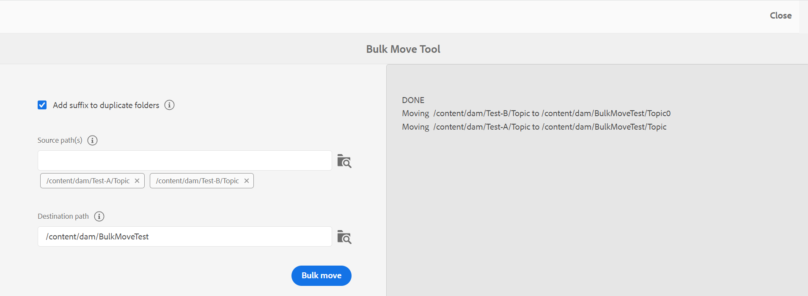
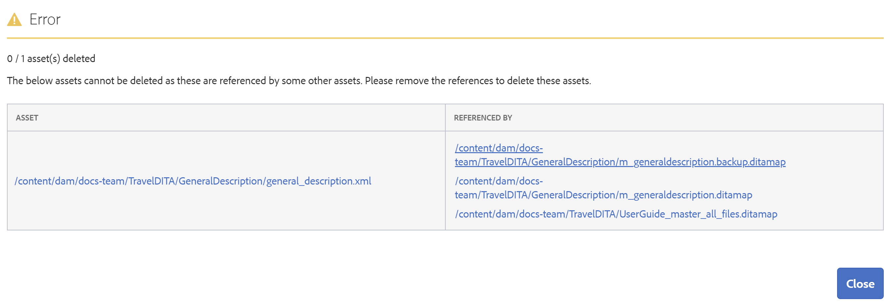
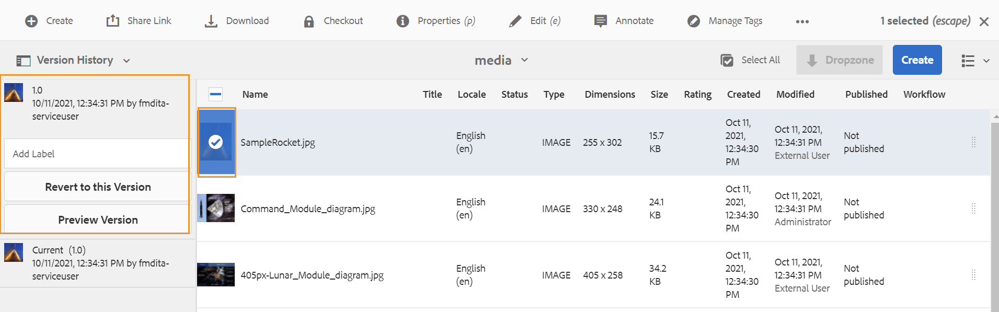

# Gerenciar arquivos e pastas {#id2116G0L08XA}

Esta seção explica como o AEM Guides lida com as operações básicas de arquivos, como copiar, colar, arrastar e soltar e excluir arquivos. Os seguintes cenários são possíveis:

## Copiar e colar arquivos

**Se o arquivo tiver um nome de arquivo legível por humanos**

- *Se o arquivo com o mesmo nome não existir na pasta de destino*: uma nova cópia do arquivo é criada e uma UUID também é atribuída a ela. Aqui, o nome do arquivo é igual ao nome original.
- *Se o arquivo com o mesmo nome já existir na pasta de destino*: uma nova cópia do arquivo é criada com um sufixo \(como nomedoarquivo0.extensão\). Uma UUID também é atribuída ao arquivo recém-criado.

**Se o nome do arquivo for baseado em um padrão UUID**

- *Se o arquivo com o mesmo nome não existir na pasta de destino*: uma nova cópia do arquivo é criada e uma nova UUID também é atribuída a ela no novo local. Aqui, o nome do arquivo é igual ao UUID.
- *Se o arquivo com o mesmo nome já existir na pasta de destino*: uma nova cópia do arquivo é criada e um novo UUID também é atribuído a ela. O nome do arquivo é igual ao UUID.

## Copiar e colar pastas

**Copiar e colar a pasta no mesmo local**

- *A pasta possui arquivos com nomes de arquivo legíveis por humanos*: uma nova cópia da pasta é criada com um sufixo \(como foldername0\). Uma nova UUID também é atribuída aos arquivos dentro da pasta. No entanto, não há alteração nos nomes dos arquivos.

- *A pasta tem arquivos com nomes de arquivo baseados em um padrão UUID*: uma nova cópia da pasta é criada com um sufixo \(como foldername0\). Um novo UUID também é atribuído a todos os arquivos na nova pasta. Os nomes dos arquivos também são alterados; os nomes dos arquivos são iguais aos da nova UUID.

**Copiar e colar a pasta em outro local**

- *A pasta possui arquivos com nomes de arquivo legíveis por humanos*: uma nova cópia da pasta é criada e uma nova UUID também é atribuída a todos os arquivos dentro da pasta no novo local. Aqui, não há alteração na pasta ou nos nomes dos arquivos.

- *A pasta tem arquivos com nomes de arquivo baseados em um padrão UUID*: uma nova cópia da pasta é criada com o mesmo nome da pasta original. Um novo UUID também é atribuído a todos os arquivos na nova pasta. Os nomes dos arquivos também são alterados; os nomes dos arquivos são iguais aos da nova UUID.

## Arrastar e soltar arquivos

**Arrastar e soltar com nomes de arquivo legíveis por humanos**

- *Arrastar e soltar no mesmo local*: você recebe as opções para **Substituir arquivo existente\(s\)**, **Manter ambos os arquivos\(s\)** e uma opção para criar uma versão da cópia de trabalho existente.

  {width="650" align="center"}

  Se você escolher a variável **Substituir arquivo existente\(s\)** , o arquivo que está sendo carregado substituirá a versão em funcionamento atual do arquivo existente no local original. A UUID não é criada ou alterada.

  Se você escolher a variável **Manter ambos os arquivos\(s\)** , uma nova cópia do arquivo é criada com um sufixo \(como nomedoarquivo0.extensão\). Uma nova UUID também é atribuída ao arquivo recém-copiado.

  Com a opção Sobrescrever arquivo existente\(s\), se você escolher a opção para criar uma versão a partir da cópia de trabalho existente, então uma nova versão a partir da cópia de trabalho do documento também será criada.

  >[!NOTE]
  >
  > **Criar nova versão para o arquivo carregado** O recurso deve ser habilitado pelo administrador. Se esse recurso estiver ativado, uma nova versão do arquivo carregado será criada. Se a opção estiver desmarcada, uma versão do arquivo carregado não será criada. Para obter mais detalhes, consulte *Criar nova versão para o arquivo carregado* na seção Instalar e configurar o Adobe Experience Manager Guides as a Cloud Service.

  Se outro usuário já tiver feito check-out de um arquivo para edição e você tentar fazer upload e substituir o arquivo existente, ocorrerá uma falha e um erro será exibido.

  >[!NOTE]
  >
  >A variável **Substituir arquivo com check-out ao fazer upload** O recurso deve ser desabilitado pelo administrador. Se esse recurso estiver ativado, é possível substituir arquivos com check-out. Se o recurso não estiver ativado, um arquivo com check-out não poderá ser substituído. Para obter mais detalhes, consulte *Substituir arquivo com check-out ao fazer upload* na seção Instalar e configurar o Adobe Experience Manager Guides as a Cloud Service.

- *Arraste e solte arquivos em um local diferente*: uma nova cópia do arquivo é criada e uma nova UUID também é atribuída a ela no novo local. Aqui, o nome do arquivo é igual ao nome original.

**Arrastar e soltar com nomes de arquivo com base em um padrão UUID**

*Arrastar e soltar arquivo no mesmo local*: você recebe as opções para **Substituir arquivo existente\(s\)** junto com a opção de criar uma versão da cópia de trabalho existente.

{width="650" align="center"}

Quando o arquivo é substituído, não há alteração no nome do arquivo ou em sua UUID.

Se você selecionar a variável **Criar versão para a cópia de trabalho existente** , então uma nova versão da cópia de trabalho do documento é criada; o novo arquivo é carregado, uma nova versão do arquivo também é criada e é feita como a cópia de trabalho do documento.

**Criar nova versão para o arquivo carregado** O recurso deve ser habilitado pelo administrador. Se esse recurso estiver ativado, uma nova versão do arquivo carregado será criada. Se a opção estiver desmarcada, uma versão do arquivo carregado não será criada. Para obter mais detalhes, consulte *Criar nova versão para o arquivo carregado* na seção Instalar e configurar o Adobe Experience Manager Guides as a Cloud Service.

*Arrastar e soltar arquivo em local diferente*: você recebe as opções para **Substituir arquivo existente\(s\)**, **Mover arquivo\(s\) para novo local** e uma opção para criar uma versão da cópia de trabalho existente.

{width="650" align="center"}

Se você escolher a variável **Substituir arquivo existente\(s\)** , o arquivo que está sendo carregado substituirá o arquivo existente no local original. A UUID não é criada ou alterada.

Se você escolher a variável **Mover arquivo\(s\) para novo local** , o arquivo existente é movido para o local atual e, em seguida, é substituído pelo arquivo que está sendo carregado. Mover um arquivo para o novo local não interrompe nenhuma referência existente do ou para o arquivo.

Ao substituir ou mover os arquivos, se você escolher a opção para criar uma versão a partir da cópia existente, uma nova versão a partir da cópia de trabalho do documento será criada; o novo arquivo será substituído no local existente ou movido para o novo local.

## Mover arquivos em massa {#move-files-bulk}

O AEM Guides vem com a ferramenta Mover em massa, que ajuda o administrador a mover uma pasta com um grande número de arquivos de um local para outro. Essa ferramenta pode mover facilmente arquivos de uma ou mais pastas para uma pasta diferente no repositório AEM. Um dos principais recursos dessa ferramenta é que ela não apenas move um grande número de arquivos, mas também mantém as referências para e dos arquivos que estão sendo movidos. É possível ajustar o número de arquivos que podem ser movidos em lotes sem prejudicar as tarefas de criação e publicação.

>[!NOTE]
>
> A ferramenta Mover em massa funciona somente no nível da pasta. Se você deseja mover arquivos de tópico ou mapa individuais, use a ferramenta de movimentação regular da interface do usuário do AEM Assets.

Estes são alguns dos recursos fornecidos pela Ferramenta de movimentação em massa:

- Você pode ajustar o número de arquivos a serem processados em cada lote. Isso pode exigir que você execute alguns testes antes de chegar a um número ideal que seu sistema possa facilmente manipular.
- Os serviços de autoria e publicação são executados sem problemas sem qualquer interrupção da operação de movimentação.
- Ter controle total sobre o intervalo de tempo entre os processos em lote \(execução de\) subsequentes. Esse intervalo de tempo garante que a operação de pós-processamento seja concluída antes de iniciar o próximo lote de arquivos.

- Manuseio automático de pastas com o mesmo nome. Esse recurso garante que, mesmo que haja pastas com o mesmo nome sendo movidas, elas não sejam substituídas.

- Manuseio automático de referências para e dos arquivos sendo movidos.

Você deve considerar os seguintes pontos antes de executar o processo em lote:

- Se você planeja mover tópicos que estão atualmente em revisão, feche o processo de revisão em todos esses tópicos antes de movê-los. Não fechar a tarefa de revisão interromperá o processo de revisão.
- Você deve executar apenas uma única operação de movimentação em massa no sistema a qualquer momento. Isso garante o manuseio adequado de referências para e dos tópicos que estão sendo movidos.

Para mover arquivos em massa, execute as seguintes etapas:

1. Clique no link Adobe Experience Manager na parte superior e escolha **Ferramentas**.
1. Selecionar **Guias** na lista de ferramentas.
1. Clique no link **Ferramenta Mover em massa** bloco.
1. A página Ferramenta de movimentação em massa é exibida com base em sua configuração. Forneça os seguintes detalhes sobre o **Ferramenta Mover em massa** página:

   

   
 Cloud Service e sistema de arquivos baseado em UUID no local 

   {width="650" align="center"}

   >[!TIP]
   >
   > Selecionar    próximo a qualquer campo para exibir mais detalhes sobre ele.

   - **Adicionar sufixo a pastas duplicadas**: caso esteja movendo pastas com o mesmo nome, você deve selecionar essa opção. Por exemplo, na captura de tela anterior, a variável **Caminho de origem** contém o nome das pastas a serem movidas. A pasta chamada topic existe em dois locais diferentes — test-A e test-B. Ao selecionar essa opção, as pastas serão movidas com êxito. A primeira pasta movida será chamada de topic, enquanto a segunda pasta será chamada topic0. A operação de movimentação adiciona um sufixo em séries sequenciais \(0, 1, 2 e assim por diante\) às pastas com o mesmo nome.

     Se você estiver movendo pastas com o mesmo nome sem selecionar essa opção, a operação será anulada com uma mensagem.

   - **Caminho de origem\(s\)**: especifique o local das pastas que deseja mover.

      - Selecionar  **Procurar pasta**      para abrir a caixa de diálogo procurar arquivo. Selecione as pastas que deseja mover e clique em **Selecionar** para concluir o processo.

      - Você também pode digitar ou copiar e colar o local de origem. Pressione Enter para adicionar a pasta à lista.

        As pastas selecionadas são listadas junto com seu caminho. Passe o mouse sobre a tag da pasta para visualizar o caminho completo.
      - Também é possível remover qualquer pasta clicando em **Remover**  próximo à pasta.

   - **Caminho de destino**: especifique o local para onde deseja mover as pastas de origem.

      - Selecionar  **Procurar pasta**  para abrir a caixa de diálogo procurar arquivo. Selecione o local para onde deseja mover as pastas de origem. e clique em Selecionar para concluir o processo.
      - Também é possível digitar ou copiar e colar o caminho de destino.

     A pasta selecionada é exibida junto com seu caminho na caixa de texto.

   - Clique em **Movimentação em massa**.

     O sistema inicia a movimentação dos arquivos do local de origem para o local de destino. Quando o processo for concluído, um resumo do processo de movimentação será mostrado à direita da página.

     {width="650" align="center"}

   

   

   
 Sistema de arquivos local não baseado em UUID 

   {width="650" align="center"}

   >[!TIP]
   >
   > Selecionar    próximo a qualquer campo para exibir mais detalhes sobre ele.

   - **Tamanho do lote**: especifique o número de arquivos a serem movidos em um único lote. Os valores padrão são 50 arquivos.
   - **Intervalo de suspensão**: especifique o tempo em segundos que o processo aguardará antes de iniciar o próximo lote. Durante esse intervalo de suspensão, o sistema corrige as referências de e para os arquivos movidos. O intervalo de suspensão padrão é de 60 segundos.

   - **Adicionar sufixo a pastas duplicadas**: caso esteja movendo pastas com o mesmo nome, você deve selecionar essa opção. Por exemplo, na captura de tela anterior, a variável **Caminho de origem** contém o nome das pastas a serem movidas. A pasta chamada topic existe em dois locais diferentes — test-A e test-B. Ao selecionar essa opção, as pastas serão movidas com êxito. A primeira pasta movida será chamada de topic, enquanto a segunda pasta será chamada topic0. A operação de movimentação adiciona um sufixo em séries sequenciais \(0, 1, 2 e assim por diante\) às pastas com o mesmo nome.

     Se você estiver movendo pastas com o mesmo nome sem selecionar essa opção, a operação será anulada com uma mensagem.

   - **Atualizar referências de arquivos obtidos**: Se você estiver movendo pastas que contêm arquivos com check-out, é recomendável selecionar essa opção. Se você selecionar essa opção, todos os arquivos com check-out serão salvos e terão check-in feito com uma nova revisão. Essa nova revisão é então movida para o local de destino.

     Se você não selecionar essa opção, os arquivos com check-out serão movidos para a pasta de destino com o mesmo status de check-out. No entanto, pode haver alguma perda de dados nesse processo de movimentação.

   - **Caminho de origem\(s\)**: especifique o local das pastas que deseja mover.

      - Selecionar  **Procurar pasta**      para abrir a caixa de diálogo procurar arquivo. Selecione as pastas que deseja mover e clique em **Selecionar** para concluir o processo.

      - Você também pode digitar ou copiar e colar o local de origem. Pressione Enter para adicionar a pasta à lista.

        As pastas selecionadas são listadas junto com seu caminho. Passe o mouse sobre a tag da pasta para visualizar o caminho completo.
      - Também é possível remover qualquer pasta clicando em **Remover**  próximo à pasta.

   - **Caminho de destino**: especifique o local para onde deseja mover as pastas de origem.

      - Selecionar  **Procurar pasta**  para abrir a caixa de diálogo procurar arquivo. Selecione o local para onde deseja mover as pastas de origem. e clique em Selecionar para concluir o processo.
      - Também é possível digitar ou copiar e colar o caminho de destino.

        A pasta selecionada é exibida junto com seu caminho na caixa de texto.

   - Clique em **Movimentação em massa**.

     O sistema inicia a movimentação dos arquivos do local de origem para o local de destino. Quando o processo for concluído, um resumo do processo de movimentação será mostrado à direita da página.
     {width="650" align="center"}

## Pesquisar conteúdo DITA

Por padrão, o AEM não reconhece o conteúdo DITA e, portanto, não fornece nenhum mecanismo para pesquisar conteúdo DITA em seu repositório. O AEM Guides adiciona uma camada sobre o AEM, o que permite que o AEM entenda e processe conteúdo DITA. O recurso Pesquisar conteúdo DITA nos Guias AEM permite pesquisar conteúdo DITA no repositório AEM.

>[!NOTE]
>
>O administrador do sistema pode configurar o **Elemento DITA** componente de pesquisa e, em seguida, você pode usar o recurso na interface do usuário do AEM Assets. Para obter mais detalhes, consulte *Adicionar componente de pesquisa do elemento DITA na interface do usuário do Assets* seção em Instalar e configurar o Adobe Experience Manager Guides as a Cloud Service.

Usando o recurso de pesquisa, você pode:

- Pesquise conteúdo DITA com base em um valor de elemento; por exemplo, `author`= xml
- Pesquise conteúdo DITA com base em um valor de atributo; por exemplo, `@platform`= windows
- Use uma combinação do elemento DITA e do valor do atributo; por exemplo, `author`= xml `AND` `@platform`= windows

Execute as seguintes etapas para pesquisar o conteúdo DITA no repositório AEM:

1. Abra a interface do Assets.

1. No painel à esquerda, selecione **Filtros**.

   {width="450" align="center"}

   As opções de filtragem de conteúdo são mostradas no painel esquerdo. Você também encontrará a opção de filtragem Elemento DITA, que é usada para filtrar conteúdo DITA.

   {width="450" align="center"}

1. *\(Opcional\)* No **Selecionar diretório de pesquisa** , procure o local em que deseja pesquisar.

1. No **Elemento DITA** filtro, forneça o **Nome do elemento**, **Atributo**, e um valor que você deseja pesquisar. Por exemplo, para pesquisar documentos que tenham `author` elemento de `@type` criador, é necessário fornecer as informações conforme mostrado na seguinte captura de tela:

   {width="650" align="center"}

   Os critérios de pesquisa inseridos na variável **Elemento DITA** O filtro de é exibido na parte superior da barra de pesquisa. Os arquivos que correspondem aos critérios de pesquisa são mostrados no **Resultados da pesquisa** área.

   Considere os pontos a seguir ao especificar os critérios de pesquisa:

   - Para procurar uma frase exata, informe a frase no campo Valor entre aspas `"`pesquisa de frase`"`.
   - Você pode adicionar até 3 critérios de pesquisa de elemento DITA.
   - Caso especifique vários critérios de pesquisa, todos eles serão combinados usando a lógica E.
   - Não é possível usar caracteres curingas nos critérios de pesquisa. Por exemplo, para procurar uma plataforma \(atributo\) com o valor Windows—você não pode especificar \*formulário ou Janela?s.

**Fazer check-out do filtro de status na pesquisa**

Além do filtro Elemento DITA, os Guias do AEM também permitem procurar conteúdo com base no status de check-out. Isso é útil quando você deseja filtrar rapidamente os arquivos cujo check-out foi feito por você e deseja fazer o check-in deles novamente.

Execute as seguintes etapas para procurar arquivos com base no status de check-out:

1. Abra a interface do Assets.

1. Clique em **Filtro** no painel esquerdo.
1. Insira sua palavra-chave de pesquisa na barra de Pesquisa.
1. Aplique os filtros necessários no painel esquerdo.

   Por exemplo, é possível aplicar **Status da saída** filtro para mostrar os tópicos com check-out ou check-in feito. Você pode refinar ainda mais essa lista escolhendo o usuário ou grupo na lista Retirado por.

   O resultado da pesquisa é exibido.

## Excluir arquivos

A exclusão de arquivos do repositório AEM é um recurso restrito, controlado pelo administrador do sistema. Com base nas configurações, a exclusão de arquivos pode ser restrita se forem:

- Retirado
- Têm referências de entrada ou saída

Também é possível excluir arquivos somente se você pertencer a um grupo de usuários específico que tenha privilégios para excluir arquivos.

>[!NOTE]
>
> Para obter mais detalhes sobre as configurações no gerenciamento de arquivos, consulte *Impedir exclusão de arquivos com check-out* e *Impedir exclusão de arquivos referenciados* seções em Instalar e configurar o Adobe Experience Manager Guides as a Cloud Service.

Se o administrador tiver dado permissão de exclusão de arquivo a todos os usuários, a seguinte mensagem será exibida quando você excluir arquivos que contenham referências:

{width="650" align="center"}

Nesse cenário, é possível excluir arquivos de forma forçada sem remover as referências de entrada ou saída dos arquivos.

Se as permissões de exclusão forem fornecidas a um grupo de usuários específico, a mensagem acima também será exibida para os usuários pertencentes a esse grupo. No entanto, para outros usuários, a seguinte mensagem é exibida:

{width="650" align="center"}

Nesse cenário, os usuários não poderão excluir arquivos até que todas as referências recebidas e enviadas sejam removidas.

## Trabalhar com arquivos de mídia

Arquivos de mídia como imagens e vídeos são parte integrante do seu conteúdo. Ao fazer upload e gerenciar o conteúdo, você também pode trabalhar com arquivos de mídia.

Se o arquivo de mídia tiver sofrido alterações, você poderá encontrá-los e visualizá-los na **Histórico da versão**.Para descobrir as alterações nas diferentes versões de um arquivo de mídia:

1. Acesse o arquivo em **Interface do usuário do Assets**.
1. Selecione o arquivo para o qual deseja exibir o histórico de versões.
1. No painel à esquerda, clique em **Histórico da versão** e selecione uma versão.
1. Você também pode ver as miniaturas de diferentes versões em Histórico de versões.

   {width="800" align="center"}

1. Nas versões listadas, selecione aquela que deseja usar como a versão base e clique em **Versão de visualização**. A visualização da versão selecionada é mostrada na janela Visualização de versão.

   {width="650" align="center"}

**Tópico pai:**[ Gerenciar conteúdo](authoring.md)
