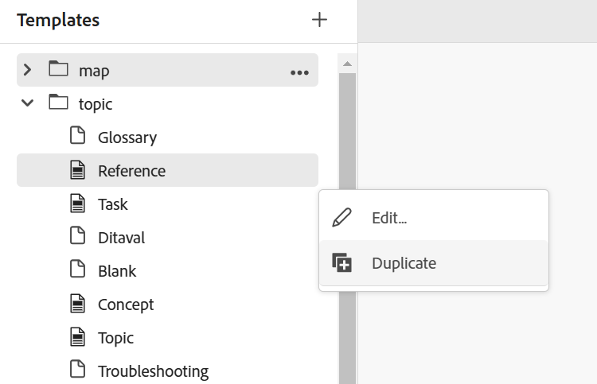

# Criar mapas com base em modelos personalizados {#id225VF0808MP}

Você pode criar modelos de mapa personalizados e usá-los para criar mapas DITA juntamente com os modelos de tópico e de mapa referenciados no modelo de mapa

Você pode consultar outros modelos de mapa e modelos de tópico do modelo de mapa personalizado. Os modelos de mapa referenciados podem se referir a vários modelos de mapa, modelos de tópico, tópicos, mapas, imagens, vídeos e outros ativos. O modelo de mapa personalizado pode ajudá-lo a replicar com facilidade os modelos de mapa e toda a estrutura de pastas indicada. Esses modelos personalizados são especialmente úteis para criar e recriar vários mapas que têm estruturas e referências recursivas.

>[!NOTE]
>
> Os modelos de tópico não são criados recursivamente. Somente os modelos de tópico que estão diretamente dentro do modelo de mapa são gerados e qualquer modelo de tópico dentro de um modelo de tópico é simplesmente referenciado diretamente no pai.

## Criar modelos personalizados

O Adobe Experience Manager Guides permite criar mapas e tópicos personalizados a partir da pasta dita-templates. Você pode usar esses modelos personalizados para criar seu mapa e tópico. Você também pode compartilhar esses modelos com seus autores, que podem usá-los para criar seus arquivos. Usando esses modelos, você pode permitir que os autores mantenham cópias separadas de determinados recursos que estão dentro da pasta de modelos.

>[!NOTE]
>
> Quaisquer recursos que só devem ser referenciados e mantidos em devem ser mantidos fora da pasta de templates.


Você pode criar modelos de mapa e tópico das seguintes maneiras:
- [Criar modelos personalizados no Editor](#create-customized-templates-from-the-editor)
- [Criar modelos personalizados na interface do usuário do Assets](#create-customized-templates-from-the-assets-ui)


### Criar modelos personalizados no Editor

O recurso **Modelos** está presente no painel [Esquerdo da interface do Editor](./web-editor-features.md#left-panel) e só está disponível para administradores. Usando esse painel, o administrador pode criar e gerenciar facilmente modelos que podem ser usados pelos autores. Por padrão, os modelos são categorizados em *mapa* e *tópico* modelos de tipo.

{width="300" align="left"}

Por padrão, é possível visualizar os arquivos por títulos. Ao passar o mouse sobre um modelo, é possível exibir o título do arquivo e o nome do arquivo como uma dica de ferramenta.

>[!NOTE]
>
> Como administrador, você também pode optar por visualizar a lista de arquivos no Editor. Selecione a opção **Nome do arquivo** da seção **Configuração de exibição dos arquivos do editor** em **Preferências do usuário**.

Execute as seguintes etapas para criar um tópico ou modelo de mapa a partir do Editor:

1. Abra o painel **Modelos** no Editor e selecione o ícone **Criar modelo DITA**.

   {width="500" align="left"}

1. Escolha **Modelo de tópico** ou **Modelo de mapa** no menu suspenso com base no tipo de modelo que você deseja criar.
1. Se você selecionar **Modelo de tópico**, a caixa de diálogo **Novo modelo de tópico** será exibida.

   {width="300" align="left"}

   Se você selecionar **Modelo de mapa**, a caixa de diálogo **Novo modelo de mapa** será exibida.

   {width="300" align="left"}

   Você também pode selecionar **Pasta** na lista suspensa se quiser primeiro criar uma pasta dentro da pasta **tópico** ou **mapa**.

1. Na caixa de diálogo **Novo modelo de tópico**/ **Novo modelo de mapa**, forneça o **Título**, que aparece no painel **Modelos**. O **Nome** do modelo é sugerido automaticamente com base no título. No entanto, você pode fornecer um nome de arquivo diferente.
Além disso, escolha o tipo de modelo que deseja criar na lista suspensa **Modelo**.

   >[!NOTE]
   >
   > Caso o administrador tenha ativado nomes de arquivo automáticos com base na configuração UUID, você não visualizará o campo Nome.

1. Selecione **Criar**.

Depois que o modelo for criado, é necessário adicioná-lo ao perfil global ou de nível de pasta. Após a adição do modelo, os autores começarão a visualizar o novo modelo no processo de criação de tópico/mapa.

Usando o menu **Opções** em um modelo existente, você pode optar por **Editar** ou **Duplicar**. No caso de duplicação, a estrutura e o tipo do modelo \(do documento\) são retidos e você pode reutilizá-los para criar outro modelo a partir dele.

{width="500" align="left"}

### Criar modelos personalizados na interface do usuário do Assets

Execute as seguintes etapas para criar um mapa ou modelo de tópico na interface do usuário do Assets:

1. Na **interface do usuário do Assets**, navegue até a pasta dita-templates.

   {align="left"}

1. Abra a pasta **tópicos** se desejar criar um modelo de **Tópico**. Abra a pasta **Mapas** se desejar criar um modelo de **Mapa**.
1. Selecione **Criar \> Modelo DITA**.

   {width="300" align="left"}
1. Na página Blueprint, selecione **Tópico \> Próximo** para criar um modelo de tópico. Caso contrário, selecione **Mapa \> Próximo** para criar um modelo de mapa.
1. Na página Propriedades, especifique o modelo **Título**.
1. Especifique o arquivo **Nome**.

   >[!NOTE]
   >
   > O nome do arquivo deve ter a extensão .dita.

1. \(Opcional\) Adicione uma descrição.
1. Selecione **Criar**.

   A mensagem de criação do modelo de tópico é exibida. Em seguida, você pode abrir o modelo e editá-lo. Para um modelo de mapa, você também pode adicionar as referências para os modelos de tópico, modelos de mapa e também outros ativos no modelo de mapa.


**Menu Opções na interface do usuário do Assets**

Para criar um mapa ou modelo de tópico usando o menu Opções na interface do usuário do Assets, execute as seguintes etapas:

1. Selecione a pasta **Mapa** ou **Tópico** na pasta de modelos atual. Por exemplo, pasta `dita-templates`.
1. No menu **Opções**, selecione **Criar Modelo de Mapa** ou **Criar Modelo de Tópico**.

   A caixa de diálogo **Criar Novo Modelo de Mapa** ou **Criar Novo Modelo de Tópico** é aberta.
1. Insira o título e o nome do novo template.
1. Escolha o tipo de modelo que deseja criar na lista suspensa **Modelo**.

A mensagem de criação do modelo de mapa é exibida. Você pode adicionar o modelo ao seu perfil global ou de nível de pasta. O novo modelo aparece no tópico ou no processo de criação de mapa e você pode criar mapas ou tópicos usando-o.

O administrador também pode criar uma pasta e configurá-la para ser a pasta na qual você pode criar e salvar os modelos.

Com base em sua configuração, saiba como configurar o caminho de pasta do modelo DITA personalizado:
<details>
    <summary> Cloud Services </summary>

Saiba como [configurar o caminho da pasta de modelo DITA personalizado](../install-guide/conf-template-tags-custom-dita-topic-template.md#configure-custom-dita-template-folder-path-id191lcf0095z) no Guia de Instalação e Configuração do Cloud Services.
</details>

<details>
    <summary> Software local</summary>

Saiba como [configurar o caminho de pasta de modelo DITA personalizado](../cs-install-guide/conf-template-tags-custom-dita-topic-template.md#configure-custom-dita-template-folder-path-id191lcf0095z) no Guia de Instalação e Configuração no Local.
</details>

## Transmita o título definido nos modelos

Se quiser passar o título do tópico ou mapa usado dentro do modelo para os mapas DITA criados usando esse modelo, use chaves ao redor do título.

Exemplo

```XML
<pubtitle>
   <mainpubtitle outputclass="booktitle">
   {title}
   </mainpubtitle>
   <subtitle>Subtitle</subtitle>
</pubtitle>

The resultant DITA map with title "Rootmap1" will look like as follows:
<pubtitle>
   <mainpubtitle outputclass="booktitle">Rootmap1
   </mainpubtitle>
   <subtitle>Subtitle</subtitle>
</pubtitle>
```

>[!NOTE]
> Somente a primeira ocorrência de chaves será substituída pelo título.

Se você não usar chaves ao redor do título, somente o primeiro elemento será escolhido, o aninhamento do título não será escolhido do modelo e terá a seguinte aparência:

```XML
<pubtitle> Rootmap1 </pubtitle>
```

>[!NOTE]
> Também é possível usar as chaves ao redor do texto para transmitir sua estrutura aninhada dos modelos personalizados para seus mapas DITA.

Exemplo

```XML
<title>    
    <sub>        
        <b>{title}</b>    
    </sub>
</title>
```

## Usar o modelo de mapa para criar novos mapas

>[!NOTE]
>
> O modelo de mapa deve ser configurado e disponibilizado para criação pelo administrador. Para obter mais detalhes, consulte a seção *Configurar modelos de criação* em Instalar e configurar o Adobe Experience Manager Guides as a Cloud Service.

No **Editor**, execute as seguintes etapas para criar um mapa usando o modelo de mapa personalizado:

1. No **Editor**, navegue até a pasta onde deseja criar o mapa.
1. No menu Opções, selecione **Novo \> Mapa DITA**.

   {width="500" align="left"}
1. A caixa de diálogo **Novo mapa** é exibida.
1. Na caixa de diálogo **Novo mapa**, especifique o mapa **Título**, arquivo **Nome**, e selecione o modelo de mapa que deseja usar.

   Por exemplo, se você criou um modelo de mapa &quot;modelo de teste&quot;, selecione-o.

1. Selecione **Criar**.

   A mensagem de mapa criado é exibida.

Na **Interface do usuário do Assets**, execute as seguintes etapas para criar um mapa usando o modelo de mapa personalizado:

1. Na **Interface do usuário do Assets**, navegue até a pasta onde deseja criar o mapa.
1. Selecione **Criar \> Mapa DITA**.
1. Na página Blueprint, selecione o modelo de mapa que deseja usar e selecione **Próximo**. Por exemplo, se você criou um modelo de mapa &quot;modelo de teste&quot;, selecione-o.
1. Na página Propriedades, especifique o mapa **Título**.
1. Especifique o arquivo **Nome**.

   >[!NOTE]
   >
   > O nome do arquivo deve ter a extensão .ditamap.

1. Selecione **Criar**. A mensagem de mapa criado é exibida.

## Observações adicionais para mapas DITA criados usando modelos personalizados


O mapa gera todos os ativos que são referenciados dentro da pasta de modelo. Alguns tipos de ativos referenciados em um mapa podem ser os seguintes:

- Se o mapa contiver a referência a um modelo de tópico, uma cópia dele será criada dentro da pasta, na mesma hierarquia que na pasta de tópicos da pasta `dita-templates`.
- Se o mapa contiver a referência a um modelo de mapa, uma cópia dele será criada dentro da pasta, na mesma hierarquia que na pasta de mapas da pasta `dita-templates`.
- Se o mapa contiver a referência genérica a um tópico ou mapa fora da pasta `dita-templates/topics` ou `dita-templates/maps`, o mesmo será mencionado apenas, e nenhuma cópia será criada.

  >[!NOTE]
  >
  > `dita-templates/topics` e `dita-templates/maps` são os caminhos padrão nos Guias e são configuráveis.


  Se houver uma definição de chave de modelo de tópico no modelo de mapa, uma nova chave \(portanto, novo tópico\) será criada e referenciada no mapa.

- Se outro mapa ou tópico for criado no mesmo nível na pasta, os nomes dos ativos recém-criados serão anexados com 0,1,2 e assim por diante. Você pode optar por abrir o mapa para edição ou salvar o arquivo de mapa no repositório.

**Tópico pai:**[ Introdução ao Editor de Mapa](map-editor.md)
