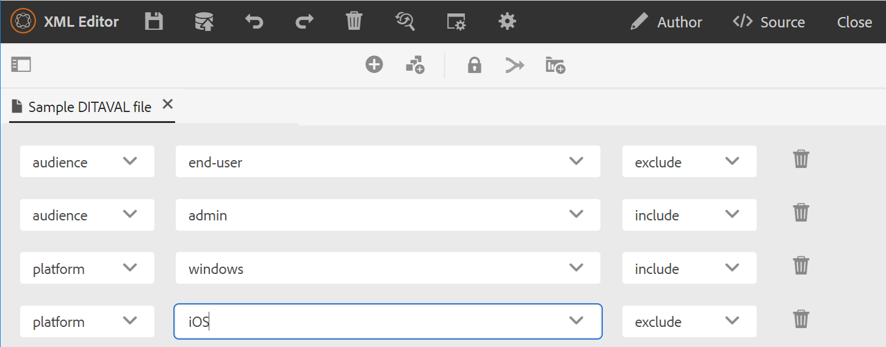
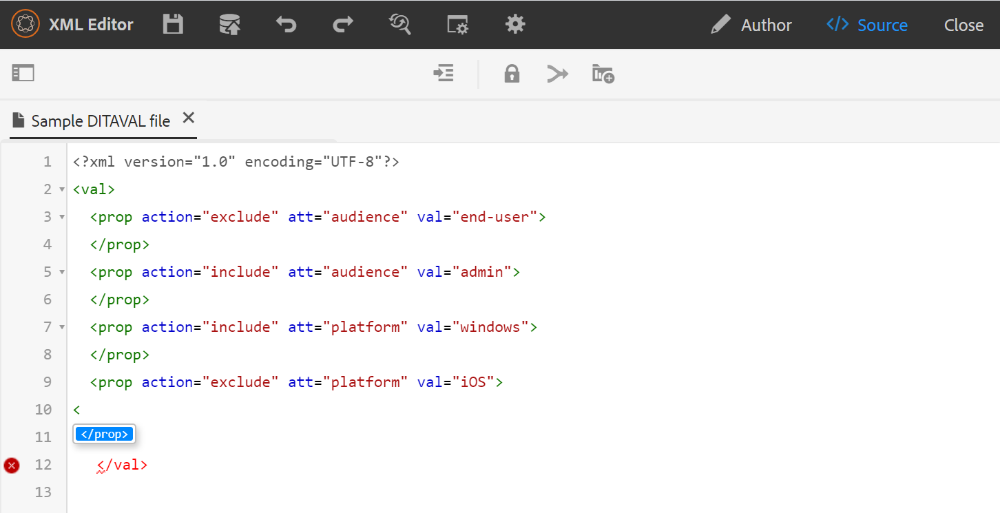

# Editor DITAVAL {#ditaval-editor}

Os arquivos DITAVAL são usados para gerar saída condicional. Em um único tópico, você pode adicionar condições usando atributos de elemento para condicionar o conteúdo. Em seguida, crie um arquivo DITAVAL, no qual especifique as condições que devem ser selecionadas para gerar conteúdo e qual condição deve ser deixada de fora da saída final.

Guias AEM permite que você crie e edite facilmente arquivos DITAVAL usando o editor DITAVAL. O editor DITAVAL recupera os atributos \(ou tags\) definidos no sistema e você pode usá-los para criar ou editar arquivos DITAVAL. Para obter mais detalhes sobre como criar e gerenciar tags no AEM, consulte [Administração de tags](https://experienceleague.adobe.com/docs/experience-manager-cloud-service/sites/authoring/features/tags.html?lang=en) seção na documentação do AEM.

## Criar arquivo DITAVAL

Execute as seguintes etapas para criar um arquivo DITAVAL:

1. Na interface do usuário do Assets, navegue até o local em que deseja criar o arquivo DITAVAL.

1. Clique em **Criar** \> **Tópico DITA**.

1. Na página Blueprint, selecione o modelo de arquivo DITAVAL e clique em **Próxima**.

1. Na página Propriedades, especifique a **Título** e **Nome** para o arquivo DITAVAL.

   >[!NOTE]
   >
   > O nome é sugerido automaticamente com base no Título do arquivo. Se você quiser especificar manualmente o nome do arquivo, verifique se ele não contém espaços, apóstrofos ou chaves e termine com .ditaval.

1. Clique em **Criar**. A mensagem Topic Created (Tópico criado) é exibida.

   Você pode optar por abrir o arquivo DITAVAL para edição no editor DITAVAL ou salvar o arquivo de tópico no repositório AEM.

## Editar arquivo DITAVAL

Execute as seguintes etapas para editar um arquivo DITAVAL:

1. Na interface do Assets, navegue até o arquivo DITAVAL que deseja editar.

1. Para obter um bloqueio exclusivo sobre o arquivo, selecione o arquivo e clique em **Check-out**.

1. Selecione o arquivo e clique em **Editar** para abrir o arquivo no editor DITAVAL de Guias AEM.

   O editor DITAVAL permite executar as seguintes tarefas:

   R: Alternar painel esquerdo Alternar a exibição do painel esquerdo. Se você tiver aberto o arquivo DITAVAL pelo mapa DITA, o mapa e o repositório serão mostrados nesse painel. Para obter mais informações sobre como abrir um arquivo pelo mapa DITA, consulte [Editar tópicos por meio do mapa DITA](map-editor-advanced-map-editor.md#id17ACJ0F0FHS).

   B: Salvar Salva as alterações feitas no arquivo. Todas as alterações são salvas na versão atual do arquivo.

   C: Adicionar propriedade Adicione uma única propriedade no arquivo DITAVAL.

   

   A primeira lista suspensa lista os atributos DITA permitidos que você pode usar no arquivo DITAVAL. Há cinco atributos compatíveis - `audience`, `platform`, `product`, `props`, e `otherprops`.

   A segunda lista suspensa mostra os valores configurados para o atributo selecionado. Em seguida, a lista suspensa seguinte mostra as ações que você pode configurar no atributo selecionado. Os valores permitidos no menu suspenso de ações são - `include`, `exclude`, `passthrough`, e `flag`. Para obter mais informações sobre esses valores, consulte a definição de [prop](http://docs.oasis-open.org/dita/dita/v1.3/errata01/os/complete/part3-all-inclusive/langRef/ditaval/ditaval-prop.html#ditaval-prop) elemento na documentação DITA do OASIS

   D: Adicionar todas as propriedades Se quiser adicionar todas as propriedades condicionais ou atributos definidos no sistema com um único clique, use o recurso Adicionar todas as propriedades.

   >[!NOTE]
   >
   > Se todas as propriedades condicionais definidas já existirem no arquivo DITAVAL, não será possível adicionar mais propriedades. Você recebe uma mensagem de erro neste cenário.

   

1. Quando terminar de editar o arquivo DITAVAL, clique em **Salvar**.

   >[!NOTE]
   >
   > Se você fechar o arquivo sem salvar, as alterações serão perdidas. Se não quiser confirmar as alterações no repositório AEM, clique em **Fechar** e clique em **Fechar sem salvar** no **Alterações não salvas** diálogo.

## Visualizações do editor DITAVAL

O editor DITAVAL do AEM Guides permite visualizar arquivos DITAVAL em dois modos ou visualizações diferentes:

**Autor**: esta é uma exibição típica do What You See is What You Get \(WYSISYG\) do editor DITAVAL. Você pode adicionar ou remover propriedades usando a interface de usuário simples, que apresenta as propriedades, seus valores e ações na lista suspensa. Na visualização Autor, você tem as opções para inserir uma propriedade individual e inserir todas as propriedades com um único clique.

Você também pode encontrar a versão do arquivo DITAVAL que você está trabalhando no momento, passando o ponteiro sobre o nome do arquivo.

**Origem**: a visualização Código-fonte exibe o XML subjacente que compõe o arquivo DITAVAL. Além de fazer edições de texto regulares nessa visualização, um autor também pode adicionar ou editar propriedades usando o Catálogo inteligente.

Para chamar o Catálogo inteligente, coloque o cursor no final de qualquer definição de propriedade e digite &quot;&lt;&quot;. O editor mostrará uma lista de todos os elementos XML válidos que você pode inserir nesse local.

