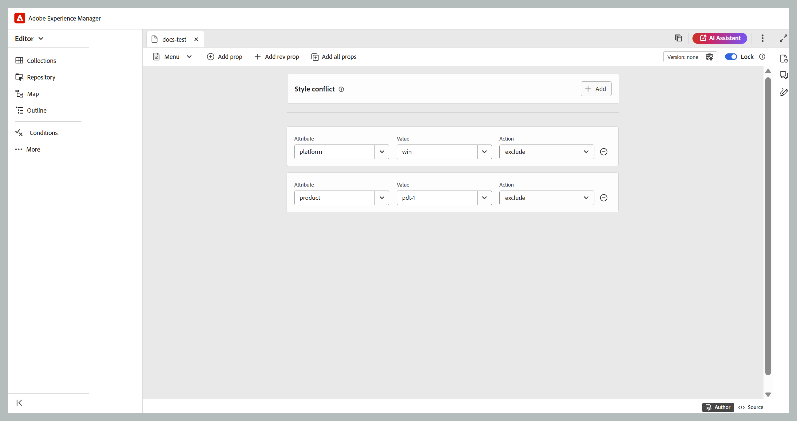

# Editor DITAVAL {#ditaval-editor}

Os arquivos DITAVAL são usados para gerar saída condicional. Em um único tópico, você pode adicionar condições usando atributos de elemento para condicionar o conteúdo. Em seguida, crie um arquivo DITAVAL, no qual especifique as condições que devem ser selecionadas para gerar conteúdo e qual condição deve ser deixada de fora da saída final.

O Adobe Experience Manager Guides permite criar e editar facilmente arquivos DITAVAL usando o editor DITAVAL. O editor DITAVAL recupera os atributos \(ou tags\) definidos no sistema e você pode usá-los para criar ou editar arquivos DITAVAL. Para obter mais detalhes sobre como criar e gerenciar tags na Adobe Experience Manager, consulte a seção [Administração de Tags](https://experienceleague.adobe.com/docs/experience-manager-cloud-service/sites/authoring/features/tags.html?lang=pt-BR) na documentação da Adobe Experience Manager.

As seções a seguir abordam as opções disponíveis para um arquivo DITAVAL no Experience Manager Guides.

- [Criar arquivo DITAVAL](#create-ditaval-file)
- [Editar arquivo DITAVAL](#edit-ditaval-file)
- [Visualizações do editor de arquivos DITAVAl](#ditaval-editor-views)
- [Trabalhar com o arquivo DITAVAL na interface do usuário do Assets](#working-with-ditaval-files-in-the-assets-ui)

## Criar arquivo DITAVAL

Execute as seguintes etapas para criar um arquivo DITAVAL:

1. No painel Repositório, selecione o ícone **Novo arquivo** e selecione **Tópico** no menu suspenso.

   {align="left"}

   Você também pode acessar esta opção a partir da [Página inicial do Experience Manager Guides](./intro-home-page.md) e do menu de opções de uma pasta na exibição Repositório.

2. A caixa de diálogo **Novo tópico** é exibida.

3. Na caixa de diálogo **Novo tópico**, forneça os seguintes detalhes:
   - Um Título para o tópico.
   - \(Opcional\)* O nome do arquivo do tópico. O nome do arquivo é sugerido automaticamente com base no tópico Título. Caso o administrador tenha ativado nomes de arquivo automáticos com base na configuração UUID, você não visualizará o campo Nome.
   - Um modelo no qual o tópico será baseado. Para um arquivo DITAVAL, selecione **Ditaval** na lista suspensa.
   - Caminho no qual você deseja salvar o arquivo de tópico. Por padrão, o caminho da pasta selecionada no momento no repositório é mostrado no campo Caminho.

   {width="300" align="left"}

4. Selecione **Criar**.

O tópico é criado no caminho especificado. Além disso, o tópico é aberto no Editor para edição.

{align="left"}

## Editar arquivo DITAVAL

Quando você cria um tópico DITAVAL, ele é aberto no Editor para edição. Para editar um tópico DITAVAL existente, navegue até a pasta ou mapa onde o tópico DITAVAL está localizado e selecione **Editar** no menu **Opções**.

O editor DITAVAL permite executar as seguintes tarefas:

- Alternar painel esquerdo

  Alterna a exibição do painel esquerdo. Se você tiver aberto o arquivo DITAVAL pelo mapa DITA, o mapa e o repositório serão mostrados nesse painel. Para obter mais informações sobre como abrir um arquivo por meio do mapa DITA, exiba [Editar tópicos por meio do mapa DITA](map-editor-advanced-map-editor.md#id17ACJ0F0FHS).

- Salvar

  Salva as alterações feitas no arquivo. Todas as alterações são salvas na versão atual do arquivo.

- Adicionar prop

  Adicione uma única propriedade no arquivo DITAVAL.

  

  A primeira lista suspensa lista os atributos DITA permitidos que você pode usar no arquivo DITAVAL. Há cinco atributos com suporte - `audience`, `platform`, `product`, `props` e `otherprops`.

  A segunda lista suspensa mostra os valores configurados para o atributo selecionado. Em seguida, a lista suspensa seguinte mostra as ações que você pode configurar no atributo selecionado. Os valores permitidos no menu suspenso de ações são - `include`, `exclude`, `passthrough` e `flag`. Para obter mais informações sobre esses valores, exiba a definição do elemento [prop](http://docs.oasis-open.org/dita/dita/v1.3/errata01/os/complete/part3-all-inclusive/langRef/ditaval/ditaval-prop.html#ditaval-prop) na documentação do OASIS DITA

- Adicionar todas as propriedades

  Se quiser adicionar todas as propriedades condicionais ou atributos definidos no sistema com um único clique, use o recurso Adicionar todas as propriedades.

  >[!NOTE]
  >
  > Se todas as propriedades condicionais definidas já existirem no arquivo DITAVAL, não será possível adicionar mais propriedades. Você recebe uma mensagem de erro neste cenário.

  

Após concluir a edição do arquivo DITAVAL, selecione **Salvar**.

>[!NOTE]
>
> Se você fechar o arquivo sem salvar, as alterações serão perdidas. Se você não deseja confirmar as alterações no repositório do Adobe Experience Manager, selecione **Fechar** e **Fechar sem salvar** na caixa de diálogo **Alterações não salvas**.

## Visualizações do editor DITAVAL

O editor DITAVAL do Adobe Experience Manager Guides é compatível com a visualização de arquivos DITAVAL em dois modos ou visualizações diferentes:

**Autor**:   Esta é uma exibição típica do What You See is What You Get \(WYSISYG\) do editor DITAVAL. Você pode adicionar ou remover propriedades usando a interface de usuário simples, que apresenta as propriedades, seus valores e ações na lista suspensa. Na visualização Autor, você tem as opções para inserir uma propriedade individual e inserir todas as propriedades com um único clique.

Você também pode encontrar a versão do arquivo DITAVAL que você está trabalhando no momento, passando o ponteiro sobre o nome do arquivo.

**Source**:   A visualização Source exibe o XML subjacente que compõe o arquivo DITAVAL. Além de fazer edições de texto regulares nessa visualização, um autor também pode adicionar ou editar propriedades usando o Catálogo inteligente.

Para chamar o Catálogo inteligente, coloque o cursor no final de qualquer definição de propriedade e digite &quot;&lt;&quot;. O editor mostrará uma lista de todos os elementos XML válidos que você pode inserir nesse local.

## Trabalhar com arquivos DITAVAL na interface do usuário do Assets

Você também pode criar um arquivo DITAVAL na interface do usuário do Assets. As etapas para criar um novo tópico DITAVAL são as seguintes:

1. Na interface do Assets, navegue até o local em que deseja criar o arquivo DITAVAL.

1. Selecione **Criar** \> **Tópico DITA**.

1. Na página Blueprint, selecione o modelo de arquivo DITAVAL e selecione **Próximo**.

1. Na página Propriedades, especifique o **Título** e o **Nome** para o arquivo DITAVAL.

   >[!NOTE]
   >
   > O nome é sugerido automaticamente com base no Título do arquivo. Se você quiser especificar manualmente o nome do arquivo, verifique se ele não contém espaços, apóstrofos ou chaves e termine com .ditaval.

1. Selecione **Criar**.

   A mensagem Topic Created (Tópico criado) é exibida.

Você pode optar por abrir o arquivo DITAVAL para edição no editor DITAVAL ou salvar o arquivo de tópico no repositório do Adobe Experience Manager.

Execute as seguintes etapas para editar um arquivo DITAVAL existente:

1. Na interface do Assets, navegue até o arquivo DITAVAL que deseja editar.

1. Para obter um bloqueio exclusivo sobre o arquivo, selecione o arquivo e **Check-out**.

1. Selecione o arquivo e selecione **Editar** para abri-lo no editor Adobe Experience Manager Guides DITAVAL.

