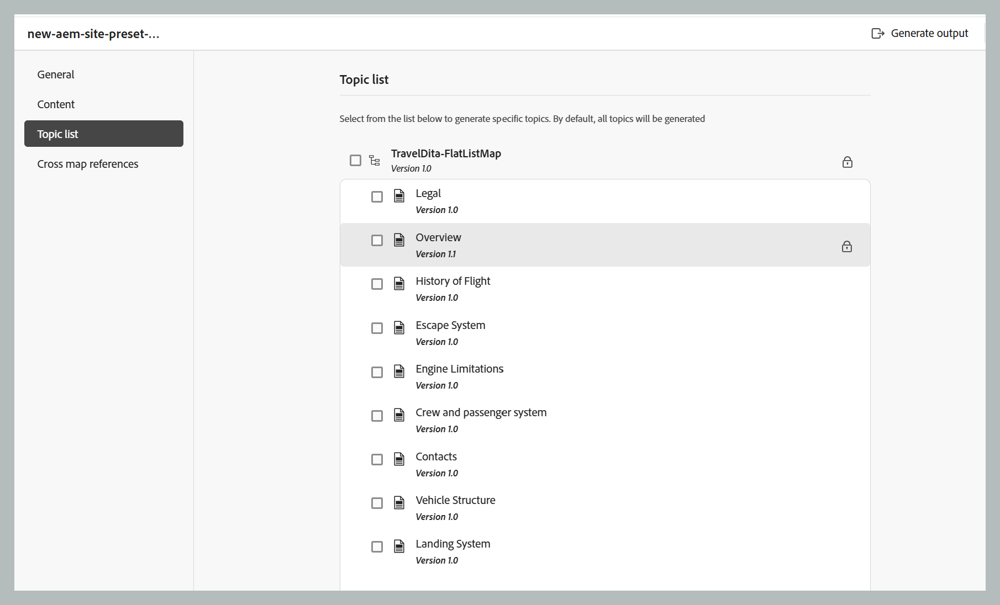

# Geração de saída incremental

>[!NOTE]
>
> A geração de saída incremental é aplicável somente para saída AEM Sites. Além disso, você só pode regenerar tópicos DITA \(.dita/.xml\) a partir de um mapa DITA ou submapas. Se você selecionar um mapa DITA, submapa, grupo de tópicos ou um tópico com `@processing-role="resource-only"`, a opção de regeneração não estará disponível.

Pode haver várias instâncias em que você atualizaria apenas alguns tópicos no mapa DITA e enviaria apenas esses tópicos atualizados em tempo real. Para lidar com esses cenários, o Experience Manager Guides permite criar saídas incrementais. Se você atualizou alguns tópicos, não é necessário gerar novamente o mapa DITA inteiro. Você pode selecionar apenas os tópicos atualizados e gerá-los novamente.

Se o mapa estiver fragmentado e você tiver atualizado um único tópico nesse mapa, será necessário gerar novamente todo o mapa para o tópico ou conteúdo atualizado para refletir na saída. A opção de regeneração de saída não é obtida em um nível de tópico. Ela só está disponível no nível de mapa \(fragmentado\). Isso é aplicável ao mapa principal e a todos os submapas.

Execute as seguintes etapas para gerar novamente a saída de um tópico específico ou de um grupo de tópicos:

## Gerar saída incremental a partir do console de Mapa (para sites do AEM usando o mapeamento de componente composto)

Execute as seguintes etapas para gerar saída incremental para o AEM Sites usando o console de Mapa:

1. [Abra o arquivo de mapa DITA no Console de mapa](./open-files-map-console.md).
1. Selecione a predefinição do AEM Sites para a qual deseja gerar saída incremental.
1. Na guia **Tópicos**, selecione os tópicos que deseja publicar.

   - Sem linha de base

      {align="left"}

   - Com linha de base

      {align="left"}

   >[!NOTE]
   >
   > Quando uma Linha de Base é selecionada na guia **Conteúdo**, a lista de Tópicos exibe os tópicos e suas versões da Linha de Base anexada.  
   > A publicação incremental da lista de Tópicos deve ser usada somente quando não houver alteração na estrutura do mapa. Se houver uma alteração na estrutura do mapa/índice, o mapa inteiro deverá ser publicado uma vez para atualizar o índice.

1. Selecione **Salvar** para salvar as alterações.
1. Selecione **Gerar saída** para gerar a saída.

## Gerar saída incremental no painel Mapa (para sites do AEM usando o mapeamento de componente herdado)

Execute as seguintes etapas para gerar saída incremental para o AEM Sites usando o painel de mapa:

1. Na interface do usuário do Assets, navegue até o arquivo de mapa DITA e selecione-o.

   O console do mapa DITA é exibido com a lista de Predefinições de saída disponíveis para gerar a saída.

1. Selecione a guia **Tópicos**.

   Uma lista de tópicos disponíveis no mapa DITA é exibida.

1. Selecione os tópicos que deseja gerar novamente.

   >[!NOTE]
   >
   > Se você tiver adicionado novos tópicos ao mapa DITA, não será possível gerar esses novos tópicos a partir daqui. Primeiro, publique os tópicos adicionados recentemente usando a função de publicação de mapa DITA.

   {align="left"}

1. Selecione **Regenerar**.

   A página **Gerar novamente os tópicos selecionados** é exibida.

1. Selecione a predefinição de saída que deseja usar para gerar novamente os tópicos selecionados.

   Para a predefinição de saída do AEM Sites usando o mapeamento de componente herdado, se uma linha de base for selecionada, as versões de tópico incluídas na linha de base selecionada serão usadas para a geração de saída. Além disso, a publicação incremental da lista de Tópicos deve ser usada somente quando não houver alterações na estrutura do mapa. Se houver uma alteração na estrutura do mapa/índice, o mapa inteiro deverá ser publicado uma vez para atualizar o índice. Para obter detalhes sobre como usar a predefinição de site do AEM, exiba [predefinições do AEM Sites no painel do mapa](./generate-output-aem-site-map-dashboard.md).

1. Selecione **Regenerar** para iniciar o processo de geração de saída.

>[!IMPORTANT]
>
> Se você renomear um título de tópico e gerar novamente o tópico, o título atualizado do tópico não será refletido no índice do mapa DITA. Para atualizar o título do tópico no índice, você deve gerar o mapa DITA inteiro.

Você pode visualizar o status atual da solicitação de geração de saída na guia **Saídas**. Para obter mais informações, consulte [Exibir o status da tarefa de geração de saída](#view-the-status-of-the-output-generation-task).

**Tópico pai:** [Entendendo as predefinições de saída](generate-output-understand-presets.md)
