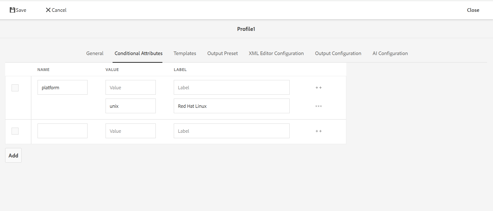

# Criação de perfil de atributo condicional {#id1843I0HN0Y4}

Em nível corporativo, é extremamente importante garantir que você tenha um sistema de marcação padrão em vigor. Tags ou atributos condicionais podem ser associados a ativos digitais no repositório, o que ajuda a publicar saída com base nas condições escolhidas. Por exemplo, você pode criar um atributo condicional para conteúdo do Windows e do Mac. Em seguida, você adiciona esses atributos ao conteúdo relevante em seus tópicos. No momento da publicação do conteúdo, você pode escolher se deseja publicar conteúdo somente do Windows ou do Mac.

O Adobe Experience Manager Guides permite criar e associar facilmente atributos condicionais usando os atributos DITA relevantes. Você pode definir atributos condicionais no nível global ou no nível da pasta. As condições definidas globalmente são visíveis em todos os projetos e as condições específicas da pasta são visíveis somente em projetos criados na pasta especificada. Os autores de conteúdo podem usar esses atributos condicionais para condicionar o conteúdo em seus tópicos ou mapas DITA que eles criam ou usam. Essas condições podem ser usadas pelo editor para criar predefinições condicionais. Usando as predefinições condicionais, o editor pode decidir qual condição incluir e excluir da saída publicada.

>[!NOTE]
>
> Você pode criar ou editar os atributos condicionais em um Perfil de pasta ao qual tem acesso. Se o administrador do sistema não tiver concedido acesso a um perfil de pasta, você não poderá criar ou editar os atributos condicionais no Perfil de Pasta.

Para definir atributos condicionais, execute as seguintes etapas:

1. Selecione o logotipo do Adobe Experience Manager na parte superior e escolha **Ferramentas**.

1. No painel Ferramentas, selecione **Guias**.

1. Selecione o bloco **Perfis de Pasta** e selecione um Perfil de Pasta.

   >[!NOTE]
   >
   > Não é possível editar o perfil global.

1. Selecione a guia **Atributos Condicionais** e selecione **Editar**.

   A tabela de Atributos Condicionais é exibida.

1. Selecione **Adicionar**.

1. Insira o **Nome**, **Valor** e um **Rótulo** para o atributo.

   Você pode salvar um perfil somente com o nome do atributo. No entanto, um atributo só pode ser usado quando tem um valor especificado. Se você especificar ambos - valor e rótulo para um atributo, o Editor da Web ainda mostrará somente o valor do atributo. O rótulo é mostrado ao administrador de publicação no momento da criação da predefinição condicional.

   A captura de tela a seguir mostra a definição do atributo `platform` com valor de `unix` e rótulo de `Red Hat Linux`.

   

1. Se quiser adicionar mais valores para o mesmo atributo, selecione o ícone **+** e insira valor e rótulo adicionais.

1. Se quiser adicionar mais atributos, selecione **Adicionar**.

1. Selecione **Salvar** para salvar as alterações.

O atributo `platform` está armazenado no sistema. Sempre que um autor decidir usar o atributo `platform` em um tópico DITA em uma pasta, ele poderá exibir os valores na guia Propriedades no Editor.

{width="350"}

**Tópico pai:**&#x200B;[&#x200B; Geração de saída](generate-output.md)
