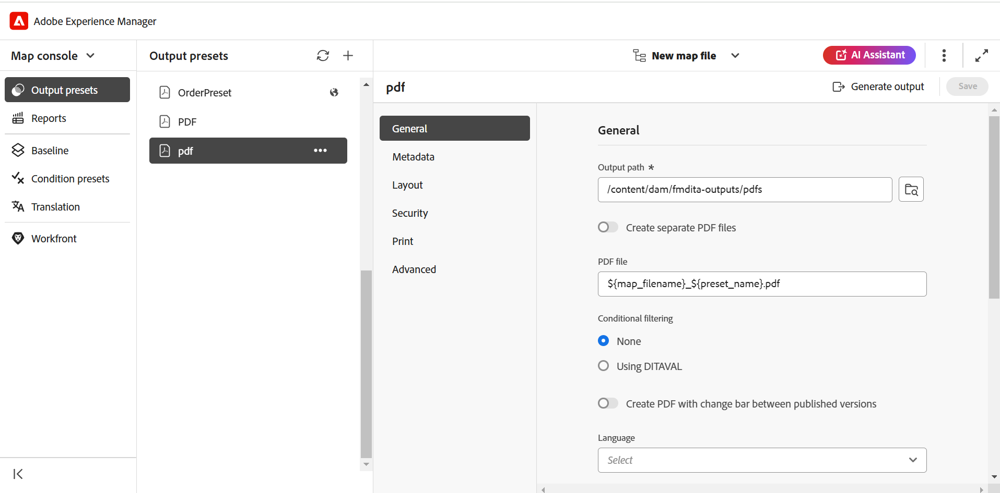

# Gerar saída

Há duas maneiras de gerar saída para um mapa DITA:

- [Gerar saída para um mapa DITA a partir do console de Mapa](#generate-output-for-a-dita-map-from-the-map-console)
- [Gerar saída para um mapa DITA no painel Mapa](#generate-output-for-a-dita-map-from-the-map-dashboard)

## Gerar saída para um mapa DITA a partir do console Mapa

Execute as seguintes etapas para gerar saída para um mapa DITA usando o console Mapa:

1. [Abra um arquivo de mapa no Console de mapa](./open-files-map-console.md).
2. O console do mapa DITA é exibido com a lista de **predefinições de saída** disponíveis para gerar saída.

3. Abra a predefinição que deseja usar para gerar a saída e selecione **Gerar saída** para iniciar o processo de geração.

   

   Ou passe o mouse sobre a predefinição e selecione **Gerar** no menu de contexto predefinido.

   

Quando a geração de saída estiver concluída, selecione **Exibir saída** para exibir a saída.

Uma caixa de diálogo **Êxito** está visível no canto inferior direito da tela.

Se uma saída não for bem-sucedida, a mensagem de erro abaixo será exibida.

Para exibir o log de erros, selecione **Ignorar**, passe o mouse sobre a guia de predefinição selecionada e selecione **Exibir log** no menu de contexto predefinido.

## Gerar saída para um mapa DITA no painel Mapa

Execute as seguintes etapas para gerar saída para um mapa DITA usando o painel Mapa:

1. Na interface do usuário do Assets, navegue até o arquivo de mapa DITA que deseja publicar e selecione-o.

   O console do mapa DITA é exibido com a lista de Predefinições de saída disponíveis para gerar a saída.

1. Selecione uma ou várias Predefinições de saída que deseja usar para gerar a saída.

   {align="left"}

1. Selecione o ícone **Gerar** para iniciar o processo de geração de saída.

Você pode visualizar o status atual da solicitação de geração de saída na guia **Saídas**. Para obter mais informações, consulte [Exibir o status da tarefa de geração de saída](./generate-output-manage-process.md#view-the-status-of-the-output-generation-task).

>[!IMPORTANT]
>
> Se um processo de geração de saída para uma predefinição estiver na fila ou em andamento, não será possível iniciar outra tarefa de geração de saída para a mesma predefinição.

Você também pode gerar a saída do AEM Sites para um ou mais tópicos, ou todo o mapa DITA no console Mapa. Para obter mais detalhes, exiba [Gerar saída da Base de Dados de Conhecimento](web-editor-article-publishing.md#id218CK0U019I).

## Mesclando diferentes tópicos em um mapa DITA usando o atributo `chunk`

Um mapa DITA pode incluir diferentes tipos de tópicos, como referência, conceito e tarefa. O atributo `chunk=to-content` permite unir esses tópicos para gerar uma única saída de página no AEM Sites. No entanto, para publicar o tópico mesclado corretamente, certifique-se de que o administrador configurou o catálogo XML correto nos Perfis DITA.

O sistema requer uma ID pública com a palavra-chave `composite` no catálogo XML para identificar e aplicar corretamente a regra DTD apropriada.
Essa configuração é incluída por padrão no catálogo XML padrão. No entanto, se estiver usando um catálogo XML personalizado, verifique se o administrador adicionou essa ID pública à configuração. Sem ele, o tópico mesclado pode não ser publicado corretamente.

Para obter detalhes sobre como usar a ID pública e a ID do sistema nos DTDs/XSDs personalizados, exiba [Integrar especialização de DITA](../cs-install-guide/dita-ot-specialization.md#integrate-dita-specialization-id211mb0e00xa).

**Tópico pai:**&#x200B;[ Geração de saída](generate-output.md)
