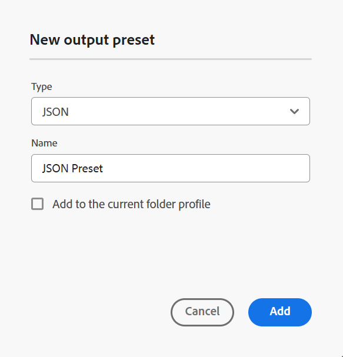
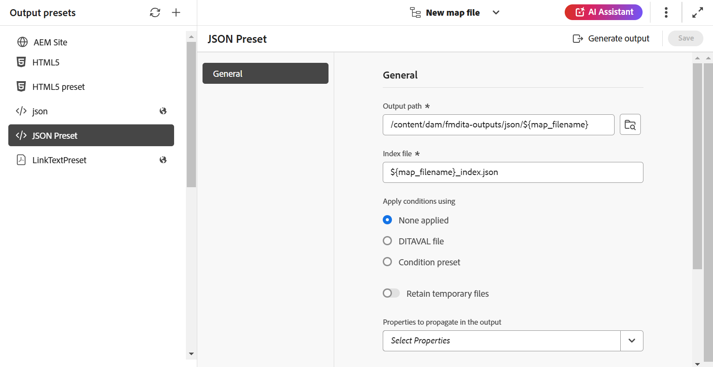

# JSON {#id231KK0180T4}

Execute as seguintes etapas para criar a predefinição JSON no console Mapa:

1. [Abra um arquivo de mapa DITA no Console de mapa](./open-files-map-console.md).

   Você também pode acessar o arquivo de mapa no widget **Arquivos recentes** na [seção Visão geral](./intro-home-page.md#overview). O arquivo de mapa selecionado seria aberto no console Mapa.
1. Na guia **Predefinições de saída**, selecione o ícone + para criar uma predefinição de saída.
1. Selecione **JSON** na lista suspensa Tipo na caixa de diálogo **Nova predefinição de saída**.
1. No campo **Nome**, forneça um nome para esta predefinição.
1. Selecione a opção **Adicionar ao perfil de pasta atual** para criar uma predefinição de saída no perfil de pasta atual. O  indica uma predefinição de nível de perfil de pasta.

   Saiba mais sobre [Gerenciar predefinições de saída de perfil Global e de Pasta](./web-editor-manage-output-presets.md).

1. Selecione **Adicionar**.

   A predefinição JSON é criada.

   {width="300" align="left"}

Depois que a predefinição é criada, é possível definir as seguintes configurações predefinidas disponíveis na guia General.

- Caminho de saída
- Arquivo de índice
- Aplicar condições usando \(Se as condições forem definidas para um mapa\)
- Usar Linha de Base \(Se uma linha de base for criada para um mapa\)
- Reter arquivos temporários
- Propriedades a serem propagadas na saída
- Fluxo de trabalho de pós-geração

Para obter detalhes, consulte [Configuração JSON](#json-configuration).

{align="left"}

## Configuração JSON

As seguintes opções estão disponíveis para a predefinição JSON:

>[!NOTE]
>
> Você também pode editar o arquivo JSON no Editor.

| Opções de JSON | Descrição |
| --- | --- |
| Caminho de saída | O caminho no repositório do AEM onde a saída JSON é armazenada. |
| Arquivo de índice | Você pode dar um nome para o arquivo de índice que está criando para a saída JSON. Por padrão, ele escolhe o nome de arquivo do mapa DITA e adiciona um sufixo (como `map_filename_index.json`).  Você também pode usar variáveis ao definir o Arquivo de Índice. Para obter mais detalhes sobre o uso de variáveis, exiba [Usar variáveis para definir as opções Caminho de Destino, Nome do Site ou Nome do Arquivo](generate-output-use-variables.md#id18BUG70K05Z). |
| Aplicar condições usando | Selecione uma das seguintes opções:  * **Nenhuma aplicada**: selecione esta opção se não quiser aplicar nenhuma condição na saída publicada. * **Arquivo DITAVAL**: selecione o(s) arquivo(s) DITAVAL para gerar conteúdo personalizado. Você pode selecionar vários arquivos DITAVAL usando a caixa de diálogo Procurar ou digitando o caminho do arquivo. Use o ícone de cruz próximo ao nome do arquivo para removê-lo. Os arquivos DITAVAL são avaliados na ordem especificada, de modo que as condições especificadas no primeiro arquivo têm precedência sobre as condições correspondentes especificadas em arquivos posteriores. É possível manter a ordem dos arquivos adicionando ou excluindo arquivos. Se o arquivo DITAVAL for movido para algum outro local ou excluído, ele não será excluído automaticamente do painel de mapa. Você precisa atualizar o local caso os arquivos sejam movidos ou excluídos. Você pode passar o mouse sobre o nome do arquivo para visualizar o caminho no repositório do AEM onde o arquivo está armazenado. Você só pode selecionar arquivos DITAVAL e um erro será exibido se você tiver selecionado qualquer outro tipo de arquivo. * **Predefinição de condição**: selecione uma predefinição de condição no menu suspenso para aplicar uma condição ao publicar a saída. A opção estará visível se você tiver adicionado uma condição na guia Predefinições de condição do console do mapa DITA. Para saber mais sobre a predefinição de condição, exiba [Usar predefinições de condição](generate-output-use-condition-presets.md#id1825FL004PN). |
| Usar Linha de Base | Se tiver criado uma Linha de Base para o mapa DITA selecionado, selecione essa opção para especificar a versão que deseja publicar.  Exibir [Trabalhar com Linha de Base](generate-output-use-baseline-for-publishing.md#id1825FI0J0PF) para obter mais detalhes. |
| Reter arquivos temporários | Selecione essa opção para manter os arquivos temporários gerados pelo DITA-OT. Se ocorrerem erros durante a geração de saída pelo DITA-OT, selecione essa opção para manter os arquivos temporários. Você pode usar esses arquivos para solucionar erros de geração de saída.    Depois de gerar a saída, selecione o ícone **Baixar arquivos temporários**  para baixar a pasta ZIP que contém os arquivos temporários.    **Observação**: se as propriedades do arquivo forem adicionadas durante a geração, os arquivos temporários de saída também incluirão um arquivo *metadata.xml* contendo essas propriedades. |
| Propriedades a serem propagadas na saída | Selecione as propriedades que deseja processar como metadados. Essas propriedades são definidas na página Propriedades do mapa DITA ou do arquivo de mapa. As propriedades selecionadas na lista suspensa estão listadas abaixo do campo Propriedades.  **Observação**: você também pode definir propriedades personalizadas e transmitir os metadados para a saída usando a publicação DITA-OT. Para obter mais detalhes, [Trabalhe com metadados](metadata-dita.md#id21BJ00QD0XA). |
| Fluxo de trabalho de pós-geração | Ao escolher essa opção, uma nova lista suspensa Fluxo de trabalho de pós-geração é exibida contendo todos os fluxos de trabalho configurados no AEM. Você deve selecionar um workflow que deseja executar após a conclusão do workflow de geração de saída.  **Observação**: para obter mais informações sobre como criar um fluxo de trabalho personalizado de geração de pós-saída, exiba _Personalizar fluxo de trabalho de geração de pós-saída_ no guia Instalar e configurar o Adobe Experience Manager Guides as a Cloud Service. |

**Tópico pai:**&#x200B;[ Noções básicas sobre as predefinições de saída](generate-output-understand-presets.md)
