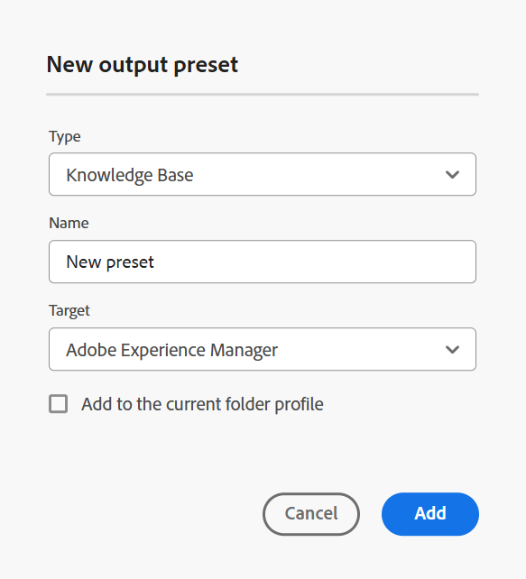

# Knowledge Base {#knowledge-base}

Execute as seguintes etapas para criar a predefinição da **Base de Dados de Conhecimento** no console Mapa:

1. [Abra um arquivo de mapa DITA no Console de mapa](./open-files-map-console.md).

   Você também pode acessar o arquivo de mapa no widget **Arquivos recentes** na [seção Visão geral](./intro-home-page.md#overview). O arquivo de mapa selecionado seria aberto no console Mapa.
1. Na guia **Predefinições de saída**, selecione o ícone + para criar uma predefinição de saída.
1. Selecione **Base de Dados de Conhecimento** na lista suspensa Tipo na caixa de diálogo **Nova predefinição de saída**.
1. No campo **Destino**, selecione um destino para a saída gerada. As opções disponíveis são: **Adobe Experience Manager**, **Salesforce** e **ServiceNow**.

   {width="350" align="left"}

1. Selecione a opção **Adicionar ao perfil de pasta atual** para criar uma predefinição de saída no perfil de pasta atual. O  indica uma predefinição de nível de perfil de pasta.

   Saiba mais sobre [Gerenciar predefinições de saída de perfil Global e de Pasta](./web-editor-manage-output-presets.md).

1. Selecione **Adicionar**.

   A predefinição da Knowledge Base é criada.

## Configuração da knowledge base{#knowledge-base-configuration}

As opções de configuração da predefinição da Base de Dados de Conhecimento estão organizadas nas guias **Geral**, **Artigos** e destino selecionado (**AEM**/ **ServiceNow**/ **Salesforce**).

{width="550" align="left"}

### Geral

As seguintes opções de configuração estão disponíveis na guia **Geral**:

| Opções da knowledge base | Descrição |
| --- | --- |
| Aplicar condições usando | Selecione uma das seguintes opções:  * **Nenhuma aplicada**: selecione esta opção se não quiser aplicar nenhuma condição na saída publicada. * **Arquivo DITAVAL**: selecione o(s) arquivo(s) DITAVAL para gerar conteúdo personalizado. Você pode selecionar vários arquivos DITAVAL usando a caixa de diálogo Procurar ou digitando o caminho do arquivo. Use o ícone de cruz próximo ao nome do arquivo para removê-lo. Os arquivos DITAVAL são avaliados na ordem especificada, de modo que as condições especificadas no primeiro arquivo têm precedência sobre as condições correspondentes especificadas em arquivos posteriores. É possível manter a ordem dos arquivos adicionando ou excluindo arquivos. Se o arquivo DITAVAL for movido para outro local ou excluído, ele não será excluído automaticamente da predefinição. Você precisa atualizar o local caso os arquivos sejam movidos ou excluídos. Você pode passar o mouse sobre o nome do arquivo para visualizar o caminho no repositório do Adobe Experience Manager onde o arquivo está armazenado. Você só pode selecionar arquivos DITAVAL, e um erro será exibido se você selecionar qualquer outro tipo de arquivo. * **Predefinição de condição**: selecione uma predefinição de condição na lista suspensa para aplicar uma condição ao publicar a saída. A opção estará visível se você tiver adicionado uma condição na guia Predefinições de condição do console do mapa DITA. Para saber mais sobre predefinições de condição, exiba [Usar predefinições de condição](generate-output-use-condition-presets.md#id1825FL004PN). |
| Usar Linha de Base | Se tiver criado uma Linha de Base para o mapa DITA selecionado, selecione essa opção para especificar a versão que deseja publicar.  Exibir [Trabalhar com a Linha de Base](generate-output-use-baseline-for-publishing.md#id1825FI0J0PF) para obter mais detalhes. |
| Fluxo de trabalho de pós-geração | Ao escolher essa opção, uma nova lista suspensa Fluxo de trabalho de pós-geração que contém todos os fluxos de trabalho configurados no Adobe Experience Manager é exibida. Você deve selecionar um workflow que deseja executar após a conclusão da geração de saída.  **Observação**: saiba mais sobre como [personalizar a seção de fluxo de trabalho de geração pós-saída](../cs-install-guide/customize-workflows.md#id17A6GI004Y4) no Guia de Instalação e Configuração do Cloud Services. |

### Artigos

Essa guia exibe a árvore ou a exibição hierárquica do mapa. Escolha os tópicos que deseja publicar em uma base de conhecimento. Expanda um nó do índice e escolha os tópicos que deseja publicar.

### Target - Adobe Experience Manager/ServiceNow/Salesforce

As opções de configuração são alteradas com base no target selecionado.

**Adobe Experience Manager**

As seguintes opções de configuração são exibidas para **Adobe Experience Manager** como destino:

>[!NOTE]
>
>Você pode usar a predefinição da Base de conhecimento Adobe Experience Manager somente se o administrador a tiver configurado.

| Opções do Adobe Experience Manager | Descrição |
| --- | --- |
| Usar caminho do artigo | Selecione esta opção para exibir o **Caminho do artigo** da pasta que contém os modelos da Base de Dados de Conhecimento. |
| Caminho do artigo | Este campo aparecerá se você selecionar a opção **Usar caminho do artigo**. Navegue até o site da knowledge base no repositório do Adobe Experience Manager onde a saída está armazenada. |
| Site | Use esse campo para selecionar a Base de conhecimento Adobe Experience Manager necessária. Você pode configurar a base de conhecimento no site do Adobe Experience Manager para armazenar o conteúdo com base nas permissões. Os artigos desse mapa do DITA podem ser publicados nessas bases de conhecimento. |
| Categoria | Selecione uma categoria na lista suspensa para publicar os tópicos do índice nessa categoria no site do Adobe Experience Manager. |
| Modelo de seção e modelo de artigo | Esses são os componentes estruturais usados para organizar o conteúdo da saída. Eles são predefinidos no modelo de site do Adobe Experience Manager. |
| Fluxo de trabalho de pós-geração | Ao escolher essa opção, uma nova lista suspensa de Fluxo de trabalho de pós-geração que contém todos os fluxos de trabalho configurados no Adobe Experience Manager é exibida. Você deve selecionar um workflow que deseja executar após a conclusão do workflow de geração de saída. Saiba mais sobre como [personalizar a seção do fluxo de trabalho de geração pós-saída](../install-guide/customize-workflows.md#id17A6GI004Y4) no Guia de Instalação e Configuração. |

>[!TIP]
> 
>Selecione o ícone **Atualizar** para preencher os respectivos modelos nos campos de acordo com o modelo da Base de Dados de Conhecimento selecionado.

**ServiceNow**

As seguintes opções de configuração são exibidas para **ServiceNow** como destino:

| Opções do ServiceNow | Descrição |
| --- | --- |
| Perfil de publicação | Use a lista suspensa para selecionar nos perfis de conexão do ServiceNow que o administrador configura. Para saber mais sobre como o administrador pode criar um perfil de publicação, exiba a descrição do recurso **Configurações do Workspace** (que aparece como **Configurações** para **No local**) na seção [Painel Esquerdo](./web-editor-features.md#id2051EA0M0HS). |
| Knowledge Base | Use esse campo para selecionar a Base de conhecimento necessária do ServiceNow. Você pode configurar bases de conhecimento no site ServiceNow para armazenar o conteúdo com base nas permissões. Os artigos desse mapa do DITA podem ser publicados nessas bases de conhecimento. |
| Categoria e subcategoria | As categorias são como árvores hierárquicas usadas para localizar e classificar artigos da Base de Dados de Conhecimento ServiceNow. Adicione uma categoria e subcategoria para publicar os tópicos e subtópicos do índice nessa categoria e subcategoria no site ServiceNow. |

**Salesforce**

As seguintes opções de configuração são exibidas para **Salesforce** como destino:

| Opções do Salesforce | Descrição |
| --- | --- |
| Perfil de publicação | Use o menu suspenso para selecionar nos perfis de conexão do Salesforce que o administrador configura. Para saber mais sobre como o administrador pode criar um perfil de publicação, exiba a descrição do recurso **Configurações do Workspace** (que aparece como **Configurações** para **No local**) na seção [Barra de guias](./web-editor-features.md#tab-bar). |
| Tipo de registro | Use a lista suspensa para selecionar entre os tipos de registro configurados no Salesforce de acordo com as configurações de visibilidade com base no perfil do usuário. Os Tipos de registro do Salesforce são uma maneira de agrupar muitos registros de um tipo para esse objeto. Elas definem como a publicação é organizada. Por exemplo, você pode selecionar Tipo de registro de perguntas frequentes e publicar de acordo com o layout e os campos da página Perguntas frequentes. |
| Campo de conteúdo do artigo | É possível ter campos diferentes e um layout exclusivo para cada modelo de tipo de registro. Use esses campos para inserir informações específicas, dependendo do tipo de artigo. Por exemplo, você pode visualizar o título, a resposta e a equação de um artigo de Perguntas frequentes. |
| Categorias | Selecione uma categoria na lista suspensa para publicar os tópicos do índice nessa categoria no site do Salesforce. |

**Mais algumas opções**

Também é possível exibir as seguintes opções nas predefinições do Salesforce e do ServiceNow:

| Opções | Descrição |
| --- | --- |
| Remova o cabeçalho do tópico do corpo do artigo. | Selecione essa opção para remover o cabeçalho do tópico do artigo na saída publicada. |
| Carregar como rascunho | Selecione esta opção para fazer upload do tópico e compartilhá-lo como rascunho antes de disponibilizá-lo aos usuários. |
| Carregar imagens | Selecione esta opção se desejar que quaisquer imagens nos tópicos sejam incluídas na saída publicada. |
| Fazer upload de documentos vinculados | Selecione essa opção para incluir os documentos vinculados em tópicos na saída publicada. |

**Tópico pai:** [Entendendo as predefinições de saída](generate-output-understand-presets.md)
