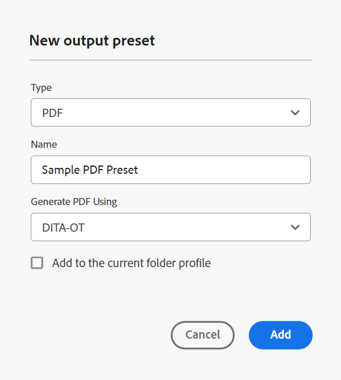
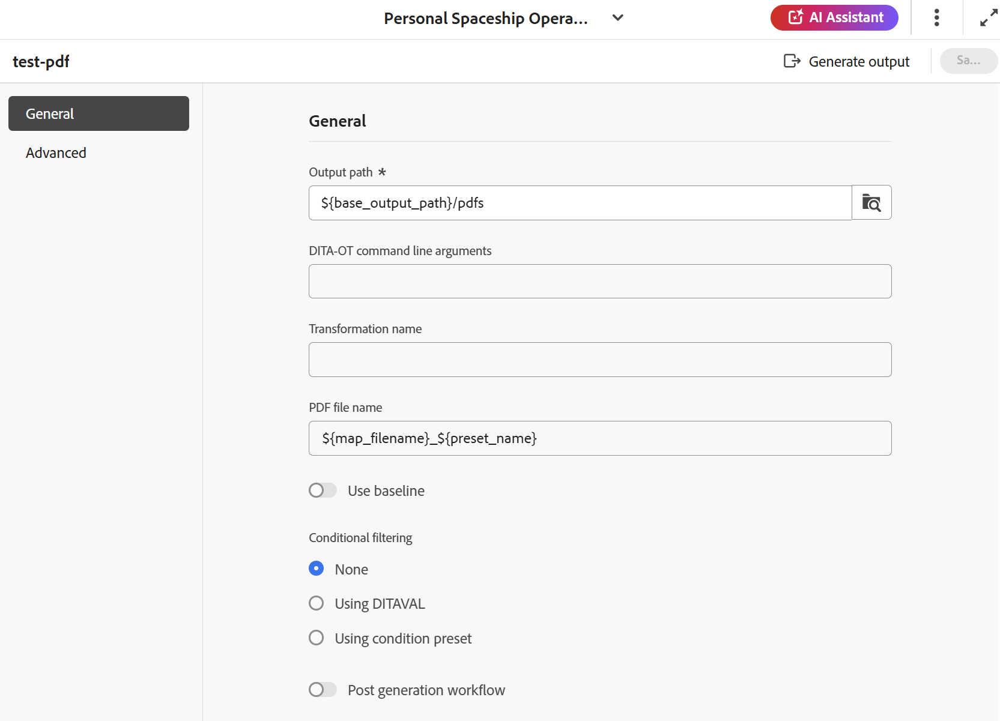

# Criar predefinição de saída DITA-OT PDF {#id205BE600HAH}

Você pode criar a predefinição de saída DITA-OT PDF de duas maneiras:

- [Crie a predefinição DITA-OT PDF no console Mapa](#create-the-dita-ot-pdf-preset-from-the-map-console)
- [Crie a predefinição DITA-OT PDF no painel Mapa](#create-the-dita-ot-pdf-preset-from-the-map-dashboard)

## Crie a predefinição DITA-OT PDF no console Mapa

Execute as seguintes etapas para criar a predefinição do PDF a partir do console Mapa:

1. [Abra um arquivo de mapa DITA no Console de mapa](./open-files-map-console.md).

   Você também pode acessar o arquivo de mapa no widget **Arquivos recentes** na [seção Visão geral](./intro-home-page.md#overview). O arquivo de mapa selecionado seria aberto no console Mapa.
1. Na guia **Predefinições de saída**, selecione o ícone + para criar uma predefinição de saída.
1. Selecione **PDF** na lista suspensa Tipo na caixa de diálogo **Nova predefinição de saída**.
1. No campo **Nome**, forneça um nome para esta predefinição.
1. No campo **Gerar PDF Usando**, selecione **DITA-OT**.
1. Selecione a opção **Adicionar ao perfil de pasta atual** para criar uma predefinição de saída no perfil de pasta atual. O  indica uma predefinição de nível de perfil de pasta.

   Saiba mais sobre [Gerenciar predefinições de saída de perfil Global e de Pasta](./web-editor-manage-output-presets.md).

1. Selecione **Adicionar**.

   A predefinição do PDF é criada.

   {width="350" align="left"}

No console de Mapa, as opções de configuração predefinidas para DITA-OT são organizadas nas guias **Geral** e **Avançado** do console de Mapa.

{width="350" align="left"}

**Geral**

A guia **Geral** contém as seguintes opções de configuração:

- Caminho de saída
- Argumentos da linha de comando DITA-OT
- Nome do arquivo do PDF
- Filtragem condicional \(Se as condições forem definidas para um mapa\)
- Usar linha de base \(Se uma linha de base for criada para um mapa\)
- Fluxo de trabalho de pós-geração

**Avançado**

A guia **Avançado** contém as seguintes opções de configuração:

- Ativar controle de versão
- Reter arquivos temporários
- Propriedades do arquivo

Para obter detalhes sobre as opções de configuração de predefinição, consulte a seção [Configuração de predefinição do PDF](#pdf-preset-configuration).

## Crie a predefinição DITA-OT PDF no painel Mapa

Execute as seguintes etapas para criar a predefinição do PDF no painel de mapa:

1. Na interface do usuário do Assets, navegue até o mapa DITA e selecione-o para abri-lo no painel do mapa.
1. Verifique se a guia **Predefinições de Saída** está selecionada.
1. Selecione **Criar** na barra de ferramentas.

   Um novo formulário de criação de predefinição de saída é exibido.

1. Insira os detalhes de configuração necessários para a predefinição do PDF.
1. Selecione **Concluído** para salvar as configurações predefinidas.

## Configuração de predefinição do PDF

As opções de configuração variam um pouco, dependendo se você está configurando a predefinição no console Mapa ou no painel Mapa. Algumas opções se aplicam somente ao painel Mapa, enquanto outras se aplicam a ambos.

Nos casos em que a mesma configuração tem dois rótulos de campo diferentes, um **/** os separa na tabela abaixo. O primeiro representa o rótulo no console Mapa e o segundo representa o rótulo no painel Mapa.

Por exemplo, **Caminho de saída/Caminho de destino** - Aqui, **Caminho de saída** é o rótulo usado no console de Mapa, enquanto **Caminho de destino** é o rótulo usado no painel de Mapa para a mesma configuração.

| Opções do PDF | Descrição |
| --- | --- |
| Tipo de Saída (*Aplicável somente ao painel do Mapa*) | O tipo de saída que você deseja gerar. Para gerar a saída do PDF, escolha a opção PDF. |
| Nome da Configuração (*Aplicável somente ao painel de Mapa*) | Dê um nome descritivo para as configurações de saída do PDF que você está criando. Por exemplo, você pode especificar _saída de clientes internos_ ou _saída de usuários finais_. |
| Gerar PDF usando (*Aplicável somente ao painel de Mapa*) | Selecione **DITA-OT** para gerar a saída do PDF. Selecione **FrameMaker Publishing Server** se o administrador tiver configurado essa opção. Algumas das opções de configuração variam quando FMPS é selecionado. Além disso, a opção de configuração FMPS só está disponível no painel Mapa. |
| Caminho de saída/Caminho de destino | O caminho no repositório do AEM onde o PDF está armazenado. O Caminho de saída é definido por meio da variável `${base_output_path}`, que é configurada pelo Administrador. Para configurar o Caminho de saída, exiba [Configurar localização de saída básica para serviços em nuvem](../native-pdf/configure-base-location-cs.md) ou [Configurar localização de saída básica para serviços no local](../native-pdf/configure-base-output-location.md) com base nos serviços que você está usando.  Você também pode usar algumas variáveis prontas para uso para definir o Caminho de saída, a exibição [Use variáveis para definir as opções Caminho de destino, Nome do site ou Nome do arquivo](generate-output-use-variables.md#id18BUG70K05Z). |
| Argumentos de linha de comando DITA-OT | Especifique os argumentos adicionais que você deseja que o DITA-OT processe ao gerar saída. Para obter detalhes sobre os argumentos de linha de comando com suporte no DITA-OT, exiba a [documentação do DITA-OT](https://www.dita-ot.org/). |
| Nome da transformação | Especifique o tipo de saída que deseja gerar. Isso é necessário se você quiser gerar saída usando seu próprio plug-in personalizado, que está integrado ao plug-in DITA-OT. Por exemplo, se você deseja gerar saída XHTML, especifique `xhtml`. Para obter uma lista de transformações disponíveis no DITA-OT, exiba [transformações do DITA-OT (formatos de saída)](http://www.dita-ot.org/2.3/user-guide/AvailableTransforms.html) no Guia do Usuário do OASIS DITA-OT. |
| Nome do arquivo do PDF/Nome do arquivo | Especifique o nome do arquivo com o qual deseja salvar a PDF.  Você também pode usar variáveis ao definir o Nome do Arquivo do PDF. Para obter mais detalhes sobre o uso de variáveis, exiba [Usar variáveis para definir as opções Caminho de Destino, Nome do Site ou Nome do Arquivo](generate-output-use-variables.md#id18BUG70K05Z).  **Observação**: se você não fornecer um nome de arquivo, o título do mapa DITA será usado para gerar o nome de arquivo final do PDF. Se o mapa não tiver um título, o nome do arquivo do mapa DITA usado para nomear será o PDF final. O nome do arquivo é limpo usando as regras configuradas no sistema para lidar com qualquer caractere inválido. |
| Filtragem condicional/Aplicar condições usando | Selecione uma das seguintes opções:  * **Nenhuma aplicada**: selecione esta opção se não quiser aplicar nenhuma condição na saída publicada. * **Arquivo DITAVAL**: selecione o(s) arquivo(s) DITAVAL para gerar conteúdo personalizado. Você pode selecionar vários arquivos DITAVAL usando a caixa de diálogo Procurar ou digitando o caminho do arquivo. Use o ícone de cruz próximo ao nome do arquivo para removê-lo. Os arquivos DITAVAL são avaliados na ordem especificada, de modo que as condições especificadas no primeiro arquivo têm precedência sobre as condições correspondentes especificadas em arquivos posteriores. É possível manter a ordem dos arquivos adicionando ou excluindo arquivos.  Também é possível aplicar sinalizadores em um arquivo DITAVAL para marcar visualmente o conteúdo. Cada sinalizador pode incluir uma imagem e ser estilizado usando formatação como negrito ou itálico. Para obter mais detalhes sobre como personalizar estilos de sinalização ou resolver conflitos de formatação, exiba [Usar o editor DITAVAL](../user-guide/ditaval-editor.md). Se o arquivo DITAVAL for movido para algum outro local ou excluído, ele não será excluído automaticamente do painel de mapa. Você precisa atualizar o local caso os arquivos sejam movidos ou excluídos. Você pode passar o mouse sobre o nome do arquivo para visualizar o caminho no repositório do AEM onde o arquivo está armazenado. Você só pode selecionar arquivos DITAVAL e um erro será exibido se você tiver selecionado qualquer outro tipo de arquivo. O FrameMaker Publishing Server não é compatível com vários arquivos DITAVAL. * **Predefinição de condição**: selecione uma predefinição de condição no menu suspenso para aplicar uma condição ao publicar a saída. A opção estará visível se você tiver adicionado uma condição na guia Predefinições de condição do console do mapa DITA. Para saber mais sobre a predefinição de condição, exiba [Usar predefinições de condição](generate-output-use-condition-presets.md#id1825FL004PN). |
| Executar fluxo de trabalho de pós-geração | Ao escolher essa opção, uma nova lista suspensa Fluxo de trabalho de pós-geração é exibida contendo todos os fluxos de trabalho configurados no AEM. Você deve selecionar um workflow que deseja executar após a conclusão do workflow de geração de saída.  **Observação**: para obter mais informações sobre como criar um fluxo de trabalho personalizado de geração de pós-saída, consulte Personalizar fluxo de trabalho de geração de pós-saída em Instalar e configurar o Adobe Experience Manager Guides as a Cloud Service. |
| Usar Linha de Base | Se tiver criado uma Linha de Base para o mapa DITA selecionado, selecione essa opção para especificar a versão que deseja publicar.  Exibir [Trabalhar com Linha de Base](generate-output-use-baseline-for-publishing.md#id1825FI0J0PF) para obter mais detalhes. |
| Reter arquivos temporários | Selecione essa opção para manter os arquivos temporários gerados pelo DITA-OT. Se ocorrerem erros durante a geração de saída pelo DITA-OT, selecione essa opção para manter os arquivos temporários. Você pode usar esses arquivos para solucionar erros de geração de saída.    Depois de gerar a saída, selecione o ícone **Baixar arquivos temporários**  para baixar a pasta ZIP que contém os arquivos temporários. Os arquivos baixados também incluem o arquivo `system_config.xml`, que fornece informações sobre a URL do autor, a URL local e a URL de publicação. Essas URLs são definidas nas configurações de Externalização do AEM e são refletidas no arquivo `system_config.xml`.   **Observação**: se as propriedades do arquivo forem adicionadas durante a geração, os arquivos temporários de saída também incluirão um arquivo *metadata.xml* contendo essas propriedades. |
| Propriedades do arquivo | Selecione as propriedades que deseja processar como metadados. Essas propriedades são definidas na página Propriedades do mapa DITA ou do arquivo de mapa. As propriedades selecionadas na lista suspensa aparecem no campo **Propriedades do arquivo**. Selecione o ícone cruzado ao lado da propriedade para removê-la.   Observação: você também pode passar os metadados para a saída usando a publicação DITA-OT. Para obter mais detalhes, [Passe os metadados para a saída usando DITA-OT](pass-metadata-dita-ot.md#id21BJ00QD0XA). |

**Tópico pai:**&#x200B;[&#x200B; Noções básicas sobre as predefinições de saída](generate-output-understand-presets.md)
