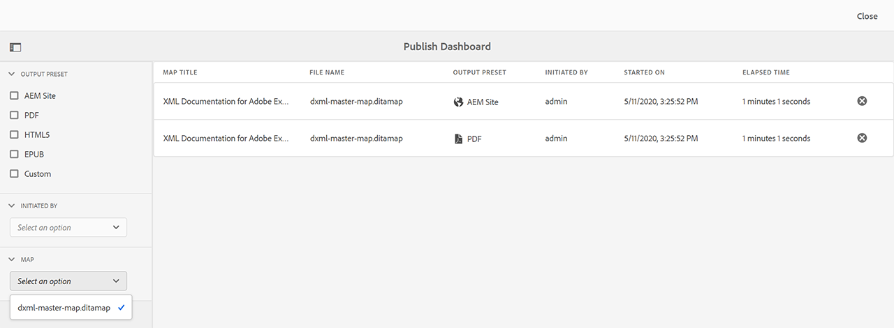

# Gerenciar tarefas de publicação usando o Painel de publicação {#id205CC08305Z}

Quando um grande conjunto de tarefas de publicação está em execução no sistema, torna-se praticamente impossível verificar cada mapa DITA individualmente para monitorar sua tarefa de publicação. O Guia AEM fornece aos administradores e editores uma visualização unificada de todas as tarefas de publicação em execução no sistema. Uma lista de todas as tarefas de publicação ativas está disponível no Painel de publicação.

O Painel de publicação fornece uma visão geral completa de todas as tarefas de publicação atualmente em execução no sistema.

{width="800" align="left"}

O Painel de publicação contém os seguintes detalhes:

- **Título do mapa** - O título de um arquivo de mapa que está sendo publicado no momento ou que está na fila de publicação.

- **Nome do arquivo** - O nome de arquivo do mapa DITA.

- **Predefinição de saída** - Nome da predefinição de saída usada para gerar a saída.

- **Iniciado por** - Nome de usuário que iniciou a tarefa de publicação.

- **Iniciado em** - Data e hora em que a tarefa de publicação foi iniciada.

- **Tempo decorrido** - Tempo decorrido desde quando a tarefa de publicação está sendo executada no sistema.

- **Ícone Excluir** - Cancelar ou encerrar uma tarefa de publicação.

O painel esquerdo no Painel de publicação fornece as seguintes opções de filtro:

- **Predefinição de saída** - Selecione uma ou mais predefinições de saída para as quais deseja ver as tarefas de publicação ativas no momento. Na captura de tela a seguir, as tarefas de publicação são filtradas para mostrar somente as tarefas que usam a predefinição de saída do site AEM:

  {width="800" align="left"}

- **Iniciado por** - Selecione um nome de usuário na lista para mostrar as tarefas de publicação iniciadas pelo usuário selecionado.

- **Mapa** - Selecione um arquivo de mapa na lista para mostrar as tarefas de publicação em execução para o mapa selecionado.

## Acessar o painel de publicação {#id205CC100DY4}

Execute as seguintes etapas para acessar o Painel de publicação:

>[!NOTE]
>
> Somente um Administrador ou Editor pode acessar o Painel de publicação.

1. Clique no link Adobe Experience Manager na parte superior e escolha **Ferramentas**.

1. Selecionar **Guias** na lista de ferramentas.

1. Clique no link **Publicar painel** bloco.

   O Painel de publicação é aberto com uma lista de todas as tarefas de publicação ativas no sistema.

   Se você clicar no link Nome do arquivo, será exibido o console de mapa DITA do mapa selecionado.

   {width="800" align="left"}

>[!NOTE]
>
> Você também pode acessar o Painel de publicação na guia Saídas enquanto gera a saída do painel de mapa. Para obter mais detalhes, consulte [Exibir o status da tarefa de geração de saída](generate-output-for-a-dita-map.md#viewing_output_history).

## Cancelar uma tarefa de publicação

Execute as seguintes etapas para cancelar uma tarefa de geração de saída no Painel de publicação:

1. [Acessar o painel de publicação](#id205CC100DY4).

1. Na lista de tarefas de publicação ativas, clique no ícone excluir de uma tarefa que deseja cancelar.

   {width="800" align="left"}

1. Clique em **Sim** no prompt da mensagem Confirmar cancelamento.

   O comando cancel é aceito e o cancelamento é tentado enquanto a tarefa permanecer ativa. Quando a tarefa for finalizada com sucesso, ela será removida da lista de tarefas ativas no momento. O status da tarefa também é atualizado no console do mapa DITA como Cancelado. Na seguinte captura de tela, a variável *HTML5* A tarefa é cancelada no Painel de publicação e seu status também é alterado no console do mapa DITA.

   {width="800" align="left"}

**Tópico pai:**[ Geração de saída](generate-output.md)
