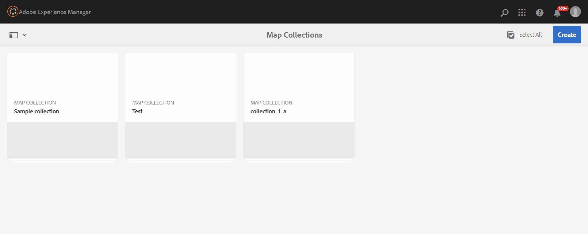

# Usar coleção de mapas para geração de saída {#id1723F20G0HS}

Em qualquer organização, um produto pode ter vários tipos de documentação. Como um especialista em publicação, você gostaria de controlar qual saída deseja gerar para qual documento. Além disso, deve haver uma maneira de publicar vários documentos em lote de uma única vez.

O Adobe Experience Manager Guides oferece a capacidade de organizar seu conteúdo para publicação usando um painel chamado Coleção de mapas. Uma Coleção de Mapas permite reunir todos os diferentes tipos de documentos em uma única unidade. Você pode escolher o tipo de saída que deseja gerar para cada documento na Coleção de mapas. Além disso, também é possível gerar saída e visualizar o progresso da geração de saída no painel de publicação.

A Coleção de mapas oferece uma opção para visualizar se há alguma alteração em qualquer mapa desde a última saída publicada. É possível exibir os detalhes na guia Mapas e predefinições da Coleção de mapas e, em seguida, republicar a saída, se necessário.

## Criar uma coleção de mapas e adicionar mapas DITA

Para criar uma Coleção de mapas e adicionar mapas DITA à coleção, execute as seguintes etapas:

1. Abra a [Página inicial do Experience Manager Guides](./intro-home-page.md#map-collections) e selecione **Mapear coleções**.

   A página **Coleções de mapas** é aberta em uma nova guia.

   {width="350" align="left"}

   >[!NOTE]
   >
   > Você também pode abrir a interface do usuário do Assets e selecionar **Mapear coleções**. Se a página Coleções de Mapas não estiver disponível, selecione a opção **Navegação** no painel à esquerda e selecione **Coleções de Mapas**.

1. Na página **Coleções de Mapas**, selecione **Criar** no canto superior direito e forneça um **Título da Coleção** para sua coleção de mapas.
1. Selecione **Criar**.

   Uma mensagem de Sucesso é exibida ao criar a coleção de mapas.

1. Selecione **Fechar** na mensagem de Êxito.

   O arquivo de mapa recém-criado é mostrado na página Coleções de mapas.

1. Selecione a caixa cinza no bloco da coleção que deseja editar.
1. A coleção de mapas selecionada é aberta no painel de coleção de mapas.
1. Selecione **Editar** e **Adicionar mapas**.
1. Localize e adicione os mapas DITA que deseja adicionar à Coleção de mapas.

   Por padrão, todas as predefinições e localidades associadas ao mapa são adicionadas automaticamente.

1. Selecione a saída desejada ativando ou desativando o botão deslizante.
1. Selecione **Concluído**.

   Os arquivos de mapa DITA são adicionados à Coleção de mapas.

   {align="left"}

**Opções de filtragem**

As seguintes opções de filtro e detalhes do mapa são mostrados na página de coleção:

- **Filtro:** o painel esquerdo mostra os seguintes filtros:
   - **Modificado**: você pode selecionar Sim ou Não. Se você selecionar sim, somente os mapas DITA modificados serão exibidos na tabela Mapas e predefinições.
   - **Predefinição**: selecione uma predefinição para a qual deseja filtrar os arquivos de mapa. Por exemplo, se você escolher a predefinição *Site do AEM*, serão exibidos apenas os mapas que tiverem a predefinição de saída *Site do AEM* configurada.
   - **Idioma**: você pode selecionar qualquer um dos códigos de idioma disponíveis e exibir somente o idioma selecionado na tabela Mapas e Predefinições.
- Tabela **Mapas e Predefinições**: a tabela Mapas e Predefinições apresenta informações nas seguintes colunas:
   - **Mapa**: mostra o título do arquivo de mapa DITA.
   - **Nome do arquivo**: mostra o nome do arquivo do mapa DITA.
   - **Idioma**: mostra o idioma do mapa DITA.
   - **Predefinição**: mostra o tipo de predefinição de saída configurado no arquivo de mapa.
   - **Linha de Base**: mostra a linha de base que é usada pela predefinição de saída.  Se nenhuma linha de base for usada, ela mostrará um hífen &quot;-&quot;
   - **Modificado**: indica se o mapa DITA é atualizado após a última publicação. Com base nessas informações, você pode decidir se deseja republicar a saída desse mapa DITA ou não.
   - **Última Geração**: mostra a data e a hora da última saída gerada.

## Configurar e gerar a saída usando uma coleção de mapas

Para configurar e gerar a saída usando uma Coleção de mapas, execute as seguintes etapas:

1. Abra a Coleção de mapas. É possível exibir várias predefinições de saída, como AEM Sites, PDF (incluindo PDF nativo), HTML5, EPUB e predefinições personalizadas. Também é possível exibir as predefinições de perfil global e de pasta criadas pelo administrador.

   O ícone  indica uma predefinição de nível de perfil de pasta.
1. \(Opcional\) Siga qualquer um dos procedimentos a seguir com base em seus requisitos:
   - Aplique filtros no painel esquerdo para filtrar os mapas modificados, a predefinição de saída ou o idioma.
   - Se necessário, selecione **Editar** e altere a saída desejada ativando ou desativando o botão deslizante.

   >[!NOTE]
   >  
   > Por padrão, qualquer nova predefinição é desativada.

1. Você pode ativar as predefinições de um mapa DITA das seguintes maneiras:

   - Ativar qualquer predefinição individual.
   - Habilite **Todas as predefinições** para que um mapa DITA selecione todas as predefinições de uma só vez. Essa opção está desabilitada por padrão.
   - Habilite **Predefinições de perfil de pasta** para um mapa DITA para selecionar todas as predefinições de perfil de pasta para ele. Essa opção está desabilitada por padrão.

{align="left"}

1. Siga uma das seguintes opções:

   - Para gerar a saída de mapas selecionados, selecione os arquivos de mapa e selecione **Gerar Selecionados**.
   - Para gerar a saída de todos os mapas DITA com suas predefinições configuradas, selecione **Gerar tudo**.

   >[!IMPORTANT]
   >
   > Se um processo de geração de saída para uma predefinição ou um mapa DITA estiver na fila ou em andamento, não será possível iniciar outra tarefa de geração de saída para a mesma predefinição ou mapa.

## Configurar as propriedades dos metadados

Na coleção de mapas, é possível configurar as propriedades de metadados em massa para os mapas DITA. Selecione **Configurar metadados** para abrir a página **Metadados do ativo**. Na página **Metadados de ativos**, todos os mapas presentes na coleção são listados à esquerda.

{align="left"}

Execute as seguintes etapas para configurar as propriedades de metadados:

1. Você pode escolher os mapas para os quais deseja atualizar os metadados. Por padrão, todos os mapas DITA presentes são selecionados.

1. Depois de selecionar os mapas DITA, você pode visualizar propriedades como metadados, agendar (des)ativação, referências, estado do documento e muito mais.

1. Atualize as propriedades dos metadados.

1. Selecione **Salvar e fechar** na parte superior para salvar as atualizações.
1. (Opcional) Ao atualizar as tags, você também pode selecionar Anexar na lista suspensa **Salvar e fechar** para anexar as novas tags à lista existente.
1. Selecione **Enviar** na lista suspensa **Salvar e fechar**.
As propriedades dos metadados são atualizadas para os mapas DITA selecionados em massa na coleção de mapas.

>[!NOTE]
> 
>Na lista suspensa **Estado do documento**, você pode selecionar apenas os estados do documento permitidos em comum para todos os mapas DITA selecionados. Para saber mais, exiba [**Estado do Documento**](./web-editor-document-states.md).

As propriedades de metadados estão sincronizadas com as propriedades do arquivo. Depois de atualizá-los, você poderá exibi-los no painel **Propriedades do arquivo** do Editor.

## Excluir uma coleção de mapas ou um mapa DITA da coleção de mapas

- Para excluir uma coleção de mapas, selecione uma coleção na página Coleção de Mapas e selecione **Excluir**.
- Para excluir um mapa DITA de uma coleção de mapas, abra a Coleção de Mapas no modo Editar, selecione o arquivo de mapa DITA e selecione **Remover da Coleção**.

Isso também removerá quaisquer predefinições ou localidades associadas ao mapa DITA da Coleção de mapas.

## Cancelar uma tarefa de geração de saída de uma coleção de mapas

Semelhante à maneira de cancelar uma tarefa de geração de saída do [console do mapa DITA](generate-output-for-a-dita-map.md#id2061H100T5Z) ou do [Painel de Publicação](generate-output-publish-dashboard.md#), é possível cancelar uma tarefa de geração de saída de uma Coleção de Mapas. Acesse a guia Saídas de uma Coleção de Mapas, vá para a tarefa de publicação que você deseja cancelar e selecione o ícone **Cancelar Este Trabalho** para cancelar a tarefa de publicação.

{align="left"}

**Tópico pai:**[ Geração de saída](generate-output.md)
