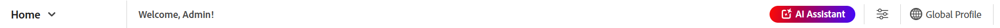
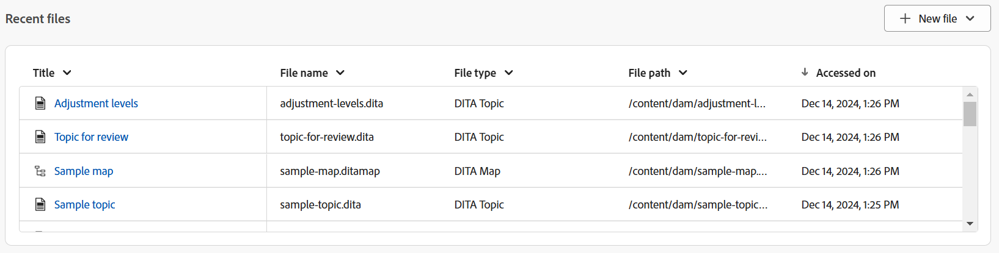
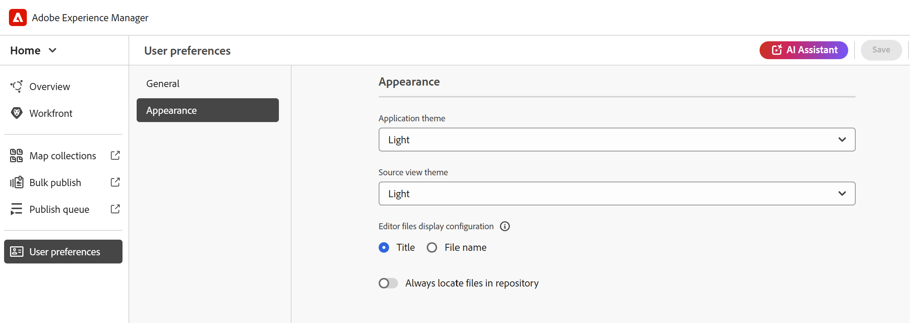

# Experiência da página inicial do Experience Manager Guides

A Página inicial é a primeira tela exibida ao fazer logon no Experience Manager Guides. Ele oferece uma experiência de tela de boas-vindas unificada e intuitiva, que inclui uma visualização rápida dos arquivos acessados recentemente, coleções e muito mais.

{align="left"}

A página inicial do Experience Manager Guides é dividida nas seguintes seções:

- Barra de cabeçalho
- Barra de navegação
- Painel esquerdo

## Barra de cabeçalho

A barra de cabeçalho é a barra superior da página inicial que exibe o logotipo do Adobe Experience Manager (ou um Unified Shell, se você estiver usando o Unified Shell como interface do usuário do Experience Manager Guides). Ao selecionar o logotipo, ele direciona você para a página Navegação do Experience Manager.

{align="left"}

## Barra de navegação

A barra de navegação exibe as ferramentas para alternar a navegação, personalizar o layout da visão geral e ajustar a visualização da página. Ele também exibe o perfil da pasta atual em uso.

>[!NOTE]
>
> Se estiver usando o Adobe Experience Manager Guides as a Cloud Service, um recurso adicional rotulado como **Assistente de IA** será exibido na barra de navegação.

{align="left"}

Os recursos disponíveis na barra de navegação são explicados da seguinte maneira:

- **Alternador de navegação**: permite a navegação contínua para outras páginas:
   - **Página inicial**: a página padrão exibida ao fazer logon no Experience Manager Guides.
   - **Editor**: um editor baseado na Web fácil de usar que permite criar e gerenciar documentos estruturados no Experience Manager Guides. [Conheça a interface do Editor](./web-editor.md).
   - **Console de mapas**: fornece um espaço de trabalho dedicado para tratar de todos os aspectos do gerenciamento e da publicação de mapas. [Conheça a interface do console de Mapa](./map-console-overview.md).
- **Assistente de IA**: uma ferramenta avançada orientada por IA, projetada para aprimorar sua produtividade por meio de recursos de ajuda inteligentes. Além disso, ao trabalhar na interface do Editor, você pode aproveitar os recursos de criação inteligente do Assistente de IA, que tornam o processo de criação mais inteligente e rápido por meio de sugestões inteligentes para reutilização e otimização de conteúdo.

  No momento, o recurso [Assistente de IA](./ai-assistant.md) está disponível apenas para o Adobe Experience Manager as Cloud Service.
- **Seção de visão geral personalizada**: permite ocultar ou mostrar os widgets na seção Widgets.
- **Perfil de pasta em uso**: exibe o perfil de pasta em uso no momento.
- **Expandir exibição**: permite expandir a exibição de página usando o ícone **Expandir**. Nesta visualização, a barra do cabeçalho fica oculta, maximizando o espaço de conteúdo. Para retornar ao modo de exibição padrão, use o ícone **Sair do modo de exibição expandido**.

## Painel esquerdo

O painel esquerdo fornece acesso rápido aos recursos Visão geral, Mapear coleções, Publicação em massa, Publicar fila e Preferências do usuário. Você pode expandir o painel selecionando o ícone **Expandir** posicionado no canto inferior esquerdo da interface. Depois de expandido, use o ícone **Recolher** para recolher o painel.

{width="300" align="left"}

O que você visualiza nesse painel depende da sua função de usuário. A tabela a seguir lista as funções e as respectivas seções exibidas no painel esquerdo.

- **Administrador e Editor**: a capacidade de exibir todas as seções no painel.
- **Autor**: a capacidade de exibir todas as seções, exceto a publicação. Os autores não têm acesso às seções Mapear coleções, Publicar fila e Publicar em massa.
- **Revisor**: a capacidade de exibir somente a seção Visão geral. Selecionar a seção Visão geral exibe uma mensagem de estado vazio padrão ou o widget de tarefas do Workfront, dependendo se o Adobe Workfront está configurado.

Os recursos disponíveis no painel esquerdo são explicados da seguinte maneira:

- [Visão geral](#overview)
- [Mapear Coleções](#map-collections)
- [Publicar em massa](#bulk-publish)
- [Publicar fila](#publish-queue)
- [Preferências do usuário](#user-preferences)

>[!NOTE]
>
> Além disso, se o administrador tiver configurado a integração do Adobe Workfront no sistema, uma opção **Workfront** também será mostrada no painel esquerdo. Saiba mais sobre a [integração do Adobe Workfront](./workfront-integration.md) no Experience Manager Guides.

### Visão geral

A **Visão geral** atua como um painel personalizado criado para aprimorar a produtividade. Ele apresenta widgets diferentes que ajudam você a se manter organizado e focado.

Os widgets também fornecem opções para classificar e redimensionar colunas. Para exibir essas opções, selecione o cabeçalho da coluna e as opções seriam exibidas em uma lista.

Os seguintes widgets estão presentes na seção Widgets:

- **Arquivos Recentes**: o widget fornece um instantâneo dos arquivos abertos recentemente (uma lista de arquivos que você acessou no Editor), juntamente com os detalhes principais do arquivo, incluindo Título, Nome do arquivo, Tipo de arquivo, Caminho do arquivo e Acessado nas datas.

  {align="left"}

  Você pode classificar e redimensionar as colunas selecionando opções no menu suspenso de colunas. Por padrão, os dados são classificados com base na data e hora do último acesso.

  {align="left"}

  Em [Preferências do Usuário](#user-preferences), você pode definir o número máximo de arquivos que podem ser exibidos neste widget. Por padrão, esse limite está definido como **20**.

  As seguintes opções estão disponíveis quando você passa o mouse sobre um arquivo:

   - **Abrir no editor**: permite que você abra o arquivo no Editor. Você também pode abrir um arquivo simplesmente selecionando-o.
   - **Fixar/desfixar**: permite fixar um ou mais arquivos no widget Arquivos recentes. Os arquivos fixados são exibidos na parte superior da lista de widgets. Para desfixar um arquivo, use a opção **Desfixar**.
   - **Remover**: permite que você remova o arquivo do widget Arquivos recentes.

  **Criar novo arquivo no menu suspenso Novo arquivo**

  O menu suspenso **Novo arquivo** permite criar um tópico ou mapa DITA diretamente do widget **Arquivos recentes**. Ao criar o arquivo com êxito, você será redirecionado para a interface do Editor, onde é possível trabalhar com o arquivo.

- **Coleções**: se você trabalhar em um conjunto de arquivos ou pastas, poderá adicioná-los a este widget para acessá-los rapidamente. Depois de adicionado, é possível visualizar os arquivos por Título, juntamente com outros detalhes importantes, como Proprietário e Datas de criação. Ao selecionar a lista suspensa de colunas, é possível visualizar as opções para classificar e redimensionar a coluna.

  {align="left"}

  As navegações estruturais da coleção selecionada são exibidas na parte superior do widget Coleção. Você pode selecioná-la para voltar para uma pasta específica na hierarquia.

  {align="left"}

  As seguintes opções estão disponíveis quando você passa o mouse sobre uma coleção e seleciona o ícone Mais :

   - **Renomear**: permite renomear a coleção.
   - **Excluir**: permite excluir a coleção.
   - **Exibir na interface do usuário do Assets**: permite que você abra a coleção na interface do usuário do Assets.

  Você pode abrir uma coleção selecionando o título. As seguintes opções estão disponíveis quando você passa o mouse sobre um arquivo de Coleção e seleciona o ícone Mais :

   - **Abrir no editor**: permite que você abra o arquivo no Editor. Como alternativa, você pode selecionar o título do arquivo para abri-lo.
   - **Abrir no console de mapa**: permite que você abra o arquivo de mapa no console de mapa. (Disponível somente para um arquivo de mapa DITA).
   - **Adicionar às coleções**: permite que você adicione o arquivo a uma coleção nova ou existente.
   - **Remover das coleções**: permite remover o arquivo da lista de coleções.
   - **Exibir na Interface do Usuário do Assets**: permite localizar o arquivo na Interface do Usuário do Assets.

  **Criar nova coleção no menu suspenso Nova coleção**

  O menu suspenso **Nova coleção** permite criar uma nova coleção e adicioná-la ao widget **Coleções**.

>[!NOTE]
>
> Além disso, se o administrador tiver configurado a integração do Adobe Workfront no sistema, o widget **Suas tarefas** também será exibido na seção Widgets. Saiba mais sobre a [integração do Adobe Workfront](./workfront-integration.md#working-with-the-your-tasks-widget) no Experience Manager Guides.

### Mapear coleções

O Experience Manager Guides oferece a capacidade de organizar seu conteúdo para publicação usando um painel chamado **Mapear coleções**. Para usar este recurso, selecione **Mapear coleções** no painel esquerdo. Você será direcionado para a página Mapear coleções na **Interface do usuário do Assets**, onde é possível [usar a coleção de mapas para geração de saída.](./generate-output-use-map-collection-output-generation.md)

### Publicação em massa

O recurso Ativação em massa permite ativar de forma rápida e fácil o conteúdo, desde a criação até a instância de publicação. Para usar este recurso, selecione **Publicação em massa** no painel esquerdo. Você será direcionado para a página Coleções de Ativação em Massa na interface do Assets, onde é possível criar e gerenciar a [Ativação em massa do conteúdo publicado](./conf-bulk-activation.md).

### Publicar fila

Quando um grande conjunto de tarefas de publicação está em execução no sistema, torna-se praticamente impossível verificar cada mapa DITA individualmente para monitorar sua tarefa de publicação. O Experience Manager Guides fornece aos administradores e editores uma visualização unificada de todas as tarefas de publicação em execução no sistema.

Para usar este recurso, selecione **Publicar fila** no painel esquerdo. Você será direcionado para a página Publicar painel na interface do Assets, onde é possível [gerenciar tarefas de publicação usando o painel de publicação](./generate-output-publish-dashboard.md).

### Preferências do usuário

As preferências do usuário estão disponíveis para todos os autores. Usando as preferências, você pode definir as seguintes configurações:

- **Geral**: a guia Geral permite definir as seguintes configurações:

  {align="left"}

   - **Perfil de pasta**: o perfil de pasta controla várias configurações relacionadas a atributos condicionais, modelos de criação, predefinições de saída e configurações do Editor. O perfil Global é exibido por padrão. Além disso, se o administrador tiver configurado perfis de pastas no sistema, esses perfis de pastas também serão mostrados na lista Perfis de pastas.
   - **Caminho base**: por padrão, ao acessar o repositório do Experience Manager Guides a partir do Editor, você verá ativos do local /content/dam. Sua pasta de trabalho provavelmente seria algumas pastas dentro da pasta /content/dam/. Você pode definir o Caminho base para sua pasta de trabalho e a Visualização do repositório, em seguida, mostra o conteúdo desse local antecipadamente. Isso reduz o tempo de acesso à pasta de trabalho. Além disso, ao inserir qualquer referência ou arquivo de mídia no tópico, o local de navegação do arquivo começa com a pasta definida no caminho Base.
   - **Selecionar mapa de raiz**: selecione um arquivo de mapa DITA para resolver referências de chave ou entradas de glossário. O mapa raiz selecionado tem a precedência mais alta para resolver referências principais. Para obter mais detalhes, consulte [Resolver referências de chave](./map-editor-other-features.md).
   - **Número máximo de arquivos recentes**: use este campo para definir um limite máximo nos arquivos exibidos no widget Arquivos recentes.
   - **Abrindo preferências para Mapas**: aqui, você pode selecionar um comportamento padrão que o sistema seguirá ao abrir um arquivo de mapa DITA.

- **Aparência**: a guia Aparência fornece as opções para selecionar os temas do aplicativo e a exibição de origem da área de edição de conteúdo. Use esta guia para definir as seguintes configurações:

  {align="left"}

   - **Tema do aplicativo e exibição do Source**: você pode escolher entre os temas Claro ou Escuro para a exibição do aplicativo e da fonte. No caso do tema Luz, as barras de ferramentas e os painéis usam um plano de fundo de cor cinza-claro. No caso do tema Escuro, as barras de ferramentas e os painéis usam um plano de fundo preto. Selecione o tema **Usar dispositivo** para permitir que o Experience Manager Guides selecione os temas claro e escuro com base no tema do seu dispositivo.

     Em todos os temas, a área de edição de conteúdo é mostrada em fundo branco na exibição Autor.

   - **Configuração de exibição de arquivos do editor**: selecione a maneira padrão de exibir os arquivos no Editor. Você pode exibir a lista de arquivos por títulos ou nomes de arquivos dos vários painéis na exibição Autor. Por padrão, os arquivos são exibidos por título no Editor.

   - **Sempre localizar arquivos no repositório**: selecione esta opção para mostrar o local de um arquivo no repositório ao editá-lo no Editor.
