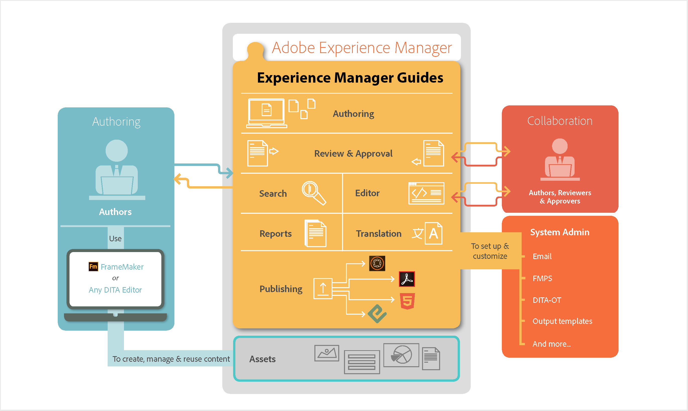

# Como o AEM Guides funciona {#id167G9A00DO4}

O diagrama a seguir ilustra como o AEM Guides funciona com AEM e qualquer editor DITA para permitir o gerenciamento de conteúdo, a reutilização, a tradução e a revisão em um cenário corporativo.

{width="800" align="center"}

**Tópico pai:**[ Sobre o Adobe Experience Manager Guides as a Cloud Service](intro.md)
