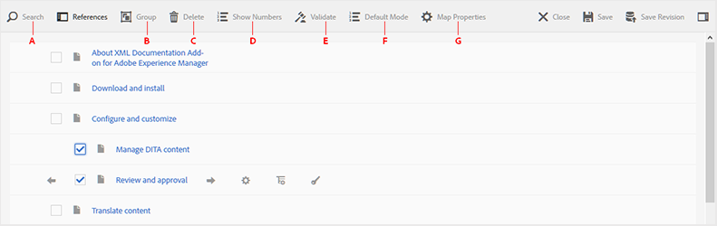
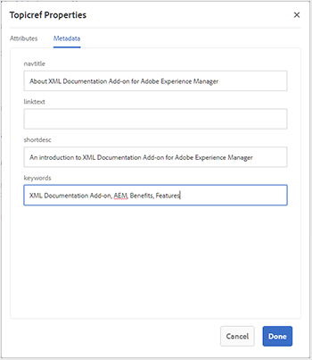

# Trabalhar com o Editor básico de mapas {#id1942CM005Y4}

>[!NOTE]
>
> O Editor de mapa básico, anteriormente disponível no Experience Manager Guides, foi descontinuado a partir da versão 4.3 e 2307. Não é possível acessar o Editor de mapa básico para criar e gerenciar mapas DITA.
>É recomendável usar o Editor de mapa avançado. O Editor de mapa avançado oferece recursos aprimorados e melhores opções de personalização. Saiba mais sobre como trabalhar com o [Editor de mapa avançado](../user-guide/map-editor-advanced-map-editor.md).

O Editor de mapa básico fornece um recurso fácil de arrastar e soltar para adicionar tópicos do seu repositório do AEM e criar o mapa ou bookmap DITA. Você pode adicionar tópicos aninhados, tabelas de relacionamento \(relacionável\), atributos e informações de metadados e também validar o mapa para correção.

>[!NOTE]
>
> Se o administrador tiver ativado a opção Editor de mapa avançado, você não terá acesso ao Editor de mapa básico. Por padrão, todos os arquivos de mapa são abertos no Editor de mapa avançado.

As seções a seguir descrevem as várias funções disponíveis no Editor de mapa básico.

## Adicionar tópicos a um arquivo de mapa {#id193CBL0505Z}

Depois que um arquivo de mapa é criado, é necessário adicionar tópicos ao arquivo de mapa. Usando o Editor de mapa básico, você pode adicionar tópicos, tabelas de relacionamento ou outros arquivos de mapa.

Execute as seguintes etapas para criar seu arquivo de mapa:

1. Na interface do usuário do Assets, navegue até o arquivo de mapa que deseja editar.

1. Para obter um bloqueio exclusivo no arquivo de mapa, selecione o arquivo de mapa e clique em **Check-out**.

   >[!NOTE]
   >
   > Depois que você tiver um bloqueio exclusivo em um arquivo de mapa, outros usuários não poderão editar o mapa. No entanto, eles poderão trabalhar nos tópicos dentro do arquivo de mapa.

1. Com o arquivo de mapa selecionado, clique em **Editar**.

   O arquivo de mapa é aberto para edição no Editor de mapa. Usando o Editor de mapas, crie um mapa usando os tópicos disponíveis no momento que são exibidos no painel Referências.

   {align="left"}

1. Usando o painel **Referências**, navegue até a pasta que contém os tópicos ou submapas que deseja adicionar.

   >[!NOTE]
   >
   > É possível adicionar tópicos ou submapas de qualquer pasta no painel Referências.

1. Para adicionar o primeiro tópico ao mapa, arraste e solte o tópico no Editor de Mapa Básico.

   >[!NOTE]
   >
   > Depois de adicionar o primeiro link, o link Adicionar nova referência fica disponível quando você passa o mouse sobre um tópico existente no mapa.

1. Para adicionar tópicos subsequentes ou um submapa, arraste e solte o tópico ou submapa no local necessário no mapa.

   Se você adicionar um submapa ao mapa DITA, o submapa será mostrado como um link no mapa DITA. Para exibir todos os tópicos do submapa, clique no link do submapa. O conteúdo do submapa é mostrado em uma nova guia.

   >[!NOTE]
   >
   > Se você soltar um novo tópico em um tópico existente no mapa, receberá uma mensagem sobre a substituição do tópico. Clique em Sim se quiser substituir o tópico e clique em Não se não quiser substituir o tópico. Você pode usar CTRL+Z e CTRL+Y para desfazer ou refazer qualquer alteração no mapa.

1. Clique em **Salvar**.

## Recursos disponíveis na barra de ferramentas do Editor básico de mapas

A barra de ferramentas principal no Editor de mapa básico permite executar as seguintes tarefas:

{align="left"}

**A: Pesquisar**

Você pode pesquisar e incluir os tópicos necessários no DAM. Clicar nesse ícone exibe a caixa de diálogo Pesquisar:

{align="left"}

Insira as palavras-chave que você deseja pesquisar; elas são combinadas no nome do arquivo do tópico, no conteúdo e até mesmo nos valores do atributo. Quando os resultados da pesquisa estiverem disponíveis, selecione o tópico desejado\(s\) e clique no botão Verificar para adicionar os arquivos selecionados no final da estrutura do mapa. Você pode filtrar os resultados da pesquisa especificando os parâmetros Modificar Data.

**B: Grupo**

Clique na caixa de seleção à esquerda dos tópicos e clique em Agrupar na barra de ferramentas para agrupar os tópicos selecionados. Para obter mais informações sobre como agrupar tópicos, consulte a documentação do [topicgroup](https://docs.oasis-open.org/dita/v1.0/langspec/topicgroup.html) na Especificação de Linguagem OASIS DITA.

**C: Excluir**

Clique na caixa de seleção à esquerda de um tópico e clique em Excluir na barra de ferramentas para remover os tópicos selecionados do mapa.

**D: Mostrar Números/Ocultar Números**

Exibir numeração \(ou ocultar\) para os tópicos do mapa.

**E: Validar**

Verifique se o mapa é válido ou tem erros.

**F: Modo Padrão/Modo XML**

No **Modo Padrão**, clicar em um link de tópico mostra a visualização do tópico em uma nova guia. Clicar no ícone **Modo Padrão** altera seu modo para **Modo XML**. No **Modo XML**, clicar em qualquer lugar em uma linha de tópico mostra o XML subjacente das referências de tópico dentro do tópico. Na exibição XML de origem, há uma opção de **Recuo automático** que reorganiza o código XML no formato apresentável e facilmente legível. Caso esteja editando um mapa manualmente, a exibição de origem também executa verificações de validação. Caso seu XML contenha erros, o mesmo é destacado no **Modo XML** e você não tem permissão para salvar o arquivo de mapa DITA. Para exibir o XML para o mapa inteiro, clique em qualquer lugar fora do limite do tópico.

**Observação:** no Modo Padrão você pode usar os atalhos de teclado para desfazer \(`Ctrl+z`\) ou refazer \(`Ctrl+y`\) a última ação.

{width="650" align="left"}

**G: Propriedades do Mapa**

Exiba a caixa de diálogo Propriedades do Mapa, na qual você pode definir os atributos e as informações de metadados do mapa. Para adicionar um atributo, clique no botão **Adicionar** no canto inferior esquerdo da caixa de diálogo para obter a lista suspensa **Atributo**. Na lista, selecione o atributo que deseja adicionar. Se o atributo selecionado tiver valores predefinidos especificados no DTD, esses valores serão apresentados em uma nova lista suspensa. Você pode selecionar o valor desejado na lista suspensa. Se não houver um valor predefinido, será exibida uma caixa de texto para você inserir um valor para o atributo selecionado.

{width="300" align="left"}

## Recursos disponíveis no nível de tópico no Editor básico de mapas

Ao passar o ponteiro do mouse sobre um tópico ou um arquivo de submapa no Editor de Mapas Básico, você pode executar as seguintes tarefas:

{width="650" align="left"}

**A: Mover para a Esquerda ou Mover para a Direita**

Clique nos ícones de seta para a esquerda ou direita para mover o tópico para a esquerda ou direita. Mover um tópico de tal forma o torna filho \(ninho\) ou irmão \(remover aninhamento\) com relação ao tópico acima.

**B: Propriedades**

Clique no ícone Propriedades para abrir a caixa de diálogo Propriedades de Topicref. Usando essa caixa de diálogo, você pode definir os atributos do tópico e as informações de metadados. Para obter mais informações sobre atributos e metadados de tópico padrão, consulte a documentação [topicref](https://docs.oasis-open.org/dita/v1.2/os/spec/langref/topicref.html) na Especificação de Linguagem OASIS DITA.

{width="350" align="left"}

**C: Adicionar Nova Referência**

Clique no ícone Adicionar nova referência para adicionar uma nova referência como irmã do tópico atual.

**D: Adicionar Nova Definição De Chave**

Clique no ícone Chave para adicionar uma nova definição de chave. Qualquer chave substituída ou uma chave que já tenha sido definida no mapa aparecerá em vermelho. Se você clicar no ícone Propriedades em uma definição de chave, será exibida a caixa de diálogo Propriedades de definição de chave.

## Trabalhar com tabelas de relacionamento no Editor de mapa básico {#id1944B0I0COB}

Os editores de mapa do AEM Guides vêm com um recurso poderoso que permite criar e editar tabelas de relacionamento no mapa DITA.

Execute as seguintes etapas para trabalhar com tabelas de relacionamento no Editor de mapa básico:

1. Na interface do usuário do Assets, navegue até o mapa DITA em que deseja criar a tabela de relacionamento.

1. Clique no mapa DITA para abri-lo no console do mapa DITA.

1. Selecione a guia **Tópicos** para ver uma lista de tópicos disponíveis no mapa DITA.

   >[!TIP]
   >
   > A guia Tópicos oferece uma opção para baixar o arquivo de mapa com seus dependentes. Para obter mais detalhes, consulte [Exportar um arquivo de mapa DITA](authoring-download-assets.md#id218UBA00IXA).

1. Na barra de ferramentas principal, clique em **Editar**.

   O arquivo de mapa é aberto no Editor de mapa básico.

1. Selecione **Relacionável** na barra de ferramentas.

   {width="650" align="left"}

1. Arraste e solte tópicos da lista de tópicos para o editor Relacionável.

   >[!NOTE]
   >
   > É possível adicionar tópicos de qualquer pasta no painel Referências.

   {width="550" align="left"}

1. Para adicionar um cabeçalho à tabela de relacionamento, clique em **Adicionar Cabeçalho Novamente**.

1. Para adicionar uma coluna à tabela de relação, clique em **Adicionar uma Coluna**.

   {width="550" align="left"}

1. Clique em **Salvar**.

Você também pode executar as seguintes ações no editor de tabela de relacionamento:

**Excluir linhas ou colunas**

Se quiser excluir uma coluna da tabela, marque a caixa de seleção no cabeçalho da coluna e clique em Excluir. Se quiser remover uma linha da tabela, marque a caixa de seleção na primeira coluna da respectiva linha e clique em Excluir.

**Excluir um tópico**

Se quiser deletar um tópico da tabela, clique no ícone cruzado ao lado do tópico.

**Excluir a tabela de relação**

Se quiser excluir a tabela de relacionamento, clique em qualquer lugar fora da tabela de relacionamento e clique em Excluir.

**Tópico pai:**&#x200B;[&#x200B; Trabalhar com o Editor de Mapa](map-editor.md)
