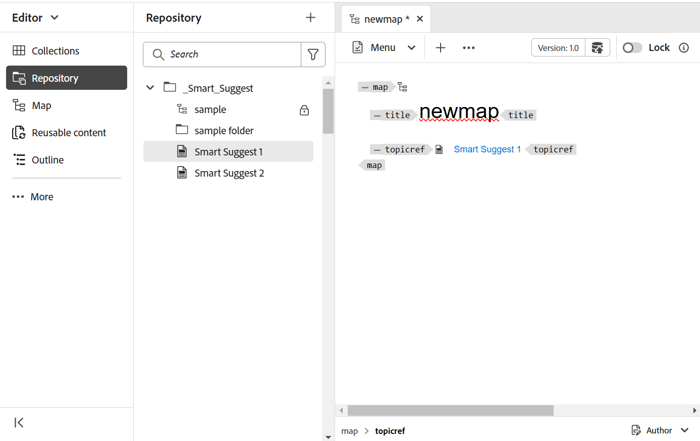

# Criar um mapa {#id176FEN0D05Z}

O Adobe Experience Manager Guides fornece dois modelos de mapa prontos para uso - mapa DITA e mapa de livros. Você também pode criar seus próprios modelos de mapa e compartilhá-los com seus autores para criar arquivos de mapa.

Execute as seguintes etapas para criar um mapa:

1. No painel Repositório, selecione o ícone **Novo arquivo** e selecione **Mapa DITA** no menu suspenso.

   {align="left"}

   Você também pode acessar esta opção a partir da [Página inicial do Experience Manager Guides](./intro-home-page.md) e do menu de opções de uma pasta na exibição Repositório.

2. A caixa de diálogo **Novo mapa** é exibida.

3. Na caixa de diálogo **Novo mapa**, forneça os seguintes detalhes:
   - Um Título para o mapa.
   - \(Opcional\)* O nome do arquivo do mapa. O nome do arquivo é sugerido automaticamente com base no tópico Título. Caso o administrador tenha ativado nomes de arquivo automáticos com base na configuração UUID, você não visualizará o campo Nome.
   - Um modelo no qual o tópico será baseado. Para um arquivo de mapa, as opções disponíveis são **Bookmap**, **Mapa** e **Esquema de assunto**.
   - Caminho no qual você deseja salvar o arquivo de mapa. Por padrão, o caminho da pasta selecionada no momento no repositório é mostrado no campo Caminho.

   {width="300" align="left"}

4. Selecione **Criar**.

O mapa é criado no caminho especificado. Além disso, o mapa é aberto no Editor de mapas para edição.

{align="left"}

## Adicionar tópicos a um arquivo de mapa

Além de editar arquivos de mapa diretamente do Editor, você também pode abrir arquivos de tópico em um mapa para editar o Editor. Você pode adicionar tópicos a um arquivo de mapa.

Execute as seguintes etapas para adicionar tópicos a um arquivo de mapa no console Mapa:

1. Na exibição Repositório, navegue e abra o arquivo de mapa que deseja editar.
1. Selecione o ícone **Editar**.

   {width="450" align="left"}

1. O arquivo de mapa é aberto no Editor de Mapas. Se você tiver aberto um novo arquivo de mapa, então somente o título do mapa será mostrado no editor.

   {align="left"}

   - **A** - \(*Barra de guias*\): é semelhante à barra de guias do Editor. Exiba a [barra de guias](./web-editor-tab-bar.md) no Editor para obter mais detalhes.

   - **B** - \(*Barra de Ferramentas*\) Esta é a barra de ferramentas que permite trabalhar com arquivos de mapa. Para obter mais informações sobre as funcionalidades disponíveis na barra de ferramentas, exiba [Recursos disponíveis na barra de ferramentas do Editor de Mapas](#features-available-in-the-map-editors-toolbar).

   - **C** - \(*Visualizações de mapa*\): permite que você alterne o Editor de mapa entre Layout, Autor, Source e Visualização. O modo de exibição **Layout** permite que você organize os tópicos em um mapa DITA. Isso fornece a exibição em árvore ou hierárquica do mapa. O modo de exibição **Autor** permite que você edite os tópicos no Editor de Mapa. Isso também fornece a visualização WYSIWYG do arquivo de mapa. A exibição **Source** permite trabalhar com o XML subjacente do arquivo de mapa. A Visualização fornece uma exibição consolidada de todos os tópicos e submapas no arquivo de mapa.

   - **D** - \(*Painel Esquerdo*\): Dá acesso ao painel esquerdo, que dá acesso aos recursos Coleções, Repositório, Mapa, Estrutura de Tópicos e outros. Você pode expandi-lo ou recolhê-lo selecionando o ícone Expandir/recolher. Para obter mais detalhes sobre os recursos disponíveis no painel esquerdo, exiba [painel esquerdo](./web-editor-left-panel.md) no Editor.

   - **E** - \(*Área do Meio*\): Mapear área de edição de conteúdo.

   - **F** - \(*Painel Direito*\): Dá acesso ao painel Propriedades. É possível exibir as propriedades de conteúdo e as propriedades do mapa do tópico ou mapa selecionado. Para obter mais detalhes sobre as funcionalidades disponíveis neste painel, consulte [Painel direito](web-editor-right-panel.md) no Editor.

1. No Painel Esquerdo, alterne para a exibição **Repositório**.

1. No repositório do Adobe Experience Manager, navegue até a pasta que contém os tópicos ou submapas que deseja adicionar.

1. Selecione o tópico ou arquivo de mapa na exibição **Repositório** e arraste-o e solte-o na área de edição de conteúdo do mapa \(meio\).

   O tópico é adicionado no mapa.

   {align="left"} ao editor de mapa

1. Para adicionar tópicos subsequentes ou um submapa, arraste e solte o tópico ou submapa no local necessário no mapa.

   Considere os seguintes pontos ao criar o arquivo de mapa:

   - O arquivo é adicionado em um local onde a barra retangular tracejada aparece na área de edição de mapa. Na captura de tela a seguir, o tópico *A sample topic* será adicionado entre os tópicos *Smart Suggest 1* e *Smart Suggest 2*.

     {align="left"}

   - Para substituir um tópico, arraste e solte o novo tópico sobre o tópico que deseja substituir. e soltá-lo sobre indica que será substituído pelo tópico que está sendo solto sobre ele.

   - Se você adicionar um submapa ao mapa DITA, o submapa será mostrado como um link no mapa DITA. Para exibir todos os tópicos do submapa, Ctrl+Clique no link do submapa. O conteúdo do submapa é mostrado em uma nova guia. Da mesma forma, para abrir um tópico no mapa DITA, pressione Ctrl+Clique no link do tópico e ele será aberto na nova guia.

   - Você pode usar as teclas de atalho CTRL+Z e CTRL+Y ou seus respectivos ícones na barra de ferramentas para desfazer ou refazer qualquer alteração no mapa.

   - Para alterar a posição de um tópico, selecione o tópico \(selecionando o ícone de tópico\) e arraste-o e solte-o no local desejado no arquivo de mapa. Na captura de tela a seguir, o tópico *Sugestão Inteligente 1* está sendo movido após o *Um tópico de amostra*.

     {align="left"}

   - Para verificar as propriedades do arquivo de mapa, clique com o botão direito do mouse em qualquer lugar na área de edição de mapas e escolha **Propriedades** no menu de contexto. Com base na sua versão do Adobe Experience Manager, você pode visualizar propriedades como metadados, programação de ativação, referências, estado do documento e muito mais.

1. Selecione **Salvar**.

## Criar um mapa na interface do usuário do Assets

Você também pode criar um arquivo de mapa na interface do usuário do Assets e abri-lo no Editor de mapas para edição.

Execute as seguintes etapas para criar um mapa na interface do usuário do Assets:

1. Na interface do usuário do Assets, navegue até o local em que deseja criar o arquivo de mapa.

1. Selecione **Criar** \> **Mapa DITA**.

1. Na página Blueprint, selecione o tipo de modelo de mapa que deseja usar e selecione **Próximo**.

   >[!NOTE]
   >
   > A forma como os tópicos são referenciados em um arquivo de mapa depende do modelo de mapa. Por exemplo, se o modelo de Mapa for selecionado, as referências de tópico \(`topicref`\) serão usadas para fazer referência a tópicos. No caso de um Bookmap, as referências de tópico são criadas usando o elemento `chapter` no DITA.

   {align="left"}

1. Na página Propriedades, especifique o mapa **Título**.

1. \(Opcional\) Especifique o arquivo **Nome**.

   Se o administrador tiver configurado o nome de arquivo automático com base na configuração UUID, você não visualizará a opção para especificar o nome do arquivo. Um nome de arquivo baseado em UUID é automaticamente atribuído ao arquivo.

   Se a opção de nomenclatura de arquivo estiver disponível, o nome também será sugerido automaticamente com base no Título do mapa. Se você quiser especificar manualmente o nome do arquivo de mapa, certifique-se de que o nome do arquivo não contenha nenhum espaço, apóstrofo ou chaves e termine com `.ditamap`.

1. Selecione **Criar**.

   A mensagem Mapa criado é exibida.

   Cada novo arquivo de mapa criado na interface do usuário do Assets ou no Editor recebe uma ID de mapa exclusiva. Além disso, o novo mapa é salvo como a cópia de trabalho mais recente no DAM. Até salvar uma revisão de um mapa recém-criado, você não exibirá nenhum número de versão no Histórico de versões. Se você abrir o mapa para edição, as informações da versão serão mostradas no canto superior direito da guia do arquivo de mapa:

   {align="left"}

   As informações de versão para um mapa recém-criado são mostradas como *nenhuma*. Ao salvar uma nova versão, um número de versão é atribuído como 1.0. Para obter mais informações sobre como salvar uma nova versão, consulte [Salvar como nova versão](web-editor-features.md#save-as-new-version).

   Você pode optar por abrir o mapa para edição no editor de mapa configurado ou salvar o arquivo de mapa no repositório do Adobe Experience Manager.

   >[!NOTE]
   >
   > Para usar o Editor de mapa avançado, acesse o arquivo de mapa no Editor. Caso o administrador tenha configurado o Editor de mapa avançado como o editor padrão nos arquivos de mapa, o arquivo de mapa será aberto diretamente no Editor de mapa avançado para edição. Exiba *Definir o Editor de Mapa Avançado como padrão* na seção Instalar e configurar o Adobe Experience Manager Guides as a Cloud Service.

### Adicionar tópicos a um arquivo de mapa na interface do usuário do Assets

Execute as seguintes etapas para adicionar tópicos a um arquivo de mapa da interface do usuário do Assets:

1. Na interface do usuário do Assets, navegue até o arquivo de mapa que deseja editar.

   >[!NOTE]
   >
   > Certifique-se de que você não ativou o modo de seleção de ativo.

1. Para obter um bloqueio exclusivo no arquivo de mapa, selecione o arquivo de mapa e a opção **Check-out** na parte superior.

   >[!NOTE]
   >
   > Depois que você tiver um bloqueio exclusivo em um arquivo de mapa, outros usuários não poderão editar o mapa. No entanto, eles poderão trabalhar nos tópicos dentro do arquivo de mapa. Se o administrador tiver configurado o Editor para bloquear arquivos antes de editar, você não poderá editar um arquivo até bloqueá-lo.

1. Com o arquivo de mapa selecionado, selecione **Editar tópicos**.

   {align="left"}

   Ou você também pode selecionar a opção **Editar Tópicos** no menu de ações no arquivo de mapa:

   {align="left"}

   O arquivo de mapa é aberto para edição no Editor. Para adicionar tópicos ao arquivo de mapa, siga as etapas (4-8) em [Adicionar tópicos a um arquivo de mapa](#add-topics-to-a-map-file).

**Tópico pai: [Introdução ao Editor de mapa](map-editor.md)
