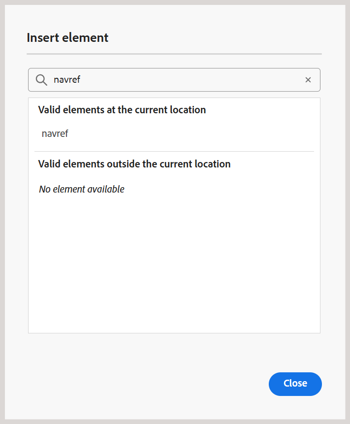

# Recursos adicionais no Editor de mapas {#id1942D0T0HUI}

Alguns recursos comuns no Editor de mapas são:

## Resolver referências de chave {#id176GD01H05Z}

Uma referência de chave de conteúdo DITA ou `conkeyref` é um mecanismo para inserir uma parte do conteúdo de um tópico em outro. Esse mecanismo usa a chave para localizar o conteúdo a ser reutilizado, em vez do mecanismo de referência direta de conteúdo. Para obter mais informações sobre referências diretas e indiretas no DITA, consulte *Endereçamento DITA* na Especificação de Linguagem OASIS DITA.

Se o tópico DITA tiver referências-chave associadas, elas precisarão ser resolvidas antes de visualizar, editar ou revisar um tópico.

As referências principais são resolvidas com base no mapa raiz definido na seguinte ordem de prioridade:

1. Preferências de usuário
1. Painel Exibição de mapa
1. Perfil da pasta

O mapa raiz selecionado nas Preferências do usuário tem a precedência mais alta para resolver referências principais seguidas pelo painel Exibição de mapa e pelo mapa raiz do Perfil de pasta. Portanto, se nenhum mapa estiver definido nas Preferências do usuário, o mapa aberto no painel Exibição de mapa será usado. Se nenhum mapa for aberto no painel Exibição de mapa, o conjunto de mapas nos Perfis de pasta será usado para resolver as referências principais.

As referências de chave podem ser armazenadas em um arquivo de mapa DITA ou em um arquivo DITA separado. No Experience Manager Guides, você pode especificar referências principais no nível do projeto ou no nível de uma sessão. Se um mapa raiz já estiver definido para a sessão do usuário, ele será usado para resolver as chaves. Caso contrário, o mapa raiz padrão para essa pasta será usado. Caso um mapa raiz padrão não esteja configurado, as referências de chave ausentes são realçadas para o usuário.

Há várias maneiras de resolver referências principais em um tópico DITA definindo o mapa DITA a ser usado nos seguintes locais:

**Propriedades do projeto** - Você pode definir um mapa raiz para resolver referências principais ao criar um Projeto na seção Propriedades do Projeto.

Esse mapa raiz será aplicável a todos os ativos \(pastas e subpastas\) associados a esse projeto. Para um conteúdo referenciado em vários projetos, uma lista em ordem alfabética de projetos é mantida e o mapa raiz padrão associado ao primeiro projeto é usado. Você também pode escolher o mapa DITA a ser usado na lista para resolver referências principais.

**Visualização do tópico** - No modo de visualização do tópico, selecione o ícone Resolução de Chave na barra de ferramentas e selecione o arquivo DITA a ser usado para as referências de chave.

**Modo de exibição de edição de tópico** - Selecione o ícone Resolução de Chave ao editar um tópico DITA e selecione o arquivo DITA a ser usado para resolver as referências de chave.

## Adicionar referências de navegação

O elemento `navref` é usado dentro de um mapa DITA para incluir referências de navegação de outro mapa DITA. Isso permite que os autores reutilizem a estrutura de navegação, como menus ou links compartilhados, sem mesclar o conteúdo real do mapa referenciado na saída.

>[!NOTE]
>
> O elemento `navref` destina-se exclusivamente a fins de navegação dentro da estrutura do mapa. Ela não contribui para a saída do mapa DITA gerada e é excluída do processamento e da exibição na exibição de Mapa, Relatórios, Linha de base, Tradução e Pré-visualização.

Para adicionar referências de navegação a um mapa, execute as seguintes etapas:

1. Abra o arquivo de mapa DITA onde deseja adicionar uma referência de navegação.

   O arquivo de mapa é aberto no Editor de Mapas.
1. Alterne para a visualização Autor e coloque o cursor em um local válido para uma referência de navegação.
1. Selecione a opção **Elemento** na barra de ferramentas.
1. No diálogo **Inserir elemento**, selecione **navref**.

   
1. A caixa de diálogo **Selecionar caminho** é exibida. Selecione um arquivo de mapa que você deseja incluir como referência de navegação em seu mapa e escolha **Selecionar**.

Uma referência de navegação do arquivo de mapa selecionado é adicionada no local especificado. Além disso, o título do mapa referenciado é exibido na exibição Autor e na exibição Layout.

*Modo de exibição do Autor*

*Modo de exibição de layout*

**Tópico pai:**&#x200B;[&#x200B; Introdução ao Editor de Mapa](map-editor.md)
