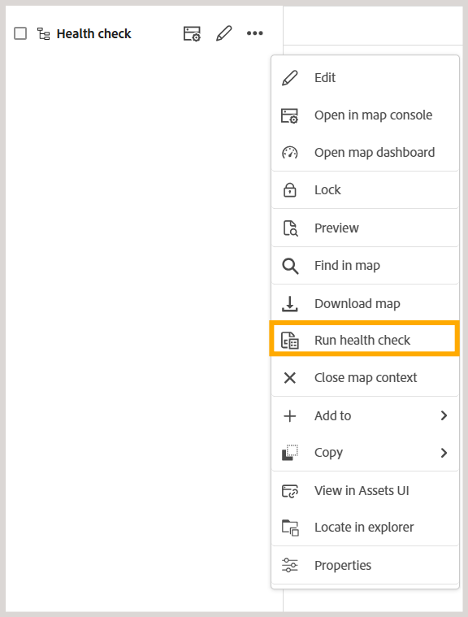

# Recursos adicionais no Editor de mapas {#id1942D0T0HUI}

Alguns recursos comuns no Editor de mapas são:

## Resolver referências de chave {#id176GD01H05Z}

Uma referência de chave de conteúdo DITA ou `conkeyref` é um mecanismo para inserir uma parte do conteúdo de um tópico em outro. Esse mecanismo usa a chave para localizar o conteúdo a ser reutilizado, em vez do mecanismo de referência direta de conteúdo. Para obter mais informações sobre referências diretas e indiretas no DITA, consulte *Endereçamento DITA* na Especificação de Linguagem OASIS DITA.

Se o tópico DITA tiver referências-chave associadas, elas precisarão ser resolvidas antes de visualizar, editar ou revisar um tópico.

As referências principais são resolvidas com base no mapa raiz definido na seguinte ordem de prioridade:

1. Preferências de usuário
1. Painel Exibição de mapa
1. Perfil da pasta

O mapa raiz selecionado nas Preferências do usuário tem a precedência mais alta para resolver referências principais seguidas pelo painel Exibição de mapa e pelo mapa raiz do Perfil de pasta. Portanto, se nenhum mapa estiver definido nas Preferências do usuário, o mapa aberto no painel Exibição de mapa será usado. Se nenhum mapa for aberto no painel Exibição de mapa, o conjunto de mapas nos Perfis de pasta será usado para resolver as referências principais.

As referências de chave podem ser armazenadas em um arquivo de mapa DITA ou em um arquivo DITA separado. No Experience Manager Guides, você pode especificar referências principais no nível do projeto ou no nível de uma sessão. Se um mapa raiz já estiver definido para a sessão do usuário, ele será usado para resolver as chaves. Caso contrário, o mapa raiz padrão para essa pasta será usado. Caso um mapa raiz padrão não esteja configurado, as referências de chave ausentes são realçadas para o usuário.

Há várias maneiras de resolver referências principais em um tópico DITA definindo o mapa DITA a ser usado nos seguintes locais:

**Propriedades do projeto** - Você pode definir um mapa raiz para resolver referências principais ao criar um Projeto na seção Propriedades do Projeto.

Esse mapa raiz será aplicável a todos os ativos \(pastas e subpastas\) associados a esse projeto. Para um conteúdo referenciado em vários projetos, uma lista em ordem alfabética de projetos é mantida e o mapa raiz padrão associado ao primeiro projeto é usado. Você também pode escolher o mapa DITA a ser usado na lista para resolver referências principais.

**Visualização do tópico** - No modo de visualização do tópico, selecione o ícone Resolução de Chave na barra de ferramentas e selecione o arquivo DITA a ser usado para as referências de chave.

**Modo de exibição de edição de tópico** - Selecione o ícone Resolução de Chave ao editar um tópico DITA e selecione o arquivo DITA a ser usado para resolver as referências de chave.

## Adicionar referências de navegação

O elemento `navref` é usado dentro de um mapa DITA para incluir referências de navegação de outro mapa DITA. Isso permite que os autores reutilizem a estrutura de navegação, como menus ou links compartilhados, sem mesclar o conteúdo real do mapa referenciado na saída.

>[!NOTE]
>
> O elemento `navref` destina-se exclusivamente a fins de navegação dentro da estrutura do mapa. Ela não contribui para a saída do mapa DITA gerada e é excluída do processamento e da exibição na exibição de Mapa, Relatórios, Linha de base, Tradução e Pré-visualização.

Para adicionar referências de navegação a um mapa, execute as seguintes etapas:

1. Abra o arquivo de mapa DITA onde deseja adicionar uma referência de navegação.

   O arquivo de mapa é aberto no Editor de Mapas.
1. Alterne para a visualização Autor e coloque o cursor em um local válido para uma referência de navegação.
1. Selecione a opção **Elemento** na barra de ferramentas.
1. No diálogo **Inserir elemento**, selecione **navref**.

   
1. A caixa de diálogo **Selecionar caminho** é exibida. Selecione um arquivo de mapa que você deseja incluir como referência de navegação em seu mapa e escolha **Selecionar**.

Uma referência de navegação do arquivo de mapa selecionado é adicionada no local especificado. Além disso, o título do mapa referenciado é exibido na exibição Autor e na exibição Layout.

*Modo de exibição do Autor*

*Modo de exibição de layout*

## Executar verificação de integridade em um mapa

A opção Executar verificação de integridade no menu de contexto permite executar uma verificação de integridade no mapa selecionado para detectar problemas, como links desfeitos, IDs duplicadas e falhas de validação do Schematron, antes da publicação.

>[!NOTE]
>
> Esse recurso é ativado por padrão. Se preferir não usar esse recurso em seu ambiente, entre em contato com a equipe de Sucesso do cliente.

As verificações disponíveis para execução são definidas por uma predefinição de verificação de integridade, criada e gerenciada por um administrador no nível do perfil da pasta. Para obter detalhes, exiba [Criar e gerenciar predefinições de verificação de integridade](../install-conf-guide/conf-health-check-preset.md).

Execute as seguintes etapas para executar uma verificação de integridade em um mapa:

1. Abra um mapa no Editor.
1. No menu Opções, selecione **Executar verificação de integridade**.
   
1. A caixa de diálogo Executar verificação de integridade é exibida. Selecione uma predefinição de verificação de integridade a ser executada. Somente as predefinições configuradas para o perfil da pasta estão disponíveis para seleção.

   Selecionar uma predefinição carrega as verificações definidas na caixa de diálogo.

   
1. *Opcional* Selecione uma Linha de Base. Se você não quiser usar uma linha de base, selecione **Nenhum**.
1. Selecione **Executar**.

Você também pode executar uma verificação de integridade em um mapa no painel **Relatório de verificação de integridade**. Para isso, abra um mapa no modo de exibição de Mapa e selecione o ícone do **Relatório de verificação de integridade**.

>[!NOTE]
>
>Esta opção é exibida somente para um mapa no qual nenhuma verificação de integridade foi executada ainda. Se uma verificação de integridade já tiver sido executada no mapa, selecionar o ícone **Relatório de verificação de integridade** abrirá o relatório existente.

No painel, selecione **Executar verificação de integridade**.

Isso abre a mesma caixa de diálogo **Executar verificação de integridade**, na qual você pode selecionar uma predefinição de verificação de integridade e uma linha de base para executar uma verificação de integridade no mapa, conforme descrito nas etapas acima.

## Usar o relatório de verificação de integridade no editor

Quando você executa uma verificação de integridade para um mapa, o relatório é aberto no painel **Relatório de verificação de integridade**, conforme mostrado abaixo:

### Barra de ferramentas Relatório

A barra de ferramentas na parte superior do painel exibe o seguinte:

- **Nome do mapa**: o nome do mapa para o qual o relatório foi gerado.
- **Ícone de informações**: selecione para exibir o nome predefinido, a versão do mapa e a linha de base (se houver) usada para gerar o relatório.
- **Filtro**: restringe o relatório a uma regra específica, por exemplo, para exibir apenas os resultados de Links desfeitos. O filtro lista apenas os tipos de regras que produziram resultados no relatório atual.
- **Baixar relatório**: baixa o relatório.
- **Regenerar**: executa a verificação de integridade novamente.

### Resultados da verificação de integridade

Cada resultado produzido pelas verificações selecionadas é listado com os seguintes detalhes:
- **Severidade**: O nível de severidade do resultado, por exemplo, Erro, Aviso, Informações ou Fatal.
- **Nome da predefinição de verificação de integridade**: Nome da predefinição de verificação de integridade usada para gerar o relatório
- **Nome da regra**: a regra que produziu o resultado, por exemplo, links desfeitos ou ID Duplicada.
- **Número da linha**: a linha no arquivo em que o problema ocorre.
- **Ativo**: o arquivo no qual o problema foi encontrado.

Selecione um resultado para abrir o arquivo correspondente na linha exata em que o problema persiste.

>[!NOTE]
>
>Os resultados de link corrompido abrem o arquivo no modo Autor. Os resultados de validação de ID duplicada e Esquematron abrem o arquivo no modo Source.

### Gerar o relatório novamente

Depois de corrigir um problema, selecione **Regenerar** na barra de ferramentas para executar a verificação de integridade novamente e confirmar se o problema foi resolvido. Na caixa de diálogo **Gerar novamente** exibida, selecione as verificações que deseja incluir no relatório gerado novamente.

>[!NOTE]
>
> Os relatórios de verificação de integridade são específicos do usuário que os gerou. Se vários usuários gerarem um relatório para o mesmo mapa, cada usuário visualizará seus próprios resultados. Os administradores, no entanto, sempre têm acesso ao relatório mais recente gerado para o mapa.

### Baixar o relatório

Selecione **Baixar relatório** para baixar o relatório no formato XLS, com informações detalhadas para cada resultado.

**Tópico pai:**&#x200B;[&#x200B; Introdução ao Editor de Mapa](map-editor.md)
