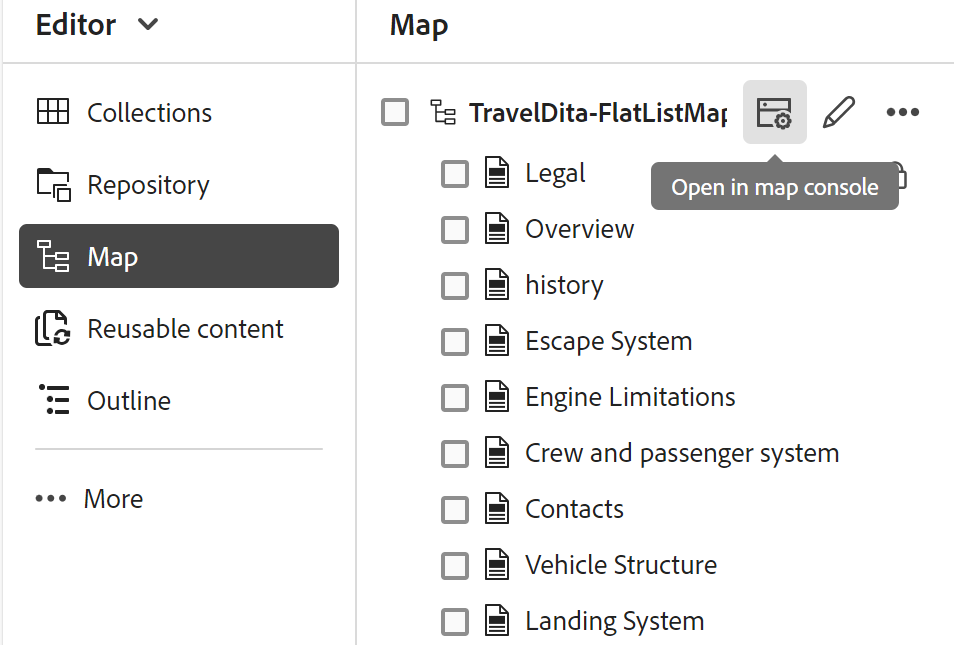

# Abrir arquivos no console de Mapa

Execute as seguintes etapas para abrir um arquivo de mapa DITA no console Mapa:

1. Abra o **Console de mapas** na Home page.

   {width="800"}

2. Como nenhum arquivo de mapa está selecionado, você será solicitado a selecionar um arquivo de mapa para usar os recursos de gerenciamento e publicação de mapas.

   

3. Escolha **Selecionar mapa** e selecione um caminho onde seu arquivo de mapa DITA está localizado.

   O arquivo de mapa é aberto no console Mapa. Por padrão, a guia **Predefinições de saída** está selecionada.

   {width="800"}

   >[!NOTE]
   >
   >  O mapa aberto no console Mapa é sincronizado com a visualização Mapa disponível no Editor.

## Abrir arquivos de mapa no Editor

Você também pode abrir um arquivo de mapa existente no console Mapa a partir do Editor.

1. Navegue até o arquivo de mapa DITA e selecione-o na exibição Repositório.

   O arquivo de mapa é aberto na visualização Mapa.

2. Selecione o ícone **Abrir no console de mapa**.

   O arquivo de mapa é aberto no console Mapa.

   
