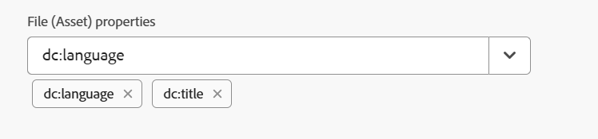

# Transmita os metadados para a saída usando DITA-OT {#id21BJ00QD0XA}

Os metadados são informações adicionais sobre a saída. No Adobe Experience Manager Guides, você pode transmitir os metadados existentes ou criar tags de metadados personalizadas. Você pode transmitir metadados para saídas de formato AEM, PDF, HTML5, EPUB e Personalizado usando a publicação DITA-OT.

Há duas maneiras de transmitir os metadados para a Saída usando o DITA-OT:

- [Utilização do console de Mapa](#using-map-console)
- [Uso do painel do Mapa](#using-map-dashboard)

## Utilização do console de Mapa

Execute as seguintes etapas para transmitir os metadados para a saída usando a publicação DITA-OT:

1. [Abra o arquivo de mapa DITA no console de mapa](./open-files-map-console.md) para o qual deseja passar os metadados para o DITA-OT.
1. Selecione e abra uma predefinição de saída para a qual deseja passar os campos de metadados. Por exemplo, selecione Predefinição de saída PDF. Verifique se ele foi criado usando a opção **DITA-OT**.
1. Na lista suspensa **Propriedades do arquivo**, selecione os metadados que deseja passar para a publicação DITA-OT.

   

   A lista suspensa Propriedades lista as propriedades personalizadas e padrão. Por exemplo, na captura de tela acima `dc:description`, `dc:language`, `dc:title` e `docstate` são as propriedades padrão.

   >[!NOTE]
   >
   > Essas propriedades são selecionadas do arquivo metadataList disponível no seguinte local:`/libs/fmdita/config/metadataList`. Por padrão, há quatro propriedades listadas neste arquivo - `dc:description`, `dc:language`, `dc:title` e `docstate`.

   Este arquivo pode ser sobreposto em: `/apps/fmdita/config/metadataList`.

   Para passar uma propriedade personalizada para a qual você já definiu os valores, exiba [Usar metadados do AEM na saída do DITA-OT PDF](https://experienceleaguecommunities.adobe.com/t5/xml-documentation-discussions/use-aem-metadata-in-dita-ot-pdf-output/td-p/411880).

1. As propriedades selecionadas são listadas abaixo da lista suspensa.

   {width="300"}

1. Selecione **Salvar** na parte superior direita para salvar as alterações.
1. Selecione **Gerar saída**.

As propriedades de metadados selecionadas serão passadas para a saída gerada usando o DITA-OT.

>[!NOTE]
>
> A partir da versão 2502 do Experience Manager Guides, a funcionalidade para passar argumentos de metadados do mapa raiz pela linha de comando DITA-OT foi descontinuada. No entanto, para evitar interrupções, uma nova propriedade foi adicionada em `Config.Manager` para habilitar ou desabilitar a funcionalidade.  Para obter mais detalhes, consulte [Definir configurações de geração de saída](../cs-install-guide/conf-output-generation.md#configure-the-dita-ot-command-line-arguement-field-on-the-dita-map-dashboard).

## Uso do painel do Mapa

Se estiver trabalhando na **Interface do usuário do Assets**, execute as seguintes etapas para transmitir os metadados para a saída usando a publicação DITA-OT:

1. Na **Interface do usuário do Assets**, navegue e escolha o arquivo de mapa DITA para o qual deseja passar os metadados para o DITA-OT.
1. Selecione e edite uma predefinição de saída para a qual deseja passar os campos de metadados. Por exemplo, selecione Predefinição de saída PDF.
1. Selecione a opção **DITA-OT** na predefinição de saída selecionada.

   

1. Na lista suspensa Propriedades, selecione os metadados que deseja transmitir para a publicação DITA-OT.

   A lista suspensa Propriedades lista as propriedades personalizadas e padrão. Por exemplo, na captura de tela acima, o autor é a propriedade personalizada, enquanto `dc:description`, `dc:language`, `dc:title` e `docstate` são as propriedades padrão.

   >[!NOTE]
   >
   > Essas propriedades são selecionadas do arquivo metadataList disponível no seguinte local:`/libs/fmdita/config/metadataList`. Por padrão, há quatro propriedades listadas neste arquivo - `dc:description`, `dc:language`, `dc:title` e `docstate`.

   Este arquivo pode ser sobreposto em: `/apps/fmdita/config/metadataList`.

   Para passar uma propriedade personalizada para a qual você já definiu os valores, exiba [Usar metadados do AEM na saída do DITA-OT PDF](https://experienceleaguecommunities.adobe.com/t5/xml-documentation-discussions/use-aem-metadata-in-dita-ot-pdf-output/td-p/411880).

1. Na lista suspensa **Propriedades**, selecione as propriedades padrão e personalizadas necessárias. Por exemplo, selecione `author`, `dc:title` e `dc:description`. Estes são os `metadata/properties` padrão que são criados quando criamos um arquivo. As propriedades selecionadas são listadas abaixo da dropbox.

   {width="300"}

1. Selecione **Concluído** no canto superior esquerdo para salvar as alterações.
1. Gere a saída.

As propriedades de metadados selecionadas serão passadas para a saída gerada usando o DITA-OT.

**Tópico pai:**&#x200B;[&#x200B; Geração de saída](generate-output.md)
