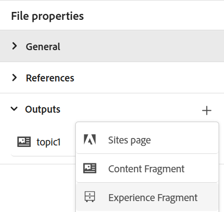
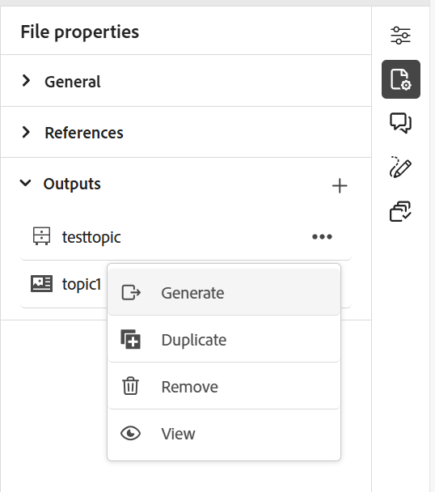

# Publicar fragmentos de experiência

Fragmentos de experiência são conteúdo modular no Adobe Experience Manager. Esses blocos de conteúdo são baseados em modelos e encapsulam o conteúdo e seu layout. Esses conteúdos reutilizáveis permitem que os criadores de conteúdo reúnam e entreguem experiências consistentes e dimensionáveis em vários canais compatíveis com o Experience Manager. Esse recurso ajuda você a criar experiências de marketing consistentes com facilidade, como boletins informativos, banners de promoção e depoimentos de clientes.

O Experience Manager Guides permite publicar um tópico ou seus elementos em um Fragmento de experiência. Você pode criar um mapeamento baseado em JSON entre um tópico e seus elementos em um Fragmento de experiência. Em seguida, use o mapeamento para publicar um tópico ou seus elementos em um Fragmento de experiência. Em seguida, você pode usar Fragmentos de experiência em qualquer site do Experience Manager ou extrair os detalhes por meio de APIs compatíveis com Fragmentos de experiência.

Para gerar um fragmento de experiência, execute as seguintes etapas:

1. Crie uma pasta nos Fragmentos de experiência. Use esta pasta para salvar os Fragmentos de experiência criados com base nos modelos de Fragmento de experiência. Por exemplo, *sales-experience-fragments*.
1. Selecione a pasta e o ícone **Propriedades** na parte superior.
1. Edite as propriedades da pasta (por exemplo, *sales-experience-fragments*).

   * **Título**: exibir ou editar o título da pasta.

   * **Modelos permitidos**: contém a lista de modelos que podem ser adicionados como páginas secundárias do fragmento de experiência. Para adicionar o modelo permitido, especifique a expressão regular para recuperar os modelos necessários no campo **Modelos permitidos**.
Por exemplo:
     `/libs/cq/experience-fragments/components/experiencefragment/template`

     Se você não definir um modelo permitido para uma pasta, os modelos serão escolhidos da pasta principal ou da pasta de modelos por padrão.
   * **Solicitável**: permite alterar a ordem dos ativos dentro de uma pasta.

     {width="650" align="left"}
     *Adicione a configuração da nuvem nas propriedades da pasta para conectá-la aos modelos de fragmento.*
1. Para gerar um Fragmento de Experiência, selecione **Nova Saída**  na seção **Saídas** em **Propriedades do Arquivo** de um tópico.
1. Selecione **Fragmento de experiência**.\
   {width="300" align="left"}

   *Adicionar um novo Fragmento de experiência das Propriedades do arquivo de um tópico*.

   >[!NOTE]
   >
   > Você também pode publicar um Fragmento de experiência da **Exibição do repositório**. Selecione o tópico que deseja publicar como um Fragmento de experiência. Em seguida, no menu **Opções**, selecione **Publicar como** > **Fragmento de experiência**.

1. Na caixa de diálogo **Gerar fragmento de experiência**, preencha os seguintes detalhes:
   {width="500" align="left"}

   *Adicione o caminho, o modelo e os detalhes de mapeamento para publicar um tópico ou seus elementos como um Fragmento de experiência. Você pode substituir um fragmento de experiência existente.*

   * **Caminho**: procure e selecione o caminho da pasta em que deseja publicar o Fragmento de experiência. Você também pode selecionar um fragmento de experiência existente e publicá-lo novamente.
   * **Título**: digite o título do Fragmento de Experiência. Por padrão, o título é preenchido com o título do tópico. Você pode editá-lo. Esse título é usado para gerar o nome do Fragmento de experiência.
   * **Nome**: digite o nome do Fragmento de Experiência. Por padrão, o nome é preenchido com o título do tópico e os espaços são substituídos por &quot;_&quot;. Por exemplo, *sample_experience_fragment*. Você pode editá-lo. Esse nome é usado para gerar o URL do Fragmento de experiência.
   * **Modelo**: selecione o modelo de Fragmento de experiência que você deseja usar para criar seu Fragmento de experiência. Os modelos são selecionados da pasta configurada nas propriedades.
   * **Mapping**: seleciona o mapeamento do arquivo *experienceFragmentMapping.json* e o exibe.

     O administrador pode adicionar os mapeamentos no arquivo *experienceFragmentMapping.json*.  Saiba mais sobre como [criar um mapeamento entre um tópico e um Fragmento de experiência](../cs-install-guide/conf-experience-fragment-mapping-cs.md) no Guia de Instalação e Configuração.

   * Você também pode selecionar condições diferentes para publicar o conteúdo.  Selecione uma das seguintes opções:

      * **Nenhum**: selecione esta opção se não quiser aplicar nenhuma condição à saída publicada.
      * **Usando DITAVAL**: selecione o arquivo DITAVAL para gerar conteúdo personalizado. Você pode selecionar o arquivo DITAVAL usando a caixa de diálogo Procurar ou digitando o caminho do arquivo.
      * **Uso de atributos**: você pode definir atributos de condição em seus tópicos DITA. Em seguida, selecione o atributo de condição para publicar o conteúdo relevante.

     >[!NOTE]
     > 
     >As condições serão ativadas somente se os atributos de condição forem definidos no tópico.

   * Marque a caixa de seleção **Substituir conteúdo existente** se o fragmento de experiência já existir e você desejar substituí-lo. O Experience Manager Guides exibe um erro se você não marcar a caixa de seleção e o Fragmento de experiência já existir.
1. Selecione **Gerar** para publicar o Fragmento de experiência.
1. Você pode exibir os Fragmentos de experiência de um tópico na seção **Saídas** em **Propriedades do arquivo**. Os Fragmentos de experiência são exibidos de acordo com a data e a hora de sua publicação, sendo que o mais recente é o primeiro.

   {width=300 align=&quot;left&quot;}

   *Exiba os Fragmentos de Experiência presentes para um tópico e publique-os novamente.*

Depois de publicar os fragmentos de experiência, você também pode usá-los em qualquer site do Adobe Experience Manager.

## Menu Opções para um Fragmento de experiência

Você também pode executar as seguintes ações para um Fragmento de experiência no menu **Opções**:

* **Gerar**: publique novamente o fragmento de experiência para atualizá-lo com o conteúdo mais recente do tópico DITA. Ao gerar novamente a saída, não é possível alterar o caminho, o nome, o título e o modelo do Fragmento de experiência. No entanto, você pode selecionar condições diferentes ao regenerar a saída.

* **Duplicar**: duplicar um fragmento de experiência. Você pode alterar o caminho, o nome, o título e o modelo. Você também pode selecionar condições diferentes ao duplicar um Fragmento de experiência.

* **Remover**: remover um fragmento de experiência da lista de saídas. Um prompt de confirmação é exibido. Depois de confirmar, o Fragmento de experiência será removido da lista **Saídas**. Mas o Fragmento de experiência não é excluído da pasta.

* **Exibir**: exibir o editor de Fragmento de Experiência. Você também pode fazer alterações e salvá-las.
