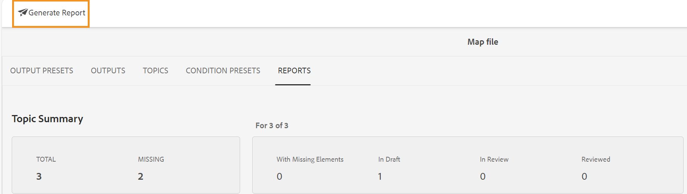

# Relatório de mapa DITA no painel de mapa {#id205BB800EEN}

O Adobe Experience Manager Guides fornece aos administradores os recursos de relatórios para verificar a integridade geral da documentação antes que ela seja ativada ou disponibilizada para os usuários finais. O relatório de mapa DITA no painel de mapa no Experience Manager Guides fornece informações valiosas, como os tópicos ausentes, tópicos com elementos ausentes, UUID de tópicos e arquivos de mídia referenciados e status de revisão de cada tópico. Um relatório detalhado em nível de tópico individual também fornece informações relacionadas ao conteúdo DITA, como referências de conteúdo e imagens ausentes ou referências cruzadas.

>[!NOTE]
>
>O Experience Manager Guides atualiza esse relatório em cada evento que resulta em uma alteração no arquivo de mapa ou quando qualquer referência no arquivo de tópico é atualizada.

Execute as seguintes etapas para exibir o Relatório de mapa DITA:

1. Na interface do usuário do Assets, navegue até o arquivo de mapa DITA e selecione-o para o qual deseja exibir o relatório.

1. Selecione **Relatórios**.

   {align="left"}

   A página Relatórios está dividida em duas partes:

   - **Resumo do tópico:**

     Lista o resumo geral do arquivo de mapa selecionado. Ao observar o Resumo, você pode saber rapidamente o número total de tópicos no mapa, tópicos ausentes, número de tópicos que têm elementos ausentes, estado dos tópicos — no rascunho, em revisão ou no estado Revisado.

   - **Detalhes:**

     Quando você seleciona um tópico, é exibido um relatório detalhado do tópico selecionado.

     {align="left"}

     Os itens realçados em **A**, **B**, **C** e **D** estão descritos abaixo:

      - **Tópico**: O título do tópico especificado no mapa DITA. Passar o ponteiro do mouse sobre o título do tópico exibe o caminho completo do tópico. Se houver problemas no tópico, como referências ou imagens ausentes, um ponto vermelho será mostrado antes do título do tópico.

      - **Nome do Arquivo**: Nome do arquivo.

      - **UUID**: o identificador exclusivo universalmente \(UUID\) do arquivo.

      - **Autor**: usuário que trabalhou por último neste tópico.

      - **Estado do Documento**: o estado atual do documento - Rascunho, Em Revisão ou Revisado.

      - **Elementos ausentes**: lista o número de imagens ausentes ou referências cruzadas corrompidas, se houver.

      - **Tópicos Ausentes \(B\)**: Se houver tópicos com referências quebradas, esses tópicos serão listados na lista Tópicos Ausentes.

      - **Abrir no Framemaker \(C\)**: lista o número de imagens ausentes ou referências cruzadas corrompidas, se houver.

      - **Abrir no Editor \(D\)**: a seleção desse ícone abre o tópico no Editor.

   Os itens realçados em **E** estão descritos abaixo:

   - **Multimídia**: o caminho das imagens usadas no tópico é mostrado junto com sua UUID. Se você selecionar o caminho da imagem, a imagem correspondente será aberta em uma janela pop-up. Os links de imagem quebrados são listados na cor vermelha.

   - **Referências de conteúdo**: o caminho do conteúdo referenciado no tópico é mostrado junto com sua UUID. Se você selecionar o título do conteúdo referido, o tópico correspondente será aberto no modo de Visualização.

   - **Referência cruzada**: o caminho do conteúdo de referência cruzada é mostrado junto com sua UUID. Se você selecionar o título do conteúdo referido, o tópico correspondente será aberto no modo de Visualização. As referências cruzadas quebradas são listadas na cor vermelha.

   - **Revisão**: mostra o status da tarefa de revisão do tópico. Você pode visualizar o status \(abertura ou fechamento\), a data de vencimento e o destinatário do tópico em revisão. Se você selecionar o link do tópico, ele abrirá o tópico no modo de revisão.

   - **Usado em**: mostra uma lista de outros tópicos ou mapas em que o tópico é usado. A UUID de todos esses tópicos e mapas também é listada.

Além do relatório de cada tópico individual, os administradores também têm acesso a informações como o histórico de publicação de um mapa DITA. Para obter mais informações sobre o histórico de saídas geradas, consulte a seção [Exibir o status da tarefa de geração de saída](generate-output-for-a-dita-map.md#viewing_output_history).

## Gerar o CSV do relatório de mapa DITA

É possível baixar e exportar o CSV de um relatório de mapa DITA. O CSV contém o relatório de mapa DITA detalhado.

Execute as seguintes etapas para gerar o CSV de um relatório de mapa DITA:

1. Selecione **Gerar relatório** no canto superior esquerdo para gerar o relatório de mapa DITA.

   {align="left"}

1. Você receberá uma notificação assim que o relatório estiver pronto para download. Selecione **Baixar** para baixar o CSV do relatório gerado.

   {width="550" align="left"}

   Posteriormente, também é possível baixar o CSV do relatório gerado na Caixa de entrada de notificações da Experience Manager.

   Selecione o relatório gerado na Caixa de entrada para baixar o relatório.

   {width="300" align="left"}

Depois que o relatório for baixado na Caixa de entrada, você também poderá selecionar o relatório e usar o ícone Abrir na parte superior para abrir o relatório selecionado.

**Tópico pai:**&#x200B;[&#x200B; Introdução aos relatórios](reports-intro.md)
