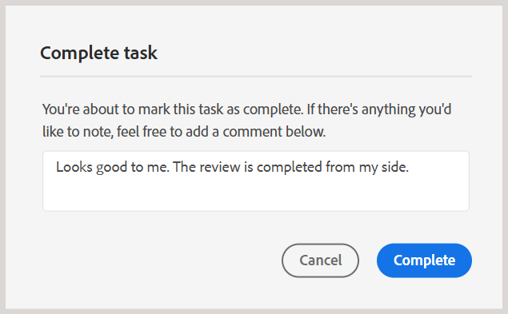

# Concluir a tarefa de revisão como Revisor

>[!IMPORTANT]
>
> Os novos recursos descritos neste artigo são ativados por padrão com a versão 2508 do Experience Manager Guides as a Cloud Service. As revisões criadas antes da migração não são afetadas e continuarão a usar o fluxo de trabalho anterior. Se preferir continuar usando os recursos existentes sem essas atualizações, entre em contato com a equipe de Sucesso do cliente para desabilitar os novos recursos.

Como Revisor, você pode marcar uma tarefa de revisão como concluída depois de revisar todo o conteúdo e notificar o Autor. Você também pode deixar qualquer comentário final neste estágio.

Execute as seguintes etapas para concluir uma tarefa de revisão:

1. Abra a tarefa de revisão atribuída a você.
2. Selecione **Marcar como concluído** a partir da parte superior, como mostrado abaixo:

   {width="350" align="left"}

   A caixa de diálogo **Concluir tarefa** é exibida.
3. Na caixa de diálogo **Concluir tarefa**, adicione comentários finais para o Autor e selecione **Concluir**.

   >[!NOTE]
   >
   > Os comentários no nível da tarefa servem como um resumo ou comentários finais, e são distintos dos comentários no nível do texto adicionados durante a revisão do tópico. Nessa caixa de diálogo, você pode definir ações de acompanhamento, como solicitar que o Autor aborde comentários específicos e reenvie a tarefa para revisão ou indicar que a revisão foi concluída.

   Por exemplo, como Revisor, você pode adicionar um comentário como uma ação de acompanhamento para o Autor:

   {width="350" align="left"}

   Ou adicione um comentário para indicar a conclusão da tarefa, como mostrado abaixo:

   {width="350" align="left"}

Você marcou com êxito a tarefa como concluída e seu status agora está definido como **Concluída**. Nenhuma outra ação será permitida depois que a tarefa for marcada como concluída. Uma notificação é enviada ao Autor ou iniciador da tarefa de revisão para chamar a atenção imediata. Para obter mais detalhes sobre como as notificações de revisão disparam, consulte [Noções básicas sobre notificações de revisão](./review-understanding-review-notifications.md).

{width="350" align="left"}

Com base no feedback, se o Autor ou iniciador da tarefa decidir [fechar a tarefa de revisão](./review-close-review-task.md), o status da tarefa na Interface de revisão será alterado para **Fechado**.

{width="350" align="left"}

## Exibir comentários no nível da tarefa

Todos os comentários no nível da tarefa são exibidos na caixa de diálogo **Comentários das tarefas**, que está disponível no modo somente leitura. Quando você conclui uma tarefa de revisão com um comentário final, sua entrada é registrada nesta caixa de diálogo para referência futura.

Para acessar comentários no nível da tarefa na interface de Revisão, navegue até o painel esquerdo e selecione o ícone **Comentários da tarefa**.

{width="350" align="left"}

A caixa de diálogo **Comentários da tarefa** é exibida à direita.

{width="350" align="left"}

Os comentários na caixa de diálogo são exibidos em ordem cronológica, com os comentários recentes aparecendo primeiro e os comentários mais antigos aparecendo por último. Essa ordem ajuda a seguir a conversa à medida que ela avançava ao longo do tempo.

A caixa de diálogo **Comentários da tarefa** está acessível a todos os usuários envolvidos na tarefa de revisão, incluindo o Autor ou iniciador da tarefa de revisão e outros Revisores. Portanto, os comentários de outros Revisores (se envolvidos) também podem aparecer na caixa de diálogo Comentários da tarefa. Isso ajuda a garantir uma comunicação clara e rastreável durante todo o processo de revisão.

Depois de revisar o feedback no nível da tarefa, o Autor pode solicitar uma revisão ou fechar a tarefa de revisão. Em ambos os casos, todos os comentários capturados durante o processo de revisão permanecem disponíveis na caixa de diálogo **Comentários da tarefa** para referência.
