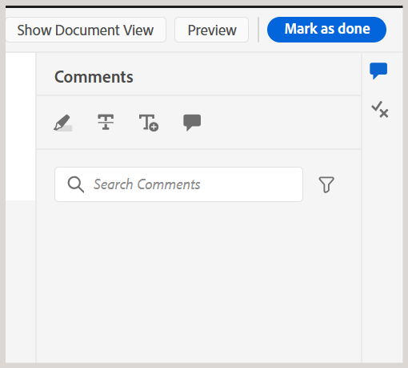
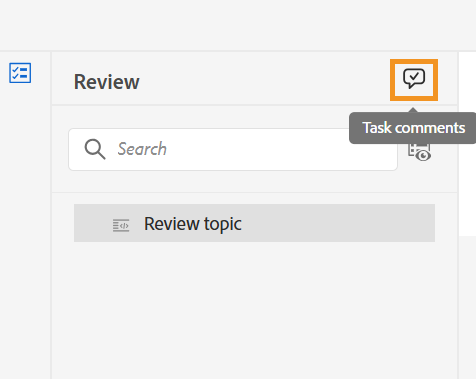

# Concluir a tarefa de revisão como Revisor

Como Revisor, você pode marcar uma tarefa de revisão como concluída depois de revisar todo o conteúdo e notificar o Autor. Você também pode deixar qualquer comentário final neste estágio.

Execute as seguintes etapas para concluir uma tarefa de revisão:

1. Abra a tarefa de revisão atribuída a você.
2. Selecione **Marcar como concluído** a partir da parte superior, como mostrado abaixo:

   {width="350"}

   A caixa de diálogo **Concluir tarefa** é exibida.
3. Na caixa de diálogo **Concluir tarefa**, adicione comentários finais para o Autor e selecione **Concluir**.

   >[!NOTE]
   >
   > Os comentários no nível da tarefa servem como um resumo ou comentários finais, e são distintos dos comentários no nível do texto adicionados durante a revisão do tópico. Nessa caixa de diálogo, você pode definir ações de acompanhamento, como solicitar que o Autor aborde comentários específicos e reenvie a tarefa para revisão ou indicar que a revisão foi concluída.

   Por exemplo, como Revisor, você pode adicionar um comentário como uma ação de acompanhamento para o Autor:

   {width="350"}

   Ou adicione um comentário para indicar a conclusão da tarefa, como mostrado abaixo:

   {width="350"}

Você marcou com êxito a tarefa como concluída e seu status agora está definido como **Concluída**. Nenhuma outra ação será permitida depois que a tarefa for marcada como concluída. Uma notificação é enviada ao Autor ou iniciador da tarefa de revisão para chamar a atenção imediata. Para obter mais detalhes sobre como as notificações de revisão disparam, consulte [Noções básicas sobre notificações de revisão](./review-understanding-review-notifications.md).

{width="350"}

Com base no feedback, se o Autor ou iniciador da tarefa decidir [fechar a tarefa de revisão](./review-close-review-task.md), o status da tarefa na Interface de revisão será alterado para **Fechado**.

{width="350"}

>[!NOTE]
>
> A sincronização de tarefas entre a Interface de revisão e a Caixa de entrada do AEM está disponível e habilitada por padrão. Quando um Revisor marca uma tarefa de revisão como **Concluída** na Interface de revisão, a tarefa correspondente é automaticamente concluída e removida da Caixa de entrada do AEM do revisor. Da mesma forma, concluir uma tarefa na Caixa de entrada do AEM a marca automaticamente como concluída na interface de revisão.
>
> O autor ou iniciador da tarefa ainda poderá revisar o feedback e reatribuir a tarefa se uma revisão adicional for necessária. Quando uma tarefa é reatribuída, uma nova notificação da Caixa de entrada do AEM é gerada para o revisor, permitindo que a tarefa seja revisada novamente.
>
> Se você quiser usar o comportamento anterior, em que as tarefas de revisão concluídas permanecem na Caixa de entrada do AEM do revisor até que o autor ou iniciador da tarefa revise os comentários e feche a tarefa de revisão, entre em contato com a equipe de Sucesso do cliente para desativar a sincronização da tarefa.

## Exibir comentários no nível da tarefa

Todos os comentários no nível da tarefa são exibidos na caixa de diálogo **Comentários das tarefas**, que está disponível no modo somente leitura. Quando você conclui uma tarefa de revisão com um comentário final, sua entrada é registrada nesta caixa de diálogo para referência futura.

Para acessar comentários no nível da tarefa na interface de Revisão, navegue até o painel esquerdo e selecione o ícone **Comentários da tarefa**.

{width="350"}

A caixa de diálogo **Comentários da tarefa** é exibida à direita.

{width="350"}

Os comentários na caixa de diálogo são exibidos em ordem cronológica, com os comentários recentes aparecendo primeiro e os comentários mais antigos aparecendo por último. Essa ordem ajuda a seguir a conversa à medida que ela avançava ao longo do tempo.

A caixa de diálogo **Comentários da tarefa** está acessível a todos os usuários envolvidos na tarefa de revisão, incluindo o Autor ou iniciador da tarefa de revisão e outros Revisores. Portanto, os comentários de outros Revisores (se envolvidos) também podem aparecer na caixa de diálogo Comentários da tarefa. Isso ajuda a garantir uma comunicação clara e rastreável durante todo o processo de revisão.

Depois de revisar o feedback no nível da tarefa, o Autor pode solicitar uma revisão ou fechar a tarefa de revisão. Em ambos os casos, todos os comentários capturados durante o processo de revisão permanecem disponíveis na caixa de diálogo **Comentários da tarefa** para referência.

## Delegar uma tarefa de revisão a outro Revisor

>[!IMPORTANT]
>
> Esse recurso é ativado por padrão. Se preferir não usar esse recurso em seu ambiente, entre em contato com a equipe de Sucesso do cliente.

Como Revisor, às vezes você pode desejar que outro usuário participe de uma revisão antes que ela retorne ao Autor. Por exemplo, se parte do conteúdo não se enquadrar em seu conhecimento especializado, ou se você desejar ter uma segunda opinião antes de marcar a tarefa como **Concluída**. Em vez de rotear isso através de um administrador de projeto, você pode recomendar um revisor diretamente da tarefa de revisão usando a opção **Delegar**.

Selecionar **Delegar** não conclui a tarefa de revisão em seu nome. Ele envia sua recomendação para o Autor (iniciador da tarefa), que decide se adiciona o revisor recomendado à tarefa.

Execute as seguintes etapas para delegar uma tarefa de revisão:

1. Abra a tarefa de revisão atribuída a você.
2. Depois de revisar o conteúdo, selecione **Delegar**, ao lado de **Marcar como concluído**.

   {width="350"}

3. A caixa de diálogo **Revisor recomendado** é exibida. Selecione um usuário na lista suspensa para recomendar como revisor para essa tarefa.

   {width="350"}

4. *(Opcional)* Adicione um comentário ao Autor, para contexto.
5. Selecione **Delegar**.

Uma notificação é enviada ao Autor, indicando que você solicitou a adição de um Revisor à tarefa. Para obter detalhes sobre como o Autor responde a esta solicitação, exiba [Solicitar uma revisão ou feche uma tarefa de revisão como Autor](./review-close-review-task.md).

