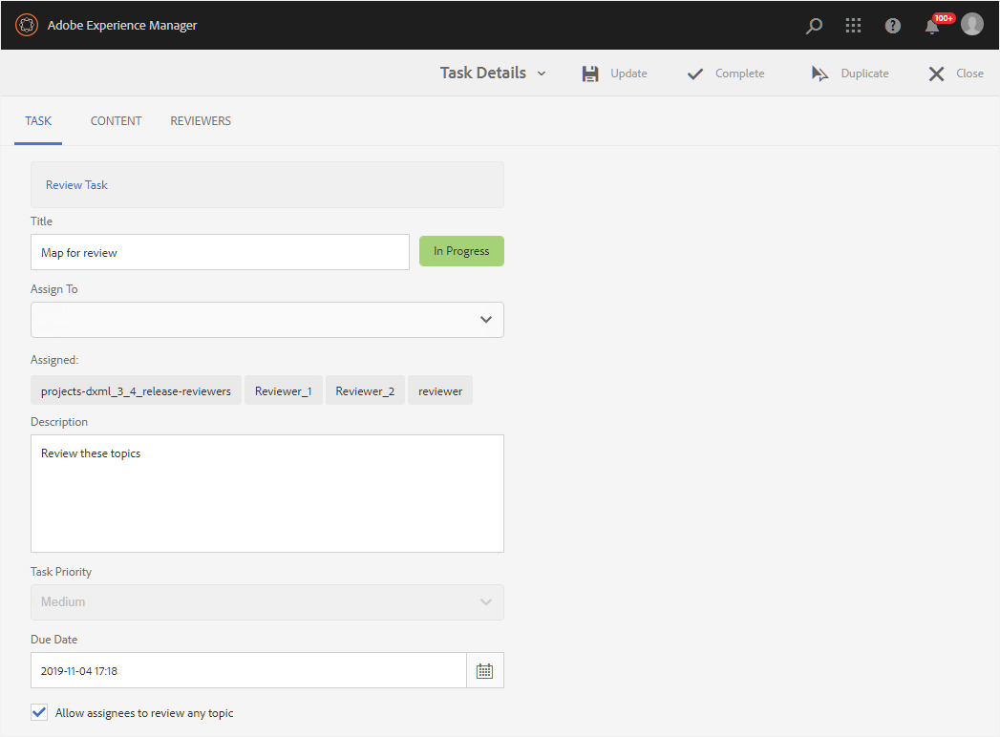

# Gerenciar tarefas de revisão usando o Painel de revisão {#id2056B0Y70X4}

O fluxo de trabalho de gerenciamento de revisão pode incluir várias tarefas. Por exemplo, você pode adicionar revisores a um tópico específico ou estender o prazo para uma revisão. Você também pode querer marcar a tarefa de revisão como concluída se achar que todas as partes interessadas deram seu feedback. Essas tarefas podem ser gerenciadas usando o Painel de revisão.

Execute as seguintes etapas para acessar e usar o Painel de Revisão:

>[!NOTE]
>
> É possível gerenciar tarefas de revisão somente para projetos para os quais você é o Autor \(ou iniciador\). Mesmo se você for um Revisor ou Editor \(usuário\), não terá acesso a nenhuma das tarefas do projeto.

1. No console **Projetos**, selecione o projeto de revisão que deseja gerenciar.

   Um painel Projeto com blocos de tarefas é exibido.

   {align="left"}

1. Selecione os três pontos no bloco **Revisões**.

   O Painel de Revisão é exibido. O painel lista todas as tarefas de revisão que você criou.

   {align="left"}

   O Painel de Revisão exibe os detalhes sobre a tarefa de revisão, como o nome da tarefa, quem iniciou a revisão, a data em que a revisão foi iniciada, a data de vencimento, o status, o número de novos comentários que não foram aceitos ou rejeitados pelo autor e o nome dos revisores. As tarefas são listadas na ordem de tarefas recém-criadas para tarefas mais antigas.

   >[!NOTE]
   >
   > Se você selecionar o link Tarefa de revisão, o tópico ou arquivo de mapa enviado para revisão será aberto.

1. Selecione uma tarefa de revisão.

   Você verá as opções Editar propriedades e [Status](#check-review-status-id199RF0A0UHS) na barra de ferramentas.

1. Se você selecionar **Editar Propriedades**, a página Detalhes da Tarefa será exibida.

   Há três guias na página Detalhes da tarefa: Tarefa, Conteúdo e Revisores. As seções a seguir explicam as várias funções disponíveis em cada guia.

## Guia Tarefa

{align="left"}

Você pode executar as seguintes ações na guia **Tarefa**:

- Modifique o título da tarefa no campo **Título**.
- Adicionar atribuídos padrão na lista suspensa **Atribuir a**. Os revisores adicionados aqui têm acesso para revisar todos os tópicos que fazem parte dessa tarefa de revisão. Você pode optar por remover ou adicionar seletivamente mais revisores a tópicos específicos na [guia Revisores](#reviewer-tab-id199RF0N0MUI).
- Atualize a descrição da tarefa no campo **Descrição**.
- Modifique a **Data de Conclusão**. Você pode adiar ou adiar o prazo para a conclusão da tarefa.
- Selecione a opção para impedir que os usuários revisem apenas os tópicos atribuídos a eles.
- Selecione **Atualizar** para atualizar os detalhes modificados.

  Uma mensagem em caixa de informações é exibida para confirmar se a atualização foi bem-sucedida ou não.
- Selecione **Concluído** para marcar a tarefa de revisão como concluída antes da data de vencimento. Quando a tarefa de um tópico for marcada como Concluída, a revisão do tópico selecionado será fechada. No entanto, no caso de tópicos compartilhados para revisão por meio de um mapa DITA, marcar a tarefa do mapa DITA como Concluída fechará a revisão de todos os tópicos no mapa que foram compartilhados para revisão.
- Selecione **Duplicar** para criar uma cópia da tarefa de revisão. O processo de criação de uma tarefa de revisão duplicada é semelhante à criação de uma nova tarefa de revisão. Depois de iniciar o workflow de tarefa duplicada, você verá a página Criar Tarefa de Revisão. Você precisa fornecer os detalhes da nova tarefa conforme explicado em [Enviar tópicos para revisão](review-send-topics-for-review.md#).

  Se você tiver selecionado uma tarefa de revisão criada a partir de um mapa DITA, serão exibidos os tópicos que são parte do mapa. Você pode então escolher os tópicos que deseja incluir na nova tarefa de revisão.

  No caso de tarefa de revisão duplicada de uma ou várias revisões de tópicos, apenas esses tópicos serão mostrados na lista de tarefas de revisão. Você pode optar por compartilhar esses tópicos para revisão com um conjunto diferente de revisores.

- Selecione **Fechar** para ir para a página Caixa de Entrada.

## Guia Conteúdo

{align="left"}

Você pode executar as seguintes ações na guia **Conteúdo**:

- Alterar a versão do tópico enviado para revisão. Você pode escolher a versão mais recente do tópico, a versão como na data, a versão com um rótulo específico ou a versão com uma linha de base específica \(para um mapa DITA\).

- Selecione **Atualizar** para compartilhar a versão atualizada do tópico com os revisores. Os revisores recebem uma notificação por email informando que a versão mais recente do tópico foi enviada para revisão. Na próxima vez que um revisor abrir o tópico, ele visualizará a versão atualizada do tópico.

  >[!NOTE]
  >
  > No caso de uma versão atualizada de um tópico, os comentários antigos também são mantidos na versão mais recente. Os revisores também podem visualizar as diferenças entre as duas versões.

- Selecione **Concluído** para marcar a tarefa de revisão como concluída antes da data de vencimento. Quando a tarefa de um tópico for marcada como Concluída, a revisão do tópico selecionado será fechada. No entanto, no caso de tópicos compartilhados para revisão por meio de um mapa DITA, marcar a tarefa do mapa DITA como Concluída fechará a revisão de todos os tópicos no mapa que foram compartilhados para revisão.

- Selecione **Duplicar** para criar uma nova tarefa de revisão usando a tarefa atual como base.

## Guia Revisores {#reviewer-tab-id199RF0N0MUI}

{align="left"}

Você pode executar as seguintes ações na guia **Revisores**:

- **Selecionar Tudo**: seleciona todos os tópicos da lista de tópicos. Você pode executar facilmente uma operação em lote após selecionar todos os tópicos.
- **Limpar seleção**: desmarca os tópicos selecionados na lista de tópicos.

  >[!NOTE]
  >
  > Você também pode marcar ou desmarcar um tópico individualmente marcando a caixa de seleção ao lado do tópico.

- **Adicionar**: exibe a caixa de diálogo Adicionar Revisores. É possível digitar o nome de um revisor ou função de usuário \(ou grupo\) que você deseja adicionar como revisor aos tópicos selecionados.
- **Remover**: exibe a caixa de diálogo Remover Revisores. Você pode digitar o nome de um revisor ou função de usuário \(ou grupo\) que deseja remover como revisor dos tópicos selecionados.
- **Reatribuir**: exibe a caixa de diálogo Reatribuir Revisores. É possível digitar o nome de um revisor ou função de usuário \(ou grupo\) à qual você deseja atribuir a tarefa de revisão. Isso remove todos os revisores existentes dos tópicos selecionados e atribui os revisores recém-selecionados a esses tópicos.
- **Exportar**: permite exportar os detalhes da tarefa de revisão em um arquivo CSV. O arquivo contém detalhes como caminho e título do tópico, nome do revisor e versão dos tópicos enviados para revisão.
- **Editar Revisores**: selecionar o ícone  na lista de tópicos exibe a caixa de diálogo Editar Revisores. Você pode adicionar ou remover revisores para o tópico selecionado nesta caixa de diálogo.

## Verificar o status de uma tarefa de revisão {#check-review-status-id199RF0A0UHS}

Na página principal do Painel de Revisão, se você selecionar uma tarefa de revisão e escolher **Status**, o relatório de status da tarefa de revisão será mostrado.

{align="left"}

O relatório de status da tarefa de revisão contém os seguintes detalhes:

- Nome\(s\) do revisor ao qual a tarefa de revisão foi atribuída.
- A coluna Status indica o status da revisão. O Status pode ser um dos seguintes:
   - **Não iniciado**: o revisor ainda não abriu o link de revisão.
   - **Em andamento**: o revisor abriu o link de revisão e está em processo de revisão do tópico.
   - **Concluído**: o revisor concluiu a revisão ao concluir a tarefa de revisão atribuída a ele. A tarefa de revisão está na Caixa de entrada de notificação do AEM para cada revisor.
- Quando um revisor abre um link de revisão e navega para um tópico específico, esse tópico é adicionado à lista Tópicos revisados. Isso ajuda os autores a determinar se os revisores abriram ou não suas respectivas seções. Se forem feitos comentários, eles serão mostrados entre parênteses.
- Número total de comentários feitos em todos os tópicos. No caso de vários tópicos em revisão, o número de comentários para cada tópico é mencionado \(entre parênteses\) em relação ao nome do tópico.
- A data em que qualquer tópico foi acessado pela última vez pelo revisor.

**Tópico pai:**[ Introdução à revisão](review.md)
