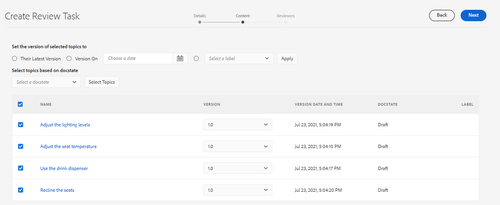

# Enviar tópicos para revisão {#id199RD0S035Z}

O fluxo de trabalho de revisão cria um ambiente de vários revisores em que o iniciador especifica uma lista de tópicos para revisão, adiciona vários revisores e atribui uma linha do tempo para a tarefa de revisão. O Guia AEM permite que os usuários pertencentes aos grupos Autores e Editores iniciem uma revisão.

Como o fluxo de trabalho de revisão é específico do projeto, o iniciador da revisão deve fazer parte da equipe do projeto ou ter direitos para criar um projeto. No momento da criação de um projeto, você define os membros da equipe para o projeto e atribui a eles várias funções ou grupos. Para obter mais informações sobre projetos, consulte [Criar um projeto DITA](authoring-create-dita-project.md#).

É possível criar uma tarefa de revisão a partir de:

- **Editor da Web**: permite enviar um tópico individual ou mapa DITA para revisão. Observe que o fluxo de trabalho para criar uma tarefa de revisão é comum no Editor da Web e na interface do usuário do Assets. Somente o método de início do fluxo de trabalho de revisão é diferente. Para obter informações sobre como iniciar o workflow de revisão no Editor da Web, consulte [Criar tarefa de análise](web-editor-features.md#id215OCJ00JXA) recurso no Editor da Web.

- **Interface do usuário do Assets**: permite enviar um ou vários tópicos e mapa DITA para revisão. O compartilhamento de documentos para revisão do fluxo de trabalho da interface do usuário do Assets é abordado neste tópico.

Na interface do usuário do Assets, há duas maneiras pelas quais um Autor/Editor pode criar uma tarefa de revisão:

- Enviar um ou mais tópicos para revisão
- Envie vários tópicos de um mapa DITA para revisão

## Enviar um ou mais tópicos para revisão {#id1721E600FY4}

>[!IMPORTANT]
>
> Antes de criar uma tarefa de revisão, verifique se você criou um projeto e adicionou revisores a ele.

Para criar uma tarefa de revisão e enviar tópicos para revisão, execute as seguintes etapas:

>[!NOTE]
>
> Você só poderá criar uma tarefa de revisão se for um autor ou editor em um projeto DITA.

1. Navegue até a pasta desejada na interface do usuário do Assets.

1. Clique no ícone Selecionar na ação rápida e selecione os tópicos que deseja enviar para revisão.

   {width="300" align="left"}

1. Na barra de ferramentas, clique em **Criar tarefa de análise**. A página de criação da tarefa de revisão é exibida.

   >[!NOTE]
   >
   > É possível criar uma tarefa de revisão somente para os tópicos que têm uma revisão. Caso o tópico selecionado não tenha uma revisão, você receberá um prompt.

   {width="650" align="left"}

1. Insira um **Título** para a tarefa e selecione um DITA **Projeto** na lista suspensa.

1. No **Atribuir a** selecione os revisores para os quais deseja enviar os tópicos para revisão.

   É possível atribuir uma tarefa de revisão a usuários individuais do projeto ou a grupos de usuários. Observe que você pode atribuir uma tarefa de revisão a usuários individuais somente quando fizer parte do grupo de administradores do projeto; caso contrário, você só verá os grupos de usuários no campo Atribuir a.

   >[!NOTE]
   >
   > O fluxo de trabalho de revisão é específico do projeto. Ao criar projetos, você adiciona os membros da equipe ao projeto e os atribui a grupos. Então quando você seleciona o projeto aqui, você tem que escolher os membros que são parte daquele projeto. Para obter mais informações sobre projetos, consulte [Criar um projeto DITA](authoring-create-dita-project.md#).

1. Insira um **Descrição** para a tarefa.

   Essa descrição é usada como o corpo do email de notificação enviado aos revisores.

1. Selecione o **Prazo** e hora para marcar o prazo para a revisão.

   >[!NOTE]
   >
   > Ao atingir o prazo final, um email é enviado ao iniciador notificando que a tarefa de revisão foi concluída. O iniciador pode estender o prazo da tarefa de revisão a partir do [Painel de revisão](review-manage-tasks-review-dashboard.md#).

1. Selecione o mapa raiz na lista suspensa **Caminho do mapa de raiz**. Esse roteiro é usado para resolver todas as principais referências e termos do glossário usados no conteúdo da revisão. Se você não selecionar o roteiro, as referências principais ou os termos do glossário associados ao tópico DITA não serão resolvidos antes de enviar o tópico para revisão.

   Se você estiver criando a revisão para um mapa DITA, por padrão **Caminho do mapa de raiz** está definido para o caminho desse mapa. Se você estiver criando a revisão para um único tópico ou vários tópicos, então, por padrão, a variável **Caminho do mapa de raiz** é definido como o mapa definido nas Preferências do usuário.

   >[!NOTE]
   >
   > O mapa raiz selecionado tem a precedência mais alta para resolver referências principais. Para obter mais detalhes, consulte [Resolver referências de chave](map-editor-other-features.md#id176GD01H05Z).

1. Como é possível atribuir diferentes revisores a diferentes tópicos, **Permitir que os responsáveis analisem qualquer tópico** a opção controla se os revisores podem revisar todos os tópicos em uma tarefa de revisão ou apenas aqueles tópicos aos quais estão atribuídos para revisão.

   Se quiser permitir que todos os revisores revisem qualquer tópico na tarefa de revisão, selecione **Permitir que os responsáveis analisem qualquer tópico**.

   Se você não selecionar essa opção, os revisores serão adicionados à **Atribuir a** terá acesso para revisar apenas os tópicos atribuídos a ele.

1. Clique em **Avançar**.

   A página Content é exibida.

   {width="800" align="left"}

1. Na página Conteúdo, selecione uma versão do tópico que você deseja compartilhar para revisão.

   Você pode usar um dos seguintes métodos para selecionar uma versão:

   - *\(Padrão\)* Escolha a opção **A versão mais recente deles** para selecionar a última revisão salva dos tópicos.
   - Escolha o **Versão ativada** e especifique a data e a hora para selecionar uma versão na data e hora especificadas. Se não houver nenhuma versão do tópico disponível na data especificada, uma versão disponível imediatamente após a data e a hora especificadas será selecionada.
   - Escolha o **Selecionar um rótulo** e selecione um rótulo na lista suspensa.
1. Depois de fazer a seleção para escolher uma versão, clique em **Aplicar**.

   A versão baseada na opção selecionada é escolhida para os tópicos.

   >[!NOTE]
   >
   > Você também pode selecionar manualmente a versão desejada na **Versão** lista suspensa de cada tópico.

1. Clique em **Avançar**.

   A página Revisores é exibida, onde você pode adicionar ou remover revisores. Por padrão, os revisores adicionados ao campo Atribuir a são adicionados automaticamente a cada tópico selecionado para a revisão.

   {width="650" align="left"}

1. Na página Revisores, você pode adicionar ou remover revisores. As seguintes operações estão disponíveis na página Revisores:

   - **Selecionar tudo**: seleciona todos os tópicos na lista de tópicos. Você pode executar facilmente uma operação em lote após selecionar todos os tópicos.
   - **Limpar seleção**: desmarca os tópicos selecionados na lista de tópicos.

     >[!NOTE]
     >
     > Você também pode marcar ou desmarcar individualmente um tópico clicando na caixa de seleção ao lado dele.

   - **Adicionar**: exibe a caixa de diálogo Adicionar revisores. É possível digitar o nome de um revisor ou função de usuário \(ou grupo\) que você deseja adicionar como revisor aos tópicos selecionados.
   - **Remover**: exibe a caixa de diálogo Remover revisores. Você pode digitar o nome de um revisor ou função de usuário \(ou grupo\) que deseja remover como revisor dos tópicos selecionados.

     >[!NOTE]
     >
     > Você também pode remover uma revisão de um tópico clicando no sinal cruzado na caixa do revisor.

   - **Reatribuir**: exibe a caixa de diálogo Reatribuir revisores. É possível digitar o nome de um revisor ou função de usuário \(ou grupo\) à qual você deseja atribuir a tarefa de revisão. Isso remove todos os revisores existentes dos tópicos selecionados e atribui os revisores recém-selecionados a esses tópicos.
   - **Exportar**: permite exportar os detalhes da tarefa de revisão em um arquivo CSV. O arquivo contém detalhes como caminho e título do tópico, nome do revisor e versão dos tópicos enviados para revisão.
   - **Editar Revisores**: Ao clicar no botão ícone na lista de tópicos exibe a caixa de diálogo Editar revisores. Você pode adicionar ou remover revisores para o tópico selecionado nesta caixa de diálogo.
1. Clique em **Criar** para criar a tarefa de revisão.

   Uma mensagem de confirmação é exibida quando a tarefa de revisão é criada com sucesso. A variável [Estado do documento](web-editor-document-states.md#) para os tópicos enviados para revisão estiver definido como Em revisão.

   >[!NOTE]
   >
   > Você também pode clicar no sino Notificações na parte superior direita da tela e confirmar se a tarefa de revisão foi criada com sucesso. No painel Notificações, você encontrará uma notificação para cada revisor que fez parte da tarefa de revisão e uma notificação para o iniciador da revisão.

Um email é enviado para todos os revisores, notificando que eles receberam um tópico ou vários tópicos para revisão. O e-mail contém um link direto no qual eles podem clicar e acessar o tópico em uma janela do navegador.

Caso vários tópicos sejam atribuídos, os revisores podem visualizá-los e selecioná-los em uma lista suspensa de tópicos no navegador da Web.

## Enviar vários tópicos para revisão a partir de um mapa DITA

Um mapa DITA é uma organização lógica de tópicos dentro de um livro. Quando você envia um tópico individual para revisão, o revisor não obtém nenhuma informação sobre a localização desse tópico no livro. Se um revisor tiver informações sobre o local exato do tópico que está sendo revisado, ele obterá um contexto melhor do tópico que está sendo revisado.

O Guia AEM permite enviar um ou mais tópicos em um mapa DITA para análise ao mesmo tempo. O revisor obtém para ver o arquivo de mapa completo, juntamente com os tópicos que foram compartilhados para revisão. Isso facilita para o revisor obter um contexto do tópico no mapa ou arquivo de livro.

É possível compartilhar o mesmo mapa DITA no para revisão em várias tarefas de revisão. Por exemplo, se em um mapa DITA houver os tópicos A, B, C, D e E. Em uma tarefa de revisão, é possível compartilhar A, B e C para revisão, e em outra tarefa de revisão você pode enviar os tópicos C, D e E para revisão. O processo de revisão permite compartilhar o mesmo tópico e arquivo de mapa em várias tarefas de revisão. Para o tópico comum em várias tarefas de revisão, os comentários fornecidos em uma tarefa de revisão não substituem nem se mesclam aos comentários nas outras tarefas de revisão.

>[!IMPORTANT]
>
> Caso um tópico de um arquivo de mapa tenha sido compartilhado em várias tarefas de revisão, seu status mostrará Em revisão até que todas as tarefas de revisão tenham sido concluídas.

Para enviar um ou vários tópicos juntamente com o arquivo de mapa para revisão, execute as seguintes etapas:

>[!IMPORTANT]
>
> Depois de iniciar uma revisão por meio de um arquivo de mapa, você não deve alterar a estrutura do arquivo de mapa adicionando novos tópicos ou removendo tópicos existentes.

1. Navegue até a pasta desejada na interface do usuário do Assets.

   >[!NOTE]
   >
   > Verifique se a exibição do console está definida como exibição de cartão ou exibição de lista.

1. Selecione o mapa de onde deseja enviar os tópicos para revisão.

1. Na barra de ferramentas, clique em **Criar tarefa de análise**. A página de criação da tarefa de revisão é exibida.

1. Insira um **Título** para a tarefa e selecione um DITA **Projeto** na lista suspensa.

   >[!NOTE]
   >
   > É possível criar uma tarefa de revisão somente para os tópicos que têm uma revisão. Caso seu mapa contenha tópicos que não têm uma revisão, você verá um prompt com uma lista desses arquivos. Os arquivos sem uma revisão são excluídos da tarefa de revisão.

1. No **Atribuir a** selecione os revisores para os quais deseja enviar os tópicos para revisão.

   É possível atribuir uma tarefa de revisão a usuários individuais do projeto ou a grupos de usuários. Observe que você pode atribuir uma tarefa de revisão a usuários individuais somente quando fizer parte do grupo de administradores do projeto; caso contrário, você só verá os grupos de usuários no campo Atribuir a.

   >[!NOTE]
   >
   > O fluxo de trabalho de revisão é específico do projeto. Ao criar projetos, você adiciona os membros da equipe ao projeto e os atribui a grupos. Então quando você seleciona o projeto aqui, você tem que escolher os membros que são parte daquele projeto. Para obter mais informações sobre projetos, consulte [Criar um projeto DITA](authoring-create-dita-project.md#).

1. Insira um **Descrição** para a tarefa.

   Essa descrição é usada como o corpo do email de notificação enviado aos revisores.

1. Selecione o **Prazo** e hora para marcar o prazo para a revisão.

   >[!NOTE]
   >
   > Ao atingir o prazo final, um email é enviado ao iniciador notificando que a tarefa de revisão foi concluída. O iniciador pode estender o prazo da tarefa de revisão a partir do [Painel de revisão](review-manage-tasks-review-dashboard.md#).

1. Como é possível atribuir diferentes revisores a diferentes tópicos, **Permitir que os responsáveis analisem qualquer tópico** a opção controla se os revisores podem revisar todos os tópicos em uma tarefa de revisão ou apenas aqueles tópicos aos quais estão atribuídos para revisão.

   Se quiser permitir que todos os revisores revisem qualquer tópico na tarefa de revisão, selecione **Permitir que os responsáveis analisem qualquer tópico**.

   Se você não selecionar essa opção, os revisores serão adicionados à **Atribuir a** terá acesso para revisar apenas os tópicos atribuídos a ele.

1. Clique em **Avançar**.

   A página Conteúdo é exibida com todos os tópicos referenciados do arquivo de mapa. Se o mapa DITA contiver mapas aninhados, os tópicos desses mapas também serão listados aqui.

   {width="800" align="left"}

1. Na página Conteúdo, selecione uma versão do tópico que você deseja compartilhar para revisão.

   Você pode usar um dos seguintes métodos para selecionar uma versão:

   - *\(Padrão\)* Escolha a opção **A versão mais recente deles** para selecionar a última revisão salva dos tópicos.
   - Escolha o **Versão ativada** e especificar a data e a hora para selecionar uma versão de acordo com a data e a hora. Se não houver nenhuma versão do tópico disponível na data especificada, uma versão disponível imediatamente após a data e a hora especificadas será selecionada.
   - Escolha o **Selecionar um rótulo** e selecione um rótulo na lista suspensa. Todos os tópicos que contêm o rótulo selecionado são selecionados no **Versão** lista suspensa.
   - Escolha o **Selecionar uma Linha de Base** e selecione uma linha de base na lista suspensa. Todas as versões de tópicos que fazem parte da linha de base selecionada são selecionadas na **Versão** lista suspensa.
1. Depois de fazer a seleção para escolher uma versão, clique em **Aplicar**.

   A versão baseada na opção selecionada é escolhida para os tópicos.

   >[!NOTE]
   >
   > Você também pode selecionar manualmente a versão desejada na **Versão** lista suspensa de cada tópico.

1. Clique em **Avançar**.

   A página Revisores é exibida, onde você pode adicionar ou remover revisores. Por padrão, os revisores adicionados ao campo Atribuir a são adicionados automaticamente a cada tópico selecionado para a revisão.

1. Na página Revisores, você pode adicionar ou remover revisores. As seguintes operações estão disponíveis na página Revisores:

   - **Selecionar tudo**: seleciona todos os tópicos na lista de tópicos. Você pode executar facilmente uma operação em lote após selecionar todos os tópicos.
   - **Limpar seleção**: desmarca os tópicos selecionados na lista de tópicos.

     >[!NOTE]
     >
     > Você também pode marcar ou desmarcar individualmente um tópico clicando na caixa de seleção ao lado dele.

   - **Adicionar**: exibe a caixa de diálogo Adicionar revisores. É possível digitar o nome de um revisor ou função de usuário \(ou grupo\) que você deseja adicionar como revisor aos tópicos selecionados.
   - **Remover**: exibe a caixa de diálogo Remover revisores. Você pode digitar o nome de um revisor ou função de usuário \(ou grupo\) que deseja remover como revisor dos tópicos selecionados.
   - **Reatribuir**: exibe a caixa de diálogo Reatribuir revisores. É possível digitar o nome de um revisor ou função de usuário \(ou grupo\) à qual você deseja atribuir a tarefa de revisão. Isso remove todos os revisores existentes dos tópicos selecionados e atribui os revisores recém-selecionados a esses tópicos.
   - **Exportar**: permite exportar os detalhes da tarefa de revisão em um arquivo CSV. O arquivo contém detalhes como caminho e título do tópico, nome do revisor e versão dos tópicos enviados para revisão.
   - **Editar Revisores**: Ao clicar no botão ícone na lista de tópicos exibe a caixa de diálogo Editar revisores. Você pode adicionar ou remover revisores para o tópico selecionado nesta caixa de diálogo.
   >[!IMPORTANT]
   >
   > Você deve atribuir pelo menos um revisor para criar a tarefa de revisão.

1. Clique em **Criar** para criar a tarefa de revisão.

   Uma mensagem de confirmação é exibida quando a tarefa de revisão é criada com sucesso. A variável [Estado do documento](web-editor-document-states.md#) para os tópicos enviados para revisão estiver definido como Em revisão.

   >[!NOTE]
   >
   > Você também pode clicar no painel Notificações na parte superior direita da interface e confirmar se a tarefa foi criada com êxito. No painel Notificações, você encontrará uma notificação para cada revisão que fez parte da tarefa de revisão e uma notificação para o iniciador da revisão.

   >[!IMPORTANT]
   >
   > Depois de iniciar uma revisão, você não deve mover nem excluir o mapa DITA ou os tópicos para um local diferente. Isso resultará em uma interrupção no processo de revisão.

Um email é enviado para todos os revisores, notificando que eles receberam tópicos para revisão. O e-mail contém um link direto no qual eles podem clicar e acessar o tópico em uma janela do navegador. Os tópicos, juntamente com o mapa DITA, são abertos no modo de revisão.

**Tópico pai:**[ Revisar tópicos ou mapas](review.md)
