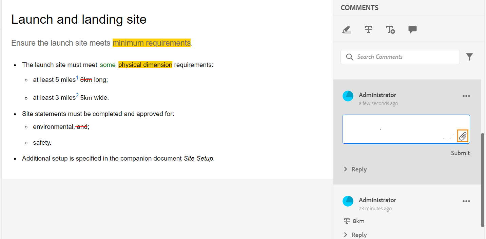
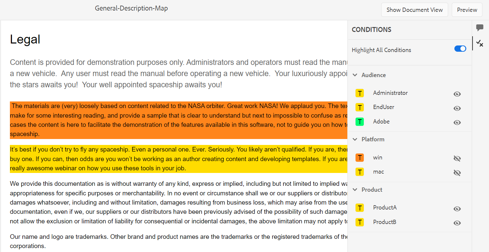

# Revisar tópicos {#id2056B0W0FBI}

Se você for um revisor, receberá um email de solicitação de revisão com o link para os tópicos da revisão. Usando este link, você pode acessar a página de revisão, na qual pode adicionar seu feedback sobre os tópicos compartilhados.

>[!NOTE]
>
> Ao acessar a solicitação de revisão a partir da notificação, você pode optar por reatribuí-la a outro usuário que faça parte do mesmo projeto de revisão. Para obter detalhes, exiba [Reatribuir tarefa de revisão usando notificação](./reassign-review-using-notification.md).

Execute as seguintes etapas para revisar um tópico:

1. Selecione o link direto fornecido no email de solicitação de revisão.

   O link do tópico ou do mapa é aberto em um navegador.

   >[!NOTE]
   >
   > Você também pode acessar o link de revisão de tópico na área Notificações da caixa de entrada na interface do usuário do Adobe Experience Manager.

1. Dependendo de como a revisão de tópico é iniciada, você pode exibir qualquer uma das duas telas a seguir:

   >[!NOTE]
   >
   > A interface do usuário pode ser diferente se você tiver criado a revisão no:
   >
   > - Adobe Experience Manager Guides as a Cloud Service versão de novembro de 2022 ou anterior
   > - Adobe Experience Manager Guides versão 4.1 ou anterior

   A tela a seguir é exibida quando um mapa DITA é usado para iniciar o workflow de revisão:

   {align="left"}

   As seguintes opções estão disponíveis nesta tela:

   - **A**: o nome da tarefa de revisão.
   - **B**: selecione o ícone Exibição de Tópicos para mostrar ou ocultar o painel de tópicos.

   - **C**: você pode pesquisar pelo tópico necessário inserindo alguma parte do texto do título ou caminho do arquivo na barra de pesquisa.

     Selecione  próximo à barra de pesquisa para optar por exibir todos os tópicos ou exibir tópicos com comentários. Por padrão, é possível exibir todos os tópicos presentes na tarefa de revisão.

   - **D**: os números realçados por ***F*** podem ser filtrados escolhendo a opção de filtro desejada aqui. Você pode filtrar comentários por tipo, status, revisor ou versão. Por exemplo, se você deseja exibir quantos comentários de Tachado foram feitos em cada um dos tópicos em revisão, selecione o ícone de filtro e escolha **Tipo de revisão** \> **Exclusão**.

     >[!NOTE]
     >
     > Ao aplicar os filtros, somente os comentários que correspondem aos filtros selecionados são exibidos no painel Comentários. O número de comentários filtrados é mostrado à esquerda no painel de tópicos.

   - **E**: um tópico atribuído para revisão ao revisor atual é mostrado em preto e pode ser selecionado. Quando o revisor seleciona um link de tópico, esse tópico é trazido para a parte superior da tela.
   - **F**: um tópico que não está disponível para revisão está esmaecido. O tópico é exibido no modo somente leitura e você não tem permissão para adicionar comentários de revisão sobre esses tópicos.

   - **G**: Número de comentários recebidos sobre um tópico. Esse número é alterado com base no filtro aplicado.

   Todos os tópicos no mapa são mostrados como um único documento composto. Os tópicos que o revisor tem permissão para revisar são mostrados normalmente. Os tópicos que a revisão não tem permissão para revisar não são mostrados.

   {align="left"}

   Na captura de tela acima, o tópico Descrição geral é compartilhado para revisão com o revisor atual, exibido normalmente. No entanto, o próximo tópico, Histórico do conteúdo do voo, não é compartilhado para revisão e é exibido no modo somente leitura. O tópico atualmente em foco também é destacado no índice.

   A tela a seguir é exibida quando um ou vários tópicos são selecionados e compartilhados para revisão:

   {align="left"}

   >[!NOTE]
   >
   > No caso de vários tópicos, eles são mostrados como um documento composto na visualização do documento. A captura de tela acima destaca dois tópicos diferentes apresentados um após o outro em uma única visualização.

1. Abra o painel Comentários selecionando o ícone **Comentários** no canto superior direito da barra de ferramentas.

   Forneça comentários de revisão selecionando um tipo de comentário apropriado na barra de ferramentas e pressione Enter para enviar seu comentário.
A caixa de comentário suporta entradas de várias linhas e permite que os usuários as expandam conforme necessário para fornecer feedback detalhado. Você pode usar **Shift** + **Enter** para ir para a próxima linha enquanto escreve o comentário.

   >[!NOTE]
   >
   > O painel Comentários mostra os comentários fornecidos apenas nos tópicos atuais. Quando você move o foco para outro tópico, os comentários dados sobre o outro tópico são mostrados.

1. Selecione o botão **Fechar** depois de concluir a revisão do tópico. Ao selecionar o botão **Fechar**, você será redirecionado para a página de onde acessou o tópico de revisão.

## Recursos adicionais disponíveis na tela de revisão

**Exibição de documento e exibição de tópico** - Por padrão, se vários tópicos forem compartilhados para revisão, uma exibição de documento composto de tópicos será mostrada aos revisores. No caso de uma revisão de mapa DITA, todos os tópicos do mapa são apresentados na forma de um único documento, semelhante a uma exibição de livro. Se desejar, você também poderá selecionar um tópico específico e somente esse tópico será exibido na tela de revisão.

Ao exibir um único tópico, você obtém uma opção adicional para alternar de volta para a exibição do documento. Na captura de tela a seguir, um tópico específico de um arquivo de mapa é aberto para revisão. A opção realçada — **Mostrar Exibição de Documento** permite que o usuário alterne de volta para a exibição de documento do arquivo de mapa.

>[!NOTE]
>
> Qualquer resolução de tela com largura superior a 1600 px é compatível com as larguras padrão do painel (esquerda e direita), garantindo que nenhuma barra de rolagem horizontal seja exibida e que o conteúdo permaneça alinhado corretamente na exibição do documento. Além disso, sempre é possível redimensionar a tela para manter a exibição apropriada do documento na interface de revisão.

{align="left"}

**Trabalhando com diferentes tipos de ferramentas de comentários** - Você pode adicionar comentários incorporados realçando o texto, percorrendo o texto, inserindo texto ou adicionando uma nota de comentário. Os diferentes tipos de ferramentas de comentários fornecidos na barra de ferramentas Comentários estão descritos abaixo:

{width="350" align="left"}

- **Realçar** \(\): para adicionar um comentário de realce, selecione o texto e escolha o ícone Realçar. Ou você pode primeiro escolher o ícone de Realce e depois selecionar o texto desejado.

  {width="650" align="left"}

  Um pop-up é exibido no painel Comentários, onde você pode adicionar seu comentário ao conteúdo destacado.

- **Tachado** \(\): se quiser sugerir a remoção de conteúdo, selecione o conteúdo e escolha o ícone Tachado. Ou você pode primeiro selecionar o texto desejado e depois escolher a tecla Delete.

  Um pop-up é exibido no painel Comentários, onde você pode adicionar seu comentário ao conteúdo excluído.

- **Inserir Texto** \(\): se desejar inserir texto, selecione o ícone Inserir Texto e coloque o cursor onde deseja inserir o texto e digite as informações. Ou coloque o cursor onde deseja inserir texto e comece a digitar. As informações adicionadas aparecem na fonte verde.

- **Adicionar comentário**\(\): se quiser adicionar um tipo de comentário de nota adesiva, selecione o ícone Adicionar comentário e insira o comentário na janela pop-up.

**Barra de ferramentas contextual**

Também é possível destacar ou tachar o texto rapidamente com a barra de ferramentas contextual. Execute as seguintes etapas para comentar usando a barra de ferramentas contextual:

1. Selecione o texto que deseja realçar ou tachar. A barra de ferramentas contextual é exibida.

   {width="550" align="left"}

1. Selecione o ícone **Realçar** ou **Tachado**.
1. É possível adicionar comentários no painel de comentários para a ação de realce ou tachado.

**Revisar usando o painel Comentários** - O painel Comentários exibe uma lista de comentários fornecidos sobre o tópico atual. Esse painel também lista comentários de outros revisores, se o tópico for enviado a vários revisores. Cada comentário no painel de comentários é vinculado ao texto correspondente no tópico atual. Isso ajuda a identificar o texto comentado. Cada comentário exibe o nome do revisor que adicionou o comentário junto com o carimbo de data e hora.

Os comentários são exibidos na ordem do texto comentado no documento. Por exemplo, há um comentário de destaque na primeira frase e um comentário de texto de inserção na segunda frase do primeiro parágrafo, depois o comentário de texto de destaque é exibido antes do comentário de texto inserido.

As tarefas que você pode executar usando o painel Comentários estão descritas abaixo:

- Selecionar um comentário realça e mostra o local do comentário correspondente no documento.
- Você pode adicionar respostas aos comentários.
- Você pode editar o seu próprio comentário selecionando o texto comentado no painel Comentários e escolhendo **Editar** no menu Opções.
- Você pode excluir seus próprios comentários selecionando-os no painel Comentários e escolhendo a opção **Excluir** no menu Opções.

  {width="300" align="left"}

  >[!NOTE]
  >
  > O menu Opções é exibido apenas quando você passa o mouse sobre seus próprios comentários. Não é exibido para os comentários de outros revisores.

- Todos os usuários participantes podem responder aos comentários enviados por outros usuários. Em um comentário, selecione **Responder** e pressione Enter para enviar uma resposta. A caixa de resposta tem várias linhas e pode ser expandida, o que ajuda os usuários a fornecer respostas detalhadas aos comentários. Você pode usar **Shift** + **Enter** para ir para a próxima linha enquanto escreve a resposta.

**Modo de visualização**

- Abrir um tópico no modo de Visualização mostra como um tópico será exibido quando for visualizado por um autor após a aplicação de todas as alterações. Por exemplo, todo o texto inserido é mostrado como texto normal e todo o texto destacado \(excluído\) é removido do conteúdo.

- A captura de tela a seguir mostra o conteúdo no modo *Revisão*:

{width="550" align="left"}

A captura de tela a seguir mostra o conteúdo no modo *Visualização*:

{width="550" align="left"}

**Marcar usuários da tarefa em um comentário**

Ao colaborar em uma tarefa de revisão com vários revisores, é possível aprimorar a comunicação marcando usuários específicos em novos comentários e respostas. Como revisor, você pode iniciar um comentário ou responder a um existente enquanto marca outros usuários envolvidos na mesma tarefa de revisão para chamar sua atenção ou atribuir acompanhamentos. Essa funcionalidade só está disponível para tarefas de revisão ativas.

>[!NOTE]
>
> Para exibir a lista de usuários atribuídos a uma tarefa de revisão e marcá-los em um comentário, você deve ter acesso de *Leitura* aos nós `/home/users and /home/groups`. Para obter detalhes, consulte [Administração e segurança do usuário](../cs-install-guide/user-admin-sec.md#additional-notes-on-user-groups).   Se a marcação ainda não estiver disponível após a confirmação do acesso, talvez o administrador precise atribuir uma licença do `user-admin` para habilitar essa funcionalidade.

{width="350" align="left"}

Os usuários marcados recebem um email e uma notificação do AEM, garantindo que sejam informados imediatamente. Para obter mais detalhes sobre como as notificações de revisão disparam, consulte [Noções básicas sobre notificações de revisão](./review-understanding-review-notifications.md).

{width="350" align="left"}

**Adicionar anexos aos comentários** -   Se quiser complementar seu comentário fornecendo informações adicionais que estão disponíveis em algum outro arquivo, anexe-o ao seu comentário. Como revisor, você pode adicionar facilmente um ou vários arquivos do sistema local ao comentário. Um arquivo pode ser adicionado a todas as formas de comentários aceitos - Realce, Tachado, Inserir texto ou um Comentário.

Quando você insere qualquer um dos comentários, o pop-up de comentários é exibido. Depois de fornecer comentários ou informações adicionais na janela pop-up, você pode enviá-las pressionando Enter. Depois que o comentário for adicionado, você terá a opção de adicionar um anexo a ele.

{align="left"}

Na captura de tela acima, o documento contém o pop-up do comentário de destaque e o comentário também é adicionado no painel Comentários. O ícone de anexo de arquivo  está disponível junto com o comentário em ambos os locais.

Execute as seguintes etapas para adicionar o anexo ao seu comentário:

1. Selecione o ícone *Adicionar Anexo* no comentário com o qual deseja adicionar um anexo.

   A caixa de diálogo Abrir arquivo é exibida.

1. Selecione um ou vários arquivos que deseja anexar.

   Os arquivos selecionados são mostrados junto com o comentário no painel Comentários.

   No painel Comentários, é possível exibir o nome do arquivo e seu tamanho. Você também tem uma opção para remover um arquivo selecionando o ícone de exclusão  associado ao nome do arquivo.

1. Selecione **Enviar**.

   Os anexos são carregados e adicionados ao comentário.

**Observações adicionais sobre como trabalhar com anexos:**

- Por padrão, somente dois arquivos anexados com um comentário são exibidos. Se houver mais arquivos, o botão **Exibir Anexo** à direita mostrará o número de todos os anexos \(que são mais de dois\) associados ao comentário. Você pode selecionar o número para exibir todos os anexos. Por exemplo, se você tiver quatro anexos com um comentário, verá +2 no botão.

{width="550" align="left"}

- Passar o ponteiro do mouse sobre um anexo fornece as opções para baixar ou remover o anexo. A remoção do anexo só estará disponível se o revisor atual tiver adicionado esse comentário, conforme mostrado na seguinte captura de tela:

{width="550" align="left"}

Os outros revisores ou autores obtêm somente a opção de download de anexo.

{width="550" align="left"}

- Você pode baixar todos os anexos associados a um comentário na caixa de diálogo **Exibir Anexos**. Selecione os anexos e selecione o ícone **Baixar** no nível de comentário.

- Você também pode excluir os anexos associados a um comentário da caixa de diálogo **Exibir anexos**. Selecione os anexos e o ícone **Excluir**.

{width="550" align="left"}

**Painel de condições** -   Se o seu tópico tiver conteúdo condicional, você verá o ícone **Condições** \(\) à direita. Selecionar o ícone **Condições** abre o painel Condições, que permite realçar o conteúdo de acordo com as condições disponíveis no tópico.

:   Por padrão, a opção **Realçar Todas as Condições** está habilitada, todas as condições são selecionadas, o conteúdo inteiro é exibido e o conteúdo condicional é mostrado como realçado tanto no modo de revisão quanto no modo de visualização.

:   Você pode desabilitar a opção **Realçar Todas as Condições** e exibir todo o conteúdo presente no tópico como texto normal sem realces.

{width="350" align="left"}

Você pode optar por ocultar ou mostrar uma condição específica.

- Se você ocultar uma condição, o conteúdo que a apresenta não será destacado no modo de revisão.
- Se você mostrar uma condição, o conteúdo condicional será realçado no modo de revisão. Por exemplo, na captura de tela a seguir, somente o conteúdo usa duas condições - `win` e `mac` é realçado.

{width="650" align="left"}

No modo de visualização, são exibidos o conteúdo não-condicional e o conteúdo condicional que usa as duas condições mostradas - `win` e `mac`. O conteúdo condicional restante para o qual as condições estão ocultas não é exibido.

**Revisão em tempo real** -   O painel Comentários é atualizado em tempo real com comentários e o feedback ou a ação realizada pelo autor nos comentários.

- Vários revisores poderão deixar comentários ou responder a comentários simultaneamente no mesmo documento. Você pode descobrir quem está revisando o documento no momento, passando o mouse sobre o ícone do usuário no canto superior direito da tela.

- Se um tópico fizer parte de várias tarefas de revisão, os comentários feitos em uma tarefa não serão mostrados na outra tarefa.

- Selecionar o ícone Comentário Desatualizado \(\) exibe as diferenças entre a versão mais recente e a versão comentada do documento. Os números de versão \(das versões que estão sendo comparadas\) são exibidos na parte superior dos documentos.

  {align="left"}

  >[!NOTE]
  >
  > Quando você passa o mouse sobre o ícone Comentário desatualizado, o número da versão do tópico em que o comentário foi adicionado é exibido. Por exemplo, se um comentário foi fornecido na versão 1.0, o mesmo é exibido.

- Selecionar um comentário desatualizado abre a versão desse comentário no painel esquerdo. A versão anterior é mostrada no painel esquerdo e a versão atual é exibida no painel direito. Todos os comentários sobre a versão desatualizada são importados no lado esquerdo. Você pode comparar a versão anterior com a versão atual.

**Filtrar comentários** -   Você pode filtrar comentários em um documento para exibir comentários específicos conforme necessário. Para filtrar comentários, selecione o ícone **Filtro** \(\) que aparece no menu à direita da caixa de texto Pesquisar Comentários, no painel Comentários.

Selecione uma ou mais das seguintes opções de filtragem na caixa de diálogo **Tipo de Filtro** e selecione **Aplicar**.

- **Tipo de Revisão** - Filtre com base no tipo de comentários - Realce, Exclusão, Inserção ou Comentário.
- **Status da Revisão** - Filtre com base no status do comentário como Aceito, Rejeitado ou Nenhum.
- **Revisores** - Filtre com base no nome do revisor.

- **Versões** - Filtre com base nos comentários recebidos sobre uma versão específica do tópico.

  Ao usar os filtros, os comentários no painel direito são filtrados de acordo com a seleção e o número de comentários no painel esquerdo é atualizado adequadamente.

Para remover o filtro e exibir todos os comentários, desmarque todos os filtros da caixa de diálogo **Tipo de Filtro** e selecione **Aplicar**.

**Tópico pai:**[ Introdução à revisão](review.md)
