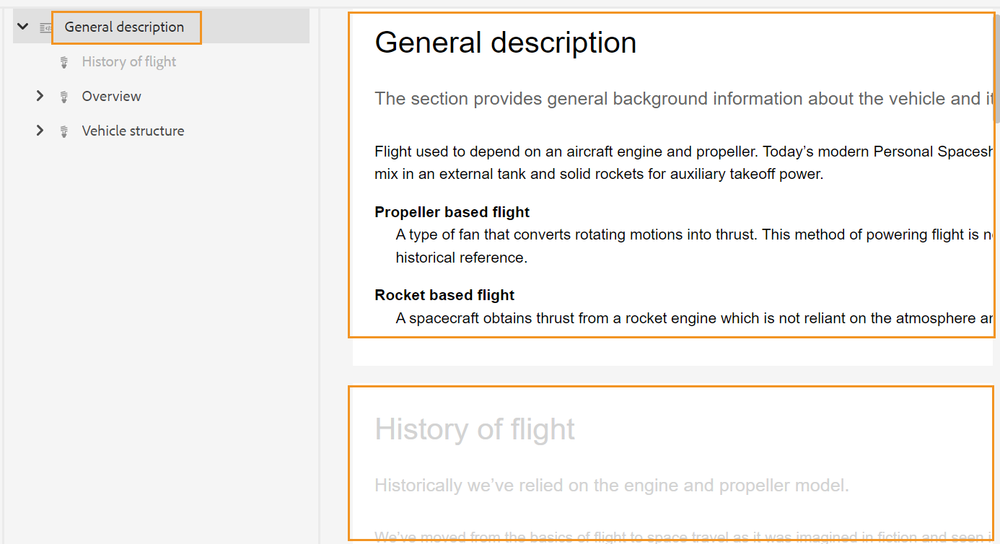

# Revisar tópicos {#id2056B0W0FBI}

Se você for um revisor, receberá um email de solicitação de revisão com o link para os tópicos da revisão. Ao clicar no link, você será redirecionado para a página de revisão, na qual poderá adicionar seu feedback sobre os tópicos compartilhados.

Execute as seguintes etapas para revisar um tópico:

1. Clique no link direto fornecido no email de solicitação de revisão.

   O link do tópico ou do mapa é aberto em um navegador.

   >[!NOTE]
   >
   > Na interface do AEM, também é possível acessar o link de revisão de tópico a partir da área de notificações da Caixa de entrada.

1. Dependendo de como a revisão de tópico é iniciada, você pode visualizar qualquer uma das duas telas a seguir:

   >[!NOTE]
   >
   > A interface do usuário pode ser diferente se você tiver criado a revisão no:
   >
   > - Guias de AEM as a Cloud Service versão de novembro de 2022 ou anterior
   > - Guias de AEM versão 4.1 ou anterior

   A tela a seguir é exibida quando um mapa DITA é usado para iniciar o workflow de revisão:

   {width="800" align="left"}

   As seguintes opções estão disponíveis nesta tela:

   - **A**: o nome da tarefa de revisão.
   - **B**: Clique no ícone Exibição de tópicos para mostrar ou ocultar o painel de tópicos.

   - **C**: Você pode pesquisar o tópico desejado inserindo alguma parte do texto do título ou caminho de arquivo na barra de pesquisa.

     Selecionar   próximo à barra de pesquisa para escolher exibir todos os tópicos ou exibir tópicos com comentários. Por padrão, é possível exibir todos os tópicos presentes na tarefa de revisão.

   - **D**: os números destacados por ***F*** pode ser filtrado ao escolher a opção de filtro desejada aqui. Você pode filtrar comentários por tipo, status, revisor ou versão. Por exemplo, se você quiser ver quantos comentários de tachado foram feitos em cada um dos tópicos em revisão, clique no ícone de filtro e escolha **Tipo de revisão** \> **Exclusão**.

     >[!NOTE]
     >
     > Ao aplicar os filtros, somente os comentários que correspondem aos filtros selecionados são exibidos no painel de comentários. O número de comentários filtrados é mostrado à esquerda no painel de tópicos.

   - **E**: um tópico atribuído para revisão ao revisor atual é mostrado em preto e é clicável. Quando o revisor clicar em um link de tópico, esse tópico será trazido para a parte superior da tela.
   - **F**: Um tópico que não está disponível para revisão fica esmaecido. O tópico é exibido no modo somente leitura e você não tem permissão para adicionar comentários de revisão sobre esses tópicos.

   - **G**: Número de comentários recebidos sobre um tópico. Esse número é alterado com base no filtro aplicado.

   Todos os tópicos no mapa são mostrados como um único documento composto. Os tópicos que o revisor tem permissão para revisar são mostrados normalmente. Os tópicos que a revisão não tem permissão para revisar não são mostrados.

   {width="800" align="left"}

   Na captura de tela acima, o tópico Descrição geral é compartilhado para revisão do revisor atual, exibido normalmente. No entanto, o próximo tópico, Histórico do conteúdo do voo, não é compartilhado para revisão e é exibido no modo somente leitura. O tópico atualmente em foco também é destacado no índice.

   A tela a seguir é exibida quando um ou vários tópicos são selecionados e compartilhados para revisão:

   {width="800" align="left"}

   >[!NOTE]
   >
   > No caso de vários tópicos, eles são mostrados como um documento composto na visualização do documento. A captura de tela acima destaca dois tópicos diferentes apresentados um após o outro em uma única visualização.

1. Abra o painel Comentários clicando no botão **Comentários** no canto superior direito da barra de ferramentas.

   Forneça comentários de revisão selecionando um tipo de comentário apropriado na barra de ferramentas e pressione Enter para enviar seu comentário.

   >[!NOTE]
   >
   > O painel Comentários mostra os comentários fornecidos apenas nos tópicos atuais. Quando você move o foco para outro tópico, os comentários dados sobre o outro tópico são mostrados.

1. Clique em **Fechar** quando terminar de revisar o tópico. Ao clicar no botão **Fechar** , você será redirecionado para a página de onde acessou o tópico de revisão.

## Recursos adicionais disponíveis na tela de revisão

**Exibição de documento e de tópico** - Por padrão, se vários tópicos forem compartilhados para revisão, uma exibição de documento composto de tópicos será mostrada aos revisores. No caso de uma revisão de mapa DITA, todos os tópicos do mapa são apresentados na forma de um único documento, semelhante a uma exibição de livro. Se desejar, você também pode clicar em um tópico específico e somente esse tópico será exibido na tela de revisão.

Ao exibir um único tópico, você obtém uma opção adicional para alternar de volta para a exibição do documento. Na captura de tela a seguir, um tópico específico de um arquivo de mapa é aberto para revisão. A opção destacada — **Mostrar visualização do documento** permite que o usuário volte para a exibição de documento do arquivo de mapa.

{width="800" align="left"}

**Trabalhar com diferentes tipos de ferramentas de comentários** - Você pode adicionar comentários em linha destacando o texto, passando pelo texto, inserindo texto ou adicionando uma nota de comentário. Os diferentes tipos de ferramentas de comentários fornecidos na barra de ferramentas Comentários estão descritos abaixo:

{width="350" align="left"}

- **Realce** \(\): para adicionar um comentário de destaque, selecione o texto e clique no ícone Realce. Ou clique no ícone de Realce e selecione o texto desejado:

  {width="650" align="left"}

  Um pop-up é exibido no painel Comentários, onde você pode adicionar seu comentário ao conteúdo destacado.

- **Tachado** \(\): se quiser sugerir a remoção de conteúdo, selecione o conteúdo e clique no ícone Tachado. Ou selecione o texto desejado e clique na tecla Delete:

  Um pop-up é exibido no painel Comentários, onde você pode adicionar seu comentário ao conteúdo excluído.

- **Inserir texto** \(\): Se quiser inserir texto, clique no ícone Inserir Texto e coloque o cursor onde deseja inserir o texto e digite as informações. Ou coloque o cursor onde deseja inserir texto e comece a digitar. As informações adicionadas aparecem na fonte em verde:

- **Adicionar comentário**\(\): Se quiser adicionar um tipo de comentário de nota adesiva, clique no ícone Adicionar comentário e insira o comentário na janela pop-up.

**Barra de ferramentas contextual**

Também é possível destacar ou tachar o texto rapidamente com a barra de ferramentas contextual. Execute as seguintes etapas para comentar usando a barra de ferramentas contextual:

1. Selecione o texto que deseja realçar ou tachar. A barra de ferramentas contextual é exibida.

   {width="550" align="left"}

1. Clique em **Realce** ou **Tachado** ícone.
1. É possível adicionar comentários no painel de comentários para a ação de realce ou tachado.

**Revisar usando o painel Comentários** - O painel Comentários exibe uma lista de comentários fornecidos sobre o tópico atual. Esse painel também lista comentários de outros revisores, se o tópico for enviado a vários revisores. Cada comentário no painel de comentários é vinculado ao texto correspondente no tópico atual. Isso ajuda a identificar o texto comentado. Cada comentário exibe o nome do revisor que adicionou o comentário junto com o carimbo de data e hora.

Os comentários são exibidos na ordem do texto comentado no documento. Por exemplo, há um comentário de destaque na primeira frase e um comentário de texto de inserção na segunda frase do primeiro parágrafo, depois o comentário de texto de destaque é exibido antes do comentário de texto inserido.

As tarefas que você pode executar usando o painel Comentários estão descritas abaixo:

- Clicar em um comentário realça e mostra o local do comentário correspondente no documento.
- Você pode adicionar respostas aos comentários.
- Você pode editar seu próprio comentário clicando no texto comentado no painel Comentários e selecionando **Editar** no menu Opções.
- Você pode excluir seus próprios comentários clicando no comentário no painel Comentários e selecionando o **Excluir** no menu Opções.

  {width="300" align="left"}

  >[!NOTE]
  >
  > O menu Opções é exibido apenas quando você passa o mouse sobre seus próprios comentários. Não é exibido para os comentários de outros revisores.

- Todos os usuários participantes podem responder aos comentários enviados por outros usuários. Em um comentário, clique em **Responder** e pressione Enter para enviar uma resposta.

**Modo de visualização**

- Abrir um tópico no modo de Visualização mostra como um tópico será exibido quando for visualizado por um autor após a aplicação de todas as alterações. Por exemplo, todo o texto inserido é mostrado como texto normal e todo o texto destacado \(excluído\) é removido do conteúdo.

- A captura de tela a seguir mostra o conteúdo em *Revisão* modo:

{width="550" align="left"}

A captura de tela a seguir mostra o conteúdo em *Visualizar* modo:

{width="550" align="left"}

**Adicionar anexos a comentários** - Se você quiser complementar seu comentário fornecendo informações adicionais que estão disponíveis em algum outro arquivo, você pode fazê-lo anexando-o com seu comentário. Como revisor, você pode adicionar facilmente um ou vários arquivos do sistema local ao comentário. Um arquivo pode ser adicionado a todas as formas de comentários aceitos - Realce, Tachado, Inserir texto ou um Comentário.

Quando você insere qualquer um dos comentários, o pop-up de comentários é exibido. Depois de fornecer comentários ou informações adicionais na janela pop-up, você pode enviá-las pressionando Enter. Depois que o comentário for adicionado, você terá a opção de adicionar um anexo a ele.

{width="800" align="left"}

Na captura de tela acima, o documento contém o pop-up do comentário de destaque e o comentário também é adicionado no painel Comentários. O ícone de anexo de arquivo O está disponível junto com o comentário em ambos os locais.

Execute as seguintes etapas para adicionar o anexo ao seu comentário:

1. Clique em *Adicionar anexo* ícone  no comentário ao qual deseja adicionar um anexo.

   A caixa de diálogo Abrir arquivo é exibida.

1. Selecione um ou vários arquivos que deseja anexar.

   Os arquivos selecionados são mostrados junto com o comentário no painel Comentários.

   No painel Comentários você pode ver o nome do arquivo e seu tamanho. Também há uma opção para remover um arquivo clicando no ícone excluir  associado ao nome do arquivo.

1. Clique em **Enviar**.

   Os anexos são carregados e adicionados ao comentário.

**Observações adicionais sobre como trabalhar com anexos:**

- Por padrão, somente dois arquivos anexados com um comentário são exibidos. Se houver mais arquivos, **Exibir anexo** O botão à direita mostra o número de todos os anexos \(que são mais de dois\) associados ao comentário. Você pode clicar no número para exibir todos os anexos. Por exemplo, se você tiver quatro anexos com um comentário, verá +2 no botão.

{width="550" align="left"}

- Passar o ponteiro do mouse sobre um anexo fornece as opções para baixar ou remover o anexo. A remoção do anexo só estará disponível se o revisor atual tiver adicionado esse comentário, conforme mostrado na seguinte captura de tela:

{width="550" align="left"}

Os outros revisores ou autores obtêm somente a opção de download de anexo.

{width="550" align="left"}

- Você pode baixar todos os anexos associados a um comentário na **Exibir anexos** diálogo. Selecione os anexos e clique no botão **Baixar** no nível de comentário.

- Também é possível excluir os anexos associados a um comentário da **Exibir anexos** diálogo. Selecione os anexos e clique no botão **Excluir** ícone.

{width="550" align="left"}

**Painel Condições** - Se o tópico tiver conteúdo condicional, você verá a variável **Condições** \(\) ícone à direita. Clicando em **Condições** ícone abre o painel Condições, que permite realçar o conteúdo de acordo com as condições disponíveis no tópico.

: por padrão **Realçar todas as condições** estiver ativada, todas as condições forem selecionadas, o conteúdo inteiro for exibido e o conteúdo condicional for exibido como realçado no modo de revisão e pré-visualização.

: Você pode desativar o **Realçar todas as condições** e veja todo o conteúdo presente no tópico como texto normal sem realces.

{width="350" align="left"}

Você pode optar por ocultar ou mostrar uma condição específica.

- Se você ocultar uma condição, o conteúdo que a apresenta não será destacado no modo de revisão.
- Se você mostrar uma condição, o conteúdo condicional será realçado no modo de revisão. Por exemplo, na captura de tela a seguir, somente o conteúdo usa duas condições: `win` e `mac` é realçado.

{width="650" align="left"}

No modo de pré-visualização, o conteúdo não condicionado e o conteúdo condicionado que usa as duas condições mostradas - `win` e `mac` é exibido. O conteúdo condicional restante para o qual as condições estão ocultas não é exibido.

**Revisão em tempo real** - O painel Comentários é atualizado em tempo real com comentários e o feedback ou a ação tomada pelo autor nos comentários.

- Vários revisores poderão deixar comentários ou responder a comentários simultaneamente no mesmo documento. Você pode descobrir quem está revisando o documento no momento, passando o mouse sobre o ícone do usuário no canto superior direito da tela.

- Se um tópico fizer parte de várias tarefas de revisão, os comentários feitos em uma tarefa não serão mostrados na outra tarefa.

- Clicando no ícone Comentário desatualizado \(\) exibe as diferenças entre a versão mais recente e a versão comentada do documento. Os números de versão \(das versões que estão sendo comparadas\) são exibidos na parte superior dos documentos.

  {width="800" align="left"}

  >[!NOTE]
  >
  > Quando você passa o mouse sobre o ícone Comentário desatualizado, o número da versão do tópico em que o comentário foi adicionado é exibido. Por exemplo, se um comentário foi fornecido na versão 1.0, o mesmo é exibido.

- Clicar em um comentário desatualizado abre a versão desse comentário no painel esquerdo. A versão anterior é mostrada no painel esquerdo e a versão atual é exibida no painel direito. Todos os comentários sobre a versão desatualizada são importados no lado esquerdo. Você pode comparar a versão anterior com a versão atual.

**Filtrar comentários** - Você pode filtrar comentários em um documento para exibir comentários específicos, conforme necessário. Para filtrar comentários, clique no link **Filtro** ícone \(\) que aparece no menu à direita da caixa de texto Pesquisar comentários no painel Comentários.

Selecione uma ou mais das seguintes opções de filtro na **Tipo de filtro** e clique em **Aplicar**.

- **Tipo de revisão** - Filtre de acordo com o tipo de comentários - Realce, Exclusão, Inserção ou Comentário.
- **Status da revisão** - Filtre com base no status do comentário, como Aceito, Rejeitado ou Nenhum.
- **Revisores** - Filtrar com base no nome do revisor.

- **Versões** - Filtre com base nos comentários recebidos sobre uma versão específica do tópico.

  Ao usar os filtros, os comentários no painel direito são filtrados de acordo com a seleção e o número de comentários no painel esquerdo é atualizado adequadamente.

Para remover o filtro e exibir todos os comentários, desmarque todos os filtros da **Tipo de filtro** e clique em **Aplicar**.

**Tópico pai:**[ Revisar tópicos ou mapas](review.md)
