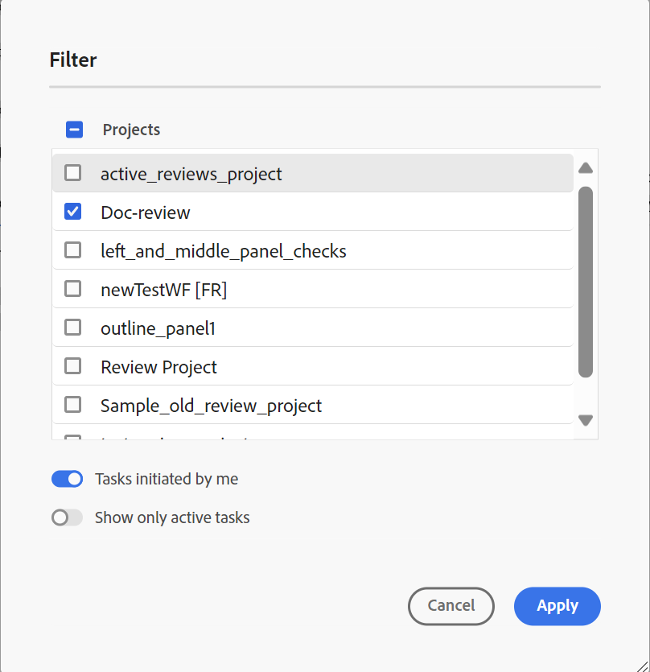

# Exibir uma tarefa de revisão concluída

É possível concluir as tarefas de revisão dos projetos dos quais você é o Autor (ou iniciador). Quando uma tarefa de revisão for concluída, você e todos os revisores poderão acessá-la no modo somente leitura.

## Como revisor

Como revisor, é possível exibir um indicador no painel de comentários para mostrar que a revisão terminou. A barra de ferramentas de comentários não é exibida, portanto, não é possível realçar, tachar, inserir texto ou adicionar comentários. Você pode ler um comentário, mas não pode editar nem excluir comentários. Também não é possível adicionar uma resposta aos comentários. Não é possível exibir a barra de ferramentas contextual (usada para realçar ou tachar qualquer texto). O ícone de comentários desatualizados também não é exibido em uma tarefa de revisão concluída.

No entanto, é possível pesquisar ou filtrar comentários. Você também pode optar por mostrar ou ocultar condições e exibir conteúdo condicional de acordo. Você pode baixar qualquer anexo, mas não pode fazer upload nem excluir anexos para os comentários.

{align="left"}

## Como autor

Você pode exibir as tarefas de revisão concluídas no painel **Revisão** em nível de projeto na seção **Tarefas fechadas**, conforme mostrado na captura de tela. Você pode pesquisar ou filtrar tarefas de revisão com base em Projetos. Por exemplo, você pode selecionar projetos específicos na caixa de diálogo **Filtro** e exibi-los no painel de revisão Ativo. Você pode filtrar ainda mais os resultados usando as opções **Tarefas iniciadas por mim** e **Mostrar somente tarefas ativas**.

{align="left"}

Para tarefas de revisão fechadas, você pode ler um comentário, mas não pode aceitá-lo ou rejeitá-lo. Não é possível editar nem excluir comentários. Também não é possível adicionar nenhuma resposta ao comentário. O ícone Comentários desatualizados e o ícone Importar comentários para a exibição do autor não são exibidos para uma tarefa de revisão concluída. O ícone Reverter tópico e o ícone de importação são desativados depois que a tarefa de revisão é concluída, como mostrado na captura de tela.

Também é possível pesquisar ou filtrar comentários presentes no painel Revisão. Você pode baixar qualquer anexo, mas não pode fazer upload nem excluir anexos para os comentários.

{align="left"}

Assim, como revisor ou autor, você pode visualizar o conteúdo revisado junto com os comentários, mas não pode fazer alterações em uma tarefa de revisão concluída.
