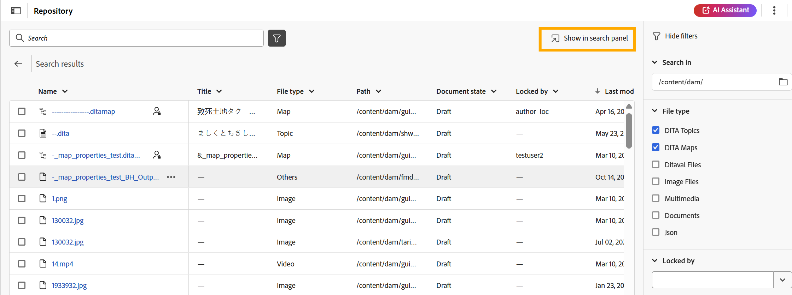
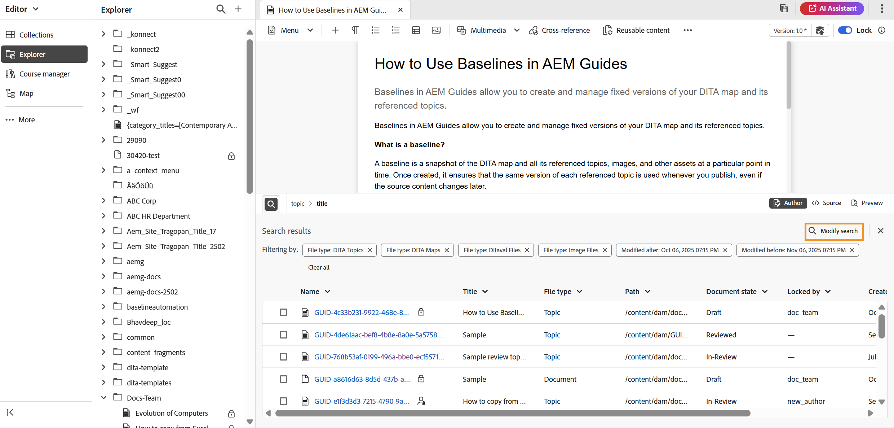

# Painel Pesquisar

>[!INFO]
>
>Este tópico se aplica ao Novo editor e ao Editor antigo. Embora a funcionalidade principal permaneça consistente, diferenças na interface do usuário, terminologia e interações são indicadas no conteúdo usando guias e chamadas de retorno, quando aplicável.

O painel Pesquisar no Editor aumenta a produtividade, fornecendo acesso rápido a um subconjunto de arquivos, exibidos com base em termos de pesquisa ou filtros aplicados ao editar conteúdo. Ele ajuda a abrir facilmente um ou vários arquivos pesquisados ou usá-los em um arquivo existente simplesmente arrastando e soltando em um tópico ou mapa. Você pode localizar o **painel de Pesquisa** na parte inferior do Editor.

O painel Pesquisar pode ser acessado das seguintes opções:

- **Interface do editor**: ao selecionar o **ícone Pesquisar** no **painel do Explorer** ou ao usar o **ícone Pesquisar** no canto inferior esquerdo da **área de edição de conteúdo**. Para obter detalhes, exiba [Pesquisar no painel Explorer](#search-from-the-explorer-panel).

  

- **Página inicial**: usando a opção **Mostrar no painel de Pesquisa** ao navegar da interface do Repositório na Página inicial. Para exibição de detalhes, [Pesquise no Repositório](#search-from-the-repository-interface-on-the-home-page).

  

## Principais benefícios

- Visualização centralizada de todos os resultados da pesquisa para facilitar a referência.
- Funcionalidade de arrastar e soltar para inserir referências diretamente no tópico ou mapa atual.
- Opções flexíveis para modificar ou refinar pesquisas sem sair do Editor.

## Pesquisar no painel Explorer

Ao trabalhar na interface do Editor, você pode filtrar o conjunto de arquivos para visualizar um subconjunto de arquivos relevantes de que precisa. Execute as seguintes etapas para pesquisar arquivos no Explorer:

1. Selecione o ícone **Pesquisar** no canto superior direito do **painel do Explorer** ou o ícone **Pesquisar** presente na parte inferior esquerda da **área de edição de conteúdo**. Isso abre a caixa de diálogo **Pesquisar repositório**, que oferece a mesma experiência de pesquisa e filtragem que a interface do Repositório na página inicial.

   >[!NOTE]
   >
   >Se já houver resultados de pesquisa da sua sessão atual, selecionar o **ícone Pesquisar** no Explorer ou o ícone na parte inferior esquerda da área de edição de conteúdo simplesmente abrirá o painel mostrando esses resultados anteriores. Para atualizar ou refinar as pesquisas, selecione **Modificar pesquisa**.

   

2. Faça a pesquisa e aplique filtros conforme necessário. Para obter instruções detalhadas sobre as opções de pesquisa e filtro, exiba a [experiência de pesquisa e filtro](./home-page-repository-view.md#search-and-filter-experience).

3. Após concluir a pesquisa, selecione **Mostrar no painel Pesquisar**. Suas pesquisas recentes aparecerão no painel Pesquisar na parte inferior do Editor.

   

4. Para atualizar os resultados da pesquisa, selecione a opção **Modificar pesquisa** no painel Pesquisar e atualize os critérios para obter novos resultados.

   

Depois que os resultados da pesquisa forem exibidos no painel Pesquisar, você poderá trabalhar com eles, abrindo e editando um ou vários arquivos diretamente no painel, ou arrastando e soltando arquivos selecionados em um tópico ou mapa existente para adicionar referências.

>[!BEGINTABS]

>[!TAB Novo editor]

>[!TAB Editor Antigo]

>[!ENDTABS]

## Pesquisar na interface do Repositório na página inicial

Ao executar uma pesquisa e aplicar filtros na interface do Repositório na Página inicial, selecionar **Mostrar no painel de pesquisa** redireciona você para a interface do Editor. Todos os resultados da pesquisa serão espelhados no painel Pesquisar, na parte inferior da interface do Editor.

No painel Pesquisar, você pode **arrastar e soltar** arquivos no tópico atual para anexar referências facilmente ou editar vários arquivos ao mesmo tempo. Além disso, você pode refinar os resultados da pesquisa usando a opção **Modificar pesquisa**, disponível no painel Pesquisar.

