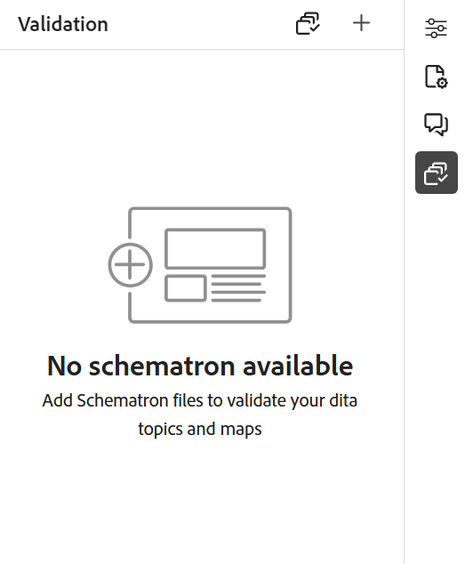
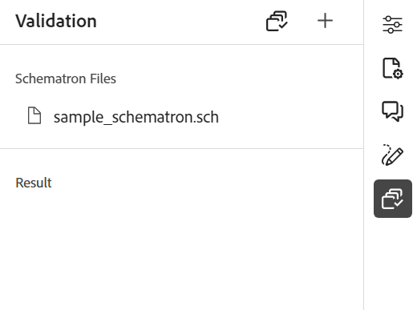

# Suporte para arquivos do Schematron

&quot;Esquematron&quot; refere-se a uma linguagem de validação baseada em regras usada para definir testes para um arquivo XML. O Editor aceita arquivos do Schematron. É possível importar os arquivos do Schematron e editá-los no Editor. Usando um arquivo de Esquematron, você pode definir determinadas regras e depois validá-las para um tópico DITA ou um mapa.

>[!NOTE]
>
> O editor é compatível com o esquema ISO.


## Importar arquivos do Schematron

Execute as seguintes etapas para importar os arquivos do Schematron:

{width="300" align="left"}

1. Navegue até a pasta necessária (onde deseja fazer upload dos arquivos) em *Repositório*.
1. Selecione o ícone **Opções** para abrir o menu de contexto e escolha **Carregar ativos**.
1. Na caixa de diálogo **Carregar ativos**, você pode alterar a pasta de destino no campo **Selecionar pasta de ativos**.
1. Selecione **Escolher Arquivos** e procure os arquivos do Schematron. Você pode selecionar um ou mais arquivos do Schematron e depois selecionar **Carregar**.

## Validar um tópico ou mapa DITA com o Schematron

Após importar os arquivos do Schematron, você pode editá-los no Editor. Você pode usar os arquivos do Schematron para validar os tópicos ou um mapa DITA. Por exemplo, você pode criar as seguintes regras para um mapa ou tópico DITA:

* Um título é definido para um mapa DITA.
* Uma breve descrição de um determinado comprimento foi adicionada.
* Deve haver pelo menos um topicref no mapa.

Quando você abre um tópico no Editor, um painel Validação do Schematron é exibido à direita. Execute as seguintes etapas para adicionar e validar um tópico ou mapa com um arquivo do Schematron:

{width="500" align="left"}

1. Selecione o ícone Esquematron () para abrir o painel Esquematron.
1. Use **Adicionar Arquivo do Esquematron** para adicionar arquivos do Esquematron.
1. Se o arquivo do Schematron não tiver erros, ele será adicionado e listado no painel Validação. Uma mensagem de erro é exibida para o arquivo do Schematron contendo erros.
   >[!NOTE]
   >
   >Você pode usar o ícone de cruz próximo ao nome do arquivo do Schematron para removê-lo.
1. Selecione **Validar com Esquematron** para validar o tópico.

   * Se o tópico não quebrar nenhuma regra, a mensagem de sucesso de validação será exibida para o arquivo.
   * Se o tópico quebrar uma regra, por exemplo, se não contiver um título e for validado para o Schematron fornecido acima, ele exibirá um erro de validação.

1. Selecione a mensagem de erro para realçar o elemento que contém o erro no tópico/mapa aberto.

O suporte ao Schematron no Editor ajuda a validar os arquivos em relação a um conjunto de regras e a manter a consistência e a correção nos tópicos.

## Usar instruções assert e report para verificar regras{#schematron-assert-report}

O Experience Manager Guides também oferece suporte às instruções assert e report no Schematron. Essas instruções ajudam a validar os tópicos DITA.

### Declaração de declaração

Uma instrução assert gera uma mensagem quando uma instrução test é avaliada como falsa. Por exemplo, se você quiser que seu título seja negrito, defina uma instrução assert para ele.

```XML
<sch:rule context="title"> 
    <sch:assert test = "b"> Title should be bold </sch:assert>
  </sch:rule>
```

Ao validar os tópicos DITA com o Schematron, você recebe uma mensagem para os tópicos em que o título não está em negrito.

### Demonstrativo do relatório

Uma instrução de relatório gera uma mensagem quando uma instrução de teste é avaliada como verdadeira. Por exemplo, se você quiser que a descrição curta tenha 150 caracteres ou menos, poderá definir uma instrução de relatório para verificar os tópicos em que a descrição curta tem mais de 150 caracteres.
Ao validar os tópicos DITA com o Schematron, você obtém um relatório completo das regras em que a instrução do relatório é avaliada como verdadeira. Assim, você recebe uma mensagem para os tópicos em que a descrição curta tem mais de 150 caracteres.


```XML
<sch:rule context="shortdesc"> 
        <sch:let name="characters" value="string-length(.)"/> 
        <sch:report test="$characters &gt; 150">  
        The short description has <sch:value-of select="$characters"/> characters. It should contain more than 150 characters.      
        </sch:report>   
    </sch:rule> 
```

>[!NOTE]
>
> Use somente expressões Xpath 2.0 ao gravar as regras do Schematron.

## Usar expressões Regex{#schematron-regex-espressions}

Também é possível usar expressões Regex para definir uma regra com a função matches() e executar a validação usando o arquivo Schematron.

Por exemplo, você pode usá-la para exibir uma mensagem se o título contiver apenas uma palavra.

```XML
<assert test="not(matches(.,'^\w+$'))"> 
No one word titles.
</assert>  
```


## Definir padrões abstratos{#schematron-abstract-patterns}

O Experience Manager Guides também oferece suporte a padrões abstratos no Schematron. Você pode definir padrões abstratos genéricos e reutilizar esses padrões abstratos.  Você pode criar parâmetros de espaço reservado que especificam o padrão real.


O uso de padrões abstratos pode simplificar o esquema Schematron, reduzindo a duplicação de regras e facilitando o gerenciamento e a atualização da lógica de validação. Ela também pode facilitar a compreensão do esquema, pois é possível definir uma lógica de validação complexa em um único padrão abstrato que pode ser reutilizado em todo o esquema.


Por exemplo, o código XML a seguir cria um padrão abstrato e, em seguida, o padrão real se refere a ele usando a id.

```XML
<sch:pattern abstract="true" id="LimitNoOfWords"> 

<sch:rule context="$parentElement"> 

<sch:let name="words" value="string-length(.)"/> 

<sch:assert test="$words &lt; $maxWords"> 

You have <sch:value-of select="$words"/> letters. This should be lesser than <sch:value-of select="$maxWords"/>. 

</sch:assert>  

<sch:assert test="$words &gt; $minWords"> 

You have <sch:value-of select="$words"/> letters. This should be greater than <sch:value-of select="$minWords"/>. 

</sch:assert>  

</sch:rule> 

</sch:pattern> 

<sch:pattern is-a="LimitNoOfWords" id="extend-LimitNoOfWords"> 

<sch:param name="parentElement" value="title"/> 

<param name="minWords" value="1"/> 

<param name="maxWords" value="8"/> 

</sch:pattern> 
```
