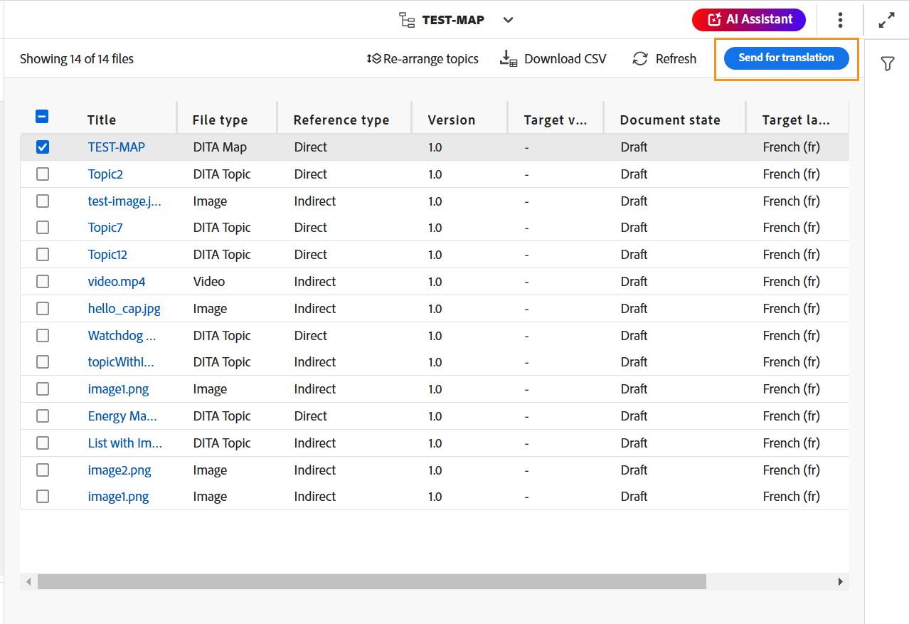
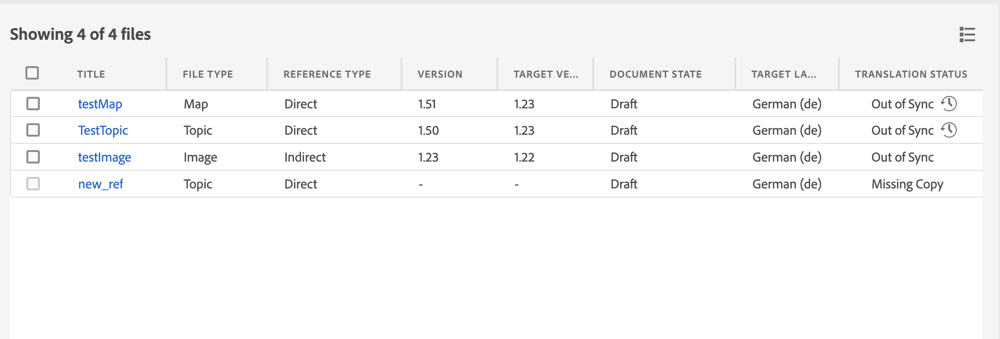

# Traduzir documentos do Editor da Web {#id21BKF0Z0YZF}

>[!TIP]
>
> É recomendável usar esse recurso de tradução do Editor da Web se você tiver atualizado para o AEM Guides as a Cloud Service na versão de fevereiro de 2022 ou posterior.

O AEM Guides vem com um recurso poderoso no Editor da Web que permite traduzir o conteúdo para vários idiomas. Você pode criar um novo projeto de tradução e depois adicionar os trabalhos de tradução ao projeto de tradução existente. Você também pode criar um projeto de tradução em vários idiomas que inclua trabalhos de tradução para todos os idiomas selecionados.

>[!NOTE]
>
> O administrador pode configurar a guia Gerenciar \(usada para tradução\) no Editor da Web. Para obter mais detalhes, consulte *Configurar o recurso de tradução no Editor da Web* na seção Instalar e configurar o Adobe Experience Manager Guides as a Cloud Service.

## Antes de começar

Antes de executar etapas neste procedimento, verifique se você criou a raiz de idioma e as pastas de destino necessárias

1. Crie uma pasta raiz para armazenar o conteúdo de origem. A pasta raiz deve ser criada com o nome de idioma \(como inglês\) ou o código de idioma \(en\).
1. Crie as pastas de destino para as quais deseja traduzir o conteúdo. Por exemplo, se você quiser traduzir seu conteúdo para alemão ou francês, crie uma pasta chamada -de \(para alemão\) ou -fr \(para francês\).

>[!NOTE]
>
> A pasta raiz e as pastas de destino devem ser criadas no mesmo nível.

## Criar um novo projeto de tradução

1. No painel Repositório, abra o arquivo de mapa DITA na exibição de mapa.
1. Clique em **Gerenciar** guia. O painel Tradução exibe o título com hiperlink do mapa DITA junto com a tag **Idiomas** lista.
1. No **Idiomas** selecione o local para o qual deseja traduzir o projeto. É possível selecionar **Todos** para traduzir o projeto para todos os idiomas disponíveis.

   >[!NOTE]
   >
   > A lista contém as pastas de idioma junto com seus códigos de idioma. Por exemplo, francês \(fr\) e alemão \(de\).

   >[!IMPORTANT]
   >
   > Idioma mostra apenas os idiomas para os quais uma pasta de idioma é criada paralelamente ao idioma de origem. Uma pasta de idioma criada em qualquer outro nível, como um nível abaixo da pasta de idioma de origem, também não é exibida. Crie todas as pastas de idioma de destino no mesmo nível que a pasta de idioma de origem.

   {width="350" align="left"}

1. Você também pode usar as seguintes opções:

   **Usar Linha de Base:** Você pode selecionar uma linha de base para traduzir o projeto. Clique em Usar Linha de Base e escolha uma linha de base criada no mapa. Todos os arquivos que fazem parte da Linha de base selecionada são mostrados na página Tradução. Depois que o conteúdo for traduzido, você poderá exportar a Linha de base traduzida. Para obter mais detalhes sobre como exportar a Linha de Base traduzida, consulte [Exportar Linha de Base traduzida](generate-output-use-baseline-for-publishing.md#id196SE600GHS).

   **Usar a versão mais recente como em**: opte por filtrar a versão dos tópicos com base na data e hora de criação. Quando você seleciona uma data e hora, somente a versão mais recente dos arquivos criados na data e hora selecionadas ou antes dela é exibida.

1. Clique em **Aplicar**. Uma lista com detalhes de tópicos e ativos associados é exibida.
1. Selecione os tópicos que deseja enviar para tradução. Você também pode usar as opções de filtragem de tópico para as seguintes colunas:

   - **Título**: Título do arquivo de origem.  Passe o mouse sobre o título do arquivo de origem para exibir o título do arquivo de destino ou traduzido.
   - **Nome do arquivo**: Nome do arquivo de origem
   - **Tipo de arquivo**: Tipo do arquivo de origem. As opções disponíveis são Mapa, Tópico e Imagem.
   - **Tipo de referência**: referências diretas ou indiretas
   - **Versão**: número de versão do arquivo de origem
   - **Rótulo da versão**: rótulo para a versão selecionada do arquivo de origem
   - **Versão de destino**: número de versão do arquivo de destino
   - **Estado do documento**: estado do arquivo de origem. As opções disponíveis são Rascunho, Em revisão e Revisado.
   - **Idioma de destino**: o idioma para o qual você deseja traduzir o arquivo de origem
   - **Status da tradução**: as opções disponíveis são: Out of Sync, Missing Copy, In Progress e In Sync.
   - **Rótulo de destino**: rótulo para a versão selecionada do arquivo de destino
1. Clique em **Enviar para tradução** no canto superior direito

   {width="800" align="left"}

1. Na lista suspensa, selecione **Criar um novo projeto de tradução**.

   {width="350" align="left"}

   Além de um novo projeto de tradução, você também pode selecionar as seguintes opções:

   - Você pode optar por **Criar uma estrutura** somente para o projeto de tradução.
   - Você pode optar por **Criar um novo projeto de tradução XLIFF** para converter o conteúdo XML no XML Localization Interchange File Format (XLIFF). XLIFF é um formato aberto baseado em XML usado para padronizar a transferência de dados entre várias ferramentas usadas no processo de tradução de conteúdo. O AEM Guides é compatível com a versão 1.2 do XLIFF. Em um projeto XLIFF, o conteúdo é exportado para o formato XLIFF padrão do setor, que pode ser fornecido para fornecedores de tradução. O formato XLIFF permite a potencial reutilização de segmentos que você já traduziu durante a fase de tradução.\
     Depois que o conteúdo XLIFF é traduzido, ele pode ser importado para os Guias AEM, criando uma versão traduzida do projeto DITA original.

     >[!NOTE]
     >
     > A exportação XLIFF funciona somente com a configuração de tradução humana.

   - É possível selecionar **Criar um novo projeto de tradução em vários idiomas** que incluirão trabalhos de tradução para todos os idiomas selecionados para tradução. Por exemplo, se você tiver selecionado francês, alemão e espanhol, ele criará um projeto que contém trabalhos de tradução para os três idiomas.
   - Se você já tiver um projeto de tradução, poderá adicionar tópicos a esse projeto. Selecione Adicionar a **Projeto de tradução existente** opção na lista Projeto e escolha um projeto na lista Projeto de tradução existente. Você pode classificar esses projetos por ordem mais recente, crescente ou decrescente.

     >[!NOTE]
     >
     > Se o projeto existente for um projeto de escopo, &quot;\(Scoping\)&quot; será anexado ao nome.

   - Se precisar criar o escopo para que um projeto seja traduzido, você pode selecionar **Criar um novo projeto de tradução de escopo**. Isso não enviará as cópias para tradução e o status original da tradução dos arquivos será mantido. Não há impacto na cópia do idioma de destino dos tópicos referenciados enviados para definição do escopo.
1. No campo **Título do projeto**, informe um título para o projeto.
1. Clique em **Criar** para criar um novo projeto de tradução.

   Um novo projeto de tradução é criado com a versão selecionada dos tópicos. No momento, uma mensagem pop-up é exibida confirmando que o projeto de tradução foi criado. Quando todas as cópias de idioma de destino estiverem disponíveis no projeto de tradução, você receberá uma notificação na Caixa de entrada. Depois que as cópias de idioma de destino estiverem disponíveis no projeto de tradução, você poderá continuar e iniciar o trabalho de tradução. Para obter mais detalhes, consulte [Iniciar o trabalho de tradução](translation-first-time.md#id225IK030OE8).

   >[!NOTE]
   >
   > Se você rejeitar a tradução para um ou mais tópicos em um trabalho de tradução, a variável **Em andamento** o status de tradução de todos os tópicos rejeitados é revertido para seu status original. O status dos tópicos referenciados é verificado e revertido de acordo com o estado de tradução mais recente. Além disso, os arquivos de tradução criados no projeto de destino não são excluídos, mesmo que a tradução seja rejeitada para eles.

## Adicionar as regras de tradução

O Guia AEM permite que os administradores configurem as regras de tradução. O formato SRX (Segmentation Rules eXchange) é um padrão para a troca de regras de segmentação entre usuários diferentes e ambientes de tradução diferentes. Você pode criar uma pasta e adicionar seus arquivos SRX personalizados a ela.

Os arquivos SRX devem ser nomeados como `<language-code>.srx`. Por exemplo, en-US ou ar-AE.

>[Nota]
>O título não diferencia maiúsculas de minúsculas, portanto, você pode ter &quot;en-US&quot;, &quot;en-us&quot; ou &quot;EN-us&quot;. Além disso, os guias de AEM podem resolver &#39;-&#39; (hífen) ou &#39;_&#39; (sublinhado). Então, você pode ter &quot;en-US&quot; ou &quot;en_US&quot;.

Além disso, você pode colocar esses arquivos dentro de qualquer pasta na raiz de ativos AEM `./content/dam`.

Depois de criar a pasta que contém os arquivos SRX, você pode adicionar o caminho da pasta na configuração do local SRX de tradução dentro do perfil da pasta.

Recomenda-se que, para um melhor desempenho, você mantenha somente arquivos SRX na pasta configurada no perfil da pasta.

O Guia AEM escolhe as regras SRX de acordo com o idioma de origem do projeto de tradução. Ele procura um arquivo SRX personalizado para um idioma e, se você não definir um arquivo SRX personalizado, ele escolhe as regras de acordo com as regras de tradução prontas para uso.

Para obter detalhes sobre a configuração de perfis globais e de nível de pasta, consulte *Configurar modelos de criação* seção em Instalar e configurar o Adobe Experience Manager Guides as a Cloud Service.

## Passar o rótulo da versão para a versão de destino

Guias do AEM permitem passar o rótulo do arquivo de origem para o arquivo de destino. Isso ajudará você a identificar facilmente a versão de origem do arquivo traduzido.

Para adicionar o rótulo da versão de origem na cópia de destino, o administrador do sistema deve selecionar a opção **Propagar rótulos de versão de origem para a versão de destino** no **Tradução** guia em **Configurações do editor**.

Por exemplo, se você tiver alguns arquivos de código-fonte com o rótulo da versão `Release 1.0` aplicado a eles, você também pode passar o rótulo de origem \(`Release 1.0`\) para o arquivo traduzido.

{width="650" align="left"}

>[!NOTE]
>
> O rótulo de origem é anexado somente a uma versão de destino. Se você mover o rótulo de origem para outra versão, ele será refletido automaticamente no rótulo de destino mais recente.

## Visualizar diferença de versão para arquivos fora de sincronização 

O Guia AEM fornece o recurso para verificar as diferenças entre a versão selecionada e a última versão de origem traduzida dos tópicos. Você pode optar por traduzir a variável **Fora de sincronia** arquivos com base nas alterações feitas.

{width="800" align="left"}

Selecione o **Mostrar diferença**&#x200B;ícone \(\) para que um tópico veja as diferenças entre a última versão traduzida e a versão atual do arquivo selecionado.

>[!NOTE]
>
> **Mostrar diferença** ícone \(\) aparece somente para arquivos DITA que têm o status de tradução como **Fora de sincronia**.

A variável **Diferença de versão** será exibida. Ele mostra o **Última versão traduzida** e a variável **Versão selecionada** número à esquerda. A janela de visualização exibe as diferenças entre a última versão traduzida e a versão selecionada do tópico.

{width="650" align="left"}

## Ignorar ativos fora de sincronia

Se você fizer alterações em alguns dos ativos, esses ativos ficarão fora de sincronia. Você pode traduzir novamente os ativos modificados ou optar por descartar o status Fora de sincronização. Por exemplo, se você tiver feito algumas alterações muito pequenas que realmente não precisam de uma tradução, poderá marcar o status delas como Em sincronia.

Para descartar o status Fora de sincronização, execute as seguintes etapas:

1. Selecione os ativos fora de sincronização para os quais deseja alterar o status.
1. Selecione o **Marcar em sincronia** botão \(\) no topo. A variável **Marcar em sincronia** será exibida.

   {width="550" align="left"}

1. Clique em **Forçar sincronização**. Ele define o status como Em sincronia para os ativos Fora de sincronia selecionados.

>[!NOTE]
>
> **Marcar em sincronia** botão \(\) aparece somente para ativos que têm o status de tradução como Fora de sincronização.

## Exibir projetos de tradução em andamento para um mapa ou tópico

Algumas das referências no painel de tradução podem estar com o status em andamento. Essas referências têm um **Em andamento** link em **Status da tradução** coluna. Ao clicar no link, a variável **Projetos em andamento** será aberta. Na caixa de diálogo, é possível ver a lista de todos os projetos de tradução em andamento \(juntamente com o idioma de destino\) que contêm a referência selecionada.

>[!NOTE]
>
> Você pode ver o link Em andamento para os projetos traduzidos criados nos Guias do AEM as a Cloud Service na versão de fevereiro de 2023 ou posterior.

Clique no nome da referência na caixa de diálogo para abri-la no modo de visualização. Você também pode clicar no projeto de tradução para iniciar a tradução.

{width="550" align="left"}

**Tópico pai:**[ Trabalhar com o editor da Web](web-editor.md)
