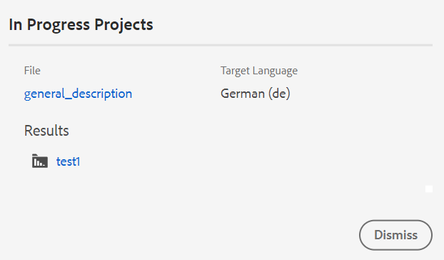

# Traduzir documentos no Console do Mapa {#id21BKF0Z0YZF}

>[!TIP]
>
> É recomendável usar esse recurso de tradução do editor se você tiver atualizado para a versão do Adobe Experience Manager Guides as a Cloud Service de fevereiro de 2022 ou posterior.

O Experience Manager Guides vem com um recurso poderoso no Editor que permite traduzir o conteúdo para vários idiomas. Você pode criar um novo projeto de tradução e depois adicionar os trabalhos de tradução ao projeto de tradução existente. Você também pode criar um projeto de tradução em vários idiomas que inclua trabalhos de tradução para todos os idiomas selecionados.

>[!NOTE]
>
> O administrador pode configurar a guia Gerenciar \(usada para tradução\) no Editor. Para obter mais detalhes, consulte *Configurar o recurso de tradução na seção Editor* em Instalar e configurar o Adobe Experience Manager Guides as a Cloud Service.

## Antes de começar

Antes de executar etapas neste procedimento, verifique se você criou a raiz de idioma e as pastas de destino necessárias

1. Crie uma pasta raiz para armazenar o conteúdo de origem. A pasta raiz deve ser criada com o nome de idioma \(como inglês\) ou o código de idioma \(en\).
1. Crie as pastas de destino para as quais deseja traduzir o conteúdo. Por exemplo, se você quiser traduzir seu conteúdo para alemão ou francês, crie uma pasta chamada -de \(para alemão\) ou -fr \(para francês\).

>[!NOTE]
>
> A pasta raiz e as pastas de destino devem ser criadas no mesmo nível.

## Criar um novo projeto de tradução

1. No painel **Repositório**, abra o arquivo de mapa DITA no Modo de Exibição de Mapa.
1. Selecione o ícone **Abrir no console de mapa**.
1. Na página do console Mapa, navegue até a guia **Tradução**. O **painel Tradução** exibe os grupos de idiomas disponíveis.

1. Como usuário, você pode exibir os grupos de idiomas configurados para o perfil da pasta. Os grupos de idiomas exibem as pastas de idiomas junto com seus códigos de idioma. Por exemplo, o grupo de idiomas denominado G1 contém as pastas de idiomas \(it\), Alemão \(de\), Francês \(fr\) e Inglês \(en\).

   {width="300" align="left"}

   *Selecione os grupos de idiomas ou idiomas nos quais você deseja traduzir os documentos.*

   >[!IMPORTANT]
   >
   > Você só pode selecionar e traduzir para os idiomas para os quais criou a pasta de destino paralelamente ao idioma de origem. Uma pasta de idioma criada em qualquer outro nível, como um nível abaixo da pasta de idioma de origem, também não é exibida. Crie todas as pastas de idioma de destino no mesmo nível que a pasta de idioma de origem.

1. Você pode selecionar qualquer grupo de idiomas como destino para a tradução. Se você **Selecionar tudo**, os arquivos selecionados serão traduzidos para todos os idiomas disponíveis nos grupos de idiomas existentes.

   A opção de pasta de idioma aparece esmaecida e mostra um sinal de aviso:

   - Se a pasta de destino de um idioma estiver ausente.
   - Se o idioma de destino for o mesmo do idioma de origem.

   >[!NOTE]
   >
   > Se você criar a pasta de destino para um idioma depois de criar o grupo de idiomas, atualize o navegador para habilitar o idioma nos grupos de idiomas.

1. Se você escolher um idioma específico, ele será exibido como selecionado em todos os grupos de idiomas selecionados. Então, quando você traduz para qualquer idioma, ela é traduzida de uma só vez para todos os grupos de idiomas. Por exemplo, se o alemão estiver presente nos grupos de idiomas G1 e G2, ele será selecionado para ambos.

1. Em **Outros idiomas**, você pode escolher qualquer idioma para o qual tenha criado a pasta de destino, mas que não faça parte de nenhum grupo de idiomas.

1. Você também pode selecionar uma das seguintes opções para traduzir o projeto:

   **Nenhum** Selecione esta opção para traduzir as versões padrão dos arquivos. Essa opção é selecionada por padrão.

   **Usar Linha de Base:** Você pode selecionar uma linha de base para traduzir seu projeto. Selecione **Usar Linha de Base** e escolha uma linha de base criada no mapa. Todos os arquivos que fazem parte da Linha de base selecionada são mostrados na página Tradução. Depois que o conteúdo for traduzido, você poderá exportar a Linha de base traduzida. Para obter mais detalhes sobre como exportar a Linha de Base traduzida, exiba [Exportar Linha de Base traduzida](generate-output-use-baseline-for-publishing.md#id196SE600GHS).

   **Usar Versão Mais Recente como em**: escolha filtrar a versão dos tópicos com base na data e hora de sua criação. Quando você seleciona uma data e hora, somente a versão mais recente dos arquivos criados na data e hora selecionadas ou antes dela é exibida.

1. Selecione **Aplicar**. Uma lista com detalhes de tópicos e ativos associados é exibida.
1. Selecione os tópicos que deseja enviar para tradução. Você também pode usar as opções de filtragem de tópico para as seguintes colunas:

   - **Título**: título do arquivo de origem.  Passe o mouse sobre o título do arquivo de origem para exibir o título do arquivo de destino ou traduzido.
   - **Nome do Arquivo**: Nome do arquivo de origem
   - **Tipo de Arquivo**: Tipo do arquivo de origem. As opções disponíveis são Mapa, Tópico e Imagem.
   - **Tipo de Referência**: Referências diretas ou indiretas
   - **Versão**: número da versão do arquivo de origem
   - **Rótulo da Versão**: Rótulo para a versão selecionada do arquivo de origem
   - **Versão de Destino**: número da versão do arquivo de destino
   - **Estado do Documento**: estado do arquivo de origem. As opções disponíveis são Rascunho, Em revisão e Revisado.
   - **Idioma de Destino**: O idioma para o qual você deseja traduzir o arquivo de origem
   - **Status da tradução**: as opções disponíveis são: Fora de sincronização, Cópia ausente, Em andamento e Em sincronia.
   - **Rótulo de Destino**: rótulo para a versão selecionada do arquivo de destino
1. Selecione **Enviar para tradução** no canto superior direito.

   {align="left"}

1. Na lista suspensa, selecione **Criar um novo projeto de tradução**.

   {width="350" align="left"}

   Além de um novo projeto de tradução, você também pode selecionar as seguintes opções:

   - Você pode optar por **Criar estrutura somente** para o projeto de tradução.
   - Você pode optar por **Criar um novo projeto de tradução XLIFF** para converter o conteúdo XML no XLIFF (XML Localization Interchange File Format). XLIFF é um formato aberto baseado em XML usado para padronizar a transferência de dados entre várias ferramentas usadas no processo de tradução de conteúdo. O Experience Manager Guides é compatível com a versão 1.2 do XLIFF.
Em um projeto XLIFF, o conteúdo é exportado para o formato XLIFF padrão do setor, que pode ser fornecido para fornecedores de tradução. O formato XLIFF permite a potencial reutilização de segmentos que você já traduziu durante a fase de tradução.\
     Após a tradução do conteúdo XLIFF, ele pode ser importado para o Experience Manager Guides, criando uma versão traduzida do projeto DITA original.

   >[!NOTE]
   >
   > A exportação XLIFF funciona somente com a configuração de tradução humana.

   - Você pode selecionar **Criar um novo projeto de tradução multilíngue**, que incluirá trabalhos de tradução para todos os idiomas selecionados para tradução. Por exemplo, se você tiver selecionado francês, alemão e espanhol, ele criará um projeto que contém trabalhos de tradução para os três idiomas.
   - Se você já tiver um projeto de tradução, poderá adicionar tópicos a esse projeto. Selecione a opção **Adicionar ao projeto de tradução existente** na lista Projeto e escolha um projeto na lista Projeto de tradução existente. Você pode classificar esses projetos por ordem mais recente, crescente ou decrescente.

   - Se você selecionar **Adicionar ao projeto de tradução existente**, essa operação atualizará a entrada do ativo existente no projeto se o ativo já estiver adicionado e o estado do trabalho de tradução relacionado estiver no estado *Rascunho*.
      - Se o idioma de destino não estiver presente no projeto, um novo projeto será criado para o projeto de tradução em um único idioma e um novo trabalho será criado para o projeto de tradução em vários idiomas.

      - Se o trabalho já estiver presente para o idioma de destino e o status do trabalho não estiver no estado *Rascunho*, um novo trabalho será criado no mesmo projeto para adicionar os ativos para tradução.

   >[!NOTE]
   >
   > Se o projeto existente for um projeto de escopo, &quot;\(Scoping\)&quot; será anexado ao nome.

   - Se precisar criar o escopo para que um projeto seja traduzido, você pode selecionar **Criar um novo projeto de tradução de escopo**. Isso não enviará as cópias para tradução e o status original da tradução dos arquivos será mantido. Não há impacto na cópia do idioma de destino dos tópicos referenciados enviados para definição do escopo.

1. No campo **Título do projeto**, informe um título para o projeto.
1. Selecione **Enviar** para criar um novo projeto de tradução.

Um novo projeto de tradução é criado com a versão selecionada dos tópicos. No momento, uma mensagem pop-up é exibida confirmando que o projeto de tradução foi criado. Quando todas as cópias de idioma de destino estiverem disponíveis no projeto de tradução, você receberá uma notificação na Caixa de entrada. Depois que as cópias de idioma de destino estiverem disponíveis no projeto de tradução, você poderá continuar e iniciar o trabalho de tradução. Para exibição de detalhes, [Inicie o trabalho de tradução](translation-first-time.md#id225IK030OE8).

>[!NOTE]
>
> Se você rejeitar a tradução de um ou mais tópicos em um trabalho de tradução, o status de tradução **Em andamento** de todos os tópicos rejeitados será revertido para seu status original. O status dos tópicos referenciados é verificado e revertido de acordo com o estado de tradução mais recente. Além disso, os arquivos de tradução criados no projeto de destino não são excluídos, mesmo que a tradução seja rejeitada para eles.

## Adicionar as regras de tradução

O Experience Manager Guides permite que os administradores configurem as regras de tradução. O formato SRX (Segmentation Rules eXchange) é um padrão para a troca de regras de segmentação entre usuários diferentes e ambientes de tradução diferentes. Você pode criar uma pasta e adicionar seus arquivos SRX personalizados a ela.

Arquivos SRX devem ser nomeados como `<language-code>.srx`. Por exemplo, en-US ou ar-AE.

>[!NOTE]
> 
> O título não diferencia maiúsculas de minúsculas, portanto, você pode ter &quot;en-US&quot;, &quot;en-us&quot; ou &quot;EN-us&quot;. Além disso, o Experience Manager Guides pode resolver &#39;-&#39; (hífen) ou &#39;_&#39; (sublinhado). Então, você pode ter &quot;en-US&quot; ou &quot;en_US&quot;.

Além disso, você pode colocar esses arquivos dentro de qualquer pasta na raiz dos ativos do Adobe Experience Manager que é `./content/dam`.

Depois de criar a pasta que contém os arquivos SRX, você pode adicionar o caminho da pasta na configuração do local SRX de tradução dentro do perfil da pasta.

Recomenda-se que, para um melhor desempenho, você mantenha somente arquivos SRX na pasta configurada no perfil da pasta.

O Experience Manager Guides escolhe as regras SRX de acordo com o idioma de origem do projeto de tradução. Ele procura um arquivo SRX personalizado para um idioma e, se você não definir um arquivo SRX personalizado, ele escolhe as regras de acordo com as regras de tradução prontas para uso.

Para obter detalhes sobre como configurar perfis globais e de nível de pasta, consulte a seção *Configurar modelos de criação* em Instalar e configurar o Adobe Experience Manager Guides as a Cloud Service.

## Passar o rótulo da versão para a versão de destino

O Experience Manager Guides permite passar o rótulo do arquivo de origem para o arquivo de destino. Isso ajudará você a identificar facilmente a versão de origem do arquivo traduzido.

Para adicionar o rótulo da versão de origem na cópia de destino, o administrador do sistema deve habilitar a opção **Propagar rótulos da versão de origem para a versão de destino** na guia **Tradução** em **Configurações do Workspace** (exibidas como **Configurações** para **No local**).

Por exemplo, se você tiver alguns arquivos de origem com o rótulo da versão `Release 1.0` aplicado a eles, você também poderá passar o rótulo de origem \(`Release 1.0`\) para o arquivo traduzido.

{width="650" align="left"}

>[!NOTE]
>
> O rótulo de origem é anexado somente a uma versão de destino. Se você mover o rótulo de origem para outra versão, ele será refletido automaticamente no rótulo de destino mais recente.

## Visualizar diferença de versão para arquivos fora de sincronização 

O Experience Manager Guides fornece o recurso para verificar as diferenças entre a versão selecionada e a última versão de origem traduzida dos tópicos. Você pode optar por traduzir os arquivos **Fora de sincronização** com base nas alterações feitas.

{width="650" align="left"}

Selecione o ícone **Mostrar diferença**\(\) de um tópico para exibir as diferenças entre a última versão traduzida e a versão atual do arquivo selecionado.

>[!NOTE]
>
> **O ícone Mostrar diferença** \(\) aparece somente para arquivos DITA que têm o status de tradução como **Fora de Sincronia**.

A caixa de diálogo **Diferença de Versão** é exibida. Ela mostra o número da **Última versão traduzida** e da **Versão selecionada** à esquerda. A janela de visualização exibe as diferenças entre a última versão traduzida e a versão selecionada do tópico.

{width="650" align="left"}

## Ignorar ativos fora de sincronia

Se você fizer alterações em alguns dos ativos, esses ativos ficarão fora de sincronia. Você pode traduzir novamente os ativos modificados ou optar por descartar o status Fora de sincronização. Por exemplo, se você tiver feito algumas alterações muito pequenas que realmente não precisam de uma tradução, poderá marcar o status delas como Em sincronia.

Para descartar o status Fora de sincronização, execute as seguintes etapas:

1. Selecione os ativos fora de sincronização para os quais deseja alterar o status.
1. Selecione o botão **Marcar como Sincronizado** \(\) acima. A caixa de diálogo **Marcar na Sincronização** é exibida.

   {width="550" align="left"}

1. Selecione **Forçar sincronização**. Ele define o status como Em sincronia para os ativos Fora de sincronia selecionados.

>[!NOTE]
>
> O botão **Marcar como Sincronizado** \(\) aparece somente para ativos que têm o status de tradução como Fora de Sincronia.

## Exibir projetos de tradução em andamento para um mapa ou tópico

Algumas das referências no painel de tradução podem estar com o status em andamento. Essas referências têm um link **Em andamento** na coluna **Status da tradução**. Ao selecionar o link, a caixa de diálogo **Projetos em andamento** é aberta. Na caixa de diálogo, é possível visualizar a lista de todos os projetos de tradução em andamento \(juntamente com o idioma de destino\) que contêm a referência selecionada.

>[!NOTE]
>
> Você pode visualizar o link Em andamento para os projetos traduzidos criados na versão de fevereiro de 2023 ou posterior do Adobe Experience Manager Guides as a Cloud Service.

Selecione o nome da referência na caixa de diálogo para abri-la no modo de visualização. Também é possível selecionar o projeto de tradução para iniciar a tradução.

{width="550" align="left"}

## Excluir ou desabilitar automaticamente um projeto de tradução concluído

>[!NOTE]
> 
>Esse recurso está disponível para os novos projetos de tradução criados usando a versão 2404 ou posterior do Experience Manager Guides.  Isso não afetará nenhum projeto existente.

O administrador pode configurar a opção **Limpeza do projeto de tradução após a conclusão** na guia **Tradução** das **Configurações do Workspace** (exibidas como **Configurações** para **No local**) para desabilitar ou excluir os projetos de tradução automaticamente.

Para afetar o gerenciamento de documentos, o Experience Manager Guides fornece a capacidade de excluir os projetos de tradução depois que você conclui a tradução.

Você também pode desativar os projetos de tradução se desejar usá-los posteriormente. A exclusão de um projeto exclui todos os arquivos e pastas presentes no projeto. Desativar um projeto não o exclui, mas o mantém no repositório. Mas você não pode atualizar ou editar um projeto desativado.  A exclusão ou desativação de um projeto não afetará o status de tradução de nenhuma referência.

**Tópico pai:**[ Introdução ao Editor](web-editor.md)
