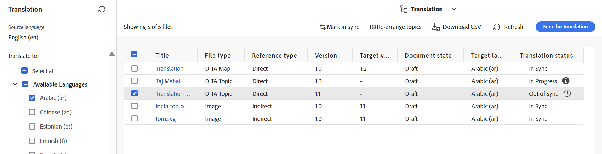

# Traduzir tópicos modificados {#id16A5A0B6072}

Se você fizer alterações em alguns dos tópicos, elas exigirão uma nova tradução. Você pode rastrear os tópicos modificados no mapa DITA. Na pasta de cópia do idioma de origem, selecione o arquivo de mapa DITA no Console de mapas e selecione a guia Tradução. Você pode visualizar o status de cada tópico, independentemente de ele exigir nova tradução ou não.

Execute as seguintes etapas para enviar um tópico modificado para nova tradução:

1. Selecione o arquivo de mapa DITA na pasta de cópia do idioma de origem no **Console do Mapa** no Editor.

1. Selecione a guia **Tradução**.

1. No painel **Tradução** à esquerda, selecione os **Idiomas Disponíveis** cujo status você deseja verificar e selecione **Aplicar**.

   É possível exibir o status da tradução de cada tópico. Os tópicos que têm outra revisão de tópico disponível diferente da que foi enviada para tradução mostram um status **Fora de sincronização**.

   >[!NOTE]
   >
   > O fluxo de trabalho de tradução compara a última revisão salva do arquivo de tópico na pasta de idioma de origem com a versão traduzida.

   Se você selecionar a seta para exibir mais detalhes, poderá exibir a cópia de idioma específica que está fora de sincronia.

   {align="left"}

1. Marque a caixa de seleção para selecionar os tópicos que deseja enviar para nova tradução.

   Quando você seleciona um tópico fora de sincronia, o botão **Marcar em Sincronização** é exibido acima da barra de título.

   Você pode usar o botão **Marcar em Sincronia** para substituir o status Fora de Sincronia dos tópicos no mapa DITA.  Por exemplo, se você tiver feito algumas alterações muito pequenas que realmente não precisam de uma tradução, poderá marcar o status delas como Em sincronia.

   >[!NOTE]
   >
   > Se você selecionar o botão **Marcar em Sincronia**, ele definirá o status do tópico como Em Sincronia para os tópicos fora de sincronia selecionados.

1. Você pode selecionar o **botão Enviar para tradução**.

1. Você pode optar por criar um novo projeto de tradução ou adicionar tópicos a um projeto de tradução existente. Forneça os detalhes necessários para configurar o projeto de tradução.

1. Selecione **Enviar**.

   Uma mensagem de confirmação é exibida mostrando que o tópico foi enviado para tradução.

1. Navegue até o projeto de tradução no console Projeto. Um novo cartão de tarefa de tradução é criado na pasta. Selecione as reticências para visualizar os ativos da pasta.

   {width="300" align="left"}

1. Para iniciar a tradução, selecione a seta no cartão de trabalho de tradução e selecione **Iniciar** na lista. Uma mensagem notifica que o trabalho foi iniciado.

   Você também pode visualizar o status do tópico que está sendo traduzido ao selecionar as reticências na parte inferior do cartão de tarefa de tradução.

   >[!NOTE]
   >
   > Se você estiver usando o serviço de tradução humana, será necessário exportar o conteúdo para tradução. Depois de ter o conteúdo traduzido, é necessário importá-lo de volta para o projeto de tradução.

1. Após a conclusão da tradução, o status muda para **Pronto para Revisão**. Selecione as reticências para exibir os detalhes do tópico e siga um destes procedimentos na barra de ferramentas:

   - Selecione **Revelar no Assets** para exibir e verificar a tradução.

   - Selecione **Aceitar tradução** se achar que as alterações foram traduzidas corretamente. Uma mensagem de confirmação é exibida.

   - Selecione **Rejeitar tradução** se achar que o trabalho precisa ser refeito. Uma mensagem de rejeição é exibida.

   >[!NOTE]
   >
   > É importante aceitar ou rejeitar o ativo traduzido, caso contrário, o arquivo permanecerá no local temporário e não será copiado para o DAM.

1. Volte para o arquivo de mapa DITA na pasta de idioma de origem na interface do Assets. Os tópicos retraduzidos agora estão em sincronia.

**Tópico principal:**&#x200B;[&#x200B; Visão geral da tradução de conteúdo](translation.md)
