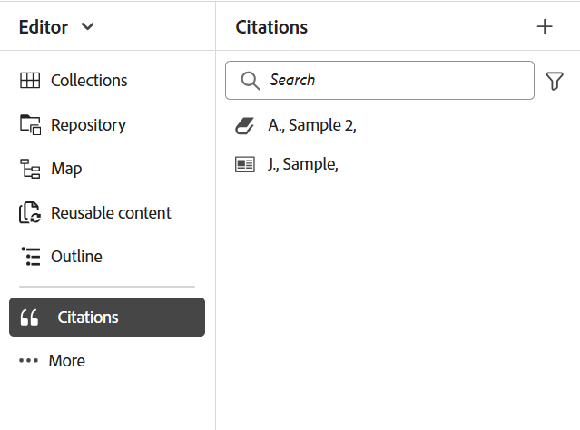
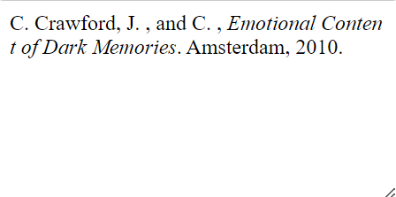
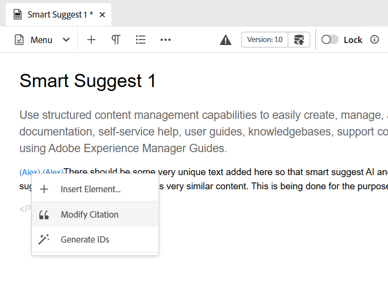

# Adicionar e gerenciar citações no seu conteúdo

Citações são referências à fonte de informações adicionada ao conteúdo. Usando citações, você pode creditar os autores das informações de origem e ajudar os leitores a acompanhar as informações de origem. Adicionar citações torna seu conteúdo mais confiável e evita plágios. Eles também permitem exibir conteúdo bem pesquisado.

No Adobe Experience Manager Guides, você pode adicionar e importar citações e aplicá-las ao seu conteúdo. É possível adicionar essas citações de qualquer fonte de livros, sites e diários.

O Experience Manager Guides ajuda a editar, visualizar e classificar as citações. Depois de adicionar suas citações ao conteúdo, você pode gerar a saída usando o PDF nativo. Você também pode adicionar a página de bibliografia ou referências na saída do PDF nativo.

O Experience Manager Guides suporta vários estilos de citações, como a Modern Language Association (MLA), American Psychological Association (APA), Chicago, Institute for Electrical and Electronics Engineers (IEEE) e American Heart Association (AHA). A recomendação é usá-los de forma clara e consistente.

>[!NOTE]
>
>Atualmente, o Experience Manager Guides só oferece suporte ao PDF nativo para citações.

## Adicionar citações

Para adicionar citações, siga estas etapas:

1. Selecione o ícone **Citações**  no painel esquerdo.

   O painel **Citações** é aberto.

   {width="350" align="left"}

1. No painel **Citações**, selecione . Na lista suspensa, é possível optar por adicionar uma nova citação ou importar uma citação.

1. Selecione **Nova citação** para adicionar uma nova citação.

   A caixa de diálogo **Adicionar Citação** é aberta.

    {width="300" align="left"}

1. Preencha os campos na caixa de diálogo **Adicionar Citação**.

   >[!NOTE]
   >
   >Você também pode adicionar o ISBN, DOI ou PubMed ID. O AEM Guides preenche os outros campos automaticamente.

   | Livro | Site | Diário |
   | --- | ---|---|
   | **Source**   No menu suspenso, selecione a origem da citação como um Livro. | **Source**  No menu suspenso, selecione a origem da citação como um Site. | **Source**   No menu suspenso, selecione a origem da citação como um Diário. |
   | **Pesquisar por**   Selecione **ISBN** ou **DOI** no menu suspenso para procurar a identificação digital vinculada à citação.    DOI: Identificador de Objeto Digital   ISBN: Identificador de Livro Numérico Exclusivo | **Pesquisar por**   Selecione **DOI** no menu suspenso para procurar a identificação digital vinculada à citação. | **Pesquisar por**   Selecione **DOI** ou PubMed ID no menu suspenso para procurar a ID digital vinculada à citação.      |
   | **Autor**   Adicione o nome e o sobrenome do autor da citação. Selecione  para adicionar mais nomes. | **Autor**   Adicione o nome e o sobrenome do autor da citação. Selecione  para adicionar mais nomes. | **Autor**   Adicione o nome e o sobrenome do autor da citação. Selecione  para adicionar mais nomes. |
   | **Título**   Adicione o título do livro. | **Título**   Adicione o título da página da Web. | **Título**   Adicione o título do artigo. |
   | **Editor**   Adicione o editor do livro. | **Nome do Site**   Adicione o nome do site. | **Título do diário**   Adicione o título do trabalho no qual o artigo é encontrado. |
   | **Edição**   Adicione a edição do livro. | **URL**   Adicione o link da Web do site para navegar pelo conteúdo. | **Ano**   Adicione o ano em que o artigo é publicado. |
   | **Cidade**   Adicione a cidade da publicação. | **Data de acesso**  Adicione a data em que o conteúdo do site é acessado. | **Volume**   Adicione o volume do trabalho na série. |
   | **Editor**   Adicione o nome do editor do livro. | **Data de publicação**   Adicione a data em que o conteúdo do site será publicado. | **Número**   Adicione o número do volume dentro da série. |
   | **Ano**   Adicione o ano em que o livro é publicado. | **Data de atualização**   Adicione a data em que o conteúdo do site é atualizado. | **Páginas**   Adicione o número da página ou o intervalo de páginas no qual o artigo é encontrado. |
   | **Versão**   Adicione a versão do livro. | **Identificador exclusivo**   Adicione um identificador exclusivo para a citação. Um identificador exclusivo é um identificador exclusivo para essa citação. | **URL**  Adicionar o link da Web ao diário. |
   | **Série**  Adicione a série do livro. |  | **Identificador exclusivo**   Adicione um identificador exclusivo para a citação. Um Identificador exclusivo é um identificador exclusivo para essa citação. |
   | **URL**   Adicione o link da Web ao livro. |
   | **Identificador exclusivo**   Adicione um identificador exclusivo para a citação. Um identificador exclusivo é um identificador exclusivo para essa citação. |

1. Selecione **Concluído**.

   Uma nova citação é adicionada ao painel Citação.

>[!NOTE]
>
> É obrigatório adicionar um identificador exclusivo para o campo de citação.  Não é possível alterar o identificador exclusivo depois que a citação é adicionada.

## Importar citações

Para importar citações, siga estas etapas:

1. No painel esquerdo, selecione **Citações** .

   O painel **Citações** é aberto.

1. No painel **Citações**, selecione  e selecione **Importar** na lista suspensa.
1. Procure um arquivo .bib em seu sistema e importe-o.

   >[!TIP]
   >
   > Uma extensão de arquivo .bib é um arquivo de banco de dados bibliográfico BibTeX. É um arquivo de texto especialmente formatado que lista referências sobre uma determinada fonte de informação.

   Depois que o arquivo for importado com êxito, você poderá exibir as referências no painel de citações.

   >[!NOTE]
   > <ol><li> O Experience Manager Guides importa somente as citações que são exclusivas e que ainda não estão presentes.
   > &gt; <li> O Experience Manager Guides pode importar citações de um Livro, Diário ou Site. Atualmente, não aceita citações de outras fontes.

## Gerenciar citações

As citações são classificadas alfabeticamente no painel esquerdo. Pesquise as citações de acordo com as fontes a serem usadas no tópico.

### Filtro

Selecione o ícone **Filtrar**  ao lado da barra de pesquisa e selecione as opções de origem no menu suspenso para filtrar a lista de citações. Permite seleções únicas e múltiplas.

* **Todas as Fontes**: mostra uma lista completa de citações, incluindo todas as fontes.

* **Livro**: mostra a lista de citações originadas de livros.

* **Site**: mostra a lista de citações originadas de sites.

* **Diário**: mostra a lista de citações originadas de diários.

### Pesquisar

Pesquisar o conteúdo na citação.

1. No painel esquerdo, selecione Citações.
O painel **Citações** é aberto.

1. Use a barra de pesquisa para procurar a citação apropriada em uma lista longa.

### Alterar estilo de citação {#change-citation-style}

O administrador do sistema pode alterar o estilo das citações na lista suspensa **Citações** da guia **Geral**, em **Configurações**.
Esses estilos determinam como as citações aparecem no painel de visualização ou na saída do PDF nativo.

As seguintes opções estão disponíveis na lista suspensa:

| MLA | APA | Chicago | IEEE | AHA |
|---|---|---|---|---|
| Estilo de Associação de Idioma Moderno   | American Psychological Association Estilo | Manual de estilo de Chicago | Estilo do Instituto de Engenheiros Elétricos e Eletrônicos | Estilo American Heart Association |
| Exemplo:  Crawford, Claire, et al. *Conteúdo emocional de memórias escuras*.Editado por Memória, vol 16, 2010, Amsterdã. | Exemplo:   Crawford, C., J., &amp; , C. (2010). *Conteúdo emocional de memórias escuras* (505-16 ed.). 10.1080/ 09658210902067289 | Exemplo:   Crawford, Claire, et al. *Conteúdo emocional das memórias escuras*. 505-16, 2010. | Exemplo:   C. Crawford, J. , e C. , *Conteúdo emocional das memórias escuras*. Amsterdam, 2010. | Exemplo:   C. Crawford, J. , e C. , *Conteúdo emocional das memórias escuras*. Amsterdam, 2010. |

## Editar uma citação

Para editar a citação, siga estas etapas:

1. Passe o mouse sobre o nome da citação na lista. Selecione  o ícone **Opções**.

1. Selecione **Editar**.

A caixa de diálogo **Editar Citação** é aberta.

1. Faça as alterações necessárias. Selecione **Concluído**.
A citação selecionada é editada.

>[!NOTE]
>
>Não é possível alterar o identificador exclusivo depois que a citação é adicionada.

## Visualizar uma citação

Para visualizar uma citação, siga estas etapas:

Passe o mouse sobre o nome da citação na lista. Selecionar     Ícone  **Opções**.

1. Selecione **Visualizar**.
Você pode visualizar o conteúdo e o formato da citação no painel de visualização.

   >[!NOTE]
   >
   >A visualização é baseada no estilo de citação selecionado pelo administrador nas **Configurações**.

1. Selecione qualquer lugar na tela para fechar a caixa de visualização.

   {width="550" align="left"}

>[!NOTE]
>
> Você também pode visualizar uma citação inserida em um tópico da interface do usuário do Assets ou da guia Preview do Editor.

## Inserir citações

Execute as seguintes etapas para inserir citações a um tópico:
1. Selecione o tópico no painel do repositório e clique duas vezes nele para abri-lo na janela de edição.
1. Coloque o cursor no local do tópico onde deseja adicionar a citação.

É possível inserir citações ao tópico a partir da barra de ferramentas principal ou do painel esquerdo.

### Na barra de ferramentas principal

1. Selecione o ícone **Citations**  na barra de ferramentas principal.
1. Na caixa de diálogo **Citações**, escolha a citação. Também é possível selecionar várias citações.
   {width="300" align="left"}
1. Você pode filtrar citações digitando os primeiros alfabetos no painel de pesquisa da caixa de diálogo **Citação**.

1. Selecione **Concluído**.
A citação selecionada é adicionada no local do cursor em seu tópico.

### No painel esquerdo

>[!NOTE]
> 
>Para exibir o ícone **Citações** no painel esquerdo, o administrador do sistema deve habilitar a opção **Citações** na guia **Painéis** das **Configurações**.

1. Selecione o ícone **Citações**  no painel esquerdo.
1. Arraste a citação do painel **Citações** e solte-a no local apropriado no tópico.

   Você também pode selecionar **Inserir** de  **Opções** para inserir uma citação.

   
1. Para selecionar várias citações, clique com o botão direito do mouse em uma citação no tópico e selecione **Modificar Citação** no menu de atalho.
1. Selecione as citações que deseja inserir na caixa de diálogo **Citação**.
1. Selecione **Concluído** para adicioná-los ao tópico.

Depois de inserir citações no tópico, você pode visualizá-las no Editor da Web. Você também pode publicar conteúdo com citações usando o PDF nativo.

## Excluir uma citação

É possível excluir citações do painel Citações ou de um tópico em que você inseriu citações.

### Excluir uma citação do painel Citações

Para excluir uma citação do painel Citações, siga estas etapas:

1. Passe o mouse sobre o nome da citação na lista.
1. Selecione o ícone  **Opções**.
1. Selecione o   **Excluir** .
A caixa de diálogo de confirmação é aberta.
1. Selecione **Sim**.
A citação selecionada é excluída do painel de citações.

### Excluir uma Citação de um Tópico

Para excluir uma citação já usada no tópico, siga estas etapas:

No tópico, coloque o cursor no final da citação.

1. Clique com o botão direito do mouse em uma citação do tópico e selecione **Modificar Citação** no menu de atalho. A caixa de diálogo Citação é aberta.
   

1. Você pode escolher as citações que deseja inserir no documento.

   >[!NOTE]
   >
   >As citações já usadas no tópico são substituídas pelas citações selecionadas na caixa de diálogo.

1. Selecione **Concluído**.

## Gerar saída de conteúdo com citações

Depois de inserir citações no tópico, você pode publicar conteúdo com citações usando o PDF nativo.

Na saída do PDF nativo, as citações aparecem no conteúdo em que você as inseriu. Você também pode criar uma página de Bibliografia. Ao selecionar uma citação, você é redirecionado para a página de bibliografia.

Crie um layout de página **Citações** nos modelos do PDF e inclua-o no documento. Todas as citações usadas no livro são listadas em uma página que aparece na saída do PDF. Para saber mais sobre como criar um layout de página, exiba [Criar um layout de página](../native-pdf/components-pdf-template.md#create-page-layout).

Para alterar a exibição da página de citação, exiba [Personalizar modelos do PDF](../native-pdf/pdf-template.md).

### Aplicar estilo de conteúdo a uma citação

Aplicar formatação à citação quando adicionada ao tópico.

1. Selecione **Folhas de Estilos** no painel **Modelos** de uma predefinição de saída do PDF Nativo.   Ele abre o painel **ESTILOS**, que contém todas as opções de estilo.

1. No painel Pesquisar, procure por `<cite>`.

Para saber mais sobre estilos, exiba [Trabalhar com os estilos de conteúdo comuns](../native-pdf/stylesheet.md).
