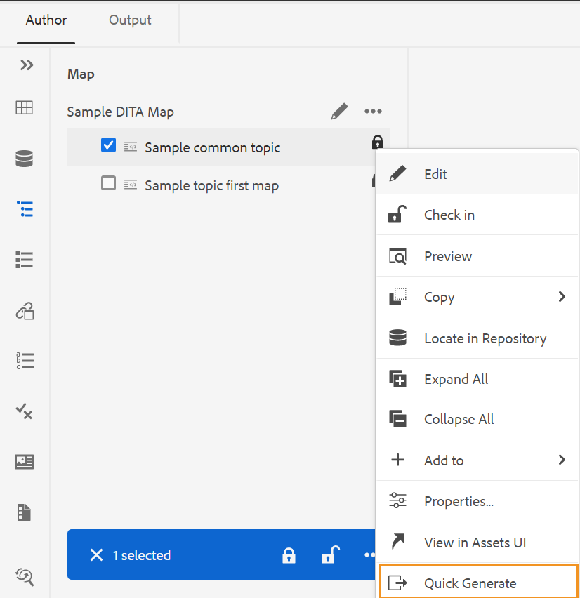
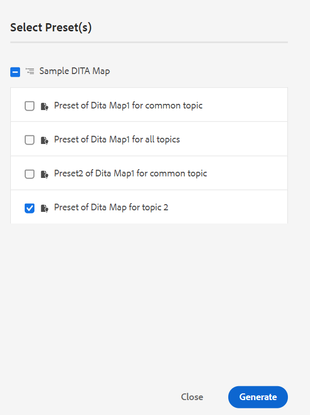

# Gerar saída a partir do painel Repositório ou do painel Exibição de mapa {#id218CL6010AE}

Você também pode usar as predefinições de saída criadas para o mapa DITA para gerar saída a partir do painel Repositório ou do painel Exibição de mapa.

- Use o **Geração rápida** recurso no painel Repositório ou no painel Exibição de mapa para gerar saída para o único tópico selecionado ou para o mapa DITA inteiro.

  >[!NOTE]
  >
  > Você também pode acessar a variável **Geração rápida** no painel Favoritos ou no painel Pesquisar.

- Use o **Gerar saída** recurso no painel Exibição de mapa para gerar a saída para os vários tópicos selecionados.

## Publicar um tópico usado em um ou mais mapas DITA

Execute as seguintes etapas para gerar saída para um ou mais tópicos em seu mapa DITA:

1. No **Autor** selecione o tópico no mapa DITA que deseja publicar.

1. Selecionar **Geração rápida** no menu Opções do tópico selecionado.
   {width="650" align="left"}

1. Para publicar um tópico usado em um único mapa DITA, selecione as predefinições de saída do mapa que deseja usar para publicar e clique em **Gerar**.
   {width="350" align="left"}

1. Você verá o status do processo de geração de saída. Para exibir a saída, passe o mouse sobre o tópico e clique em Exibir saída.

1. Se você tiver um tópico comum que seja usado em vários tópicos, selecione os vários mapas DITA e também as predefinições de saída que deseja usar para publicar e clique em **Gerar.**

   {width="350" align="left"}

1. Você verá o status do processo de geração de saída.

   - **Temas**: lista os tópicos selecionados para os quais a saída está sendo gerada.
   - **Predefinição**: exibe as predefinições de saída que contêm os tópicos selecionados.
   - **Mapa**: lista os mapas DITA que contêm o tópico selecionado.
   - **Status**: exibe o status de publicação de cada tópico.
Para exibir a saída, passe o mouse sobre o tópico e clique em Exibir saída.
     {width="800" align="left"}

## Gerar saída para um mapa DITA do Editor da Web

Execute as seguintes etapas para gerar a saída para todo o mapa DITA:

1. No **Autor** selecione o mapa DITA que deseja publicar.

1. Selecionar **Geração rápida** no menu Opções do mapa DITA.

   {width="650" align="left"}

1. Selecione as predefinições de saída do mapa DITA que deseja usar para publicar e clique em **Gerar.**

1. Você verá o status do processo de geração de saída. Para exibir a saída, passe o mouse sobre o tópico e clique em Exibir saída.

## Gerar saída para mais de um tópico

Execute as seguintes etapas para gerar saída para mais de um tópico no mapa DITA a partir do painel Exibição de mapa:

1. No **Autor** selecione os tópicos que deseja publicar.

1. Selecionar **Gerar saída** no menu Opções na parte inferior.

1. Selecione a predefinição de saída do mapa DITA que deseja usar para publicar.

   >[!NOTE]
   >
   > Você verá apenas as predefinições de saída do mapa DITA atual que contêm todos os tópicos selecionados.

   {width="650" align="left"}

1. Você verá o status do processo de geração de saída. Para exibir a saída, passe o ponteiro do mouse sobre o tópico e clique em Exibir Saída.

**Tópico pai:**[ Publicação baseada em artigos no Editor da Web](web-editor-article-publishing.md)
