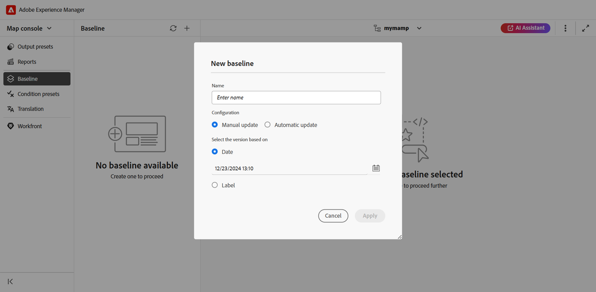

# Criar e gerenciar linhas de base do console de Mapa {#id223MB0ZF043}

O recurso Linha de base permite criar uma versão dos tópicos e ativos que podem ser usados para publicação ou tradução. Por exemplo, se o seu mapa DITA tem `topicA` e `imageA`, você pode criar uma Linha de Base para usar a 3ª versão do `topicA`, mas a 4ª versão do `ImageA`. Depois de ter uma Linha de base em vigor, você poderá publicar ou traduzir tópicos de diferentes versões em uma única etapa.

A seleção de uma Linha de base é opcional para predefinições de saída e um mapa DITA pode ter mais de uma Linha de base. No entanto, cada predefinição de saída em um mapa DITA pode ser associada a apenas uma única Linha de base. Se nenhuma Linha de base for especificada no momento da publicação, a saída será publicada usando a versão mais recente do conteúdo.

Da mesma forma, selecionar uma Linha de base para traduzir conteúdo é opcional. No entanto, se você optar por traduzir o conteúdo usando uma Linha de base, o conteúdo da Linha de base também será salvo junto com as cópias traduzidas. Em seguida, você pode usar a Linha de base traduzida para executar outras operações, como compartilhá-la com editores externos ou arquivá-la.

>[!TIP]
>
> É recomendável usar esse recurso de Linha de base no console Mapa. No entanto, você também pode [usar o painel de mapa para criar e gerenciar linhas de base](./generate-output-use-baseline-for-publishing.md).

Na guia **Linha de Base**, você pode executar as seguintes ações:

- [Criar uma Linha de Base](#create-a-baseline)
- [Gerenciar Linhas de Base](#manage-baselines)

## Criar uma Linha de Base

Você pode criar uma linha de base no console Mapa executando as seguintes etapas:

1. [Abra o arquivo de mapa DITA no Console de mapa](./open-files-map-console.md).
1. Navegue até a guia **Linha de base** e selecione o ícone + na parte superior direita para começar a criar uma linha de base.
1. Na caixa de diálogo **Nova linha de base**, forneça os seguintes detalhes:

   {width="500" align="left"}

   - Insira um nome para a linha de base no campo **Nome**.
   - Em **Configuração**, escolha [Atualização manual](#configuring-baseline-for-manual-update) ou [Atualização automática](#configuring-baseline-for-automatic-update).
   - Selecione **Aplicar**.

A linha de base é criada. A criação da linha de base ocorre de forma assíncrona, para que você possa continuar trabalhando em outros arquivos. Depois que a linha de base é criada, uma mensagem pop-up é exibida confirmando que a linha de base foi criada, e você também recebe uma notificação da Caixa de entrada para a mesma linha.

### Configuração da linha de base para atualização manual

Você pode criar manualmente uma linha de base estática com uma versão específica dos tópicos e conteúdo referenciado disponível em uma data e hora específicas, ou com um rótulo definido para uma versão dos tópicos:

Em **Selecionar a versão baseada em,**, selecione uma das seguintes opções:

- **Data** : escolhe a versão dos tópicos como na data e hora especificadas.
- **Rótulo**: selecione esta opção para escolher os tópicos de acordo com o rótulo aplicado a eles. Se os tópicos tiverem rótulos especificados para eles, eles serão listados na lista suspensa. Você pode escolher um rótulo na lista. Também é possível adicionar um rótulo na caixa de texto.

  >[!NOTE]
  >
  > Ao escolher rótulos, o carregador de rótulos permanece visível até que todos os rótulos tenham sido buscados com sucesso e totalmente carregados. Depois de carregados, os rótulos são exibidos em uma ordem alfabética que não diferencia maiúsculas de minúsculas. Eles são recuperados em lotes de 20, com rolagem infinita ativada na lista suspensa para carregar lotes adicionais à medida que você rolar a tela.

  Para as referências diretas em linhas de base estáticas, os rótulos são extraídos da versão salva mais recente do mapa. Por exemplo, se você tiver criado os rótulos `Label Release 1.0` e `Label Release 1.1` para as versões 1.0 e 1.1 do Tópico A e, em seguida, adicionar o Tópico A ao mapa salvo como versão 1.0. Nesse caso, você pode visualizar os rótulos `Label Release 1.0` e `Label Release 1.1` na lista suspensa de rótulos de linha de base estáticos.

  Ao selecionar **Rótulo**, você pode escolher as referências diretas e indiretas.
   - Para referências diretas no mapa DITA, você tem a opção de usar a versão mais recente de tópicos que não têm o rótulo especificado aplicado a eles.

     >[!NOTE]
     >
     > Se você inserir um rótulo que não existe e selecionar a opção **Não criar uma linha de base**, ocorrerá uma falha na criação da linha de base e será exibida uma mensagem de erro próxima ao nome da linha de base no painel Linha de Base.

   - Para referências indiretas no mapa DITA, você tem uma opção adicional para usar a versão mais recente de tópicos que não têm o rótulo especificado aplicado. Você também pode optar por **Selecionar automaticamente** para o conteúdo referenciado, e o sistema escolhe automaticamente a versão do conteúdo referenciado correspondente à versão do conteúdo no qual ele é referenciado.

Depois de selecionar um rótulo ou uma versão como na data, todos os tópicos e arquivos de mídia referenciados no mapa são selecionados adequadamente. Essa seleção de tópicos não é exibida na interface do usuário, mas é salva no back-end.

### Configurando Linha de Base para Atualização Automática

Selecione essa opção para que a criação da linha de base escolha automaticamente os tópicos de acordo com o rótulo aplicado a eles.

As linhas de base criadas usando a configuração de atualização automática são atualizadas dinamicamente. Se você gerar uma linha de base, baixar uma linha de base ou criar um projeto de tradução usando uma linha de base, os arquivos serão selecionados dinamicamente com base nos rótulos atualizados. Por exemplo, se você tiver usado a versão 1.2 de um tópico com Rótulo Versão 1.0 para a linha de base e a versão mais recente atualizada 1.5 com Rótulo Versão 1.0, a linha de base será atualizada dinamicamente e a versão 1.5 será usada.

{width="300" align="left"}

- **Rótulos**: se os tópicos tiverem rótulos especificados para eles, use a lista suspensa **Rótulos** para escolher entre os [rótulos listados](#labels-list).

  Os rótulos selecionados primeiro recebem prioridade mais alta sobre os posteriores.

  >[!NOTE]
  >
  >Enquanto os rótulos estão sendo puxados, um carregador é exibido e a lista suspensa é desativada.

  Para linhas de base dinâmicas, os rótulos são extraídos da versão salva mais recente e da cópia de trabalho atual do mapa. Por exemplo, se você tiver criado rótulos   `Label Release A.1.0 ` e `Label Release A.1.1` para as versões 1.0 e 1.1 do Tópico A e rótulos `Label Release B.1.0` e `Label Release B.1.1` para as versões 1.0 e 1.1 do Tópico B. Em seguida, você pode adicionar o Tópico A ao Mapa A na versão 1.0 e o Tópico B ao Mapa A no 1.0* (cópia de trabalho). Nesse caso, você pode exibir `Label Release A.1.0 `, `Label Release A.1.1`, `Label Release B.1.0` e `Label Release B.1.1` na lista suspensa de rótulos de linha de base dinâmicos.
- **Referências indiretas**: para referências indiretas no mapa DITA, você tem as seguintes opções:

   - **Escolher automaticamente**: você pode optar por **Escolher automaticamente** para o conteúdo referenciado, e o sistema escolhe automaticamente a versão do conteúdo referenciado correspondente à versão do conteúdo no qual ele é referenciado.
   - **Usar rótulo selecionado**: você pode criar uma linha de base com o rótulo selecionado definido para uma versão de tópicos.
   - **Usar a versão mais recente ou a cópia de trabalho**: use a versão mais recente dos tópicos que não têm o rótulo especificado aplicado ou, se nenhuma versão tiver sido criada, use a cópia de trabalho dos tópicos para criar a linha de base.

## Gerenciar Linhas de Base

Você pode gerenciar suas linhas de base existentes usando os vários recursos no painel Linha de Base.

- Você pode pesquisar uma linha de base existente usando a caixa de texto no painel Linha de base. Use o ícone **Aplicar Filtro** para mostrar todas as linhas de base ou listar as linhas de base com o status de criação como Bem-sucedido, Em Andamento ou Falha.
- Use o ícone **Atualizar** no painel Linha de Base para verificar novamente todas as linhas de base e exibir uma nova lista de linhas de base para o mapa DITA aberto na Exibição de Mapa.
- Selecione a linha de base para exibir ou editar o conteúdo de uma linha de base estática existente no painel **Linha de Base**. A janela de edição da linha de base exibe o arquivo de mapa DITA, o conteúdo do mapa ou os tópicos e o conteúdo referenciado.

  >[!NOTE]
  >
  >A operação de edição para linhas de base estáticas só é recomendada para um pequeno número de alterações de referência. A operação de edição não é recomendada para alterar a versão do mapa DITA principal, pois deve recalcular todas as referências. Isso pode causar uma falha de atualização de linha de base para mapas DITA grandes. Para os mapas DITA maiores, é possível criar uma nova linha de base ou editar as propriedades da linha de base.
  >
  >Editar operação no caso de linha de base dinâmica permite editar as propriedades da linha de base, pois as referências para linhas de base dinâmicas são geradas no tempo de execução usando os rótulos.

  {width="500" align="left"}

### Ações disponíveis para uma linha de base existente

Você também pode executar as seguintes operações na linha de base a partir do menu Opções:

**Duplicar uma linha de base**

Você pode duplicar uma linha de base e modificá-la de acordo com suas necessidades.

{width="300" align="left"}
*Duplique uma linha de base com base em um rótulo ou crie uma cópia exata.*

1. Selecione **Duplicar** no menu Opções de uma linha de base. A caixa de diálogo **Duplicar linha de base** é aberta.
>[!NOTE]
>
>O nome padrão da linha de base é `<selected baseline name>`_suffix (como sample-baseline_1). Você pode alterar o nome de acordo com suas necessidades.

   Em **Selecionar a versão baseada em**, você pode escolher a opção **Cópia exata** ou a opção **Rótulo**:

   - **Cópia exata**: o Experience Manager Guides escolhe a mesma versão de todos os tópicos e cria uma cópia exata da linha de base duplicada.
   - **Rótulo**: usando a lista suspensa, você pode escolher um dos [rótulos listados](#labels-list). O Experience Manager Guides escolhe essas versões dos tópicos com o rótulo selecionado definido para eles, enquanto para os tópicos restantes, ele escolhe a versão da linha de base duplicada. Por exemplo, você seleciona o rótulo `Release 1.0` na lista suspensa e, em seguida, ele escolhe as versões dos tópicos para os quais você definiu esse rótulo. Para todos os outros tópicos, ele escolhe a versão da linha de base duplicada.
1. Selecione **Duplicar**.

- **Renomear** ou **Excluir** uma linha de base existente**.
- **Gerenciar rótulos** que permitem adicionar, remover ou fazer alterações em rótulos existentes para linhas de base estáticas. Se o administrador tiver configurado rótulos predefinidos, esses rótulos serão exibidos na lista suspensa Adicionar rótulo. Para obter mais informações sobre como adicionar rótulos, exiba [Usar rótulos](web-editor-use-label.md#).

  >[!NOTE]
  >
  > O processo para adicionar ou remover rótulos ocorre de forma assíncrona, para que você possa continuar trabalhando em outros arquivos. Depois que o rótulo é adicionado ou removido, uma mensagem pop-up é exibida confirmando que o rótulo foi adicionado ou removido, e você também recebe uma notificação da Caixa de entrada para o mesmo.

- **Editar propriedades** de uma linha de base estática existente que você definiu ao criar a linha de base.
- A opção **Exportar Linha de Base** exporta um instantâneo da linha de base no arquivo do Microsoft Excel, incluindo todos os detalhes essenciais, como título, nome de arquivo, tipo de arquivo, número da versão, estado do documento e outras informações relevantes.

### Lista de rótulos {#labels-list}

Os rótulos listados na lista suspensa são baseados nos seguintes critérios:
- Os rótulos devem ser adicionados a uma das versões dos tópicos no mapa DITA (no qual a linha de base é criada).
- E somente as referências de primeiro nível (tópicos ou submapas) do mapa DITA são consideradas para a escolha dos rótulos.

## Filtros da linha de base

Usando o ícone Filtros no painel **Filtros da linha de base**, você pode aplicar filtros na linha de base aberta na janela de edição da linha de base:

{width="300" align="left"}

- Filtre os arquivos com base nos nomes ou no local dos arquivos.
- Filtre os arquivos com base nos valores de diferentes colunas, como Tipo de arquivo, Tipo de referência e assim por diante.
- Escolha as colunas a serem exibidas na janela de edição da linha de base.

>[!NOTE]
>
> Você pode selecionar um cabeçalho de coluna e classificar os arquivos com base nas colunas na janela de edição da linha de base.

**Salvar ou Redefinir uma Linha de Base**

Depois de editar a linha de base, selecione **Salvar** para salvar as alterações na linha de base. Você pode selecionar **Redefinir** se não quiser salvar a alteração e redefinir a linha de base. Quando você seleciona **Redefinir**, é exibido um aviso de que as alterações não salvas serão perdidas.

**Tópico pai:**&#x200B;[ Geração de saída](generate-output.md)

