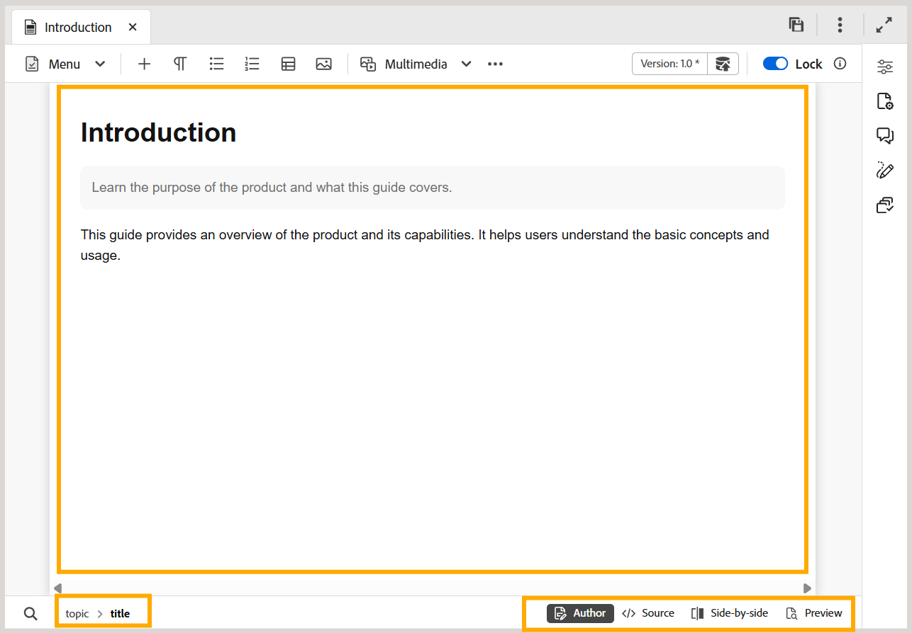

# Área de edição de conteúdo no editor

>[!INFO]
>
> Este tópico se aplica ao Novo editor e ao Editor antigo. Embora a funcionalidade principal permaneça consistente, diferenças na interface do usuário, terminologia e interações são indicadas no conteúdo usando guias e chamadas de retorno, quando aplicável.

A área de edição de conteúdo é onde o conteúdo do tópico ou mapa é exibido. Você faz todas as edições de conteúdo nesta área. Ele fornece uma visualização do WYSIWYG do conteúdo que você está editando.

Na parte inferior esquerda da área de edição de conteúdo, você tem a navegação estrutural do elemento na localização atual do cursor. No canto inferior direito, as visualizações do Editor disponíveis são exibidas.

>[!BEGINTABS]

>[!TAB Novo editor]

>[!TAB Editor Antigo]

>[!ENDTABS]

Para saber mais sobre as exibições do Editor disponíveis para um arquivo de tópico na área de edição de conteúdo, exiba [exibições do Editor](./web-editor-views.md).

>[!NOTE]
>
> Se você estiver trabalhando em um arquivo de mapa, opções ou visualizações diferentes serão exibidas na área de edição de conteúdo. Para obter mais detalhes, consulte [Recursos do editor de mapas](./map-editor-advanced-map-editor.md).

**Tópico pai:**[ Introdução ao Editor](web-editor.md)
