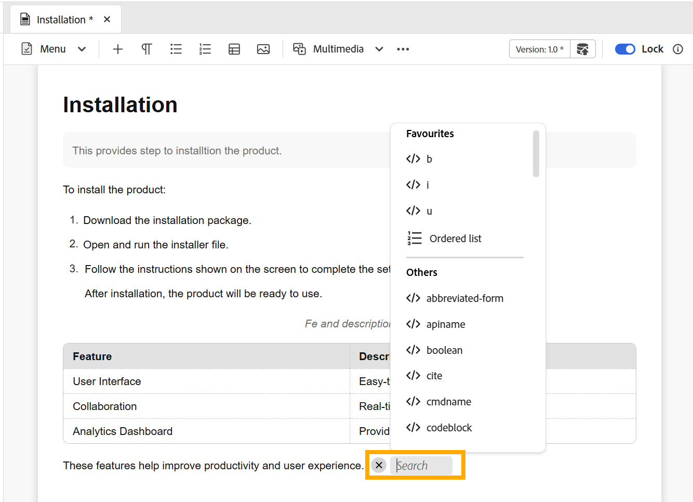
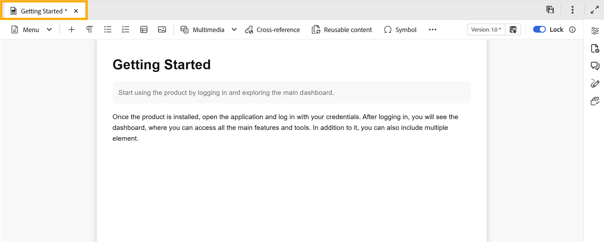

# Editar tópicos no Editor {#id2056B040VUI}

>[!INFO]
>
>Este tópico se aplica ao Novo editor e ao Editor antigo. Embora a funcionalidade principal permaneça consistente, diferenças na interface do usuário, terminologia e interações são indicadas no conteúdo usando guias e chamadas de retorno, quando aplicável.

O Editor vem com uma variedade de recursos de edição que permitem criar ou modificar facilmente seus arquivos de tópico. De modo geral, você executaria as seguintes etapas para editar um tópico no Editor.

>[!IMPORTANT]
>
> Se você encontrar um erro de aplicativo ao trabalhar no Editor, atualize a página para continuar trabalhando.

>[!BEGINTABS]

>[!TAB Novo editor]

1. Para editar ou inserir um elemento em um tópico, clique dentro do limite de texto do elemento necessário para fazer alterações ou coloque o cursor no final do elemento após o qual deseja adicionar um novo elemento e selecione o elemento necessário na barra de ferramentas (ou pressione Alt+1 para abrir o pop-up Inserir elemento), que lista e insere de forma inteligente apenas elementos válidos para esse local no tópico.

1. Além disso, você pode usar o menu Inserção rápida para inserir prontamente os elementos permitidos na posição do cursor. Selecione **Control + /** para Windows ou **Command + /** para Mac para acessar os elementos.

   {width="650"}

   Procure um novo elemento ou escolha um dos favoritos usando o menu Inserção rápida e, em seguida, insira-o na posição atual do cursor. Os favoritos incluem os elementos usados com mais frequência e somente aqueles válidos para a localização atual do cursor são mostrados. Você pode habilitar ou desabilitar este recurso e configurar elementos favoritos para inserção através do menu Inserção rápida disponível nas [Configurações do editor](./config-editor-settings.md).

>[!TAB Editor Antigo]

1. Para fazer alterações no tópico, clique dentro do limite de texto do elemento necessário e comece a fazer edições.

1. Para inserir um elemento específico, mova o cursor no final do elemento após o qual deseja inserir o novo elemento e selecione o ícone de elemento necessário na barra de ferramentas. Você também pode usar o atalho de teclado `Alt+1` para invocar o pop-up **Inserir Elemento**.

   Será exibida uma lista de elementos que podem ser usados no tópico. A Experience Manager Guides faz uma inserção inteligente dos elementos de acordo com seu local válido no tópico.

   >[!NOTE]
   >
   > Você também pode escolher qual ícone deve ser exibido na barra de ferramentas, configurando o arquivo `ui_config.json` localizado em - `/etc/designs/fmdita/clientlibs/xmleditor/`. Para obter mais informações sobre como personalizar recursos, entre em contato com o administrador do sistema.

1. Quando terminar de editar o documento, selecione **Salvar tudo**.

   >[!NOTE]
   >
   > Se você não deseja confirmar as alterações no repositório do Adobe Experience Manager, selecione **Fechar** e **Fechar sem salvar** na caixa de diálogo Alterações não salvas.

>[!ENDTABS]

## Seleção parcial de conteúdo entre elementos

O Experience Manager Guides também permite selecionar o conteúdo entre elementos. Após selecionar o conteúdo, você pode executar as seguintes operações:

- Formatação: a formatação do conteúdo selecionado é significativamente mais fácil no Novo Editor em comparação ao Editor 1.0, conforme ilustrado abaixo.

>[!BEGINTABS]

>[!TAB Novo editor]

Você pode formatar o conteúdo selecionado como negrito, itálico ou sublinhado usando a barra de ferramentas contextual. Selecione o conteúdo e clique no ícone de formatação apropriado no menu exibido. Tornar o conteúdo selecionado negrito, itálico ou sublinhado. O conteúdo das tags abertas válidas é então mesclado e exibido em um único elemento.

{width="650"}

>[!TAB Editor Antigo]

Deixe o conteúdo selecionado em negrito, itálico, sublinhe o conteúdo selecionado. O conteúdo das tags abertas válidas é então mesclado e exibido em um único elemento. Por exemplo, é possível selecionar o conteúdo em um parágrafo e estender a seleção para outro parágrafo. Em seguida, se você colocar o conteúdo selecionado em negrito, todo o conteúdo em negrito das tags abertas será mesclado e exibido em um único elemento de parágrafo.

>[!ENDTABS]

- Exclusão: se você excluir o conteúdo selecionado, o conteúdo restante após a exclusão nas tags abertas será mesclado.

- Circundar o conteúdo com um elemento válido: execute as seguintes etapas para envolver o conteúdo com um elemento válido:

   - Selecione o conteúdo em um elemento.
   - Selecione o ícone  na barra de ferramentas na parte superior para exibir a caixa de diálogo **Inserir elemento**. A caixa de diálogo lista os elementos válidos para o conteúdo selecionado.

     >[!NOTE]
     >
     > Você também pode visualizar a caixa de diálogo Inserir elemento selecionando o menu de contexto do conteúdo selecionado.

   - Selecione um elemento na caixa de diálogo. O conteúdo selecionado é colocado sob esse elemento. Por exemplo, se você selecionar o conteúdo em um parágrafo e escolher o elemento `<note>` na caixa de diálogo **Inserir elemento**, o conteúdo selecionado será exibido abaixo de uma observação.

      {width="300"}

## Atualizar o navegador ao editar os arquivos

O Experience Manager Guides fornece suporte para atualizar o navegador enquanto você edita seu conteúdo no Editor. Este recurso ajuda você a continuar editando o conteúdo caso encontre um erro no aplicativo durante o trabalho. Se você clicar em Atualizar do navegador enquanto um ou mais arquivos com alterações não salvas estiverem abertos para edição, você será avisado de que as alterações não salvas podem ser perdidas. Você tem a opção de cancelar a operação de atualização e salvar os arquivos para preservar as alterações.

Mesmo ao atualizar o navegador, as visualizações do painel esquerdo e direito são mantidas no Editor. O Experience Manager Guides restaura o último estado salvo dos arquivos abertos no Editor quando você atualiza o navegador. Por exemplo, os arquivos abertos no painel Repositório são abertos novamente. O painel de mapa é mantido junto com o mapa aberto anteriormente.

O tópico ativo ou mapa DITA é reaberto na área de edição de conteúdo.

O painel direito também é reaberto e exibe a mesma visualização de antes da atualização.

## Indicador de cópia de trabalho

O Experience Manager Guides fornece o indicador da cópia de trabalho, que mostra se a \(cópia de trabalho\) atual do arquivo está sincronizada ou não com a versão salva. Se você tiver alterado sua cópia atual e não tiver salvado o arquivo, uma marca \* será exibida junto com o título na guia do arquivo do tópico. Esse indicador atua como um lembrete para salvar suas alterações e desaparece ao salvar o arquivo.

>[!BEGINTABS]

>[!TAB Novo editor]

Esta visualização mostra como o conteúdo é renderizado no Novo editor.

{width="550"}

>[!TAB Editor Antigo]

Esta visualização mostra como o conteúdo é renderizado no Editor antigo.

{width="550"}

>[!ENDTABS]

O Experience Manager Guides também indica se a última cópia \(em funcionamento\) salva do arquivo está ou não sincronizada com a versão salva. Se você tiver algumas alterações não salvas entre a cópia de trabalho e a última versão salva, uma marca \* será exibida juntamente com as informações da versão mostradas no canto superior direito da guia Arquivo do tópico. Esse indicador atua como um lembrete para salvar e criar uma versão da sua cópia \(em funcionamento\) atual do arquivo.

>[!NOTE]
>
> Quaisquer alterações nos campos de metadados disponíveis em [Propriedades do arquivo](./web-editor-right-panel.md#file-properties) ou aplicadas no back-end também acionarão o asterisco `(*)` na versão do documento.  Para evitar que atualizações de metadados geradas pelo sistema afetem esse indicador, os administradores podem configurar uma lista de itens a serem ignorados para propriedades de metadados. Para obter detalhes sobre como configurar propriedades de metadados, consulte [Configurar a lista para ignorar de propriedades de metadados](../install-conf-guide/conf-metadata-prop.md).

>[!BEGINTABS]

>[!TAB Novo editor]

{width="650"}

>[!TAB Editor Antigo]

{width="650"}

>[!ENDTABS]

## Acessar arquivos bloqueados nos modos Autor e Source

Quando um arquivo DITA ou Markdown é bloqueado ou passado por check-out por outro usuário, não é possível editar ou modificar o conteúdo. No entanto, você ainda pode exibir o arquivo em um formato somente leitura nos modos **Autor** e **Source**, além do modo **Visualização**.

No modo somente leitura, você pode exibir o conteúdo, as marcas e os atributos nos modos **Autor** ou **Source**. Também é possível modificar as propriedades do arquivo.

>[!NOTE]
>
> Como administrador, você tem acesso ao recurso **Forçar desbloqueio** que permite desbloquear um arquivo bloqueado por outra pessoa.

<!-- This is no more available -->
<!--
The toolbar displays the following icons for read-only access:

- Toggle Tags view
- Version History
- Version Label

Experience Manager Guides also displays a **Read only access** indicator near the version number.
 

You can access the **Layout** view for read-only DITA maps. This view lets you see the DITA map and its properties but prevents edits.

>[!NOTE]
>
> Your folder-level administrative users must update *ui_config.json* so that you can harmoniously access the read-only files in the  Author, Source, and Layout modes.

 -->

## Localizar um arquivo aberto no Explorer

Enquanto você abre um arquivo no Editor, o Experience Manager Guides fornece o recurso para localizar o arquivo no Explorer. Por exemplo, ela localiza o tópico atual enquanto você o edita.

Você pode desativar o recurso para localizar o arquivo com a opção **Sempre localizar arquivos no Explorer** da guia **Aparência** das **Preferências do usuário**.

>[!NOTE]
>
>Na versão 2025.11.0, a configuração **Sempre localizar arquivos no repositório** foi renomeada para **Sempre localizar arquivos no explorador**. Para configuração no local, ele continua disponível como Sempre localizar arquivos no repositório até a versão 5.1 do Experience Manager Guides.

**Tópico pai:**[ Trabalhar com o editor](web-editor.md)
