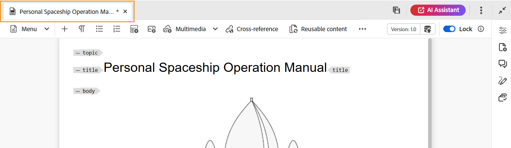

# Editar tópicos no Editor da Web {#id2056B040VUI}

O Editor da Web vem com uma variedade de recursos de edição que permitem criar ou modificar facilmente seus arquivos de tópico. De modo geral, você executaria as seguintes etapas para editar um tópico no Editor da Web.

>[!IMPORTANT]
>
> Se você encontrar um erro de aplicativo ao trabalhar no Editor da Web, atualize a página para continuar trabalhando.

1. Para fazer alterações no tópico, clique dentro do limite de texto do elemento necessário e comece a fazer edições.

1. Para inserir um elemento específico, clique em no final do elemento após o qual deseja inserir o novo elemento e clique no ícone do elemento necessário na barra de ferramentas. Você também pode usar o atalho de teclado `Alt+Enter` para invocar o pop-up **Inserir Elemento**.

   Será exibida uma lista de elementos que podem ser usados no tópico. A AEM Guides faz uma inserção inteligente dos elementos de acordo com seu local válido no tópico.

   >[!NOTE]
   >
   > Você também pode escolher qual ícone deve ser exibido na barra de ferramentas, configurando o arquivo `ui_config.json` localizado em - `/etc/designs/fmdita/clientlibs/xmleditor/`. Para obter mais informações sobre como personalizar recursos, entre em contato com o administrador do sistema.

1. Após concluir a edição do documento, clique em **Salvar**.

   >[!NOTE]
   >
   > Se você não deseja confirmar as alterações no repositório AEM, clique em **Fechar** e em **Fechar sem salvar** na caixa de diálogo Alterações não salvas.

## Seleção parcial de conteúdo entre elementos

O Experience Manager Guides também permite selecionar o conteúdo entre elementos. Após selecionar o conteúdo, você pode executar as seguintes operações:
- Formatação e exclusão: deixe o conteúdo selecionado em negrito, itálico, sublinhado ou até mesmo exclua o conteúdo selecionado. O conteúdo das tags abertas válidas é então mesclado e exibido em um único elemento. Por exemplo, é possível selecionar o conteúdo em um parágrafo e estender a seleção para outro parágrafo. Em seguida, se você colocar o conteúdo selecionado em negrito, todo o conteúdo em negrito das tags abertas será mesclado e exibido em um único elemento de parágrafo.

Da mesma forma, se você excluir o conteúdo selecionado, o conteúdo restante após a exclusão nas tags abertas será mesclado.

- Circundar o conteúdo com um elemento válido: execute as seguintes etapas para envolver o conteúdo com um elemento válido:
   - Selecione o conteúdo em um elemento.
   - Selecione o ícone  na barra de ferramentas secundária na parte superior para exibir a caixa de diálogo **Circundar com Elemento**. A caixa de diálogo lista os elementos válidos para o conteúdo selecionado.
     >[!NOTE]
     >
     > Você também pode visualizar a caixa de diálogo Circular com elemento selecionando o menu de contexto do conteúdo selecionado.

   - Selecione um elemento na caixa de diálogo. O conteúdo selecionado é colocado sob esse elemento. Por exemplo, se você selecionar o conteúdo em um parágrafo e escolher o elemento `<note>` na caixa de diálogo **Circundar com elemento**, o conteúdo selecionado será exibido abaixo de uma observação.\
      {width="300" align="left"}

## Atualizar o navegador ao editar os arquivos

O Experience Manager Guides fornece suporte para atualizar o navegador enquanto você edita seu conteúdo no Editor da Web. Este recurso ajuda você a continuar editando o conteúdo caso encontre um erro no aplicativo durante o trabalho. Se você clicar em Atualizar do navegador enquanto um ou mais arquivos com alterações não salvas estiverem abertos para edição, você será avisado de que as alterações não salvas podem ser perdidas. Você tem a opção de cancelar a operação de atualização e salvar os arquivos para preservar as alterações.

Mesmo ao atualizar o navegador, as exibições do painel esquerdo e direito são mantidas no Editor da Web. O Experience Manager Guides restaura o último estado salvo dos arquivos abertos no Editor da Web quando você atualiza o navegador. Por exemplo, os arquivos abertos no painel Repositório são abertos novamente. O painel de mapa é mantido junto com o mapa aberto anteriormente.

O tópico ativo ou mapa DITA é reaberto na área de edição de conteúdo.

O painel direito também é reaberto e exibe a mesma visualização de antes da atualização.

## Indicador de cópia de trabalho

O AEM Guides fornece o indicador da cópia de trabalho, que mostra se a \(cópia de trabalho\) atual do arquivo está sincronizada ou não com a versão salva. Se você tiver alterado sua cópia atual e não tiver salvado o arquivo, uma marca \* será exibida junto com o título na guia do arquivo do tópico. Esse indicador atua como um lembrete para salvar suas alterações e desaparece ao salvar o arquivo.

{width="550" align="left"}

O AEM Guides também indica se a última cópia \(em funcionamento\) salva do arquivo está ou não sincronizada com a versão salva. Se você tiver algumas alterações não salvas entre a cópia de trabalho e a última versão salva, uma marca \* será exibida juntamente com as informações da versão mostradas no canto superior direito da guia Arquivo do tópico. Esse indicador atua como um lembrete para salvar e criar uma versão da sua cópia \(em funcionamento\) atual do arquivo.

{width="550" align="left"}

## Localizar um arquivo aberto na Exibição do repositório

Ao abrir um arquivo no Editor da Web, o Experience Manager Guides fornece o recurso para localizar o arquivo na Exibição do repositório. Por exemplo, ela localiza o tópico atual enquanto você o edita.

Você pode desativar o recurso para localizar o arquivo com a opção **Sempre localizar arquivos no repositório** da guia **Aparência** das **Preferências do usuário**.

**Tópico pai:**[ Trabalhar com o Editor da Web](web-editor.md)
