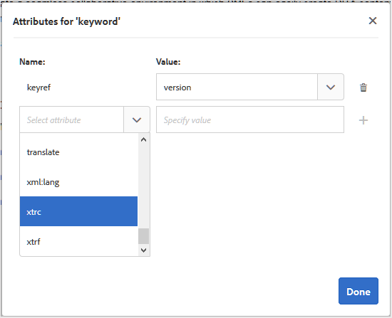
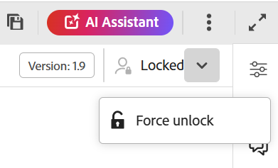
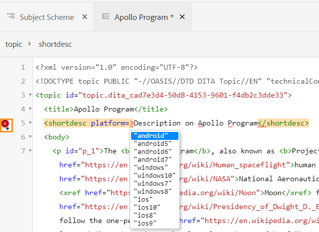
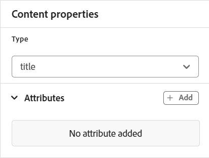

# Conhecer os recursos do Editor {#id176NC500V5Z}

Esta seção aborda os vários recursos disponíveis no Editor. Podemos dividir o Editor nas seguintes seções ou áreas:

- [Barra de cabeçalho](#header-bar)
- [Barra de guias](#tab-bar)
- [Barra de ferramentas](#toolbar)
- [Painel esquerdo](#left-panel)
- [Área de edição de conteúdo](#content-editing-area)
- [Painel direito](#right-panel)

As subseções a seguir abordam em detalhes as várias seções do Editor.

## Barra de cabeçalho

A barra de cabeçalho é a barra superior do Editor que exibe o logotipo do Adobe Experience Manager (ou um Unified Shell, se você estiver usando o Unified Shell como a interface do Experience Manager Guides). Ao selecionar o logotipo, ele direciona você para a página Navegação do Experience Manager.


Use o ícone **Expandir** na barra de ferramentas para ocultar a barra de cabeçalho e maximizar a área de conteúdo. Para restaurar o modo de exibição padrão, selecione **Sair do modo de exibição expandido**.


## Barra de guias

A barra de guias está na parte superior da interface do Editor e fornece acesso aos seguintes recursos:


**Guias**

Exibe os tópicos atualmente abertos no Editor como guias de arquivo. É possível abrir vários tópicos ao mesmo tempo, que são exibidos em suas respectivas guias na barra de guias. Por padrão, é possível exibir os títulos dos arquivos nas guias. Ao passar o mouse sobre um arquivo, é possível visualizar o título do arquivo e o caminho do arquivo como uma dica de ferramenta.

>[!NOTE]
>
> Como administrador, você também pode optar por exibir a lista de arquivos por nomes de arquivo nas guias. Selecione a opção **Nome do arquivo** da seção **Configuração de exibição dos arquivos do editor** em [Preferências do usuário](./intro-home-page.md#user-preferences).

Selecionar a guia Arquivo abre um menu de contexto com as opções Salvar como nova versão, Copiar, Localizar em, Adicionar a, Propriedades, Dividir, Baixar como PDF e Fechar.

**Salvar tudo**

Salva as alterações feitas em todos os tópicos abertos. Se você tiver vários tópicos abertos no Editor, selecionar **Salvar tudo** ou usar as teclas de atalho **Ctrl**+**S** salvará todos os documentos com um único clique. Não é necessário salvar cada documento individualmente.

>[!NOTE]
>
> A operação **Salvar tudo** não cria uma nova versão dos tópicos. Para criar uma nova versão, use a opção **Salvar como nova versão**.

**Assistente de IA**

Uma ferramenta avançada orientada por IA, projetada para melhorar a produtividade por meio de recursos inteligentes de ajuda e criação. Ele reúne dois recursos robustos de IA — **Criação** e **Ajuda** — na interface do Experience Manager Guides, permitindo que você crie conteúdo e acesse informações da documentação do Experience Manager Guides com mais rapidez e eficiência.

>[!NOTE]
>
>O recurso Assistente de IA está disponível no momento para o Adobe Experience Manager Guides as a Cloud Service.

**Expandir exibição**: permite expandir a exibição de página usando o ícone **Expandir**. Nesta visualização, a barra de cabeçalho que contém o logotipo do Adobe Experience Manager está oculta. Isso maximiza o espaço de conteúdo para edição. Para retornar ao modo de exibição padrão, use o ícone **Sair do modo de exibição expandido**.

**Mais ações**: permite navegar até a **Assets** e as **Configurações**.

A opção **Assets** leva você a um destino com base em sua configuração:

- **Serviços em Nuvem**: se você estiver usando os Serviços em Nuvem, selecionar a opção **Assets** o levará à página Navegação da AEM.

- **Software Local**: se estiver usando o Adobe Experience Manager Guides (4.2.1 e posterior), selecionar a opção **Assets** levará você ao caminho do arquivo atual na interface do usuário do Assets.


A opção **Configurações** está disponível somente para administradores e administradores de perfil de pasta e permite definir as seguintes configurações:

>[!NOTE]
>
> Se estiver atualizando qualquer configuração padrão, você deverá reabrir os documentos para que as alterações entrem em vigor.

- **Geral**: as configurações Gerais permitem configurar o dicionário a ser usado com o Editor. Esta guia contém quatro seções: **Verificação ortográfica**, **Condição**, **Criação** e **Citações**.

  {width="650" align="left"}

   - **Verificação ortográfica**: há duas opções — **Verificação ortográfica do AEM** e **Verificação ortográfica do navegador**. Por padrão, o editor usa o recurso de verificação ortográfica do navegador, no qual a verificação ortográfica é executada usando o dicionário interno do navegador. Você pode alternar para a verificação ortográfica do AEM para usar o dicionário do Adobe Experience Manager, que também pode ser personalizado para adicionar sua lista de palavras personalizada. Para obter mais informações sobre como personalizar o dicionário do AEM, consulte [Personalizar o dicionário padrão do AEM](../cs-install-guide/customize-aem-custom-dictionary.md) na seção Instalar e configurar o Adobe Experience Manager Guides as a Cloud Service.

   - **Condição**

      - **Realçar texto condicional no modo de exibição Autor**: selecione essa opção para realçar o texto condicional no modo de exibição Autor. O conteúdo condicional é realçado usando a cor definida para a condição.

      - **Validar com atributos de condição**: selecione essa opção para permitir a validação dos valores definidos para os atributos. Isso impede que você adicione qualquer valor incorreto.

      - **Mostrar chave com o título no painel Esquema de Assunto**: selecione essa opção para mostrar as chaves junto com títulos no esquema de assunto. Se você não selecionar essa opção, somente os títulos serão exibidos. Por exemplo, aqui as chaves &quot;os&quot;, &quot;audience&quot; e &quot;other&quot; também são mostradas junto com títulos.

        {width="550" align="left"}

      - **Mostrar esquema de assunto no painel Condições**: selecione esta opção para exibir um esquema de assunto no painel Condições. Se você desmarcar essa opção, as condições definidas serão mostradas no painel Condições.

   - **Criação**

      - **Habilitar Substituir Tudo**: selecione esta opção para exibir o ícone **Substituir Tudo** no painel **Localizar e substituir**.

   - **Citações**
Alterar o estilo das citações. Escolha o estilo da citação no menu suspenso que deseja usar em seu projeto. Para obter mais detalhes, consulte [Alterar estilos de citação](./web-editor-apply-citations.md#change-citation-style).

   - **Assistente de IA**
Selecione esta opção para habilitar o recurso [Assistente de IA](./ai-assistant.md) no Experience Manager Guides. Desmarque para desativar o recurso.

**Painéis**: esta configuração controla os painéis exibidos nos painéis esquerdo e direito do Editor e do console de Mapa. Você pode alternar o botão para mostrar ou ocultar o painel desejado.

{width="650" align="left"}

Você também pode definir a ordem em que os recursos presentes nos painéis são exibidos. Para alterar a ordem padrão dos recursos disponíveis nos painéis, selecione as barras pontilhadas para arrastar e soltar as guias de recursos no local desejado. Um recurso também pode ser movido da seção **Mais** para a seção principal de um painel, e vice-versa de acordo com o requisito. Depois de reordenados, os recursos aparecem na mesma sequência nos respectivos painéis direito e esquerdo.

{width="650" align="left"}


No máximo oito painéis podem ser exibidos de cada vez. Quaisquer alterações feitas nas configurações do painel são aplicadas imediatamente.


>[!NOTE]
>
> Se um painel personalizado tiver sido configurado, ele também aparecerá na lista de painéis. Você pode alternar o botão para mostrar ou ocultar o painel personalizado.

- **Lista de elementos**: como administrador, você pode controlar a lista de elementos que um autor pode inserir em um arquivo e também definir o nome de exibição do elemento. A configuração da lista Elementos permite especificar o nome do elemento de acordo com as especificações DITA e um rótulo que você deseja usar em vez do nome do elemento definido por DITA:

  {width="650" align="left"}

Na captura de tela acima, o elemento `p` recebeu um rótulo de Parágrafo, e `codeblock` recebeu um rótulo de Bloco de Código junto com alguns outros elementos. Se você selecionar a opção **Usar somente os elementos acima**, então somente os elementos válidos \(no ponto de inserção atual\) desta lista serão exibidos na caixa de diálogo **Inserir elemento**.

Na captura de tela a seguir, apenas 3 dos 4 elementos configurados da captura de tela anterior são mostrados no contexto atual:

{width="300" align="left"}

- **Lista de atributos**: assim como a lista de elementos, você pode controlar a lista de atributos e seus nomes de exibição a serem exibidos na lista de atributos de um elemento. Na captura de tela a seguir, apenas 3 atributos foram configurados para serem mostrados na lista de atributos de um elemento:

  {width="650" align="left"}

  Com essa configuração, ao tentar adicionar um atributo a um elemento, você só visualiza a lista de atributos configurados na lista.

  {width="300" align="left"}

- **Cores**: exibe uma lista de cores de fundo pré-configuradas para **Condições**. Os usuários podem selecionar uma cor de plano de fundo ao aplicar uma condição a um tópico. Como administrador, você também pode criar e adicionar cores de fundo personalizadas à lista. Para adicionar uma nova cor, digite o nome desejado no campo **Nome da Cor**, escolha uma cor personalizada e selecione o ícone **+**. A cor personalizada aparecerá no final da lista de cores.

- **Publicar perfis**: contém os Perfis que podem ser usados para publicar a saída da **Base de Dados de Conhecimento**. Você pode criar um novo perfil para uma base de dados de conhecimento de destino. Por exemplo, Salesforce ou ServiceNow.

   - **Criar um perfil do Salesforce**

     **Pré-requisitos**

      - Crie um aplicativo conectado para o Salesforce. Para obter mais detalhes, consulte [Habilitar configurações do OAuth para integração com a API](https://help.salesforce.com/s/articleView?id=sf.connected_app_create_api_integration.htm&amp;type=5).

      - Ao configurar o aplicativo conectado, verifique o seguinte:

         - Especifique o retorno de chamada.

           `URL: http://<server name>:<port>/bin/dxml/thirdparty/callback/salesforce`

         - Selecione os seguintes escopos do OAuth:
            - Acesso total (total)
            - Selecione Gerenciar dados do usuário por meio das APIs (api)

     Depois que o aplicativo é configurado, a Salesforce fornece uma **Chave do consumidor** e um **Segredo do consumidor**. Eles podem ser usados para criar o perfil do Salesforce.


   - Para criar um perfil do Salesforce, selecione a Base de Dados de Conhecimento **Salesforce** na lista suspensa **Tipo de servidor**. Insira um Nome de perfil. No **URL do Site**, insira o site do consumidor que você usaria para publicar a saída e adicionar a **Chave do Consumidor** e o **Segredo do Consumidor** fornecidos pelo site do consumidor do Salesforce. Em seguida, **Validar** e **Salvar** o perfil recém-criado.

     {width="550" align="left"}

     >[!NOTE]
     >
     >Para configurar um proxy para o Salesforce no Experience Manager Guides, use Configuração de proxy de componentes HTTP do Apache no AEM. Saiba como [configurar proxy para o Verificador de Links do AEM](https://helpx.adobe.com/experience-manager/kb/How-to-configure-proxy-for-the-AEM-Link-Checker-AEM.html).


   - **Criar um perfil do ServiceNow**

     **Pré-requisitos**

     Configure o servidor ServiceNow para fazer upload dos ativos.
      - Conecte-se ao servidor **ServiceNow**.
      - Navegue até **Propriedades do Sistema** > **Segurança**.
      - Desmarque a seguinte opção:

        **Esta propriedade deve ser definida para ativar a verificação de tipo MIME para carregamentos (Todas as versões Eureka e superiores). Ativa (true) ou desativa (false) a validação do tipo MIME para os anexos de arquivo. Extensões de arquivo configuradas via glide.attachment.extensions serão verificadas em busca de tipo MIME durante o carregamento.**

      - Selecione **Salvar**.

     Depois de configurar o aplicativo, crie o perfil do **ServiceNow**.

   - Para criar um perfil, selecione a Base de Dados de Conhecimento ServiceNow na lista suspensa **Tipo de servidor**. Insira um perfil **Nome**. Na **URL do ServiceNow**, insira o site do consumidor que você usaria para publicar a saída e, em seguida, adicione o **Nome de Usuário** e a **Senha** fornecidos pelo site do consumidor do ServiceNow. Em seguida, **Validar** e **Salvar** o perfil recém-criado.

     {width="550" align="left"}

  Depois de validar, você pode selecionar o Perfil de Publicação nas predefinições de saída de um Mapa DITA e usá-lo para gerar a saída para o servidor do **Salesforce** ou do **ServiceNow** escolhido.

  Saiba mais sobre a predefinição de saída da [Base de Dados de Conhecimento](../user-guide/generate-output-knowledge-base.md).


- **Validação**: esta guia contém opções para configurar as validações de Esquematron no Editor. Você pode ativar os seguintes recursos:

   - **Executar verificação de validação antes de salvar o arquivo**: selecione essa opção para executar validações de Esquematron usando os arquivos de Esquematron selecionados antes de qualquer operação de salvamento. Você pode adicionar um arquivo do Schematron selecionando o ícone +. Os arquivos do Schematron selecionados são listados.

     >[!NOTE]
     >
     >O(s) arquivo(s) de esquema selecionado(s) persistirá(ão) no perfil de pasta selecionado.

     {width="550" align="left"}

     Isso impede que os usuários salvem qualquer arquivo que quebre uma regra definida no(s) arquivo(s) selecionado(s) do Schematron. Se esta opção não estiver selecionada, o arquivo não será validado antes de salvar as alterações.

   - **Permitir que todos os usuários adicionem arquivos de esquematron no painel de validação**: selecione essa opção para permitir que os usuários adicionem qualquer arquivo de Esquematron no painel Validação do Editor. Isso permite que os usuários adicionem arquivos do Schematron e, em seguida, validem os tópicos em relação ao arquivo Schematron. Se esta opção não estiver selecionada, a opção para adicionar o arquivo de esquematron **botão Adicionar Arquivo de Esquematron** não estará disponível para os usuários no **Painel de validação** do Editor.


- **Exibir atributos**: assim como a lista de atributos, você pode controlar a lista de atributos a serem exibidos na lista de atributos de um elemento. Por padrão, quatro **Atributos de exibição** — público-alvo, plataforma, produto e propriedades foram configurados para serem mostrados na lista de atributos de um elemento. Você também pode adicionar um atributo de exibição usando o ícone **Adicionar** na parte superior. Você também pode excluir qualquer um dos atributos de exibição usando o ícone **Excluir**.

  Os atributos definidos para um elemento são exibidos na exibição Layout e Estrutura de Tópicos.

  {width="550" align="left"}

- **Tradução**: esta guia contém as opções para criar grupos de idiomas, propagar os rótulos de origem para a versão de destino e limpar o projeto de tradução.

  {width="550" align="left"}

   - **Grupos de Idiomas**: como administrador, você pode criar um grupo de idiomas e usá-los como um conjunto para traduzir o conteúdo.

     Execute as seguintes etapas para criar um novo grupo de idiomas:

      1. Selecione **Adicionar**.
      1. Informe o nome do grupo de idiomas. Cada idioma deve ter um nome exclusivo. Você pode exibir um erro se o campo de nome estiver vazio ou se o nome não for exclusivo.
      1. Selecione os idiomas na lista suspensa. Você pode selecionar vários idiomas.

         Digite os primeiros caracteres do idioma ou o código do idioma para filtrar os idiomas desejados. Por exemplo, digite &#39;en&#39; para filtrar todos os idiomas que contêm &#39;en&#39; no início de seu nome ou código.

      1. Selecione o ícone Concluído para adicionar os idiomas selecionados ao grupo. Os idiomas são exibidos. Quando você adiciona três ou mais idiomas, a opção **Mostrar mais** é exibida. Você pode selecionar **Mostrar mais** para exibir todos os idiomas presentes no grupo.

         >[!TIP]
         >
         >Alternar **Mostrar mais** para **Mostrar menos** e exibir apenas alguns idiomas.

      1. Passe o mouse sobre os idiomas em um grupo para editar o  ou excluir os grupos de idiomas .
      1. Salve as **Configurações**.

         >[!NOTE]
         >
         >Como usuário, você pode exibir os grupos de idiomas configurados para o perfil da pasta.

   - **Propagar rótulos de versão de origem para a versão de destino**: selecione esta opção para passar o rótulo da versão do arquivo de origem para o arquivo traduzido. Por padrão, está desativado.
   - **Limpeza do projeto de tradução após a conclusão**: selecione essa opção para configurar os projetos de tradução a serem desabilitados ou excluídos automaticamente após a tradução. Por padrão, **Nenhum** está selecionado, portanto, o projeto existe após a tradução.

     Você pode desativar os projetos de tradução se desejar usá-los posteriormente. A exclusão de um projeto exclui permanentemente todos os arquivos e pastas presentes no projeto.


- **Metadados**: você pode controlar os metadados da versão do tópico e seus valores a serem exibidos na caixa de diálogo **Histórico de versões**.  No caminho dos metadados, especifique a localização dos nós dos quais deseja selecionar os metadados. Também é possível definir um nome personalizado para os metadados como o rótulo. As propriedades padrão são Título, Estado do documento e Tags.

  Os metadados podem ser escolhidos de qualquer propriedade no nó `/jcr:content` do ativo, de modo que você possa adicionar o caminho da propriedade como o caminho de Metadados.


  Um erro é exibido se o caminho de metadados estiver em branco. Se você deixar o rótulo em branco, o último elemento será escolhido como o rótulo.


  {width="550" align="left"}

  *Configure os metadados da caixa de diálogo **Histórico de Versões**.*


  Você também pode definir a ordem em que essas tags de metadados são exibidas. Para alterar a ordem padrão dessas tags, selecione as barras pontilhadas para arrastar e soltar as tags no local desejado.
Os rótulos de metadados aparecem na mesma sequência na caixa de diálogo **Histórico de versões** do Editor.

## Barra de ferramentas

A barra de ferramentas aparece quando você abre um tópico ou mapa para edição no Editor. Os recursos disponíveis na barra de ferramentas são os seguintes:

- [Menu suspenso](#menu-dropdown)
- [Opções de inserção de conteúdo](#content-insertion-options)
- [Botão Informações de versão e Salvar como nova versão](#save-as-new-version)
- [Bloquear/desbloquear](#lockunlock)

>[!NOTE]
>
> Os recursos listados acima são aplicáveis somente a arquivos de tópico. Ao trabalhar com um arquivo de mapa, opções diferentes são exibidas na barra de ferramentas com base na exibição atual do Editor de mapa. Saiba mais sobre as opções da barra de ferramentas do Editor de mapas no documento [Recursos do editor de mapas](./map-editor-advanced-map-editor.md).

### Menu suspenso

A lista suspensa Menu fornece acesso às ações de edição, Localizar e substituir, Histórico de versão, Rótulo de versão, Mesclar, Criar tarefa de revisão, Rastrear alterações e Recurso de tags.

A explicação detalhada desses recursos é a seguinte:

**Editar ações**

Ao editar um tópico no Editor, acesse as várias ações de edição, como **Recortar** ou ***Ctrl***+***X*** , **Copiar** ou ***Ctrl***+***C*** , **Desfazer** ou ***Ctrl***+***Z*** , **Refazer** ou ***Ctrl***+***Y*** e **Excluir** presentes na lista suspensa Menu.


**Localizar e substituir**

O recurso **Localizar e substituir** está disponível nos modos de exibição Autor e Source. Quando ativada, a barra de texto Localizar e Substituir aparece na parte inferior da área de edição de tópico. Você pode usar as teclas de atalho **CTRL**+**F** para invocar a barra Localizar e substituir.

{width="800" align="left"}

Usando o ícone de configurações \(\), você pode alternar as opções de pesquisa **Ignorar maiúsculas e minúsculas** e **Somente palavra inteira**. Para executar a pesquisa que não diferencia maiúsculas de minúsculas, ative (ou selecione) a opção **Ignorar maiúsculas e minúsculas**. Caso contrário, se você deseja realizar a pesquisa que diferencia maiúsculas de minúsculas, desative (ou desmarque) a opção **Ignorar maiúsculas e minúsculas**. Você também pode optar por pesquisar uma palavra inteira.

A pesquisa é instantânea, o que significa que à medida que você digita a frase ou palavra de pesquisa no campo **Localizar**, o termo é imediatamente pesquisado e selecionado no tópico. Da mesma forma, para substituir um texto em seu tópico, insira o termo de pesquisa e sua substituição nos respectivos campos e selecione o botão **Substituir** ou **Substituir tudo**.

No modo de exibição do Source, o recurso **Localizar e substituir** é extremamente útil para procurar um elemento ou atributo específico. Por exemplo, se você deseja substituir o valor do atributo `@product`, ele pode ser facilmente feito no modo de exibição Source. A visualização Autor não permite que você pesquise com base em um atributo ou elemento. No entanto, você deve ter cuidado ao usar o recurso **Substituir tudo**, pois ele pode substituir o código XML.

**Histórico de versões**

O recurso **Histórico de versões** no Editor permite verificar as versões disponíveis dos arquivos DITA, compará-las e reverter para qualquer versão do próprio Editor. É possível comparar o conteúdo e os metadados da versão atual (que também pode ser uma cópia de trabalho) com qualquer versão anterior do mesmo arquivo. Também é possível exibir os rótulos e comentários das versões comparadas.

>[!NOTE]
>
> As opções de Histórico de versão só serão exibidas se houver alterações feitas na primeira versão do tópico ou mapa.

Para acessar o histórico de versões e reverter para uma versão específica do seu tópico, execute as seguintes etapas:

1. Abra um tópico no Editor.
1. Selecione o **Histórico de versões** na lista suspensa **Menu**.

   A caixa de diálogo **Histórico da Versão** é exibida.

   {width="550" align="left"}

   *Visualize as alterações nas diferentes versões de um tópico.*

1. Escolha uma versão do tópico que você deseja comparar ou reverter na lista suspensa **Comparar com**.

   >[!NOTE]
   >
   > Se uma versão tiver rótulos aplicados a ela, eles também serão mostrados \(entre colchetes\) junto com o número da versão.

1. Habilite a opção **Exibir rótulos e comentários** para exibir os rótulos e comentários aplicados às versões atual e comparada.
1. Você também pode exibir as seguintes informações na caixa de diálogo **Histórico de versões**:

   Guia **Visualizar**: o conteúdo recém-adicionado está em fonte verde e o conteúdo excluído está em fonte vermelha.

   Guia **Metadata**: os metadados recém-adicionados estão em fonte verde e os metadados excluídos estão em fonte vermelha.

   {width="550" align="left"}

   *Comparar os metadados de diferentes versões no histórico de Versões.*

   >[!NOTE]
   >
   > O administrador do sistema pode alterar os metadados a serem mostrados na guia Metadados em **Configurações**. Para obter detalhes, consulte a seção **Mais ações** da [Barra de guias](#tab-bar).

   Você também pode exibir os detalhes de usuário e tempo da versão atual e da versão comparada.

   Depois de escolher uma versão na lista suspensa, a opção **Reverter para a versão selecionada** é disponibilizada. A janela de visualização exibe as diferenças entre a versão atual e a versão selecionada do tópico.

1. Selecione **Reverter para a versão selecionada** para reverter sua cópia de trabalho com a versão selecionada do tópico.

   A caixa de diálogo Reverter versão é exibida.

   {width="550" align="left"}

1. \(*Opcional*\) Forneça um motivo para reverter para uma versão anterior. Você também pode criar uma nova versão da cópia de trabalho ativa do tópico.

1. Selecione **Confirmar.**

   Sua cópia de trabalho do arquivo foi revertida para a versão selecionada. Se você optar por criar uma nova versão da cópia de trabalho ativa no momento, uma nova versão do arquivo também será criada com todas as alterações de trabalho.

   Quando você reverte para uma versão anterior, uma dica visual é mostrada, indicando que a versão em que você está trabalhando no momento não é a versão mais recente.

   {width="800" align="left"}

**Rótulos de versão**

Os rótulos ajudam a identificar o estágio em que um tópico específico está no DDLC (Document Development Life Cycle, Ciclo de vida de desenvolvimento de documentos). Por exemplo, ao trabalhar em um tópico, você pode definir o rótulo como &quot;Aprovado&quot;. Depois que um tópico é publicado e disponibilizado aos clientes, é possível atribuir o rótulo &quot;Lançado&quot; a esse tópico.

O Experience Manager Guides permite especificar rótulos em um formato de texto livre ou usar um conjunto de rótulos predefinidos. O rótulo personalizado permitiria que qualquer autor no sistema especificasse um rótulo de acordo com sua escolha. Isso dá flexibilidade; no entanto, introduz rótulos inconsistentes no sistema. Para resolver esse problema, os administradores podem configurar um conjunto de rótulos predefinidos. Para obter mais informações sobre como configurar rótulos predefinidos, consulte *Configurar e personalizar o Editor da Web de XML* em Instalar e configurar o Adobe Experience Manager Guides as a Cloud Service.

Esses rótulos são mostrados na forma de uma lista suspensa para os autores sempre que eles precisarem especificar um rótulo. Isso garante que somente rótulos predefinidos e consistentes sejam usados no sistema.

Há diferentes métodos pelos quais você pode aplicar rótulos aos seus tópicos - painel [Histórico de versões](web-editor-use-label.md) na interface do usuário do Assets, interface do usuário [Linhas de Base](/help/product-guide/user-guide/generate-output-use-baseline-for-publishing.md) e editor. O recurso Rótulo de versão no Editor oferece aos autores uma maneira rápida e fácil de atribuir rótulos a seus tópicos.

Para adicionar rótulos ao seu tópico a partir do Editor, execute as seguintes etapas:

1. Abra um tópico no Editor.

1. Selecione **Rótulos de versão** na lista suspensa Menu.

   A caixa de diálogo Gerenciamento de Rótulos de Versão é exibida.

   {width="650" align="left"}

   A caixa de diálogo Gerenciamento de rótulo de versão é dividida em duas partes: o painel esquerdo tem uma lista de versões disponíveis para o tópico, juntamente com a lista suspensa de rótulos \(ou uma caixa de texto para inserir um rótulo\) e o painel direito com uma visualização do tópico.

1. Selecione uma versão na qual você deseja aplicar rótulos.

   Quando você escolhe uma versão diferente do tópico na lista de versões, o painel de visualização exibe as alterações entre a versão atual e a versão selecionada do tópico

   >[!NOTE]
   >
   > Se um rótulo já estiver aplicado em uma versão, ele será exibido ao lado do número da versão na lista suspensa e abaixo da lista Selecionar versão. Você pode remover um rótulo existente selecionando o ícone \(**x**\) ao lado do rótulo.

1. Caso o administrador tenha definido uma lista de rótulos, você verá uma lista suspensa dos rótulos de onde poderá escolher os rótulos que deseja aplicar. É possível selecionar vários rótulos na lista suspensa.

   Caso contrário, será exibida uma caixa de texto, na qual você poderá inserir os rótulos que deseja adicionar ao tópico.

   >[!NOTE]
   >
   > Não é possível aplicar o mesmo rótulo a várias versões de um tópico. Se tentar associar um rótulo existente, você terá a opção de removê-lo da versão existente e aplicá-lo na versão selecionada do tópico.

1. Selecione **Adicionar rótulo**.

1. Na mensagem de confirmação Aplicar Rótulo, selecione a opção **Mover rótulo(Se usado em outra versão)** para mover rótulos de uma versão existente para a versão selecionada. Se você não selecionar essa opção e houver rótulos atribuídos a uma versão diferente do tópico, eles não serão movidos para a versão do tópico selecionado. Esses rótulos são ignorados no processo de aplicativo de rótulo.

**Mesclar**

Quando você trabalha em um ambiente de vários autores, fica difícil rastrear as alterações que os outros autores fizeram em um tópico ou mapa. O recurso Mesclar oferece mais controle não apenas sobre a exibição das alterações, mas também sobre quais alterações são mantidas na versão mais recente do documento.

- **Mesclar arquivos de tópico**

  Para mesclar alterações em um tópico, execute as seguintes etapas:

   1. Abra um tópico no Editor.

   1. Selecione **Mesclar**.

      A caixa de diálogo Mesclar é exibida.

      {width="550" align="left"}

   1. *\(Opcional\)* Você também pode procurar e selecionar um novo arquivo em algum outro local do seu repositório.

   1. Selecione uma versão do arquivo com a qual deseja comparar a versão atual do arquivo.

   1. Em Opções, escolha:

      - **Controlar alterações da versão selecionada**: esta opção mostra todas as atualizações de conteúdo na forma de alterações controladas. Você pode optar por aceitar ou rejeitar as alterações no documento, uma de cada vez, ou todas de uma só vez.

      - **Reverter para a versão selecionada**: essa opção reverte a versão atual do documento para a versão selecionada. Essa opção não oferece controle sobre qual conteúdo é aceito ou rejeitado.

   1. Selecione **Concluído**.

   1. Se você selecionou a opção **Controlar alterações da versão selecionada**, todas as alterações da versão selecionada serão mostradas no recurso Controlar alterações do painel direito.

      Você pode optar por aceitar ou rejeitar todos os comentários do painel Alterações controladas ou aceitar ou rejeitar comentários individuais.


- **Mesclar arquivos de mapa**

  Para mesclar alterações em um arquivo de mapa, execute as seguintes etapas:

   1. Abra um mapa no Editor.

   1. Selecione **Mesclar**.

      A caixa de diálogo Mesclar é exibida.

      {width="550" align="left"}

   1. *\(Opcional\)* Você também pode procurar e selecionar um novo arquivo em algum outro local do seu repositório.

   1. Selecione uma versão do arquivo com a qual deseja comparar a versão atual do arquivo.

   1. Em Opções, escolha:

      - **Controlar alterações da versão selecionada**: esta opção mostra todas as atualizações de conteúdo na forma de controlar alterações. Você pode optar por aceitar ou rejeitar as alterações no documento, uma de cada vez, ou todas de uma só vez.

      - **Reverter para a versão selecionada**: essa opção reverte a versão atual do documento para a versão selecionada. Essa opção não oferece controle sobre qual conteúdo é aceito ou rejeitado.

   1. Selecione **Concluído**.

   1. Se você selecionou a opção **Controlar alterações da versão selecionada**, todas as alterações da versão selecionada serão mostradas no painel Alterações controladas \(à direita\).

      Você pode optar por aceitar ou rejeitar todas as alterações do painel Alterações controladas ou aceitar ou rejeitar alterações individuais no arquivo de mapa.


**Criar tarefa de revisão**

Você pode [criar uma tarefa de revisão](./review-send-topics-for-review.md) do tópico atual ou mapear arquivo diretamente do Editor. Abra o arquivo para o qual deseja criar a tarefa de revisão e selecione **Criar tarefa de revisão** na lista suspensa Menu para iniciar o processo de criação da revisão.

**Controlar alterações**

Você pode controlar todas as atualizações feitas em um documento ativando o modo Controlar alterações. Depois de ativar o controle de alterações, todas as inserções e exclusões são capturadas no documento. Todo o conteúdo excluído é realçado usando Tachado e todas as inserções são realçadas em texto de cor verde. Além disso, você também obtém as barras de alteração na borda da página de tópico. Novamente, uma barra vermelha é exibida para o conteúdo excluído, e uma barra verde é exibida para o conteúdo adicionado. Caso haja uma adição e exclusão na mesma linha, as barras verde e vermelha são exibidas.

A captura de tela a seguir destaca o conteúdo excluído e inserido junto com as barras de alteração:

{width="650" align="left"}

Um caso de uso típico para rastrear alterações em um documento pode ser para fazer revisão por pares. Você pode habilitar o controle de alterações e compartilhar seu documento para revisão, e o revisor faz alterações com o controle de alterações ATIVADO. Ao receber o documento, você deve ter um mecanismo para visualizar as atualizações sugeridas, juntamente com uma maneira conveniente de aceitar ou rejeitar alterações.

O Experience Manager Guides fornece o recurso Alterações controladas que contém informações sobre as atualizações feitas no documento. O recurso Alterações rastreadas fornece informações sobre quais atualizações foram feitas, quem as fez e em que momento. Usando o recurso Alterações controladas, você também pode aceitar ou rejeitar facilmente as atualizações sugeridas no documento.

Para acessar o recurso, selecione o ícone **Controlar alterações** no painel direito.

{width="300" align="left"}

Selecionar uma alteração controlada seleciona o conteúdo alterado no documento. Você pode aceitar uma alteração selecionando o ícone Aceitar alteração ou rejeitá-la selecionando Rejeitar alteração.

Se quiser aceitar ou rejeitar todas as alterações com um único clique, selecione **Aceitar todas as alterações** ou **Rejeitar todas as alterações**.

>[!NOTE]
>
> O modo Visualizar permite visualizar o documento com ou sem as marcações do conteúdo alterado. Para obter mais detalhes, veja o modo [Visualização](web-editor-views.md#preview-mode-id19AAGL00163).

**Tags**

O recurso **Tags** no Editor é um botão de alternância que controla a visibilidade dos elementos DITA. Quando ativado, ele exibe tags estruturais no conteúdo, permitindo que você visualize e gerencie os elementos DITA subjacentes com mais eficiência. Quando desativado, o editor oculta essas tags, fornecendo um ambiente de criação mais limpo e focado.

A captura de tela a seguir mostra um documento com a exibição de Tags ativada:

{width="650" align="left"}

As seguintes operações podem ser executadas em um documento com Tags:

- **Selecionar um elemento**: selecione a marca de abertura ou de fechamento de um elemento para selecionar seu conteúdo.

- **Expandir ou recolher marcas**: selecione as marcas + ou - para expandir ou recolher uma marca.

- **Usar o menu de contexto**: o menu de contexto fornece opções para recortar, copiar ou colar o elemento selecionado. Também é possível inserir um elemento antes ou depois do elemento selecionado. As outras opções permitem Gerar ID ou abrir o painel Propriedades do elemento selecionado.

- **Arrastar e soltar elementos**: selecione a marca de um elemento e arraste-a e solte-a facilmente no seu documento. Se o local de destino for um local válido onde o elemento é permitido, o elemento será colocado no local de destino.


>[!NOTE]
>
> Se um usuário ativar a visualização Tags no Editor, ela permanecerá ativada mesmo nas sessões. Isso significa que não é necessário habilitar a exibição de Tags novamente para acessá-la posteriormente. O valor padrão para o modo de exibição de Tags da sessão de um novo usuário é determinado pela propriedade `tagsView` no arquivo `ui\_config.json`. Para obter mais detalhes, exiba a seção [Configurar valor padrão para Exibição de Marcas](../cs-install-guide/configure-default-value-tags-view.md) em Instalar e configurar o Adobe Experience Manager Guides as a Cloud Service.

### Opções de inserção de conteúdo

**Elemento** - 

Insere um elemento válido no local válido atual ou próximo. Você também pode usar o atalho de teclado ***Alt***+***Enter*** para abrir a caixa de diálogo Elemento. Por exemplo, ao editar um parágrafo, na caixa de diálogo **Elemento**, é exibida uma lista de elementos que podem ser inseridos no parágrafo. Selecione o elemento que deseja inserir. Você pode usar o teclado para percorrer a lista de elementos e pressionar ***Enter*** para inserir o elemento necessário.

Você pode exibir dois tipos de elementos válidos:

- **Elementos válidos no local atual**: a lista exibe os elementos que você pode inserir no próprio local do cursor atual.

- **Elementos válidos fora do local atual**: a lista exibe os elementos que você pode inserir depois de qualquer um dos pais do elemento atual na hierarquia de elementos.

Por exemplo, se você estiver dentro do elemento `<b>` embutido, é possível inserir elementos como `<u>`, `<xref>`, `<i>` no local atual. Por outro lado, você pode inserir elementos como `<table>` e `<topic>` fora do local atual.

Você também pode digitar um caractere ou sequência de caracteres na caixa de pesquisa e pesquisar os elementos que começam com ele.

{width="300" align="left"}

*Digite &#39;t&#39; para procurar todos os elementos válidos que comecem com &#39;t&#39;.*

Se você estiver trabalhando dentro de um elemento de bloco como `note`, use o ícone Inserir elemento para inserir um novo elemento após o elemento `note`. Na captura de tela a seguir, um elemento de nota foi inserido no elemento p \(parágrafo\):

{width="800" align="left"}

Se você pressionar Enter no elemento de nota, um novo parágrafo será criado dentro do próprio elemento de nota. Para inserir um novo elemento fora da observação, selecione o elemento p \(destacado na captura de tela\) na navegação estrutural dos elementos e selecione o ícone Elemento ou pressione ***Alt***+***Enter*** para abrir a caixa de diálogo Inserir elemento. Em seguida, selecione o elemento desejado e pressione Enter para inserir o elemento selecionado após o elemento de nota.

Você também pode adicionar um elemento entre dois elementos quando um cursor de bloco intermitente é exibido.


{width="300" align="left"}

Por exemplo, se você estiver trabalhando em um tópico DITA e o cursor de bloco estiver piscando entre a descrição curta e o corpo, é possível adicionar o elemento `prolog` e, em seguida, adicionar direitos autorais, autor e outros detalhes.

Outra maneira de inserir um novo elemento é usando o menu de contexto. Clique com o botão direito do mouse em qualquer lugar do documento para chamar o menu de contexto. Nesse menu, escolha **Inserir Elemento** para exibir a caixa de diálogo **Inserir elemento** e escolha o elemento que deseja inserir.

{width="300" align="left"}

**Parágrafo** - 

Inserir elemento de parágrafo no local válido atual ou próximo.

**Lista com marcadores** - 

Cria uma lista com marcadores no local válido atual ou próximo. Se você estiver em uma lista com marcadores e selecionar esse ícone, o item será convertido em um parágrafo normal.

**Lista numerada** - 

Cria uma lista numerada no local válido atual ou próximo. Se você estiver em uma lista numerada e selecionar esse ícone, o item será convertido em um parágrafo normal.

>[!NOTE]
>
>Você também pode selecionar a opção **Dividir lista** no menu de contexto de um item de lista para dividir a lista atual e iniciar uma nova lista no mesmo nível.

**Tabela** - 

Insere uma tabela no local válido atual ou próximo. Selecione o ícone Tabela para abrir a caixa de diálogo Inserir Tabela Simples.

{width="550" align="left"}

>[!NOTE]
>
> Você também pode copiar uma tabela do MS Word ou Excel e colá-la no arquivo de tópico do Experience Manager Guides. A tabela copiada será colada como `<simpletable>` ou `<tgroup>`, dependendo das configurações definidas na Configuração do Editor de XML. Para obter mais detalhes, consulte [Configurar a exibição de tabelas coladas](../cs-install-guide/conf-pasted-tables.md).

Você pode especificar o número de linhas e colunas necessárias na tabela. Para manter a primeira linha como o cabeçalho da tabela, selecione a opção **Definir primeira linha como cabeçalho**. Para adicionar um título à tabela, insira-o no campo Title.

Depois de inserir uma tabela, você pode modificá-la usando o menu de contexto.

{width="550" align="left"}


Usando o menu de contexto da tabela, você pode:

- Inserir células, linhas ou colunas

- Mesclar células nas direções direita e abaixo

- Dividir células horizontalmente ou verticalmente

- Excluir células, linhas ou colunas

- Gerar IDs


Você também pode definir atributos em várias células, linha inteira ou coluna de uma tabela. Por exemplo, para alinhar a célula da tabela, arraste e selecione a célula necessária. No painel Propriedades de Conteúdo (à direita), a propriedade **Type** é alterada para **entry**.

1. Na seção **Atributos**, selecione **+Adicionar**.
1. Selecione o atributo `@valign` na lista suspensa **Atributo**.
1. Na lista suspensa de valores, selecione o alinhamento de texto desejado que deseja aplicar às células selecionadas da tabela.
1. Selecione **Adicionar.**

{width="800" align="left"}

**Imagem** - 

Insere uma imagem no local válido atual ou próximo. Selecione o ícone Imagem para abrir a caixa de diálogo Inserir imagem e, em seguida, pesquise e selecione a imagem que deseja inserir.

>[!NOTE]
>
> Você também pode adicionar uma imagem arrastando-a e soltando-a do seu sistema local no seu artigo. Nesse caso, o arquivo de imagem é adicionado usando o fluxo de trabalho **Carregar Assets**.  Para obter mais detalhes, exiba o fluxo de trabalho **Carregar Assets** na seção [Painel esquerdo](#left-panel).


{width="650" align="left"}

Você pode adicionar uma imagem/Título da Figura e Texto Alternativo para a imagem na caixa de diálogo Inserir Imagem.

>
>
> Quando você insere uma imagem e especifica um texto alternativo para a mesma, ela é adicionada dentro do elemento `<alt>` de acordo com os padrões DITA mais recentes. O uso do atributo `@alt` para texto alternativo está obsoleto, mas ele permanece com suporte em versões DITA anteriores.

Usando a opção **Selecionar Arquivo**, você pode procurar o arquivo de imagem necessário por nome de arquivo. Você também pode filtrar os resultados da pesquisa por Caminho \(para pesquisar em\), Coleções, Tipo de arquivo e Tags. Depois de encontrar o arquivo de imagem necessário, selecione o arquivo e escolha **Selecionar** para inserir a imagem no documento. Você pode inserir vários formatos de arquivos de imagem, como `.png`, `.svg`, `.gif`, `.jpg`, `.eps`, `.ai`, `.psd` e muito mais.

Depois de inserir uma imagem, você pode alterar a altura, a largura, a disposição e os atributos no painel Propriedades de conteúdo. Selecione o arquivo de imagem e faça as alterações no painel Propriedades de conteúdo no painel direito.

{width="800" align="left"}

O campo Source exibe a UUID do arquivo de imagem inserido. Você pode encontrar o caminho completo do arquivo de imagem inserido passando o ponteiro do mouse sobre o campo Source. O caminho é exibido na dica de ferramenta.

Você pode redimensionar uma imagem fornecendo o valor de Altura ou Largura para o arquivo de imagem. A proporção da imagem é mantida automaticamente. Se desejar, você também pode optar por não manter as proporções do arquivo de imagem selecionando o ícone de cadeado \(de Manter Proporções\) e fornecendo valores de Altura e Largura.

Você também pode especificar a configuração de Posicionamento para a imagem como Em linha ou Quebra. Caso opte por usar a opção Inserção de quebra, é possível escolher onde alinhar a imagem (esquerda, centro ou direita).

Você também pode adicionar outras propriedades para um arquivo de imagem selecionando as propriedades necessárias no campo **Atributos**.

>[!NOTE]
>
>Você também pode definir áreas clicáveis \(mapa de imagem\) na sua imagem. Para obter mais detalhes, exiba a descrição do recurso **Inserir/Editar Mapa de Imagem** na seção [Painel esquerdo](web-editor-features.md#left-panel).

**Menu de contexto para arquivos de imagem ou mídia**

Também é possível executar algumas operações comuns para imagens e arquivos de mídia usando o menu de contexto. Clique com o botão direito do mouse em qualquer lugar na imagem para chamar o menu de contexto.

O menu de contexto fornece opções para recortar, copiar ou colar a imagem ou mídia. Você pode inserir um elemento antes ou depois do elemento selecionado. Você também tem a opção de renomear ou decodificar um elemento. Você pode localizar a imagem ou mídia selecionada no repositório ou visualizar o arquivo na interface do usuário do Assets.

As outras opções no menu de contexto permitem copiar um caminho, editar um mapa de imagem, renomear elemento, criar um trecho ou gerar IDs para o elemento selecionado.

**Inserir/Editar Mapa de Imagem**

Insere um mapa de imagem na imagem selecionada. Uma imagem com áreas clicáveis que se vinculam a tópicos ou páginas da Web é chamada de mapa de imagem.

Selecione uma imagem no tópico atual e selecione o ícone Inserir/Editar mapa de imagem para abrir a caixa de diálogo Inserir mapa de imagem.

{width="650" align="left"}

Escolha a forma preferida Retangle , Circle  ou Polygon  para definir uma área sobre uma imagem que você deseja usar como um link. Depois de definir uma área, a caixa de diálogo Referência é exibida, onde é necessário especificar o link para conteúdo interno ou externo:

{width="650" align="left"}

Se houver sobreposição de áreas, você poderá trazer a forma para frente ou enviá-la para trás clicando no respectivo ícone na barra de ferramentas. Você também pode remover uma área selecionando-a e clicando no ícone Excluir. Clicar duas vezes em uma área abre a caixa de diálogo Referência, na qual é possível alterar o link de destino. Depois de marcar as áreas necessárias na imagem, salve as alterações selecionando **Concluído**.


**Multimídia**

Insere diferentes tipos de arquivos multimídia. Selecione o ícone suspenso Multimídia e escolha o tipo de arquivo que deseja inserir. Os formatos de multimídia compatíveis são:

- Arquivo de áudio
- Arquivo de vídeo
- YouTube
- Vimeo

Ao selecionar a opção de arquivo de Áudio ou Vídeo, você verá a exibição de repositório para procurar e selecionar o arquivo desejado. Se você escolher YouTube ou Vimeo, você obterá a caixa de diálogo Inserir multimídia. Cole o link do arquivo de vídeo no campo Link da Web e selecione Inserir para adicionar o vídeo no local válido atual ou próximo no documento.

>[!NOTE]
>
> Ao adicionar um link de vídeo do YouTube, é necessário substituir a cadeia de caracteres `watch?v=` por `embed` na URL. Por exemplo, para adicionar um link de vídeo do YouTube: `https://www.youtube.com/**watch?v**=WlIKQOrmZcs`, você precisa adicioná-lo como: `https://www.youtube.com/**embed/**WlIKQOrmZcs`. Essa alteração garante que o vídeo seja incorporado na saída do AEM Site e do PDF.

Você poderá também adicionar o Arquivo de Áudio ou Vídeo a partir da janela Inserir Multimídia. Selecione a opção Arquivo de áudio/vídeo e, em seguida, selecione o ícone de navegação para iniciar a visualização de repositório. Selecione o arquivo de áudio ou vídeo do repositório e selecione **Selecionar** para adicionar o link do arquivo no campo Arquivo de Áudio/Vídeo. Caso escolha um arquivo de vídeo, uma pré-visualização do arquivo também é mostrada na área Pré-visualização. É possível reproduzir o arquivo de vídeo para visualizá-lo.

{width="650" align="left"}

**Referência cruzada**

Inserir referências do tipo — Referência de conteúdo, Referência de chave de conteúdo, Referência de chave, Referência de arquivo, Link da Web ou Link de email.

Selecione o ícone **Selecionar Arquivo** \(para Referência de Conteúdo e Referência de Arquivo\) ou **Selecionar Mapa de Raiz** \(para Referência de Chave de Conteúdo e Referência de Chave\) e selecione o arquivo ou conteúdo desejado para ser vinculado.

{width="650" align="left"}

Um link da referência selecionada é adicionado no documento. O menu de contexto no link fornece as opções para:

- **Inserir Elemento**: mostra uma lista de elementos válidos que você pode inserir no contexto fornecido.
- **Copiar UUUID**: copia a UUID da referência inserida.
- **Copiar Caminho**: copia o caminho completo da referência inserida.
- **Gerar IDs**: gera uma ID exclusiva para a referência inserida.

Também é possível pesquisar usando a UUID do arquivo que você deseja referenciar. Para links de Referência de Conteúdo e Chave, insira a UUID do arquivo ao qual deseja vincular e o arquivo é automaticamente pesquisado e exibido na seção Visualizar. Ao especificar a UUID do arquivo, você não precisa mencionar explicitamente a extensão de arquivo para arquivos .xml. A extensão .xml é anexada automaticamente ao UUID.

{width="650" align="left"}

Se o administrador tiver habilitado a opção UUIDs no *XMLEditorConfig*, você exibirá a UUID do conteúdo referenciado na propriedade **Link**.

{width="800" align="left"}

>[!NOTE]
>
> Se a opção **Habilitar UUIDs** não estiver habilitada, o caminho relativo do conteúdo referenciado será mostrado.

>[!IMPORTANT]
>
> Embora o caminho relativo do conteúdo referenciado seja mostrado na propriedade **Link**, internamente o link é criado usando a UUID do conteúdo referenciado.

>[!TIP]
>
> Exiba a seção Referências no Guia de práticas recomendadas para obter as práticas recomendadas sobre referência de conteúdo.

**Filtrar Pesquisa**

Você pode procurar algum texto nos arquivos presentes no caminho selecionado do repositório do AEM. Por exemplo, é feita uma pesquisa de &quot;geral&quot; na captura de tela a seguir. Também é possível restringir sua pesquisa usando filtros aprimorados. Você pode procurar todos os arquivos DITA como Tópicos DITA e Mapas DITA presentes no caminho selecionado.

Você pode pesquisar arquivos não DITA como arquivos de imagem, multimídia e documentos no caminho selecionado. Também é possível pesquisar valores específicos nos atributos de elementos DITA. Você também pode procurar arquivos cujo check-out tenha sido feito pelo usuário especificado.

{width="650" align="left"}

>[!NOTE]
>
> O administrador do sistema também pode configurar os filtros de texto e mostrar ou ocultar outros filtros. Para obter mais detalhes, consulte a seção *Configurar filtros de texto* em Instalar e configurar o Adobe Experience Manager Guides as a Cloud Service.

A lista de arquivos filtrados que contém o texto pesquisado é exibida. Por exemplo, na captura de tela acima, os arquivos que contêm o texto &quot;geral&quot; são listados. Você também pode visualizar o conteúdo do arquivo.


**Conteúdo Reutilizável** - 

Reutilize o conteúdo que existe em qualquer outro documento no seu projeto. Você pode inserir conteúdo vinculando diretamente ao conteúdo em um arquivo ou usando uma referência de chave, exiba [Resolver referências de chave](map-editor-other-features.md#id176GD01H05Z). Ao selecionar o ícone Conteúdo reutilizável, você obtém a caixa de diálogo Reutilizar conteúdo:

{width="650" align="left"}

Na caixa de diálogo Reutilizar conteúdo, selecione o arquivo DITA para referências de arquivo ou o arquivo de mapa DITA que contém as referências principais. Depois de selecionada, o tópico ou as referências de chave são mostrados na caixa de diálogo. Você pode selecionar a ID/chave do tópico que deseja inserir e selecionar **Concluído** para inserir o conteúdo no seu tópico.

Para inserir a Referência de conteúdo, você também pode inserir a UUID do arquivo e o conteúdo reutilizável desse arquivo é listado na seção Visualizar.

Com base na configuração para inserir links, você pode visualizar a UUID do conteúdo inserido ou o caminho relativo no painel Propriedades ou na visualização de código do Source. O link é sempre criado usando a UUID do conteúdo referenciado. Exiba *Configurar links baseados em UUID* em Instalar e configurar o Adobe Experience Manager Guides as a Cloud Service.

>[!NOTE]
>
> Para adicionar conteúdo antes ou depois do conteúdo indicado, use as teclas de seta *Alt*+*Left* ou Alt+*Right* para mover o cursor para o local desejado.

Você também pode incorporar o conteúdo referenciado no tópico clicando com o botão direito do mouse no conteúdo referido e escolhendo **Substituir referência com conteúdo** no menu de contexto.

**Símbolo** - 

Insere caracteres especiais no tópico. Selecione o ícone de Símbolo para abrir a caixa de diálogo Inserir caractere especial.

>[!NOTE]
>
> O Experience Manager Guides fornece caixas de diálogo móveis e redimensionáveis. As caixas de diálogo que têm duas linhas cruzadas no canto inferior direito podem ser redimensionadas. As linhas cruzadas na caixa de diálogo Caractere especial são mostradas abaixo.

{width="550" align="left"}

Na caixa de diálogo Inserir caractere especial, você pode procurar um caractere especial usando seu nome. Todos os caracteres especiais são armazenados em várias categorias. Use a lista suspensa Selecionar categoria e selecione uma categoria. Os caracteres especiais disponíveis na categoria selecionada são exibidos. Você pode navegar pela lista de caracteres especiais usando as teclas de seta ou selecionar o caractere desejado que deseja inserir. O Nome e o Código hexadecimal do caractere especial selecionado são exibidos abaixo da lista. Selecione **Inserir** para inserir o caractere selecionado no documento.

**Palavra-chave** - 

Inserir palavra-chave definida no mapa DITA. Selecione a opção Palavra-chave para abrir a caixa de diálogo Referência-chave.

{width="550" align="left"}

As palavras-chave são listadas em ordem alfabética e você também pode pesquisar palavras-chave\(s\) digitando uma string de pesquisa na caixa Pesquisar. O resultado da pesquisa retornará as palavras-chave que contêm a cadeia de caracteres em ID ou Valor. As palavras-chave definidas no mapa DITA são listadas nesta caixa de diálogo. Escolha a palavra-chave que deseja inserir e selecione **Inserir**.

Você também pode alterar os atributos da palavra-chave inserida clicando com o botão direito do mouse na palavra-chave e selecionando a opção Atributos. A caixa de diálogo **Atributos para palavra-chave é aberta:

{width="550" align="left"}

Você pode alterar os atributos da palavra-chave ou adicionar um novo atributo à palavra-chave.

**Fragmentos** - 

Insira um trecho no local válido atual ou seguinte. Para que esse recurso funcione, você deve ter os snippets definidos no sistema. Para obter mais informações sobre como adicionar um trecho, exiba a descrição do recurso **Trecho** na seção [Painel esquerdo](web-editor-features.md#left-panel).

Ao selecionar a opção Trechos, você verá o catálogo Inserir trechos. O catálogo é sensível ao contexto, o que indica que exibirá os trechos somente se forem permitidos no local atual.

O exemplo a seguir mostra dois trechos pré-configurados - Aviso e Erro que podem ser inseridos no local atual no documento.

{width="300" align="left"}

Quando você escolhe um trecho na lista, ele é inserido no local válido atual ou próximo no documento. A captura de tela a seguir mostra o trecho de erro inserido no documento:

{width="400" align="left"}

**Citações** - 

Crie Citações e adicione-as ao seu conteúdo. Saiba como [adicionar e gerenciar citações no seu conteúdo](./web-editor-apply-citations.md).

**Dados da consulta** - 

Conecte-se com sua fonte de dados e use os dados para criar conteúdo. Saiba como [usar dados da sua fonte de dados](./web-editor-content-snippet.md).

### Informações de versão e Salvar como nova versão

O recurso **Informações de versão e Salvar como nova versão** combina o rastreamento de versão e a gravação de conteúdo em uma única funcionalidade.

- As informações de versão exibem a versão atual do tópico ou mapa. Um asterisco (*) é exibido ao lado do número da versão para indicar alterações não salvas.

  O número da versão é alterado com cada nova versão criada para o tópico ou arquivo de mapa. Se você estiver trabalhando em um documento recém-criado, as informações da versão serão mostradas como **nenhuma**.

  {width="800" align="left"}


- **Salvar como nova versão** é um botão que salva as alterações feitas no tópico e também cria uma nova versão do tópico.

  {width="800" align="left"}


Quando você opta por salvar um tópico ou mapa usando **Salvar como nova versão**, a seguinte caixa de diálogo é exibida:

{width="300" align="left"}

Insira comentários e rótulos de versão para identificar as alterações e selecione **Salvar** para criar uma nova versão do arquivo.

Quando você escolhe a opção **Salvar como nova versão**, a primeira versão do tópico é criada no DAM, que também se torna a versão atualmente ativa do seu tópico. Posteriormente, se você reverter para uma versão mais antiga do tópico, essa será a versão ativa atual do tópico.

Se o administrador tiver rótulos de versão pré-configurados, você os visualizará em uma lista suspensa. Você pode escolher um rótulo na lista de rótulos disponíveis e salvar seu documento.

{width="300" align="left"}

Ao salvar um tópico, você pode adicionar um comentário especificando as alterações feitas no tópico. Este comentário é mostrado no Histórico de versão do tópico.

Se o tópico estiver sendo revisado, os revisores receberão uma notificação informando que uma versão mais recente do tópico está disponível. Eles podem acessar facilmente a última revisão do seu documento e continuar revisando a versão mais recente do seu tópico.

Ao passar o ponteiro sobre o título de um tópico, você verá o título do arquivo, o caminho do arquivo e o número da versão.

{width="800" align="left"}

>[!NOTE]
>
> Quando uma versão do tópico estiver disponível, você também poderá adicionar rótulos a ele. Esses rótulos podem ser usados para criar uma linha de base para publicar uma versão específica do seu documento. Para obter mais informações sobre como usar rótulos em seus tópicos, exiba [Usar rótulos](web-editor-use-label.md#).

### Bloquear/desbloquear

Bloqueia ou desbloqueia o arquivo atual. Bloquear um arquivo oferece acesso de gravação exclusivo ao arquivo. Isso impede que outros usuários editem o arquivo. Desbloqueie o arquivo se desejar que outras pessoas tenham acesso para edição. Quando o arquivo estiver desbloqueado, as alterações serão salvas na versão atual do arquivo.

{width="800" align="left"}

Se você estiver na Exibição de mapa e expandir o mapa principal, será possível bloquear todos os arquivos no mapa com um único clique. Basta expandir o arquivo de mapa principal e selecionar o arquivo principal, o que resulta na seleção de todos os arquivos no mapa. Em seguida, você pode selecionar **Bloquear**  para obter o bloqueio em todos os arquivos do mapa.

No painel Repositório, os arquivos bloqueados são exibidos com um ícone de bloqueio. Quando você passa o mouse sobre esse ícone de bloqueio, o Bloqueado por você/nome de usuário é exibido como uma dica de ferramenta.

{width="350" align="left"}

Se um arquivo for bloqueado por outro usuário, passar o mouse sobre o ícone de bloqueio no Repositório exibirá o nome do usuário que o bloqueou. Nesse caso, o arquivo abre no modo Somente leitura, com **Acesso somente leitura** exibido ao lado das informações da versão.

Como administrador, você também tem acesso ao recurso **Forçar desbloqueio** que permite desbloquear o arquivo bloqueado por outros usuários. Use este recurso para acessar os direitos de edição em um arquivo bloqueado por outros usuários.

{width="350" align="left"}

## Painel esquerdo

O painel esquerdo fornece acesso rápido a Coleções, Exibição de repositório, Exibição de mapa e muito mais recursos. Você pode expandir o painel selecionando o ícone **Expandir** posicionado no canto inferior esquerdo da interface. Depois de expandido, use o ícone **Recolher** para recolher o painel. Na exibição expandida, ele mostra os nomes dos ícones que aparecem como dicas de ferramentas na exibição recolhida.

>[!NOTE]
>
> O painel esquerdo é redimensionável. Para redimensionar o painel, coloque o cursor no limite do painel, o cursor se transformará em uma seta de duas pontas, selecione e arraste para redimensionar a largura do painel.

O painel esquerdo fornece acesso aos seguintes recursos:

- [Coleções](#collections)
- [Repositório](#repository)
- [Mapa](#map)
- [Conteúdo reutilizável](#reusable-content)
- [Estrutura](#outline)

Alguns dos recursos no painel esquerdo estão disponíveis na seção **Mais**. Selecione o ícone Mais  para acessar os recursos abaixo:

- [Glossário](#glossary)
- [Condições](#conditions)
- [Esquema do assunto](#subject-scheme)
- [Trechos](#snippets)
- [Modelos](#templates)
- [Citações](#citations)
- [Variáveis de idioma](#language-variables)
- [Variáveis](#variables)
- [Localizar e substituir](#find-and-replace)
- [Modelos do PDF](#pdf-templates)
- [Revisar](#review)


Uma opção adicional rotulada como **Workfront** também será exibida no painel esquerdo se o Adobe Workfront estiver configurado.

Para obter detalhes, consulte [integração com o Workfront](./workfront-integration.md).

>[!NOTE]
>
> Os recursos disponíveis no painel esquerdo são gerenciados pelo administrador, permitindo que eles ativem ou desativem os recursos individuais presentes no painel esquerdo. Somente os recursos ativados são exibidos no painel esquerdo. Para obter mais detalhes, exiba a seção **Painéis** da [Barra de guias](#tab-bar).

A explicação detalhada dos recursos do painel esquerdo é a seguinte:

### Coleções

Se você trabalhar em um conjunto de arquivos ou pastas, poderá adicioná-los à sua lista de favoritos para acessá-los rapidamente. **Coleções** mostra a lista de documentos que você adicionou e outras listas de documentos acessíveis publicamente de outros usuários.

Por padrão, é possível visualizar os arquivos por títulos. Ao passar o mouse sobre um arquivo, é possível visualizar o título do arquivo e o caminho do arquivo como uma dica de ferramenta.

>[!NOTE]
>
> Como administrador, você também pode optar por visualizar a lista de arquivos por nomes de arquivo no Editor. Selecione a opção **Nome do arquivo** da seção **Configuração de exibição dos arquivos do editor** em **Preferências do usuário**.

Para criar uma nova coleção, selecione o ícone + ao lado do painel Coleções para exibir a caixa de diálogo **Nova coleção**:

{width="300" align="left"}

Insira um título e uma descrição para a coleção que você deseja criar. Se você selecionar **Público**, este favorito será mostrado aos outros usuários também.

>[!NOTE]
>
> Você também pode criar uma coleção na página inicial do Experience Manager Guides. Abra a página inicial, navegue até o widget **Coleções** na [seção Visão geral](./intro-home-page.md#overview) e selecione **Nova coleção**.

Para adicionar um arquivo a coleções, use um dos seguintes métodos:

- Navegue até o arquivo ou pasta necessário no modo de exibição Repositório, selecione o ícone *Opções* para abrir o menu de contexto e escolha **Adicionar a** > **Coleções**. Na caixa de diálogo **Adicionar às coleções**, você pode optar por adicionar o arquivo/pasta a um favorito existente ou criar um novo.

  {width="300" align="left"}

- Clique com o botão direito do mouse na guia de um arquivo no editor para abrir o menu de contexto. Escolha **Adicionar a** > **Coleções** para adicionar o arquivo à lista de favoritos.

  {width="800" align="left"}


>[!NOTE]
>
> - Para remover um item da lista de favoritos, selecione o ícone Opções ao lado do item em uma coleção de Favoritos e escolha **Remover das coleções**.
> - Para visualizar o arquivo sem abri-lo, selecione um arquivo e, em seguida, selecione **Visualizar** no menu Opções.

**Menu de opções de uma coleção**

Também é possível executar muitas ações usando o menu Opções disponível para uma Coleção:

{width="650" align="left"}

- **Renomear**: renomear a coleção selecionada.
- **Excluir**: excluir a coleção selecionada.
- **Atualizar**: obtenha uma lista atualizada de arquivos e pastas do Repositório.
- **Exibir na Interface do Usuário do Assets**: mostrar o conteúdo do arquivo ou da pasta na Interface do Usuário do Assets.

>[!NOTE]
>
> Você também pode atualizar a lista usando o ícone Atualizar na parte superior.


### Repositório

Ao selecionar o ícone Repositório, você obtém uma lista de arquivos e pastas disponíveis no DAM. Por padrão, é possível visualizar os arquivos por títulos. Ao passar o mouse sobre um arquivo, é possível exibir o título e o nome do arquivo como uma dica de ferramenta.

>[!NOTE]
>
> Como administrador, você também pode optar por visualizar a lista de arquivos por nomes de arquivo no Editor. Selecione a opção **Nome do arquivo** da seção **Configuração de exibição dos arquivos do editor** em **Preferências do usuário**.

São carregados 75 arquivos de cada vez. Cada vez que você seleciona **Carregar mais**... 75 arquivos são carregados e o botão para de ser exibido quando todos os arquivos forem listados. Esse carregamento em lote é eficiente, e você pode acessar os arquivos mais rapidamente em comparação ao carregamento de todos os arquivos existentes em uma pasta.

Você pode navegar facilmente para o arquivo necessário no DAM e abri-lo no Editor. Se você tiver o acesso necessário para editar o arquivo, poderá fazê-lo.

Você também pode selecionar e reproduzir um arquivo de áudio ou vídeo no Editor. Você pode alterar o volume ou
a visualização do vídeo. No menu de atalho, você também tem as opções para baixar, alterar a reprodução
velocidade ou visualizar imagem na imagem.

Selecione um mapa e pressione Enter ou clique duas vezes para abri-lo na **Exibição do mapa**. Para obter mais detalhes, exiba a descrição do recurso **Exibição de mapa** na seção [Painel esquerdo](#left-panel). Selecione um tópico e pressione Enter ou clique duas vezes para abri-lo na [área de edição de conteúdo](#content-editing-area). Ser capaz de navegar e abrir um arquivo diretamente do Editor economiza tempo e aumenta a produtividade.

**Filtrar pesquisa no repositório**

O Editor fornece filtros aprimorados para pesquisar texto. Você pode pesquisar e filtrar por um texto nos arquivos presentes no caminho selecionado do repositório do Adobe Experience Manager. Ele pesquisa o título, o nome do arquivo e o conteúdo nos arquivos.


{width="300" align="left"}

*Aplicar filtros para procurar os arquivos contendo o texto`personal spaceship.`*

Selecione o ícone **Filtrar pesquisa** \(\) para abrir o pop-up Filtro.

>[!NOTE]
>
> Quando você pesquisa qualquer texto ou filtra qualquer arquivo, um ponto azul é exibido no ícone **Filtrar pesquisa** \(\) para indicar que estamos no painel de pesquisa e que alguns filtros foram aplicados.


Você tem as seguintes opções para filtrar os arquivos e restringir sua pesquisa no repositório do Adobe Experience Manager:

- **Arquivos DITA**: você pode procurar todos os **tópicos DITA** e **mapas DITA** presentes no caminho selecionado. Elas são selecionadas por padrão.
- **Arquivos não DITA**: você pode pesquisar por **Arquivos Ditaval**, **Arquivos de Imagem**, **Multimídia**, **Documentos** e **JSON** no caminho selecionado.

   {width="300" align="left"}

  *Use os filtros rápidos para procurar arquivos DITA e não DITA.*

**Filtragem avançada**

Selecione o ícone **Filtragem avançada** para exibir a caixa de diálogo **Filtro avançado**.

Você pode exibir as seguintes opções nas guias **Geral** e **Avançado**.

 {width="650" align="left"}


**Geral**

- **Resultados da pesquisa com**: procure algum texto nos arquivos presentes no caminho selecionado do repositório do Adobe Experience Manager. O texto é pesquisado no título, nome de arquivo e conteúdo nos arquivos.

Está sincronizado com a caixa de pesquisa na janela do repositório. Por exemplo, se você digitar `general purpose` na caixa de pesquisa no painel do repositório, ele também aparecerá na caixa de diálogo **Filtro avançado** e vice-versa.

- **Pesquisar em**: selecione o caminho em que deseja pesquisar os arquivos presentes no repositório do Adobe Experience Manager.

**Avançado**

- **Elementos DITA**: você também pode procurar valores específicos nos atributos dos elementos DITA especificados.
   - Selecione **Adicionar elemento** para adicionar os elementos, atributos e valores.
   - Aplique os filtros selecionados.

- Selecione **Limpar tudo** para limpar todos os filtros aplicados.


- Selecione o ícone **Fechar filtro**  para fechar o filtro e retornar ao modo de exibição de árvore do repositório.

  >[!NOTE]
  >
  >O administrador do sistema também pode configurar os filtros de texto e mostrar ou ocultar outros filtros. Para obter mais detalhes, consulte a seção *Configurar filtros de texto* em Instalar e configurar o Adobe Experience Manager Guides as a Cloud Service.
  >
  >A lista de arquivos filtrados que contêm o texto pesquisado é exibida. Por exemplo, os arquivos contendo o texto `personal spaceship` estão listados na captura de tela anterior. Você pode selecionar vários arquivos da lista filtrada para arrastá-los e soltá-los em um mapa aberto para edição.

**Menu Opções**

Além de abrir arquivos no painel esquerdo, você também pode executar muitas ações usando o menu Opções disponível na visualização Repositório. Você verá diferentes opções, dependendo se você escolhe uma pasta, um arquivo de tópico ou um arquivo de mídia.

**Opções de uma pasta**

Você pode executar as seguintes ações usando o menu Opções disponível para uma *pasta* na exibição Repositório:

{width="550" align="left"}


- **Novo**: crie um novo tópico DITA, mapa DITA ou uma pasta.

  Etapas para criar um novo tópico:
   1. Selecione **Novo** > **Tópico**.
   2. A caixa de diálogo **Novo tópico** é exibida.

      {width="300" align="left"}

   3. Na caixa de diálogo **Novo tópico**, forneça os seguintes detalhes:
      - Um Título para o tópico.
      - \(Opcional\)* O nome do arquivo do tópico. O nome do arquivo é sugerido automaticamente com base no tópico Título. Caso o administrador tenha ativado nomes de arquivo automáticos com base na configuração UUID, você não visualizará o campo Nome.
      - Um modelo no qual o tópico será baseado. Por exemplo, para uma configuração pronta para uso, você pode escolher entre os modelos Em branco, Conceito, DITAVAL, Referência, Tarefa, Tópico, Markdown, Glossário e Solução de problemas. Se a pasta tiver um Perfil de Pasta configurado, você visualizará somente os modelos de tópico configurados no perfil de Pasta.

      - Caminho no qual você deseja salvar o arquivo de tópico. Por padrão, o caminho da pasta selecionada no momento no repositório é mostrado no campo Caminho.

   4. Selecione **Criar**. O tópico é criado no caminho especificado. Além disso, o tópico é aberto no Editor para edição.

  Etapas para criar um novo mapa DITA:

   1. Selecione **Novo** > **Mapa DITA**.
   2. A caixa de diálogo **Novo mapa** é exibida.

      {width="300" align="left"}

   3. Na caixa de diálogo **Novo mapa**, forneça os seguintes detalhes:
      - Um Título para o mapa.
      - *\(Opcional\)* O nome de arquivo do mapa. O nome do arquivo é sugerido automaticamente com base no título do mapa. Caso o administrador tenha ativado nomes de arquivo automáticos com base na configuração UUID, você não visualizará o campo Nome.
      - Um modelo no qual o mapa será baseado. Por exemplo, para uma configuração pronta para uso, é possível escolher entre os modelos de mapa Bookmap ou DITA.
      - Caminho no qual você deseja salvar o arquivo de mapa. Por padrão, o caminho da pasta selecionada no momento no repositório é mostrado no campo Caminho.
   4. Selecione **Criar**. O mapa é criado e adicionado na pasta especificada no campo Path. Além disso, o mapa é aberto na visualização Mapa. Você pode abrir o arquivo de mapa no Editor de mapa e adicionar tópico a ele. Para obter mais informações sobre como adicionar tópicos a um arquivo de mapa, exiba [Criar um mapa](map-editor-create-map.md#). Como alternativa, selecione **Abrir no console de mapa** para abrir o mapa no console de Mapa.

  Etapas para criar uma nova pasta:

   1. Selecione **Nova** > **Pasta**.
   2. A caixa de diálogo **Nova pasta** é exibida.

      {width="300" align="left"}

   3. Na caixa de diálogo **Nova pasta**, forneça os seguintes detalhes:
      - Um Título para a pasta, que é convertido automaticamente no nome da pasta.
      - Caminho no qual você deseja salvar a pasta. Por padrão, o caminho da pasta selecionada no momento no repositório é mostrado no campo Caminho.
   4. Selecione **Criar**. A pasta é criada e adicionada à pasta de onde a opção criar pasta foi executada.

- **Carregar Assets**: carregue um arquivo do sistema local para a pasta selecionada no repositório do Adobe Experience Manager. Você também pode arrastar e soltar arquivos do seu sistema local no tópico de trabalho atual. Isso é muito útil se você quiser inserir imagens do sistema local no tópico.

  {width="300" align="left"}

  É possível selecionar uma pasta na qual deseja fazer upload do arquivo, e uma visualização da imagem também é exibida. Se desejar renomear o arquivo, faça isso na caixa de texto nome do arquivo. Selecione **Carregar** para concluir o processo de carregamento de arquivos. Se você tiver arrastado e soltado um arquivo de imagem em um tópico, o arquivo de imagem será adicionado ao artigo e também será carregado.

  Se o administrador tiver habilitado a opção UUIDs no *XMLEditorConfig*, você exibirá a UUID da imagem carregada na propriedade **Source**.

  {width="800" align="left"}

- **Localizar arquivos na pasta**: desloca o foco para a pesquisa no repositório onde você pode inserir o termo de pesquisa. A pesquisa é realizada na pasta selecionada no repositório. Você também pode aplicar um filtro para retornar Arquivos DITA, Arquivos de imagem ou ambos.

  {width="300" align="left"}

  Também é possível pesquisar usando a UUID de um arquivo. Nesse caso, os resultados da pesquisa exibem o título do arquivo DITA/XML e, caso o arquivo seja um arquivo de imagem, a UUID do arquivo é exibida. No exemplo de pesquisa a seguir, a UUID de um arquivo de imagem é pesquisada e os resultados da pesquisa exibem a UUID do arquivo de imagem original e o título do tópico do arquivo ao qual essa imagem é referenciada.

  {width="300" align="left"}

- **Recolher**: recolher a pasta selecionada no repositório.

  >[!NOTE]
  >
  > Use o ícone **\>** ao lado de uma pasta para expandi-la.

- **Adicionar às coleções**: adiciona a pasta selecionada aos favoritos. Você pode optar por adicioná-la a uma coleção existente ou nova.

- **Atualizar**: obtenha uma lista atualizada de arquivos e pastas do repositório.
- **Exibir na interface do usuário do Assets**: mostrar o conteúdo da pasta na interface do usuário do Assets.

**Opções para um arquivo**

Obtenha acesso a diferentes opções no menu Opções dependendo se você seleciona um arquivo de mídia ou um arquivo DITA. Algumas opções comuns disponíveis para arquivos de mídia e DITA são:

- Editar
- Abrir no FrameMaker
- Duplicado
- Bloquear/desbloquear
- Visualização
- Mover para
- Renomear
- Excluir
- Gerar
- Baixar como PDF
- Adicionar a
- Copiar
- Exibir na interface do usuário do Assets
- Propriedades


{width="550" align="left"}

As várias opções no menu Opções são explicadas abaixo:

- **Editar**: abrir o arquivo para edição. No caso de um arquivo .ditamap/.bookmap, ele é aberto no [Editor de Mapas](map-editor-advanced-map-editor.md#) para edição.

- **Duplicar**: use esta opção para criar uma duplicata ou uma cópia do arquivo selecionado. Você também tem a opção de renomear o arquivo duplicado no prompt Duplicar ativo. Por padrão, o arquivo é criado com um sufixo \(como nomedoarquivo\_1.extensão\). O título do arquivo permanece o mesmo do arquivo de origem, e o novo arquivo começa com a versão 1.0. Todas as referências, tags e metadados são copiados, enquanto as linhas de base não são copiadas no arquivo duplicado.
- **Bloqueio**: obtenha um bloqueio no arquivo selecionado para edição. Se o arquivo estiver bloqueado, passar o ponteiro do mouse sobre o ícone de bloqueio mostrará **Bloqueado por você** se você o bloqueou, ou **Bloqueado por [nome de usuário]** se outro usuário o bloqueou.

- **Visualização**: obtenha uma visualização rápida do arquivo (.dita, .xml, áudio, vídeo ou imagem) sem abri-lo. É possível redimensionar o painel de visualização. Se o conteúdo contiver qualquer `<xref>` ou `<conref>`, você poderá selecioná-lo para abri-lo em uma nova guia. O título do arquivo aparece na janela. Se nenhum título estiver presente, o nome do arquivo será exibido. Para fechar o painel **Visualização**, você pode selecionar o ícone de fechamento ou qualquer lugar fora do painel.

  {width="800" align="left"}

- **Renomear**: use esta opção para renomear o arquivo selecionado. Digite o nome do novo arquivo na caixa de diálogo **Renomear ativo**.
   - É possível renomear arquivos de qualquer tipo.
   - Não é possível alterar a extensão de um arquivo.
   - Dois arquivos não podem ter o mesmo nome. Portanto, não é possível renomear um arquivo com um nome que já existe. Um erro é exibido.

- **Mover para**: use esta opção para mover o arquivo selecionado para outra pasta.
   - Você pode digitar o nome da pasta de destino ou escolher **Selecionar caminho** para selecionar a pasta de destino.
   - É possível mover um arquivo de qualquer tipo para qualquer destino na pasta Conteúdo.
   - Dois arquivos não podem ter o mesmo nome. Portanto, não é possível mover um arquivo para uma pasta na qual já exista um arquivo com o mesmo nome.

  Se você tentar mover um arquivo para uma pasta onde existe um arquivo com o mesmo nome mas com um título diferente, a caixa de diálogo Renomear e mover arquivo é exibida e você precisa renomear o arquivo antes de movê-lo. O arquivo movido na pasta de destino tem o novo nome de arquivo.

  {width="550" align="left"}

  >[!NOTE]
  >
  > Você também pode arrastar e soltar um arquivo em outra pasta de destino.

  **Cenários de exclusão**

  O Experience Manager Guides não permite renomear ou mover um arquivo nos seguintes cenários:

   - Não é possível mover ou renomear um arquivo se ele fizer parte de um fluxo de trabalho de revisão ou tradução.

   - Se qualquer outro usuário bloquear o arquivo, você não poderá renomeá-lo ou movê-lo. Você não visualizará a opção Renomear ou Mover para do arquivo.

  >[!NOTE]
  >
  > Se o administrador concedeu a você as permissões em uma pasta, apenas as opções **Renomear** ou **Mover para** serão exibidas.

  <details>
    <summary> Cloud Services </summary>

  Renomear ou mover qualquer arquivo não interrompe nenhuma referência existente do ou para o arquivo, pois cada arquivo tem uma UUID exclusiva.
  </details>

- **Excluir**: use esta opção para excluir o arquivo selecionado. Um prompt de confirmação é exibido antes de excluir o arquivo.

   - Um prompt de confirmação é exibido antes de excluir o arquivo.
   - Se o arquivo não for referenciado a partir de outro arquivo, ele será excluído e uma mensagem de sucesso será exibida.
   - Se o arquivo estiver bloqueado, não será possível excluí-lo e uma mensagem de erro será exibida.

     >[!NOTE]
     >
     > Se o administrador tiver impedido a exclusão de arquivos bloqueados, somente a mensagem de erro será exibida. Para obter mais detalhes, consulte *Impedir exclusão de arquivos com check-out* na seção Instalar e configurar o Adobe Experience Manager Guides as a Cloud Service.

   - Se o arquivo for adicionado a uma coleção, a caixa de diálogo **Forçar Exclusão** será exibida e você poderá excluí-la à força.
   - Se o arquivo for referenciado a partir de qualquer outro arquivo, a caixa de diálogo **Forçar Exclusão** com a mensagem de confirmação será exibida e você poderá forçar a exclusão do arquivo:

     {width="300" align="left"}

     >[!NOTE]
     >
     > Se o administrador concedeu permissão para excluir o arquivo, a **Exclusão Forçada** será habilitada. Senão, **Forçar Exclusão** está desabilitado e será exibida uma mensagem informando que você não tem permissão para excluir os arquivos referenciados. Para obter mais detalhes, consulte *Impedir exclusão dos arquivos referenciados* na seção Instalar e configurar o Adobe Experience Manager Guides as a Cloud Service.

   - Se você excluir um tópico referenciado e tiver aberto o arquivo contendo referências para edição, ele mostrará o link corrompido para o arquivo referenciado.

  >[!NOTE]
  >
  > Você também pode excluir o arquivo selecionado de forma semelhante usando a tecla Delete do teclado.

- **Copiar**: você pode escolher entre as seguintes opções:

   - **Copiar UUUID**: Copiar a UUID do arquivo selecionado para a Área de Transferência.

   - **Copiar Caminho**: Copie o caminho completo do arquivo selecionado para a Área de Transferência.

- **Adicionar a**: você pode escolher entre as seguintes opções:
   - **Coleções**: adiciona o arquivo selecionado às Coleções. Você pode optar por adicioná-la a uma coleção existente ou nova.

   - **Conteúdo reutilizável**: adiciona o arquivo selecionado à lista de conteúdo reutilizável no painel esquerdo.

- **Propriedades**: use esta opção para abrir a página de propriedades do arquivo selecionado. Essa página de propriedades também pode ser acessada na interface do usuário do Assets selecionando um arquivo e, em seguida, selecionando o ícone Propriedades na barra de ferramentas.

- **Abrir no painel de mapa**: caso o arquivo selecionado seja um mapa DITA, essa opção abrirá o painel de mapa.

- **Abrir no console de mapa**: caso o arquivo selecionado seja um mapa DITA, essa opção abrirá o console de mapa.

- **Editar no Oxygen**: selecione essa opção para editar o arquivo selecionado no plug-in do conector do Oxygen. O arquivo está aberto para edição.

  >[!NOTE]
  >
  >Entre em contato com a equipe de sucesso do cliente para habilitar esse recurso no ambiente. Isso não é ativado como parte do suporte pronto para uso. Para obter mais detalhes, exiba a opção [Configurar a opção para editar no Oxygen](../cs-install-guide/conf-edit-in-oxygen.md) na seção do Guia de Instalação e Configuração.


- **Exibir na interface do usuário do Assets**: use esta opção para mostrar uma visualização de um arquivo .dita/.xml na interface do usuário do Assets. No caso de um arquivo .ditamap/.bookmap, todos os arquivos de tópico no mapa são mostrados em uma única exibição unificada página por página.

- **Baixar como PDF**: use a opção para gerar a saída do PDF e baixá-la.

- **Gerar**: use a opção para publicar um mapa ou tópicos em um mapa em uma página do Sites, Fragmento de Conteúdo ou Fragmento de Experiência.

### Mapa

Quando você seleciona o ícone Exibição de mapa, a exibição de mapa é exibida, onde uma lista de tópicos dentro do arquivo de mapa é exibida. Se você não tiver aberto nenhum arquivo de mapa, a exibição Mapa aparecerá em branco. Clicar duas vezes em qualquer arquivo de mapa abre o arquivo de mapa nesta exibição. Você pode clicar duas vezes em qualquer arquivo no mapa para abri-lo no Editor.

Por padrão, é possível visualizar os arquivos por títulos. Ao passar o mouse sobre um arquivo, é possível visualizar o título do arquivo e o caminho do arquivo como uma dica de ferramenta.

>[!NOTE]
>
>Como administrador, você também pode optar por exibir o nome do arquivo do mapa pai que está aberto na exibição de mapa. Selecione a opção **Nome do arquivo** da seção **Configuração de exibição dos arquivos do editor** em **Preferências do usuário**.


Quando você abre um mapa na exibição de mapa, o título do mapa atual é exibido no centro da barra de guias. Se o título for muito longo, uma reticências será exibida e você também poderá passar o mouse sobre o título para ver o título completo na dica de ferramenta.

Ao definir atributos principais para o tópico ou referências de mapa, é possível visualizar o título, o ícone correspondente e a chave no painel esquerdo. A chave é exibida como `keys=<key-name>`.

{width="300" align="left"}

Se você tiver direitos de edição nos arquivos de mapa, também poderá editar os arquivos. Para obter mais informações sobre como abrir e editar um tópico por meio do mapa DITA, exiba [Editar tópicos por meio do mapa DITA](map-editor-advanced-map-editor.md#id17ACJ0F0FHS).

As seguintes opções estão disponíveis para um arquivo de mapa na exibição Mapa:

- **Abrir no console de mapa**: abre o arquivo de mapa no console de Mapa.
- **Editar**: abre o arquivo de mapa para edição.
- **Opções**: abre o menu de contexto para o arquivo de mapa selecionado.

Você pode executar as seguintes ações usando o menu Opções do arquivo de mapa:

{width="800" align="left"}

- **Editar**: abrir o arquivo de mapa para edição no Editor de Mapa.

- **Selecionar tudo**: selecionar todos os arquivos no mapa.

- **Limpar seleção**: Desmarque os arquivos selecionados no mapa.

- **Bloqueio**: obtenha um bloqueio sobre os arquivos selecionados no mapa.

- **Desbloquear**: desbloqueia o arquivo de mapa e o disponibiliza para edição. Isso não reverte as alterações para a versão anterior.

- **Salvar como nova versão e desbloquear**: crie uma versão mais recente e libere o bloqueio nos arquivos selecionados no mapa.

- **Visualização**: abrir uma visualização do arquivo de mapa. Nesta exibição, todos os arquivos de tópico no mapa são mostrados em uma única exibição unificada página por página.

- **Copiar**: você pode escolher entre as seguintes opções:
   - **Copiar UUUID**: Copiar a UUID do arquivo de mapa para a Área de Transferência.
   - **Copiar Caminho**: Copiar o caminho completo do arquivo de mapa para a Área de Transferência.

- **Localizar no repositório**: mostra o local do arquivo de mapa no repositório \(ou DAM\).

- **Adicionar a**: você pode escolher entre as seguintes opções:
   - **Coleções**: adiciona o arquivo de mapa às coleções. Você pode optar por adicioná-la a uma coleção existente ou nova.

   - **Conteúdo reutilizável**: adiciona o arquivo de mapa à lista de conteúdo reutilizável no painel esquerdo.

- **Propriedades**: use esta opção para abrir a página de propriedades do arquivo de mapa. Essa página de propriedades também pode ser acessada na interface do usuário do Assets selecionando um arquivo e o ícone Propriedades na barra de ferramentas.

- **Abrir painel de mapa**: abre o painel de mapa.

- **Exibir na Interface do Usuário do Assets**: use esta opção para mostrar uma visualização do arquivo de mapa na Interface do Usuário do Assets. Nesta exibição, todos os arquivos de tópico no mapa são mostrados em uma única exibição unificada página por página.
- **Baixar mapa**: selecione esta opção para abrir a caixa de diálogo **Baixar mapa**.

  Na caixa de diálogo **Baixar Mapa**, você pode escolher as seguintes opções:

  **Usar Linha de Base**: selecione esta opção para obter uma lista de Linhas de Base criadas para o mapa DITA. Para baixar o arquivo de mapa e seu conteúdo com base em uma Linha de Base específica, selecione a Linha de Base na lista suspensa. Para obter mais detalhes sobre como trabalhar com Linhas de Base, exiba [Trabalhar com Linha de Base](./generate-output-use-baseline-for-publishing.md).

  **Nivelar Hierarquia de Arquivos**: selecione esta opção para salvar todos os tópicos e arquivos de mídia referenciados em uma única pasta.

  Também é possível baixar o arquivo de mapa sem selecionar nenhuma opção. Nesse caso, as últimas versões persistentes dos tópicos e arquivos de mídia referenciados são baixadas.

  Após selecionar o botão **Baixar**, a solicitação de pacote de exportação de mapa é enfileirada. A caixa de diálogo **Êxito** será exibida se o pacote for criado com êxito.  Você pode selecionar o botão **Download** na caixa de diálogo **Sucesso**.

  Você recebe a notificação de que o mapa está pronto para download se estiver pronto para download. Caso o download falhe, você receberá a notificação de que o download do mapa falhou.

  É possível acessar o link de download na Caixa de entrada de notificação do Adobe Experience Manager. Selecione a notificação de mapa gerada na Caixa de entrada para baixar o mapa no formato .zip.

  >[!NOTE]
  >
  >  Por padrão, os mapas baixados permanecem por cinco dias na Caixa de entrada de notificação do Adobe Experience Manager.

- **Fechar contexto do mapa**: fecha o arquivo de mapa.

A captura de tela a seguir mostra o menu Opções de um arquivo na exibição de mapa:

{width="800" align="left"}

Você pode executar as seguintes ações usando o menu Opções:

- **Editar**: abrir o arquivo para edição. No caso de um arquivo .ditamap/.bookmap, ele é aberto no [Editor de Mapas](map-editor-advanced-map-editor.md#) para edição.

- **Bloquear**: bloqueia o arquivo selecionado. Para um arquivo bloqueado, esta opção muda para **Desbloquear**.


  >[!NOTE]
  >
  > - Se um arquivo for bloqueado por um usuário, passar o ponteiro do mouse sobre o ícone de bloqueio mostrará o usuário \(name\) que bloqueou o arquivo.
  > - Ao fazer check-in de um arquivo, ele solicita que você salve as alterações. Se você não salvar as alterações, ele só fará o check-in do arquivo.

- **Visualização**: obtenha uma visualização rápida do arquivo (.dita, .xml, áudio, vídeo ou imagem) sem abri-lo. É possível redimensionar o painel de visualização. Se o conteúdo contiver qualquer `<xref>` ou `<conref>`, você poderá selecioná-lo para abri-lo em uma nova guia.  O título do arquivo aparece na janela. Se nenhum título estiver presente, o nome do arquivo será exibido. Para fechar o painel **Visualização**, você pode selecionar o ícone de fechamento ou selecionar qualquer lugar fora do painel.
- **Copiar**: você pode escolher entre as seguintes opções:
   - **Copiar UUUID**: Copiar a UUID do arquivo selecionado para a Área de Transferência.
   - **Copiar Caminho**: copia o caminho completo do arquivo selecionado para a Área de Transferência.


- **Localizar no repositório**: mostra o local do arquivo selecionado no repositório \(ou DAM\).
- **Expandir tudo**: expandir todos os tópicos nos arquivos de mapa.

- **Recolher tudo**: Recolher todos os tópicos que fazem parte do arquivo de mapa atual.

- **Adicionar a**: você pode escolher entre as seguintes opções:
   - **Coleções**: adiciona o arquivo selecionado às coleções. Você pode optar por adicioná-la a uma coleção existente ou nova.

   - **Conteúdo reutilizável**: adiciona o arquivo selecionado à lista de conteúdo reutilizável no painel esquerdo.

- **Propriedades**: use esta opção para abrir a página de propriedades do arquivo selecionado. Essa página de propriedades também pode ser acessada na interface do usuário do Assets selecionando um arquivo e o ícone Propriedades na barra de ferramentas.

- **Exibir na interface do usuário do Assets**: use esta opção para mostrar uma visualização de um arquivo .dita/.xml na interface do usuário do Assets. No caso de um arquivo .ditamap/.bookmap, todos os arquivos de tópico no mapa são mostrados em uma única exibição unificada página por página.

- **Gerar**: gere a saída para o arquivo selecionado na página Sites, no fragmento de conteúdo ou no Fragmento de experiência.

>[!NOTE]
>
> Você também pode abrir e editar as propriedades dos tópicos selecionados em um mapa DITA no menu **Mais opções** em Referências.

### Conteúdo reutilizável

Um dos principais recursos do DITA é a capacidade de reutilizar conteúdo. O painel **Conteúdo reutilizável** pode armazenar seus arquivos DITA de onde você geralmente insere conteúdo reutilizável. Depois de adicionados, os arquivos DITA permanecem no painel Conteúdo reutilizável nas sessões. Isso significa que não é necessário adicionar os arquivos DITA novamente para acessá-los posteriormente.

Você pode simplesmente arrastar e soltar o conteúdo reutilizável do painel no seu tópico atual e ele é inserido de forma fácil e rápida. Você também pode obter uma visualização do conteúdo antes de inseri-lo no documento.

Por padrão, é possível visualizar os arquivos por títulos. Ao passar o mouse sobre um arquivo, é possível visualizar o título do arquivo e o caminho do arquivo como uma dica de ferramenta.

>[!NOTE]
>
> Como administrador, você também pode optar por visualizar a lista de arquivos por nomes de arquivo no Editor. Selecione a opção **Nome do arquivo** da seção **Configuração de exibição dos arquivos do editor** em **Preferências do usuário**.

Para adicionar um arquivo DITA ao painel Conteúdo reutilizável, use um dos seguintes métodos:

- Selecione o ícone **+** ao lado de Conteúdo reutilizável para abrir a caixa de diálogo Procurar arquivo. Selecione o arquivo que deseja adicionar e selecione **Adicionar** para concluir o processo.

- Na exibição Repositório, selecione o ícone **Opções** do arquivo desejado e escolha **Adicionar a** > **Conteúdo reutilizável** no menu de contexto.

- Clique com o botão direito do mouse na guia de um arquivo no editor para abrir o menu de contexto e escolha **Adicionar a** > **Conteúdo reutilizável**.


Depois que o arquivo for adicionado, você poderá exibir todos os elementos de conteúdo reutilizáveis do arquivo no painel Conteúdo reutilizável. O conteúdo reutilizável é exibido com as IDs e os nomes de elemento.

Ao adicionar um arquivo à lista de conteúdo reutilizável, o título do arquivo é exibido em vez da UUID do arquivo. Para verificar a UUID do arquivo, passe o mouse sobre o título do arquivo e a UUID do arquivo será exibida na dica de ferramenta.

{width="400" align="left"}

>[!NOTE]
>
> É possível adicionar vários arquivos à lista de conteúdo reutilizável. Em seguida, você pode inserir o conteúdo desejado do painel Conteúdo reutilizável no documento.

**Atualizar**: verifica novamente todo o conteúdo reutilizável e exibe uma nova lista de conteúdo reutilizável.

Para inserir conteúdo do painel Conteúdo reutilizável, use um dos seguintes métodos:

- Passe o ponteiro do mouse sobre um elemento que você deseja inserir, selecione o ícone **Opções** e escolha **Inserir conteúdo reutilizável** na lista suspensa.

  {width="400" align="left"}

  >[!NOTE]
  >
  > Selecione um arquivo e, em seguida, **Visualizar** no menu **Opções** para visualizar o arquivo sem abri-lo. Você também pode visualizar as referências presentes em um tópico. A ID de referência aparece na janela.
  >
  > A opção **Visualizar** também está disponível no menu **Opções** de um elemento, que fornece uma visualização rápida do elemento antes de inseri-lo.

- Arraste e solte o item de conteúdo reutilizável do painel no local desejado no documento.

### Estrutura

Ao selecionar o ícone **Estrutura de Tópicos**, você obtém a exibição hierárquica dos elementos usados no documento.

{width="300" align="left"}

A exibição em Estrutura de Tópicos oferece os seguintes recursos:

- Uma exibição em árvore de todos os elementos usados no documento.

- Se um elemento tiver uma ID, um atributo e um texto, você poderá visualizá-los junto com o elemento.

- Acesse a exibição de Estrutura de tópicos nas exibições do Autor e do Source.

- Use a lista suspensa de filtro para mostrar todos os elementos ou somente as referências corrompidas:

- Escolher um elemento na exibição de Estrutura de Tópicos seleciona o conteúdo do elemento na exibição Autor ou Source. A exibição de Estrutura de tópicos permanece sincronizada com a exibição do Autor e do Source. Se você fizer alterações em qualquer exibição, poderá exibi-las na exibição Estrutura de Tópicos. Por exemplo, se você adicionar um parágrafo ou atualizar um elemento na exibição Autor, ele será mostrado na exibição Estrutura de tópicos.

  {width="650" align="left"}

- Arraste e solte elementos. Você pode substituir facilmente um elemento soltando outro elemento nele. Se você arrastar e soltar um elemento sobre outro elemento e visualizar uma caixa de retângulo tracejada ao redor do elemento, isso indica que o elemento será substituído. Ele substitui o elemento no qual o elemento é solto.

  {width="800" align="left"}

  Se você arrastar e soltar um elemento, um retângulo tracejado indicará que o elemento pode ser colocado no local atual. Se arrastar e soltar for inválido, uma mensagem de erro será mostrada para indicar que a operação não é permitida.

  {width="800" align="left"}

- O menu **Opções** no modo de exibição *Estrutura de Tópicos* permite executar operações genéricas, como Recortar, Copiar, Excluir, Gerar ID, Inserir elemento antes ou depois do elemento atual, Renomear ou substituir um elemento, Quebrar um elemento, Desfazer a quebra de um elemento e criar um trecho do elemento selecionado.

>[!NOTE]
>
>Para obter mais detalhes sobre Gerar ID, Inserir elemento antes ou depois do elemento atual e Decodificar um elemento, exiba [Outros recursos no Editor](web-editor-other-features.md#).

**Exibir configuração**

Usando a opção **Exibir Configuração**, você pode optar por exibir o seguinte:

- **Mostrar ID**: mostra a ID do elemento.
- **Mostrar atributo**: mostra o atributo junto com seu valor.
- **Mostrar texto**: mostra o texto. Se o texto tiver mais de 20 caracteres, uma reticências será exibida.

Se um elemento de bloco tiver seu próprio texto, ele será exibido junto com esse elemento de bloco. Se não tiver seu próprio texto, o texto do primeiro elemento secundário será exibido junto com o elemento de bloco.

{width="550" align="left"}

Se o administrador tiver criado um perfil para atributos, você obterá esses atributos junto com seus valores configurados. Você também pode atribuir atributos de exibição configurados pelo administrador na guia **Atributos de exibição** em **Configurações**. Os atributos definidos para um elemento são exibidos na exibição Layout e Estrutura de Tópicos.


Para obter mais detalhes, exiba os *Atributos de exibição* na descrição do recurso *Configurações* na seção [Painel esquerdo](#left-panel).

**Recurso de pesquisa**

Usando o recurso de pesquisa, você pode pesquisar um elemento por seu nome, id, texto ou valor de atributo.

A pesquisa não diferencia maiúsculas de minúsculas e corresponde exatamente à sequência de caracteres. Os resultados da pesquisa são classificados de acordo com a posição do elemento no documento.

Você pode procurar por uma cadeia de caracteres no elemento se ela for mostrada na exibição **Estrutura de Tópicos**. Por exemplo, se a sequência &quot;Adobe&quot; estiver presente no texto do elemento e for mostrada no painel Modo de Exibição de Estrutura de Tópicos (como você selecionou **Mostrar Texto** na lista suspensa Opções de Exibição), o elemento que contém será filtrado. Mas se o texto não for mostrado no painel Modo de Exibição de Estrutura de Tópicos (já que você não selecionou **Mostrar Texto** na lista suspensa Opções de Exibição), o elemento que o contém não será filtrado. Da mesma forma, você encontrará a cadeia de caracteres na ID ou nos atributos se os tiver selecionado.

### Glossário

O Experience Manager Guides permite criar e usar facilmente os documentos do tipo glossário. Você pode criar arquivos de tópico de glossário e incluí-los em um mapa de glossário comum. Depois que esse mapa é adicionado como mapa raiz, as entradas do glossário são mostradas no painel Glossário.

{width="650" align="left"}

Para inserir um termo do glossário, basta arrastar e soltar a entrada do painel para o local desejado no seu tópico. O menu Opções de um termo do glossário permite obter uma **Visualização** rápida do termo de entrada, **Copiar caminho** do arquivo de termo de entrada ou localizar o arquivo de termo de entrada no repositório.

Execute as seguintes etapas para pesquisar termos de texto e substituí-los por abreviações de glossário:

1. Abra o tópico DITA ou o mapa no qual deseja pesquisar e converter o texto ou os termos.
1. Selecione o painel de glossário para exibir os termos do glossário presentes no mapa-raiz. Você pode arrastar e soltar esses termos para adicioná-los ao tópico aberto.
1. Selecione a ferramenta **Ponto de acesso** \( \) no painel Glossário para pesquisar e converter termos de texto específicos em abreviações de glossário vinculadas. Além disso, vice-versa, você pode usá-lo para pesquisar abreviações de glossário e convertê-las em termos de texto.


Você pode definir as seguintes configurações da ferramenta Ponto de acesso:

{width="300" align="left"}


- **Chaves do glossário**: selecione as chaves do glossário no mapa DITA que você deseja usar para a pesquisa no tópico selecionado. As teclas selecionadas serão exibidas abaixo. Você pode remover uma chave selecionada selecionando o ícone **Remover**.

- **Tópicos**: escolha o **Tópico atual** aberto no Editor, todos os **Tópicos abertos** no mapa atual ou o **Mapa atual** sendo editado no Editor de Mapa para pesquisar os termos.
- **Filtrar Tópicos por Status**: você pode optar por limitar a pesquisa a tópicos que tenham o status de documento selecionado. Os tópicos podem estar no status Rascunho, Editar, Em revisão, Aprovado, Revisado, Concluído ou em qualquer um dos estados configurados pela organização.
- **Ação**: você pode optar por pesquisar as chaves do glossário **Manualmente para cada tópico** ou **Automaticamente para todos os tópicos**. Se você escolher **Manualmente para cada tópico**, ele solicitará que você confirme antes de converter cada termo em cada tópico. Se você escolher **Automaticamente para todos os tópicos**, ele converterá automaticamente todos os termos em todos os tópicos.
- **Converter**: você pode converter um **Texto pesquisado em termo de glossário** ou **Termo do glossário em texto.**
- **Opções**: você pode selecionar entre as seguintes opções:
   - **Correspondência que diferencia maiúsculas de minúsculas**: procura um termo para localizar a correspondência que tem a mesma capitalização. Por exemplo, &quot;USB&quot; não corresponderá a &quot;usb&quot;.
   - **Converter apenas a primeira instância**: se várias instâncias do termo pesquisado estiverem presentes em um tópico, somente a primeira instância será convertida.
   - **Bloquear arquivo antes da conversão**: o arquivo pesquisado é bloqueado antes da conversão dos termos.
   - **Criar uma nova versão após a conversão**: uma nova versão do tópico é criada após a conclusão da conversão dos termos.
- O botão **Avançar** será exibido se você selecionar **Manualmente para cada tópico**. Selecione **Avançar** para converter os termos de cada tópico com base nas configurações selecionadas. Ele solicita a conversão de termos em cada tópico e passa para o próximo arquivo. Você pode optar por converter um termo ou ignorá-lo e passar para o próximo termo.

  {width="300" align="left"}

- O botão **Converter** será exibido se você selecionar a opção **Automaticamente para todos os tópicos**. Selecione **Converter** para converter todos os termos encontrados no documento em abreviações de glossário vinculadas.

Uma lista de **Tópicos Atualizados** com os termos convertidos e **Tópicos com Erro** é exibida. Passe o mouse sobre o ícone de informações próximo a Tópicos com erro para ver os detalhes do erro.

>[!NOTE]
>
> Atualize o tópico para exibir os termos convertidos.

### Condições

O painel Condições exibe os atributos condicionais definidos pelo administrador no perfil global ou de nível de pasta. Você pode adicionar condições ao seu conteúdo simplesmente arrastando e soltando a condição desejada no seu conteúdo. O conteúdo condicional é realçado usando a cor definida para a condição, para facilitar a identificação.

Você também pode aplicar várias condições a um elemento arrastando e soltando várias condições em um elemento. Quando você aplica várias condições em um elemento, o painel Propriedades exibe as condições aplicadas separadas por vírgula.

{width="800" align="left"}

No entanto, na visualização Código, as condições são separadas usando um delimitador de espaço. Ao adicionar ou editar uma condição na Visualização de código, certifique-se de que várias condições sejam separadas usando um espaço.

>[!IMPORTANT]
>
> A captura de tela a seguir é de um usuário com privilégios administrativos. Como um usuário com privilégios administrativos, você pode adicionar, editar e excluir condições. Senão, como um autor normal, você só terá a opção de aplicar condições.

{width="800" align="left"}

Para adicionar ou definir uma condição, selecione o ícone + ao lado do painel Condições para exibir a caixa de diálogo Definir condição:

{width="400" align="left"}

Na lista Atributo, selecione o atributo condicional que deseja definir, insira um valor para a condição e especifique o rótulo que é exibido no painel Condições. Defina um grupo para a condição. Você pode adicionar várias condições a um grupo. Você também pode definir uma cor para a condição. Essa cor é definida como a cor de plano de fundo do conteúdo no qual a condição é aplicada.

Você pode agrupar as condições e estruturá-las em pastas aninhadas. Os grupos ajudam você a criar condições em vários níveis e a organizá-los melhor para uso no conteúdo.

Por exemplo, você pode criar grupos de condições de produtos como *Acrobat* e *AEM Guides*. Você pode selecionar os atributos condicionais para ambos os grupos. Em cada grupo, você pode ter valores específicos como *Usuário*, *Administrador*, *Revisor* e *Autor*.

>[!NOTE]
>
> Digite para criar um novo grupo ou selecione um grupo existente para um determinado atributo.

Você pode usar `/` e definir subgrupos como `AEM Guides/Cloud Service`.


{width="300" align="left"}


Para editar uma condição, escolha **Editar** no menu Opções. A caixa de diálogo Editar Condição é exibida:

{width="400" align="left"}

Especifique os detalhes da mesma forma que foram configurados ao definir uma nova condição.

### Esquema do assunto

Mapas de esquema de assunto são uma forma especializada de mapas DITA que são usados para definir assuntos taxonômicos e valores controlados. Dependendo das suas necessidades, você pode criar um mapa de esquema de assunto e referenciá-lo no arquivo de mapa raiz. O Experience Manager Guides permite definir a hierarquia de nível aninhado das definições de assunto no esquema de assunto.

Você pode criar facilmente e usar o esquema de assunto em um mapa de esquema de assunto. Depois que esse mapa é adicionado como mapa raiz, o esquema de assunto é mostrado no painel Esquema de assunto. O painel Esquema do assunto exibe o esquema do assunto disponível de forma aninhada ou hierárquica.

O Experience Manager Guides também oferece suporte a mapas de esquema de assunto de nível aninhado, e você pode ter vários esquemas de assunto definidos no mapa de esquema de assunto raiz.

O exemplo a seguir mostra como usar o esquema de assunto no Experience Manager Guides.

1. Crie um arquivo de esquema do assunto em uma ferramenta de sua escolha. O código XML a seguir cria um esquema de assunto que associa valores ao atributo `platform`.

   ```XML
   <?xml version="1.0" encoding="UTF-8"?>
   <!DOCTYPE subjectScheme PUBLIC "-//OASIS//DTD DITA Subject Scheme Map//EN" "subjectScheme.dtd">
   <subjectScheme id="GUID-4f942f63-9a20-4355-999f-eab7c6273270">
       <title>rw</title>
       <!-- Define new OS values that are merged with those in the unixOS scheme -->
       <subjectdef keys="os">
           <subjectdef keys="linux">    </subjectdef>
           <subjectdef keys="mswin">    </subjectdef>
           <subjectdef keys="zos">    </subjectdef>
       </subjectdef>
       <!-- Define application values -->
       <subjectdef keys="app" navtitle="Applications">
           <subjectdef keys="apacheserv">    </subjectdef>
           <subjectdef keys="mysql">    </subjectdef>
       </subjectdef>
       <!-- Define an enumeration of the platform attribute, equal to       each value in the OS subject. This makes the following values       valid for the platform attribute: linux, mswin, zos -->
       <enumerationdef>
           <attributedef name="platform">    </attributedef>
           <subjectdef keyref="os">    </subjectdef>
       </enumerationdef>
       <!-- Define an enumeration of the otherprops attribute, equal to       each value in the application subjects.       This makes the following values valid for the otherprops attribute:       apacheserv, mysql -->
       <enumerationdef>
           <attributedef name="otherprops">    </attributedef>
           <subjectdef keyref="app">    </subjectdef>
       </enumerationdef>
   </subjectScheme>
   ```

   {width="300" align="left"}

1. Salve o arquivo com a extensão a.ditamap e faça upload dele para qualquer pasta no DAM.

   >[!NOTE]
   >
   > Você pode adicionar uma referência ao arquivo de esquema do assunto no mapa DITA principal.

   {width="550" align="left"}

1. Defina o mapa pai como o mapa raiz nas **Preferências do usuário**. Depois que esse mapa é adicionado como mapa raiz, o esquema de assunto é mostrado no painel Esquema de assunto.

   {width="650" align="left"}


1. No Editor, abra o arquivo no qual deseja usar as definições do esquema de assunto.
1. Aplique o esquema de assunto ao seu conteúdo simplesmente arrastando e soltando o esquema de assunto desejado no seu conteúdo. O conteúdo é então realçado com a cor definida.


**Manipulando definições hierárquicas de definições de assunto e enumerações**

Além de lidar com as enumerações e as definições de assunto presentes no mesmo mapa, o Experience Manager Guides também fornece o recurso para definir enumerações e definições de assunto em dois mapas separados. É possível definir uma ou mais definições de assunto em um mapa e as definições de enumeração em outro mapa e, em seguida, adicionar a referência do mapa. Por exemplo, o código XML a seguir cria definições de assunto e definições de enumeração em dois mapas separados.

As definições de assunto estão definidas em `subject_scheme_map_1.ditamap`


```XML
  <?xml version="1.0" encoding="UTF-8"?> 
    <!DOCTYPE subjectScheme PUBLIC "-//OASIS//DTD DITA Subject Scheme Map//EN" "../dtd/libs/fmdita/dita_resources/DITA-1.3/dtd/subjectScheme/dtd/subjectScheme.dtd"> 
    <subjectScheme id="subject-scheme.ditamap_f0bfda58-377b-446f-bf49-e31bc87792b3"> 

    <title>subject_scheme_map_1</title> 
    
    <subjectdef keys="os" navtitle="Operating system">
        <subjectdef keys="linux" navtitle="Linux">
        <subjectdef keys="redhat" navtitle="RedHat Linux">
        </subjectdef>
        <subjectdef keys="suse" navtitle="SuSE Linux">
        </subjectdef>
        </subjectdef>
        <subjectdef keys="windows" navtitle="Windows">
        </subjectdef>
        <subjectdef keys="zos" navtitle="z/OS">
        </subjectdef>
        </subjectdef>
        <subjectdef keys="deliveryTargetValues">
        <subjectdef keys="print">
        </subjectdef>
        <subjectdef keys="online">
        </subjectdef>
    </subjectdef>
    <subjectdef keys="mobile" navtitle="Mobile">
        <subjectdef keys="android" navtitle="Android">
        </subjectdef>
        <subjectdef keys="ios" navtitle="iOS">
    </subjectdef>
    </subjectdef>
    <subjectdef keys="cloud" navtitle="Cloud">
        <subjectdef keys="aws" navtitle="Amazon Web Services">
        </subjectdef>
        <subjectdef keys="azure" navtitle="Microsoft Azure">
        </subjectdef>
        <subjectdef keys="gcp" navtitle="Google Cloud Platform">
        </subjectdef>
    </subjectdef>
    </subjectScheme>
```

A definição de enumeração está presente em    subject_scheme_map_2.ditamap.

```XML
    ?xml version="1.0" encoding="UTF-8"?> 
        <!DOCTYPE subjectScheme PUBLIC "-//OASIS//DTD DITA Subject Scheme Map//EN" "../dtd/libs/fmdita/dita_resources/DITA-1.3/dtd/subjectScheme/dtd/subjectScheme.dtd"> 
        <subjectScheme id="subject-scheme.ditamap_17c433d9-0558-44d4-826e-3a3373a4c5ae"> 
        <title>subject_scheme_map_2</title> 
        <mapref format="ditamap" href="subject_scheme_map_1.ditamap" type="subjectScheme"> 
        </mapref> 
        <enumerationdef>
        <attributedef name="platform">
        </attributedef>
        <subjectdef keyref="mobile">
        </subjectdef>
        <subjectdef keyref="cloud">
        </subjectdef>
        </enumerationdef>
        </subjectScheme>
```

Aqui as definições de assunto são definidas em `subject_scheme_map_1.ditamap` enquanto a definição de enumeração está presente em `subject_scheme_map_2.ditamap`. A referência a `subject_scheme_map_1.ditamap` também é adicionada em `subject_scheme_map_2.ditamap`.

>[!NOTE]
>
> Como `subject_scheme_map_1.ditamap` e `subject_scheme_map_2.ditamap` são referenciados um com o outro, os esquemas de assunto estão sendo resolvidos.

As referências de enumeração do assunto são resolvidas na seguinte ordem de prioridade:

1. Mesmo mapa
1. Mapa referenciado


As referências não serão resolvidas se a enumeração não for encontrada no mesmo mapa e no mapa referenciado.

**Restringir os valores a um elemento específico**

Você também pode restringir as condições a alguns elementos dentro de um tópico. Use a marca `<elementdef>` para definir o elemento e a marca `<attributedef>` para definir a condição que pode ser aplicada ao elemento.  Se você não adicionar a tag `<elementdef>`, poderá aplicar as condições a todos os elementos.
Por exemplo, use a enumeração a seguir para restringir o atributo `@platform` ao elemento `<shortdesc>`.  As outras condições são visíveis para todos os elementos.

```XML
<enumerationdef>
    <elementdef name="shortdesc">
    </elementdef>
    <attributedef name="platform">
    </attributedef>
    <subjectdef keyref="deliveryTargetValues">
    </subjectdef>
    <subjectdef keyref="os">
    </subjectdef>
  </enumerationdef>
```

</details>


Menu suspenso **Atributos**

Você também pode alterar o valor do esquema do assunto usando a lista suspensa **Atributos** do painel **Propriedades de conteúdo** na exibição **Autor**.

Execute as seguintes etapas para alterar o valor:

1. Selecione um atributo na lista suspensa **Atributo**.
1. Selecione **Editar**.
1. Selecione o valor necessário na lista suspensa **Valor**.
1. Selecione **Atualizar**.

Você também pode aplicar valores a um atributo selecionando vários valores na lista suspensa.

**exibição do Source**

Você também pode alterar os valores do menu suspenso do atributo na visualização Source. A visualização Source também impede que você adicione qualquer valor incorreto.

{width="550" align="left"}

**Exibir e aplicar o esquema de assunto do painel Condições**

Você também pode exibir e aplicar o esquema de assunto do painel Condições.

Para exibir o esquema de assunto no painel Condições, o administrador do sistema deve selecionar a opção **Mostrar esquema de assunto no painel Condições** na guia Geral em Configurações. Para obter mais detalhes, exiba a seção **Configurações** na [Barra de guias](#tab-bar).

O painel Condições exibe a estrutura vertical plana das definições de assunto dentro do esquema de assunto.

Você pode adicionar condições ao seu conteúdo arrastando e soltando a condição desejada no seu conteúdo. O conteúdo condicional é realçado usando a cor definida para a condição.

### Trechos

Os trechos são pequenos fragmentos de conteúdo que podem ser reutilizados em vários tópicos do projeto de documentação. O painel Snippets mostra uma coleção de trechos de conteúdo que você criou. Para inserir um trecho, arraste e solte o trecho do painel no local desejado no tópico. O painel Snippets permite adicionar, editar, excluir, visualizar e inserir um trecho.

>[!IMPORTANT]
>
> A captura de tela a seguir é de um usuário com privilégios administrativos. Como usuário com privilégios administrativos, você pode adicionar, editar e excluir trechos. Caso contrário, como autor normal, você só terá as opções para visualizar e inserir um trecho.

{width="800" align="left"}

Para adicionar um trecho, use um dos seguintes métodos:

- Selecione o ícone **+** ao lado de Trechos para abrir a caixa de diálogo **Novo Trecho**.

  {width="300" align="left"}

  Na caixa de diálogo Novo trecho, forneça um título que apareça no painel Trechos, uma descrição e o código XML do conteúdo do trecho que você deseja criar. Selecione **Criar** para salvar e criar o trecho.

- Na área de edição de conteúdo, clique com o botão direito do mouse na navegação estrutural do elemento que você deseja usar como snippet e escolha **Criar snippet** no menu de contexto. A caixa de diálogo Novo trecho é exibida com o código XML do elemento selecionado preenchido no campo **Conteúdo**. Insira o **Título** e a **Descrição** para o trecho e selecione **Criar** para salvar o trecho.

- Na área de edição de conteúdo, clique com o botão direito do mouse em qualquer lugar do conteúdo que você deseja usar como um trecho e escolha **Criar trecho** no menu de contexto. A caixa de diálogo Novo trecho é exibida com o código XML do elemento selecionado preenchido no campo **Conteúdo**. Insira o **Título** e a **Descrição** para o trecho e selecione **Criar** para salvar o trecho.

  A captura de tela a seguir destaca a navegação estrutural e a área de conteúdo da qual você pode chamar o menu de contexto.

  {width="350" align="left"}


Para inserir um trecho, use um dos seguintes métodos:

- Selecione um trecho no painel Snippets e arraste-o e solte-o no local desejado no seu tópico.

- Posicione o ponto de inserção onde deseja inserir o trecho. No menu Opções do trecho necessário, escolha Inserir trecho.


>[!NOTE]
>
> No menu de contexto de uma entrada de trecho, você também pode optar por Editar, Excluir, obter uma Visualização ou Inserir um trecho.

### Modelos

O painel Modelos está disponível somente para administradores. Usando esse painel, o administrador pode criar e gerenciar facilmente modelos que podem ser usados pelos autores. Por padrão, os modelos são categorizados em *mapa* e *tópico* modelos de tipo.

{width="300" align="left"}

Por padrão, é possível visualizar os arquivos por títulos. Ao passar o mouse sobre um modelo, é possível exibir o título do arquivo e o nome do arquivo como uma dica de ferramenta.

>[!NOTE]
>
> Como administrador, você também pode optar por visualizar a lista de arquivos no Editor. Selecione a opção **Nome do arquivo** da seção **Configuração de exibição dos arquivos do editor** em **Preferências do usuário**.

Para saber como criar modelos personalizados, exiba [Criar mapas com base em modelos personalizados](./create-maps-customized-templates.md).

### Citações

No Experience Manager Guides, você pode adicionar e importar citações e aplicá-las ao seu conteúdo. É possível adicionar essas citações de qualquer fonte de livros, sites e diários.

Para obter detalhes, exiba [Adicionar e gerenciar citações no seu conteúdo](./web-editor-apply-citations.md).

### Variáveis de idioma

O Experience Manager Guides fornece o recurso para usar variáveis de idioma na saída do PDF nativo. Você pode usar variáveis de idioma para definir strings localizadas na saída do PDF ou para localizar qualquer texto estático nos templates de saída. Você pode usar estilos CSS para localizar as cadeias de caracteres provenientes de um CSS.

Para obter detalhes, consulte [Suporte para variáveis de idioma](../native-pdf/native-pdf-language-variables.md).

### Variáveis

O Experience Manager Guides permite criar e gerenciar variáveis para publicação PDF nativa. Para obter detalhes, exiba [Variáveis na saída do PDF](../native-pdf/native-pdf-variables.md).


### Localizar e substituir

O ícone Localizar e substituir está localizado na parte inferior do painel esquerdo. O painel Localizar e substituir permite procurar e substituir texto entre arquivos em um mapa ou uma pasta no repositório. É possível localizar e substituir em todos os tópicos de um mapa, bem como nos tópicos presentes nos submapas dentro do mapa.

{width="800" align="left"}

Por padrão, é possível visualizar os arquivos por títulos. Ao passar o mouse sobre um arquivo, é possível visualizar o título do arquivo e o caminho do arquivo como uma dica de ferramenta.

>[!NOTE]
>
> Como administrador, você também pode optar por visualizar a lista de nomes de arquivo no Editor. Selecione a opção **Nome do arquivo** da seção **Configuração de exibição dos arquivos do editor** em **Preferências do usuário**.

Para executar a pesquisa global e substituir, execute as seguintes etapas:

1. Abra o painel global **Localizar e substituir**.
1. Selecione a lista suspensa **Examinar** e selecione uma das seguintes opções para realizar a pesquisa.

   - **Mapa atual**: para pesquisar no mapa atualmente aberto

     >[!NOTE]
     >
     > Essa opção será exibida se você já tiver aberto um mapa para edição.

   - **Caminho**: para pesquisar no caminho selecionado
   - **Selecionar mapa**: para pesquisar no mapa selecionado

1. Você pode usar a lista suspensa **Opções** e escolher entre as seguintes opções:

   - **Bloquear arquivo antes de substituir**: selecione esta opção se desejar bloquear um arquivo automaticamente antes de substituir o termo de pesquisa. Essa configuração é mais relevante caso o administrador tenha ativado a configuração para bloquear um arquivo antes de editar. Com a configuração de backend ativada, você deve selecionar essa opção. Isso impedirá que a caixa de diálogo de bloqueio de arquivo solicite que você bloqueie todos os arquivos antes de fazer qualquer alteração. Se você não selecionar essa opção, um prompt será exibido antes que um arquivo seja aberto para edição.
   - **Somente palavras inteiras**: selecione esta opção se desejar pesquisar toda a cadeia de caracteres de pesquisa. Por exemplo, se você inserir sobre na cadeia de caracteres de pesquisa, o resultado da pesquisa retornará todos os arquivos contendo palavras como sobre e visão geral. Se quiser restringir a pesquisa para retornar o termo exato inserido, selecione essa opção.
   - **Criar nova versão após substituir**: selecione essa opção se desejar criar uma nova versão do tópico no qual você escolhe substituir o texto. Você também pode fornecer comentários de versão que serão adicionados com cada arquivo atualizado.

     Se você não selecionar essa opção, as alterações serão salvas na versão atual do tópico e nenhuma nova versão será criada.

   - **Incluir referências indiretas**: selecione essa opção se desejar pesquisar a cadeia de caracteres nas referências indiretas também no mapa DITA. Por padrão, isso fica desativado para que a pesquisa seja executada somente nas referências diretas.

1. Informe o termo ou texto de pesquisa que deseja localizar.
1. Insira o texto pelo qual deseja substituir o termo de pesquisa.
1. Pressione Enter ou selecione o ícone **Pesquisar** \( \) para realizar a pesquisa.
1. Selecione um arquivo na lista de resultados da pesquisa. O arquivo é aberto na área de edição de conteúdo com o termo pesquisado realçado no conteúdo.

1. Selecione **Substituir única ocorrência** \( \) para substituir o termo de pesquisa destacado no tópico ou selecione Próxima correspondência  ou  Correspondência anterior para ir para a próxima ocorrência ou ocorrência anterior do texto.
1. Selecione **Substituir todos** \( \)para substituir todas as ocorrências do termo pesquisado em um único arquivo pelo termo de substituição em um único clique. Você receberá uma notificação depois de substituir todas as ocorrências no arquivo selecionado.

Para habilitar o ícone **Substituir tudo**, o administrador do sistema deve selecionar a opção **Habilitar Substituir tudo** na guia **Geral** em **Configurações**.

>[!NOTE]
>
> Passe o mouse sobre um arquivo da lista de resultados da pesquisa para exibir o ícone Substituir tudo no arquivo à direita. Você também obtém o ícone Ignorar arquivo para remover o arquivo do resultado da pesquisa. Os arquivos que você ignora são removidos da lista e o termo pesquisado não é substituído neles.

Somente uma operação de substituição total pode ser executada de cada vez em todo o sistema. Até que a operação esteja sendo executada, você verá o status &quot;Substituir tudo em andamento&quot;. Você também pode abortar a operação replace all entre as duas ou exibir o relatório de log. Se você suspender a operação, receberá uma notificação sobre ela na sua Caixa de entrada. Você receberá uma notificação de sucesso depois de substituir todas as ocorrências no arquivo selecionado.

{width="300" align="left"}

Você também pode usar a opção **Localizar no mapa** do menu **Opções** de um mapa para localizar e substituir texto em um mapa. Essa opção aparece para um mapa aberto no painel de repositório ou na exibição de mapa.

{width="550" align="left"}

### Modelos do PDF

Permite trabalhar com vários modelos do PDF. Para obter detalhes, exiba [modelos do PDF](../native-pdf/pdf-template.md).

### Revisar

O Experience Manager Guides fornece o recurso para exibir todas as tarefas de revisão em seus projetos. Você pode exibir todos os projetos de revisão e as tarefas de revisão ativas dentro dos projetos de revisão, dos quais você faz parte no painel **Revisão**.  É possível abrir as tarefas de revisão para exibir os comentários dos vários revisores.

O painel de revisão exibe as tarefas de revisão. Por padrão, é possível visualizar os arquivos por títulos. Ao passar o mouse sobre um arquivo, é possível visualizar o título do arquivo e o caminho do arquivo como uma dica de ferramenta.

>[!NOTE]
>
> Como administrador, você também pode optar por visualizar a lista de arquivos por nomes de arquivo no Editor. Selecione a opção **Nome do arquivo** da seção **Configuração de exibição dos arquivos do editor** em **Preferências do usuário**.

Como autor, você pode abordar os comentários em um tópico usando o Editor.

Para exibir os comentários de revisão nas tarefas de revisão ativas que estão presentes em seus projetos, execute as seguintes etapas:

1. Selecione Revisar no painel esquerdo. O painel **Revisão** é aberto.  Todos os projetos de revisão e as tarefas de revisão ativas nos projetos de revisão, dos quais você faz parte, são exibidos.

   {width="300" align="left"}
1. Selecione um projeto de revisão e, em seguida, selecione uma tarefa de revisão na lista para abri-lo.
1. Você também pode filtrar seus projetos das seguintes maneiras:

   - Insira o termo ou texto de pesquisa que deseja localizar no título do projeto. Pressione Enter para realizar a pesquisa. Por exemplo, você pode pesquisar todos os projetos com o termo &quot;espaço&quot; no título.

   - Selecione  para abrir a caixa de diálogo **Filtro**. Você pode selecionar todos ou somente projetos específicos. Os projetos selecionados estão listados no painel **Revisão**.

     {width="300" align="left"}

     Habilite a opção **Tarefas iniciadas por mim** para exibir somente as tarefas que você iniciou. O estado de alternância dessa opção é mantido mesmo após a atualização da página. Habilite a opção **Mostrar somente tarefas ativas** para filtrar a lista de projetos de forma a mostrar tarefas que estão ativas no momento.

1. Por padrão, no projeto de revisão, você exibirá uma lista simples de tópicos que têm comentários associados a eles. Aplique os filtros necessários no painel esquerdo para filtrar os tópicos com base nos comentários de revisão presentes neles:

   - **Exibir todos os tópicos**: lista todos os tópicos presentes nos projetos.
   - **Exibir tópicos com comentários**: lista apenas os tópicos que contêm comentários de revisão.
1. Você também pode inserir o termo de pesquisa ou o texto que deseja localizar no título do tópico ou no caminho do arquivo. Os tópicos que contêm o termo no título ou no caminho do arquivo são listados.
1. Clique duas vezes em qualquer tópico para abri-lo na exibição do autor. Você pode exibir os comentários no painel **Comentários**.

   {width="800" align="left"}

   >[!NOTE]
   > 
   > O painel **Revisão** e o painel **Comentários** estão sempre sincronizados. No painel Comentários, os comentários são carregados com base na tarefa de revisão carregada no painel Revisão.
   >É possível exibir as tarefas de revisão fechadas no painel esquerdo do Painel de revisão junto com as tarefas de revisão ativas.
   >Além disso, para uma tarefa de revisão fechada, você pode exibir os comentários de revisão no painel Comentários à direita, mas os botões **Importar Comentários** e **Reverter Versão** estão desabilitados.
   >Para obter mais informações sobre como tratar os comentários, exiba [comentários de revisão de endereço](review-address-review-comments.md#).


## Área de edição de conteúdo

A área de edição de conteúdo é onde o conteúdo do tópico ou mapa é exibido. Você faz todas as edições de conteúdo nesta área. Ele fornece uma visualização do WYSIWYG do conteúdo que você está editando.

Na parte inferior esquerda da área de edição de conteúdo, você tem a navegação estrutural do elemento na localização atual do cursor. No canto inferior direito, as visualizações do Editor disponíveis são exibidas.

{width="800" align="left"}

Para saber mais sobre as exibições do Editor disponíveis para um arquivo de tópico na área de edição de conteúdo, exiba [exibições do Editor](./web-editor-views.md).

>[!NOTE]
>
> Se você estiver trabalhando em um arquivo de mapa, diferentes opções ou modos de exibição serão exibidos na área de edição de conteúdo, incluindo um modo de exibição de **Layout** para o arquivo de mapa. Para obter mais detalhes, consulte [Recursos do editor de mapas](./map-editor-advanced-map-editor.md).

## Painel direito

O painel direito contém informações sobre o documento selecionado atualmente.

>[!NOTE]
>
> O painel direito é redimensionável. Para redimensionar o painel, coloque o cursor no limite do painel, o cursor se transformará em uma seta de duas pontas, selecione e arraste para redimensionar a largura do painel.

O painel direito fornece acesso aos seguintes recursos:

- [Propriedades de conteúdo](#content-properties)
- [Propriedades do arquivo](#file-properties)
- [Revisar](#review-1)
- [Rastrear alterações](#track-changes)
- [Schematron](#schematron)

### Propriedades de conteúdo

Você pode acessar o recurso **Propriedades de conteúdo** selecionando o ícone **Propriedades de conteúdo** no painel direito. O painel **Propriedades de conteúdo** contém informações sobre o tipo de elemento atualmente selecionado no documento e seus atributos.

**Tipo**: você pode exibir e selecionar as marcas da hierarquia completa para a marca atual na lista suspensa.

**Atributos**: o painel suspenso **Atributos** está disponível nos modos de exibição Layout, Autor e Source. É possível adicionar, editar ou excluir facilmente os atributos.

1. Selecione **Adicionar**.

   {width="300" align="left"}

1. No painel suspenso **Atributo**, selecione o atributo na lista suspensa e especifique o valor de um atributo.  Em seguida, selecione **Adicionar**.

   {width="300" align="left"}

1. Para editar o atributo, passe o mouse sobre ele e selecione **Editar** .

1. Para excluir o atributo, passe o mouse sobre ele e selecione **Excluir** .


>[!NOTE]
>
> Mesmo que seu tópico tenha conteúdo referenciado, é possível adicionar atributos a ele usando o painel de propriedades.

Se o administrador tiver criado um perfil para atributos, você obterá esses atributos junto com seus valores configurados. Usando o painel de propriedades de conteúdo, você pode escolher esses atributos e atribuí-los ao conteúdo relevante em seu tópico. Dessa forma, você também pode criar conteúdo condicional, que pode ser usado para criar saída condicional. Para obter mais informações sobre como gerar saída usando predefinições condicionais, exiba [Usar predefinições de condição](generate-output-use-condition-presets.md#).

### Propriedades do arquivo

Visualize as propriedades do arquivo selecionado selecionando o ícone Propriedades do arquivo no painel direito. O recurso Propriedades do arquivo está disponível em todos os quatro modos ou exibições: Layout, Autor, Source e Visualização.

As propriedades do Arquivo têm as duas seções a seguir:

**Geral**

A seção Geral fornece acesso aos seguintes recursos:

{width="300" align="left"}

- **Nome do arquivo**: exibe o nome do arquivo do tópico selecionado. O nome do arquivo tem um hiperlink para a página de propriedades do arquivo selecionado.
- **ID**: exibe a ID do tópico selecionado.
- **Marcas**: estas são as marcas de metadados do tópico. Eles são definidos no campo tags na página propriedades. Você pode digitá-los ou selecioná-los na lista suspensa.  As tags são exibidas na lista suspensa. Para excluir uma tag, selecione o ícone de cruz ao lado da tag.
- **Editar mais propriedades**: é possível editar mais propriedades na página de propriedades do arquivo.
- **Idioma**: mostra o idioma do tópico. Ele é definido no campo Language na página de propriedades.
- **Criado em**: exibe a data e a hora em que o tópico foi criado.
- **Modificado em**: exibe a data e a hora em que o tópico foi modificado.
- **Bloqueado por**: mostra o usuário que bloqueou o tópico.
- **Estado do documento**: você pode selecionar e atualizar o estado do documento do tópico aberto no momento. Para obter mais detalhes, exiba [Estado do Documento](web-editor-document-states.md#).

>[!NOTE]
>
> Você pode copiar os valores de atributo de vários campos nas propriedades do arquivo para a área de transferência.

**Referências**

A seção Referências fornece acesso aos seguintes recursos:

{width="300" align="left"}

- **Usado em**: as referências Usado em listam os documentos nos quais o arquivo atual está sendo referenciado ou usado.
- **Links de saída:** os Links de saída listam os documentos referenciados no documento atual.

Por padrão, é possível visualizar os arquivos por títulos. Ao passar o mouse sobre um arquivo, é possível visualizar o título do arquivo e o caminho do arquivo como uma dica de ferramenta.

>[!NOTE]
>
> Como administrador, você também pode optar por visualizar a lista de arquivos por nomes de arquivo no Editor. Selecione a opção **Nome do arquivo** da seção **Configuração de exibição dos arquivos do editor** em **Preferências do usuário**.

>[!NOTE]
>
> Todas as referências Usadas no e de Saída têm hiperlinks para os documentos. É possível abrir e editar facilmente os documentos vinculados.

Além de abrir arquivos, você também pode executar muitas ações usando o menu **Opções** na seção Referências. Algumas das ações que você pode executar incluem Editar, Visualizar, Copiar UUID, Copiar caminho, Adicionar às coleções, Propriedades.

### Revisar

Selecionar o ícone Revisar abre o painel de revisão, no qual é possível selecionar uma tarefa de revisão para o documento aberto no momento e exibir comentários.

{width="300" align="left"}

Se você tiver criado vários projetos de revisão, é possível selecionar um no menu suspenso e acessar os comentários da revisão.

Usando o painel de revisão, você pode exibir e postar respostas aos comentários fornecidos sobre o tópico. Você pode aceitar ou rejeitar os comentários um por um.

>[!NOTE]
>
> A caixa de comentário e a caixa de resposta são compatíveis com entradas de várias linhas e permitem que os usuários as expandam conforme necessário para fornecer comentários abrangentes, bem como respostas detalhadas aos comentários. Você pode usar **Shift** + **Enter** para ir para a próxima linha enquanto escreve os comentários ou as respostas.

Para obter mais informações, exiba [comentários de revisão de endereço](review-address-review-comments.md#).

### Rastrear alterações

Usando o recurso Alterações controladas do painel direito, você pode exibir as informações de todas as atualizações feitas em um documento. Você também pode procurar por atualizações específicas feitas no documento.

>[!NOTE]
>
> O recurso Alterações controladas mostra todas as atualizações que foram controladas usando o recurso Habilitar/Desabilitar Controlar Alterações da [Barra de guias](#tab-bar).

### Schematron

&quot;Esquematron&quot; refere-se a uma linguagem de validação baseada em regras usada para definir testes para um arquivo XML. O Editor aceita arquivos do Schematron. É possível importar os arquivos do Schematron e editá-los no Editor. Usando um arquivo de Esquematron, você pode definir determinadas regras e depois validá-las para um tópico DITA ou um mapa.

Saiba como trabalhar com arquivos Schematron no Experience Manager Guides, consulte [Suporte para arquivos Schematron](./support-schematron-file.md).


**Tópico pai**: [Introdução ao Editor](web-editor.md)
