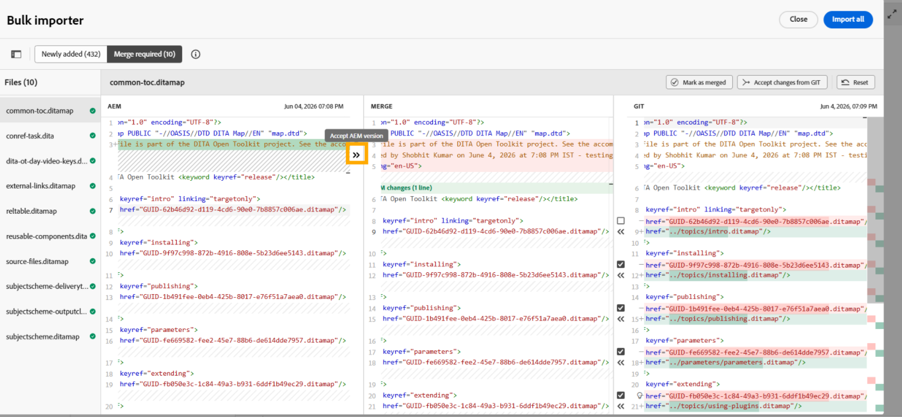
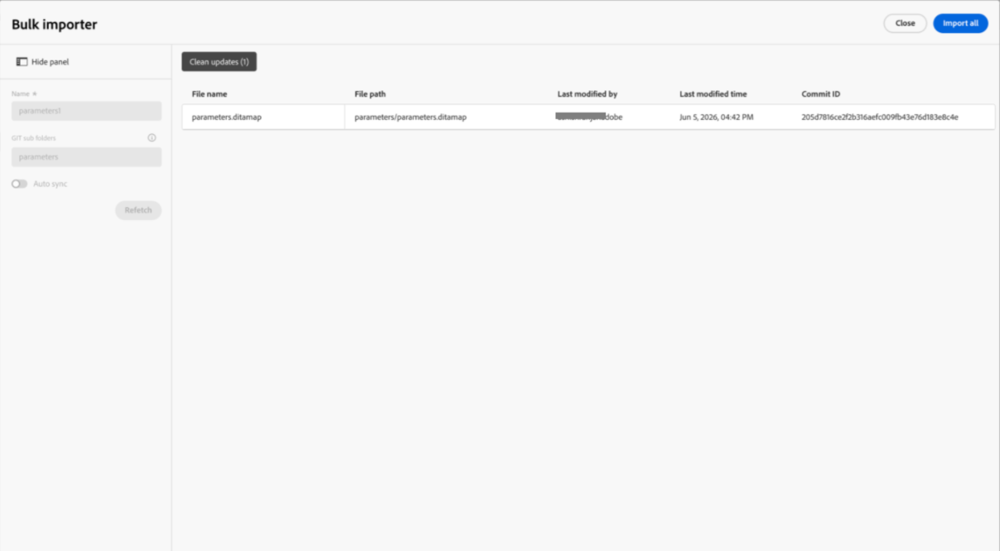

# Importar conteúdo usando o Conector Git (Beta)

>[!IMPORTANT]
>
> O Conector Git está disponível atualmente como um recurso do Beta e está desativado por padrão. Para ativar esse recurso, entre em contato com a equipe de Sucesso do cliente.

O Conector Git permite importar conteúdo de repositórios Git conectados para o Experience Manager Guides. Depois que o conteúdo for importado, você poderá usar os recursos de criação, revisão, tradução e publicação do Experience Manager Guides para desenvolver e entregar a documentação.

Quando o conteúdo é alterado no repositório de origem, você pode buscar novamente as atualizações, revisar os conflitos e sincronizar as alterações mais recentes com o Experience Manager Guides.

## Pré-requisitos

Antes de começar a usar esse recurso, verifique se:

- O recurso Conector Git deve estar habilitado para o seu ambiente.
- (*Se habilitado*) o administrador configurou o Conector Git no seu ambiente. Para obter detalhes, consulte [Criar e configurar o Conector Git na interface do usuário](../install-conf-guide/conf-git-connector.md).
- Você tem acesso de *Leitura* ao repositório Git que contém o conteúdo que deseja importar.
- Você sabe qual ramificação de repositório e pasta de origem deseja importar.
- Você sabe a pasta de destino no Experience Manager Guides onde o conteúdo importado será armazenado.

## Importar conteúdo do repositório Git conectado

Depois que o administrador configurar o Conector Git, você poderá usá-lo no Editor para começar a importar conteúdo de um repositório Git.  Execute as seguintes etapas para importar conteúdo de um repositório Git:

1. No Editor, abra o painel esquerdo.
1. Selecione **Fontes de dados**.

   As fontes de dados conectadas são exibidas.

1. Selecione o bloco **Conector Git**.

1. Selecione o ícone + e selecione **Importador em massa**.

   A caixa de diálogo **Importador em massa** é exibida.

   

1. Na caixa de diálogo **Importador em massa**, forneça um nome para a importação, selecione uma subpasta do repositório Git configurado e selecione **Salvar e Buscar**.  A lista de arquivos disponíveis para importação é exibida no diálogo. Revise a lista e valide o conteúdo antes de continuar.

   

1. Depois de revisar os arquivos, selecione **Importar tudo** para importar o conteúdo para o Experience Manager Guides.

   >[!NOTE]
   >
   > Você pode habilitar a **Sincronização automática** para sincronizar e importar automaticamente o conteúdo do seu repositório Git para o Experience Manager Guides. Se algum erro for detectado, a Sincronização Automática não será acionada e o Autor deverá importar o conteúdo manualmente selecionando **Importar tudo**. Depois de habilitada, a Sincronização automática não pode ser desabilitada para o importador.

Depois que o conteúdo é importado, ele é armazenado no **caminho raiz do AEM de destino** configurado ao configurar o Conector Git.

## Gerenciar conteúdo importado do Git

Depois que o conteúdo for importado para o Experience Manager Guides, você poderá usar as ações disponíveis para gerenciar o conteúdo e mantê-lo sincronizado com as alterações no repositório de origem.

{width="600"}

- **Visualizar**: visualizar conteúdo importado. Se o repositório de origem tiver atualizações, revise as diferenças e use a opção **Rebuscar** para importar as alterações mais recentes.
- **Excluir**: remova o conteúdo importado que não é mais necessário.
- **Renomear**: renomeie o conteúdo importado para facilitar a identificação.
- **Exibir log**: exiba o log de importação para examinar os detalhes da operação de importação.
- **Exibir Relatório**: exiba e baixe o **Relatório de importação em massa**, que inclui detalhes como:

   - número total de arquivos importados
   - número de importações com êxito
   - número de importações com falha

  {width="600"}

  Você também pode baixar o relatório detalhado. Se não for possível importar alguns arquivos, use **Repetir importações com falha** para tentar importá-los novamente.

## Revisar e resolver conflitos de conteúdo

Ao buscar novamente o conteúdo de um repositório Git, as diferenças no conteúdo entre a versão do repositório e o conteúdo correspondente disponível no Experience Manager Guides são exibidas como conflitos. Você deve resolver e mesclar esses conflitos antes de importar os dados para o Experience Manager Guides.

Execute as seguintes etapas para resolver e mesclar conflitos:

1. Abra a caixa de diálogo Importador em massa e selecione **Rebuscar**.
1. Se forem detectados conflitos, a guia **Mesclagem necessária** será exibida e listará os arquivos que contêm conflitos. Selecione a guia **Mesclagem necessária** e selecione um arquivo da lista para examinar e resolver os conflitos.
1. Revise o conteúdo nas seguintes seções:

   {width="600"}

   - Na seção **AEM**, a versão atual do conteúdo presente no Experience Manager Guides é exibida.
   - Na seção **Git**, a versão mais recente do conteúdo do repositório é exibida.
   - Na seção **Mesclar**, o conteúdo mesclado é exibido.

1. Revise as diferenças destacadas no editor e resolva os conflitos usando os controles de mesclagem:

   - Se quiser usar as alterações mais recentes do repositório Git, verifique se a caixa de seleção do conflito na seção **Git** está marcada e selecione o controle `<<<` correspondente. O conteúdo Git selecionado substitui o conteúdo conflitante na seção **Mesclar**.

     {width="600"}

   - Se quiser manter o conteúdo de ambas as versões, desmarque a caixa de seleção para o conflito e use o controle `<<<` para adicionar o conteúdo necessário à seção **Mesclar** sem substituir o conteúdo existente.

     {width="600"}

   - Da mesma forma, você pode usar o controle `>>>` na seção AEM para manter a versão disponível no momento no Experience Manager Guides.

     {width="600"}

1. Depois de revisar o conteúdo mesclado, execute uma das seguintes ações:

   - Use **Aceitar alterações do Git** quando a versão do repositório precisar substituir o conteúdo conflitante.
   - Use **Marcar como mesclado** depois de revisar e atualizar a versão mesclada para garantir que ela contenha o conteúdo que você deseja manter.
   - Use **Redefinir** para descartar todas as atualizações mescladas e restaurar o conteúdo ao seu estado original.

Depois que todos os arquivos contendo os conflitos forem marcados como mesclados, o botão **Importar tudo** será habilitado. Selecione **Importar tudo** para concluir o processo de resolução de conflitos.

Se o repositório tiver conteúdo totalmente novo, como um novo tópico, parágrafo ou linha que não entre em conflito com o conteúdo existente, ele será exibido em **Limpar atualizações**. Essas atualizações não exigem resolução de conflitos e podem ser importadas diretamente.

{width="600"}

