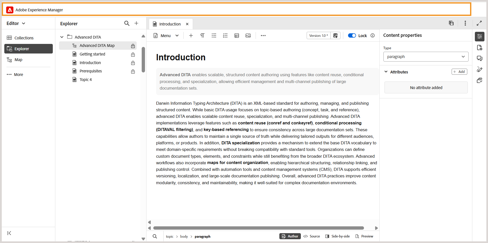

# Barra de cabeçalho no editor

A barra de cabeçalho é a barra superior do Editor que exibe o logotipo do Adobe Experience Manager (ou um Unified Shell, se você estiver usando o Unified Shell como a interface do Experience Manager Guides). Ao selecionar o logotipo, ele direciona você para a página Navegação do Experience Manager.

>[!BEGINTABS]

>[!TAB Novo editor]

Esta visualização mostra como o conteúdo é renderizado no Novo editor

>[!TAB Editor Antigo]

Esta visualização mostra como o conteúdo é renderizado no Editor antigo

>[!ENDTABS]

Use o ícone **Expandir** na barra de ferramentas para ocultar a barra de cabeçalho e maximizar a área de conteúdo. Para restaurar o modo de exibição padrão, selecione **Sair do modo de exibição expandido**.

{width="350"}

**Tópico pai:**&#x200B;[&#x200B; Introdução ao Editor](web-editor.md)
