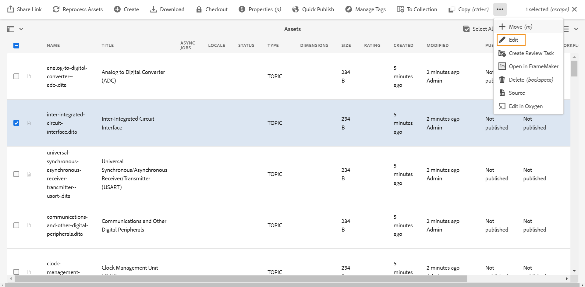

# Iniciar o editor {#id2056B0140HS}

Você pode iniciar o Editor nos seguintes locais:

- [Página de navegação do Adobe Experience Manager](#adobe-experience-manager-navigation-page)
- [Interface do usuário do Adobe Experience Manager Assets](#adobe-experience-manager-assets-ui)
- [Mapear console](#map-console)

As seções a seguir abordam os detalhes de como você pode acessar e iniciar o Editor de vários locais.

## Página de navegação do Adobe Experience Manager

Ao fazer logon no Experience Manager, você verá a página Navegação:

{width="800" align="left"}

Ao selecionar o link **Guias**, você será direcionado para a [Página inicial do Adobe Experience Manager Guides](./intro-home-page.md).

{width="800" align="left"}

Para iniciar o Editor, vá para a barra de navegação e selecione **Editor** na lista suspensa. A página inicial é selecionada por padrão.

{width="350" align="left"}

Como você iniciou o Editor sem selecionar nenhum arquivo, uma tela em branco do Editor é exibida. Você pode abrir um arquivo para edição no **Repositório** da Experience Manager ou em suas **Coleções**.

{width="800" align="left"}

Como alternativa, você também pode iniciar o Editor abrindo os arquivos existentes presentes no widget **Arquivos recentes** e **Coleções** da [experiência da página inicial do Adobe Experience Manager Guides](./intro-home-page.md).

Para voltar para a página Navegação no Experience Manager, selecione o logotipo do Adobe Experience Manager localizado no canto superior esquerdo do cabeçalho superior.

## Interface do usuário do Adobe Experience Manager Assets

Outro local onde é possível iniciar o Editor é na interface do usuário do Experience Manager Assets. Você pode selecionar um ou mais tópicos e abri-los diretamente no Editor.

Para abrir um tópico no Editor, siga estas etapas:

1. Na interface do usuário do Assets, navegue até o tópico que deseja editar.

   >[!NOTE]
   >
   > Você também pode exibir a UUID do tópico.

   {width="800" align="left"}

   >[!IMPORTANT]
   >
   > Certifique-se de que você tenha as permissões de leitura e gravação na pasta que contém o tópico que deseja editar.

1. Para obter um bloqueio exclusivo sobre o tópico, selecione o tópico e **Check-out**.

   >[!IMPORTANT]
   >
   > Se o administrador tiver configurado a opção **Desabilitar edição sem bloquear o arquivo**, você deverá fazer check-out do arquivo antes de editar. Se não fizer check-out do arquivo, você não poderá visualizar a opção de edição.

1. Feche o modo de seleção de ativos e selecione o tópico que deseja editar.

   A visualização do tópico é exibida.

   É possível abrir o Editor na exibição de Lista, na exibição de Cartão e no modo de Visualização.

   >[!IMPORTANT]
   >
   > Se quiser abrir vários tópicos para edição, selecione os tópicos desejados na interface do usuário do Assets e selecione **Editar**. Certifique-se de que o navegador não tenha um bloqueador de pop-ups ativado, caso contrário, somente o primeiro tópico na lista selecionada será aberto para edição.

   {width="800" align="left"}

   Se você não quiser visualizar um tópico e quiser abri-lo diretamente no Editor, selecione o ícone **Editar** no menu de ação rápida da exibição de cartão:

   {width="800" align="left"}

   O tópico é aberto no Editor.

   {width="800" align="left"}

Você também pode abrir um arquivo de mapa na interface do usuário do Assets e iniciar o Editor para editar os tópicos no arquivo de mapa.

Para abrir um mapa no Editor, siga estas etapas:

1. Na interface do usuário do Assets, navegue até o arquivo de mapa que contém o tópico que deseja editar e selecione-o.
1. No console do mapa DITA, navegue até a guia **Tópicos**. Uma lista de tópicos no arquivo de mapa é exibida.
1. Selecione o arquivo de tópico que deseja editar.
1. Selecione **Editar Tópico**.

   {width="800" align="left"}

1. O tópico é aberto no Editor.

   >[!IMPORTANT]
   >
   > Se o administrador tiver configurado a opção **Desabilitar edição sem bloquear o arquivo**, você deverá fazer check-out do arquivo antes de editar. Se você não fizer check-out do arquivo, o documento será aberto no editor no modo somente leitura.

## Mapear console

Para abrir o Editor no console Mapa, siga estas etapas:

1. Abra a página inicial e inicie o console Mapa.

   {width="350" align="left"}

   Como você iniciou o console de Mapa sem selecionar nenhum arquivo de mapa, uma tela em branco do console de Mapa é exibida. Você também pode abrir um arquivo de mapa no **Repositório** da Experience Manager ou em suas **Coleções**.

   {width="500" align="left"}

1. Escolha **Selecionar mapa** para abrir um arquivo de mapa contendo os tópicos que você deseja editar no Editor.
1. Selecione o caminho onde o arquivo de mapa está localizado. O arquivo de mapa selecionado é adicionado ao console Mapa.
1. Navegue até o arquivo de mapa e selecione **Abrir no editor** na lista suspensa.

   {width="800" align="left"}

   O arquivo de mapa que contém os tópicos está aberto para edição no Editor.

   {width="800" align="left"}

**Tópico pai**: [Introdução ao Editor](web-editor.md)
