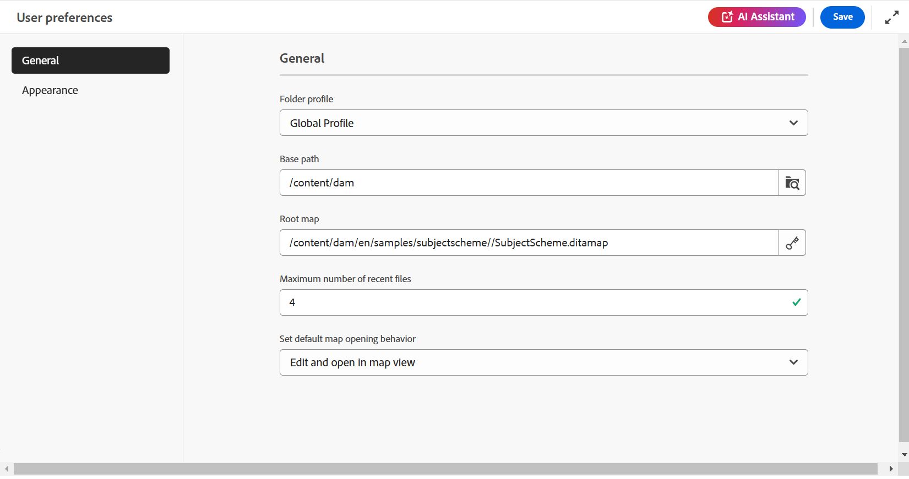
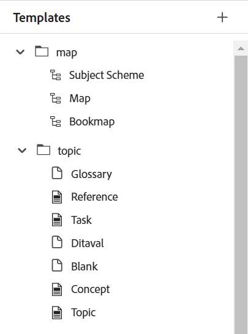
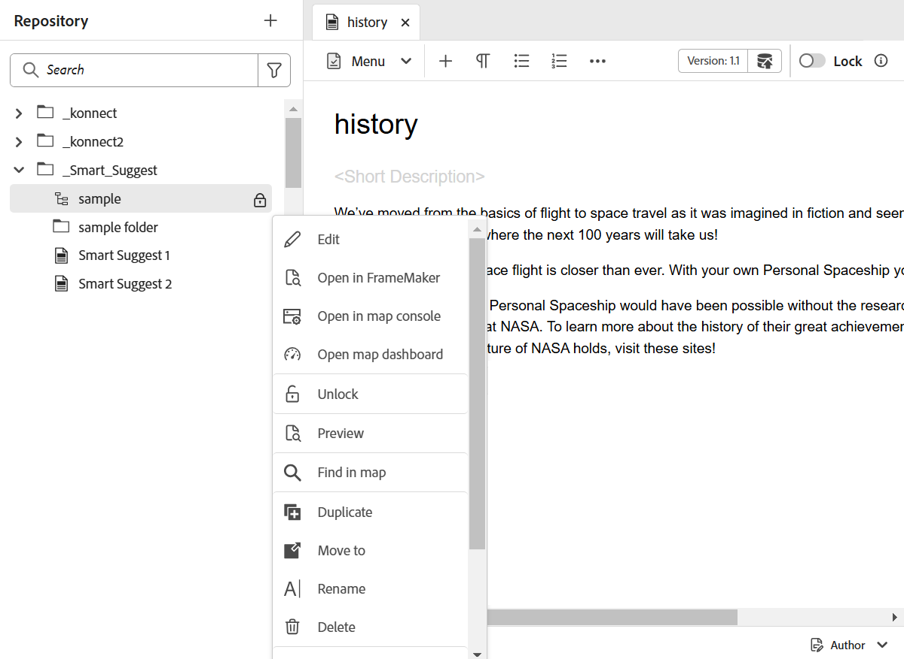

# Painel esquerdo no editor

O painel esquerdo fornece acesso rápido a Coleções, Exibição de repositório, Exibição de mapa e muito mais recursos. Você pode expandir o painel selecionando o ícone **Expandir** posicionado no canto inferior esquerdo da interface. Depois de expandido, use o ícone **Recolher** para recolher o painel. Na exibição expandida, ele mostra os nomes dos ícones que aparecem como dicas de ferramentas na exibição recolhida.

>[!NOTE]
>
>O painel esquerdo é redimensionável. Para redimensionar o painel, coloque o cursor no limite do painel, o cursor se transformará em uma seta de duas pontas, selecione e arraste para redimensionar a largura do painel.

O painel esquerdo fornece acesso aos seguintes recursos:

- [Coleções](#collections)
- [Repositório](#repository)
- [Explorer](#explorer)
- [Mapa](#map)
- [Conteúdo reutilizável](#reusable-content)
- [Estrutura](#outline)

Alguns dos recursos no painel esquerdo estão disponíveis na seção **Mais**. Selecione o ícone Mais  para acessar os recursos abaixo:

- [Glossário](#glossary)
- [Condições](#conditions)
- [Esquema do assunto](#subject-scheme)
- [Trechos](#snippets)
- [Modelos](#templates)
- [Citações](#citations)
- [Variáveis de idioma](#language-variables)
- [Variáveis](#variables)
- [Localizar e substituir](#find-and-replace)
- [Modelos do PDF](#pdf-templates)
- [Revisar](#review)


Uma opção adicional rotulada como **Workfront** também será exibida no painel esquerdo se o Adobe Workfront estiver configurado.

Para obter detalhes, consulte [integração com o Workfront](./workfront-integration.md).

>[!NOTE]
>
> Os recursos disponíveis no painel esquerdo são gerenciados pelo administrador, permitindo que eles ativem ou desativem os recursos individuais presentes no painel esquerdo. Somente os recursos ativados são exibidos no painel esquerdo. Para obter mais detalhes, exiba a seção **Painéis** da [Barra de guias](./web-editor-tab-bar.md).

A explicação detalhada dos recursos do painel esquerdo é a seguinte:

## Coleções

Se você trabalhar em um conjunto de arquivos ou pastas, poderá adicioná-los à sua lista de favoritos para acessá-los rapidamente. **Coleções** mostra a lista de documentos que você adicionou e outras listas de documentos acessíveis publicamente de outros usuários.

Por padrão, é possível visualizar os arquivos por títulos. Ao passar o mouse sobre um arquivo, é possível visualizar o título do arquivo e o caminho do arquivo como uma dica de ferramenta.

>[!NOTE]
>
> Como administrador, você também pode optar por visualizar a lista de arquivos por nomes de arquivo no Editor. Selecione a opção **Nome do arquivo** da seção **Configuração de exibição dos arquivos do editor** em **Preferências do usuário**.

<details>
    <summary> Criar uma nova coleção </summary>


Para criar uma nova coleção, selecione o ícone + ao lado do painel Coleções para exibir a caixa de diálogo **Nova coleção**:

{width="300" align="left"}

Insira um título e uma descrição para a coleção que você deseja criar. Se você selecionar **Público**, este favorito será mostrado aos outros usuários também.

>[!NOTE]
>
> Você também pode criar uma coleção na página inicial do Experience Manager Guides. Abra a página inicial, navegue até o widget **Coleções** na [seção Visão geral](./intro-home-page.md#overview) e selecione **Nova coleção**.

</details>

<details>
    <summary> Adicionar um arquivo às coleções </summary>


Para adicionar um arquivo a coleções, use um dos seguintes métodos:

- Navegue até o arquivo ou pasta necessário no modo de exibição Repositório, selecione o ícone *Opções* para abrir o menu de contexto e escolha **Adicionar a** > **Coleções**. Na caixa de diálogo **Adicionar às coleções**, você pode optar por adicionar o arquivo/pasta a um favorito existente ou criar um novo.

  {width="300" align="left"}

- Clique com o botão direito do mouse na guia de um arquivo no editor para abrir o menu de contexto. Escolha **Adicionar a** > **Coleções** para adicionar o arquivo à lista de favoritos.

  {align="left"}


>[!NOTE]
>
> - Para remover um item da lista de favoritos, selecione o ícone Opções ao lado do item em uma coleção de Favoritos e escolha **Remover das coleções**.
> - Para visualizar o arquivo sem abri-lo, selecione um arquivo e, em seguida, selecione **Visualizar** no menu Opções.

</details>

**Menu de opções de uma coleção**

Também é possível executar muitas ações usando o menu Opções disponível para uma Coleção:

{width="650" align="left"}

- **Renomear**: renomear a coleção selecionada.
- **Excluir**: excluir a coleção selecionada.
- **Atualizar**: obtenha uma lista atualizada de arquivos e pastas do Repositório.
- **Exibir na Interface do Usuário do Assets**: mostrar o conteúdo do arquivo ou da pasta na Interface do Usuário do Assets.

>[!NOTE]
>
> Você pode atualizar a lista usando o ícone **Atualizar** na parte superior. Além disso, atualizar a lista recarrega as coleções e, como resultado, qualquer coleção expandida no painel é recolhida.


## Repositório

>[!NOTE]
>
> A partir da versão 2025.11.0, o **Repositório** no Editor será substituído pelo **Explorer** para a configuração do **Cloud service**. Para a configuração **No local**, você continuará a visualizar e usar o Repositório por meio da interface do Editor até a versão 5.1 do Experience Manager Guides.

Ao selecionar o ícone Repositório, você obtém uma lista de arquivos e pastas disponíveis no DAM. Por padrão, é possível visualizar os arquivos por títulos. Ao passar o mouse sobre um arquivo, é possível exibir o título e o nome do arquivo como uma dica de ferramenta.

>[!NOTE]
>
> Como administrador, você também pode optar por visualizar a lista de arquivos por nomes de arquivo no Editor. Selecione a opção **Nome do arquivo** da seção **Configuração de exibição dos arquivos do editor** em **Preferências do usuário**.

São carregados 75 arquivos de cada vez. Cada vez que você seleciona **Carregar mais**... 75 arquivos são carregados e o botão para de ser exibido quando todos os arquivos forem listados. Esse carregamento em lote é eficiente, e você pode acessar os arquivos mais rapidamente em comparação ao carregamento de todos os arquivos existentes em uma pasta.

Você pode navegar facilmente para o arquivo necessário no DAM e abri-lo no Editor. Se você tiver o acesso necessário para editar o arquivo, poderá fazê-lo.

Você também pode selecionar e reproduzir um arquivo de áudio ou vídeo no Editor. Você pode alterar o volume ou
a visualização do vídeo. No menu de atalho, você também tem as opções para baixar, alterar a reprodução
velocidade ou visualizar imagem na imagem.

Selecione um mapa e pressione Enter ou clique duas vezes para abri-lo na **Exibição do mapa**. Para obter mais detalhes, consulte a descrição do recurso **Exibição de mapa** no painel esquerdo. Selecione um tópico e pressione Enter ou clique duas vezes para abri-lo na [área de edição de conteúdo](./web-editor-content-editing-area.md). Ser capaz de navegar e abrir um arquivo diretamente do Editor economiza tempo e aumenta a produtividade.

## Filtrar pesquisa no repositório

O Editor fornece filtros aprimorados para pesquisar texto. Você pode pesquisar e filtrar por um texto nos arquivos presentes no caminho selecionado do repositório do Adobe Experience Manager. Ele pesquisa o título, o nome do arquivo e o conteúdo nos arquivos.


{width="300" align="left"}

*Aplicar filtros para procurar os arquivos contendo o texto`personal spaceship.`*

Selecione o ícone **Filtrar pesquisa** \(\) para abrir o pop-up Filtro.

>[!NOTE]
>
> Quando você pesquisa qualquer texto ou filtra qualquer arquivo, um ponto azul é exibido no ícone **Filtrar pesquisa** \(\) para indicar que estamos no painel de pesquisa e que alguns filtros foram aplicados.


Você tem as seguintes opções para filtrar os arquivos e restringir sua pesquisa no repositório do Adobe Experience Manager:

- **Arquivos DITA**: você pode procurar todos os **tópicos DITA** e **mapas DITA** presentes no caminho selecionado. Elas são selecionadas por padrão.
- **Arquivos não DITA**: você pode pesquisar por **Arquivos Ditaval**, **Arquivos de Imagem**, **Multimídia**, **Documentos** e **JSON** no caminho selecionado.

   {width="300" align="left"}

  *Use os filtros rápidos para procurar arquivos DITA e não DITA.*

>[!NOTE]
>
> Você também pode usar o filtro **Tópico DITA** para pesquisar conteúdo específico para arquivos Markdown no repositório, incluindo títulos, conteúdo de tópico e propriedades. No momento, esse recurso se aplica somente aos arquivos recém-criados do Markdown.

**Filtragem avançada**

Selecione o ícone **Filtragem avançada** para exibir a caixa de diálogo **Filtro avançado**.

Você pode exibir as seguintes opções nas guias **Geral** e **Avançado**.

 {width="650" align="left"}


**Geral**

- **Resultados da pesquisa com**: procure algum texto nos arquivos presentes no caminho selecionado do repositório do Adobe Experience Manager. O texto é pesquisado no título, nome de arquivo e conteúdo nos arquivos.

Está sincronizado com a caixa de pesquisa na janela do repositório. Por exemplo, se você digitar `general purpose` na caixa de pesquisa no painel do repositório, ele também aparecerá na caixa de diálogo **Filtro avançado** e vice-versa.

- **Pesquisar em**: selecione o caminho em que deseja pesquisar os arquivos presentes no repositório do Adobe Experience Manager.
- **Arquivos DITA**: você pode procurar todos os **tópicos DITA** e **mapas DITA** presentes no caminho selecionado. Elas são selecionadas por padrão.
- **Arquivos não DITA**: você pode pesquisar por **Arquivos Ditaval**, **Arquivos de Imagem**, **Multimídia**, **Documentos** e **JSON** no caminho selecionado.
- **Bloqueado por**: exibe uma lista de usuários. A lista é paginada e carregada de forma assíncrona, mostrando um conjunto limitado de usuários de cada vez e buscando mais à medida que você rola a tela ou navega. Isso melhora a velocidade de carregamento e o desempenho geral, especialmente ao trabalhar com um grande número de usuários.
- **Modificado após** / **Modificado antes**: filtre o conteúdo com base na data de modificação. Selecione um intervalo de datas no calendário ou escolha uma das seguintes opções de intervalo de tempo:
   - Nas últimas duas horas
   - Na semana passada
   - No mês passado
   - No ano passado
- **Marcas**: filtrar conteúdo com base em marcas.

**Avançado**

- **Elementos DITA**: você também pode procurar valores específicos nos atributos dos elementos DITA especificados.
   - Selecione **Adicionar elemento** para adicionar os elementos, atributos e valores.
   - Aplique os filtros selecionados.

- Selecione **Limpar tudo** para limpar todos os filtros aplicados.


- Selecione o ícone **Fechar filtro**  para fechar o filtro e retornar ao modo de exibição de árvore do repositório.

  >[!NOTE]
  >
  >O administrador do sistema também pode configurar os filtros de texto e mostrar ou ocultar outros filtros. Para obter mais detalhes, consulte a seção *Configurar filtros de texto* em Instalar e configurar o Adobe Experience Manager Guides as a Cloud Service.
  >
  >A lista de arquivos filtrados que contêm o texto pesquisado é exibida. Por exemplo, os arquivos contendo o texto `personal spaceship` estão listados na captura de tela anterior. Você pode selecionar vários arquivos da lista filtrada para arrastá-los e soltá-los em um mapa aberto para edição.

### Menu Opções

Além de abrir arquivos no painel esquerdo, você também pode executar muitas ações usando o menu Opções disponível na visualização Repositório. Você verá diferentes opções, dependendo se você escolhe uma pasta, um arquivo de tópico ou um arquivo de mídia.

**Opções de uma pasta**

Você pode executar as seguintes ações usando o menu Opções disponível para uma *pasta* na exibição Repositório:

{width="550" align="left"}


- **Novo**: crie um novo tópico DITA, mapa DITA ou uma pasta.

<details>
    <summary> Etapas para criar um novo tópico </summary>

Etapas para criar um novo tópico:

1. Selecione **Novo** > **Tópico**.
1. A caixa de diálogo **Novo tópico** é exibida.

   {width="300" align="left"}

1. Na caixa de diálogo **Novo tópico**, forneça os seguintes detalhes:
   - Um Título para o tópico.
   - \(Opcional\)* O nome do arquivo do tópico. O nome do arquivo é sugerido automaticamente com base no tópico Título. Caso o administrador tenha ativado nomes de arquivo automáticos com base na configuração UUID, você não visualizará o campo Nome.
   - Um modelo no qual o tópico será baseado. Por exemplo, para uma configuração pronta para uso, você pode escolher entre os modelos Em branco, Conceito, DITAVAL, Referência, Tarefa, Tópico, Markdown, Glossário e Solução de problemas. Se a pasta tiver um Perfil de Pasta configurado, você visualizará somente os modelos de tópico configurados no perfil de Pasta.

   - Caminho no qual você deseja salvar o arquivo de tópico. Por padrão, o caminho da pasta selecionada no momento no repositório é mostrado no campo Caminho.
1. Selecione **Criar**. O tópico é criado no caminho especificado. Além disso, o tópico é aberto no Editor para edição.

</details>

<details>
<summary> Etapas para criar um novo mapa DITA </summary>


Etapas para criar um novo mapa DITA:

1. Selecione **Novo** > **Mapa DITA**.
2. A caixa de diálogo **Novo mapa** é exibida.

   {width="300" align="left"}

3. Na caixa de diálogo **Novo mapa**, forneça os seguintes detalhes:
   - Um Título para o mapa.
   - *\(Opcional\)* O nome de arquivo do mapa. O nome do arquivo é sugerido automaticamente com base no título do mapa. Caso o administrador tenha ativado nomes de arquivo automáticos com base na configuração UUID, você não visualizará o campo Nome.
   - Um modelo no qual o mapa será baseado. Por exemplo, para uma configuração pronta para uso, é possível escolher entre os modelos de mapa Bookmap ou DITA.
   - Caminho no qual você deseja salvar o arquivo de mapa. Por padrão, o caminho da pasta selecionada no momento no repositório é mostrado no campo Caminho.
4. Selecione **Criar**. O mapa é criado e adicionado na pasta especificada no campo Path. Além disso, o mapa é aberto na visualização Mapa. Você pode abrir o arquivo de mapa no Editor de mapa e adicionar tópico a ele. Para obter mais informações sobre como adicionar tópicos a um arquivo de mapa, exiba [Criar um mapa](map-editor-create-map.md#). Como alternativa, selecione **Abrir no console de mapa** para abrir o mapa no console de Mapa.
</details>

<details>
<summary> Etapas para criar uma nova pasta </summary>

Etapas para criar uma nova pasta:

1. Selecione **Nova** > **Pasta**.
2. A caixa de diálogo **Nova pasta** é exibida.

   {width="300" align="left"}

3. Na caixa de diálogo **Nova pasta**, forneça os seguintes detalhes:
   - Um Título para a pasta, que é convertido automaticamente no nome da pasta.
   - Caminho no qual você deseja salvar a pasta. Por padrão, o caminho da pasta selecionada no momento no repositório é mostrado no campo Caminho.
4. Selecione **Criar**. A pasta é criada e adicionada à pasta de onde a opção criar pasta foi executada.

</details>

- **Carregar ativos**: carregue um arquivo do sistema local para a pasta selecionada no repositório do Adobe Experience Manager. Você também pode arrastar e soltar arquivos do seu sistema local no tópico de trabalho atual. Isso é muito útil se você quiser inserir imagens do sistema local no tópico.

  {width="300" align="left"}

  É possível selecionar uma pasta na qual deseja fazer upload do arquivo, e uma visualização da imagem também é exibida. Se desejar renomear o arquivo, faça isso na caixa de texto nome do arquivo. Selecione **Carregar** para concluir o processo de carregamento de arquivos. Se você tiver arrastado e soltado um arquivo de imagem em um tópico, o arquivo de imagem será adicionado ao artigo e também será carregado.

  Se o administrador tiver habilitado a opção UUIDs no *XMLEditorConfig*, você exibirá a UUID da imagem carregada na propriedade **Source**.

  {align="left"}

  Após um upload bem-sucedido, a seguinte caixa de diálogo de confirmação será exibida:

  

  <details>

  <summary>Manipulação de caracteres inválidos em nomes de arquivo</summary>

  Se o nome do arquivo do ativo que está sendo carregado contiver caracteres inválidos (como * / : [\] | # % { } ?), os seguintes cenários podem ocorrer:

   - **Carregamento parcial**: indica que um ou mais ativos que estão sendo carregados contêm caracteres inválidos em seus nomes de arquivo.

     

   - **Falha ao Carregar** : indica que todos os ativos que estão sendo carregados contêm caracteres inválidos em seus nomes de arquivo.

     

  Para resolver esses conflitos, remova os caracteres inválidos dos nomes de arquivo dos ativos e, em seguida, faça upload deles novamente para o repositório.

  </details>

- **Atualizar**: obtenha uma lista atualizada de arquivos e pastas do repositório.
- **Recolher**: recolher a pasta selecionada no repositório.

  >[!NOTE]
  >
  > Use o ícone **\>** ao lado de uma pasta para expandi-la.

- **Localizar arquivos na pasta**: desloca o foco para a pesquisa no repositório onde você pode inserir o termo de pesquisa. A pesquisa é realizada na pasta selecionada no repositório. Você também pode aplicar um filtro para retornar Arquivos DITA, Arquivos de imagem ou ambos.

  {width="300" align="left"}

  Também é possível pesquisar usando a UUID de um arquivo. Nesse caso, os resultados da pesquisa exibem o título do arquivo DITA/XML e, caso o arquivo seja um arquivo de imagem, a UUID do arquivo é exibida. No exemplo de pesquisa a seguir, a UUID de um arquivo de imagem é pesquisada e os resultados da pesquisa exibem a UUID do arquivo de imagem original e o título do tópico do arquivo ao qual essa imagem é referenciada.

  {width="300" align="left"}

- **Adicionar às coleções**: adiciona a pasta selecionada aos favoritos. Você pode optar por adicioná-la a uma coleção existente ou nova.

- **Reprocessar ativos**: aciona o processamento de todos os ativos da pasta.
- **Exibir na interface do usuário do Assets**: mostrar o conteúdo da pasta na interface do usuário do Assets.

**Opções para um arquivo**

Obtenha acesso a diferentes opções no menu Opções dependendo se você seleciona um arquivo de mídia ou um arquivo DITA. Algumas opções comuns disponíveis para arquivos de mídia e DITA são:

- Editar
- Abrir no FrameMaker
- Duplicado
- Bloquear/desbloquear
- Visualização
- Mover para
- Renomear
- Excluir
- Gerar
- Baixar como PDF
- Adicionar a
- Copiar
- Reprocessar ativo
- Exibir na interface do usuário do Assets
- Propriedades


{width="550" align="left"}

As várias opções no menu Opções são explicadas abaixo:

- **Editar**: abrir o arquivo para edição. No caso de um arquivo .ditamap/.bookmap, ele é aberto no [Editor de Mapas](map-editor-advanced-map-editor.md#) para edição.

- **Editar no Oxygen**: selecione essa opção para editar o arquivo selecionado no plug-in do conector do Oxygen. O arquivo está aberto para edição.

  >[!NOTE]
  >
  >Entre em contato com a equipe de sucesso do cliente para habilitar esse recurso no ambiente. Isso não é ativado como parte do suporte pronto para uso. Para obter mais detalhes, exiba a opção [Configurar a opção para editar no Oxygen](../cs-install-guide/conf-edit-in-oxygen.md) na seção do Guia de Instalação e Configuração.

- **Abrir no painel de mapa**: caso o arquivo selecionado seja um mapa DITA, essa opção abrirá o painel de mapa.

- **Abrir no console de mapa**: caso o arquivo selecionado seja um mapa DITA, essa opção abrirá o console de mapa.

- **Bloqueio**: obtenha um bloqueio no arquivo selecionado para edição. Se o arquivo estiver bloqueado, passar o ponteiro do mouse sobre o ícone de bloqueio mostrará **Bloqueado por você** se você o bloqueou, ou **Bloqueado por [nome de usuário]** se outro usuário o bloqueou.

- **Visualização**: obtenha uma visualização rápida do arquivo (.dita, .xml, áudio, vídeo ou imagem) sem abri-lo. É possível redimensionar o painel de visualização. Se o conteúdo contiver qualquer `<xref>` ou `<conref>`, você poderá selecioná-lo para abri-lo em uma nova guia. O título do arquivo aparece na janela. Se nenhum título estiver presente, o nome do arquivo será exibido. Para fechar o painel **Visualização**, você pode selecionar o ícone de fechamento ou qualquer lugar fora do painel.

  {align="left"}


- **Duplicar**: use esta opção para criar uma duplicata ou uma cópia do arquivo selecionado. Você também tem a opção de renomear o arquivo duplicado no prompt Duplicar ativo. Por padrão, o arquivo é criado com um sufixo \(como nomedoarquivo\_1.extensão\). O título do arquivo permanece o mesmo do arquivo de origem, e o novo arquivo começa com a versão 1.0. Todas as referências, tags e metadados são copiados, enquanto as linhas de base não são copiadas no arquivo duplicado.

- **Mover para**: use esta opção para mover o arquivo selecionado para outra pasta.
   - Você pode digitar o nome da pasta de destino ou escolher **Selecionar caminho** para selecionar a pasta de destino.
   - É possível mover um arquivo de qualquer tipo para qualquer destino na pasta Conteúdo.
   - Dois arquivos não podem ter o mesmo nome. Portanto, não é possível mover um arquivo para uma pasta na qual já exista um arquivo com o mesmo nome.

  Se você tentar mover um arquivo para uma pasta onde existe um arquivo com o mesmo nome mas com um título diferente, a caixa de diálogo Renomear e mover arquivo é exibida e você precisa renomear o arquivo antes de movê-lo. O arquivo movido na pasta de destino tem o novo nome de arquivo.

  {width="550" align="left"}

  >[!NOTE]
  >
  > Você também pode arrastar e soltar um arquivo em outra pasta de destino.

  **Cenários de exclusão**

  O Experience Manager Guides não permite renomear ou mover um arquivo nos seguintes cenários:

   - Não é possível mover ou renomear um arquivo se ele fizer parte de um fluxo de trabalho de revisão ou tradução.

   - Se qualquer outro usuário bloquear o arquivo, você não poderá renomeá-lo ou movê-lo. Você não visualizará a opção Renomear ou Mover para do arquivo.

  >[!NOTE]
  >
  > Se o administrador concedeu a você as permissões em uma pasta, apenas as opções **Renomear** ou **Mover para** serão exibidas.

  <details>
    <summary> Cloud Services </summary>

  Renomear ou mover qualquer arquivo não interrompe nenhuma referência existente do ou para o arquivo, pois cada arquivo tem uma UUID exclusiva.
  </details>

- **Renomear**: use esta opção para renomear o arquivo selecionado. Digite o nome do novo arquivo na caixa de diálogo **Renomear ativo**.
   - É possível renomear arquivos de qualquer tipo.
   - Não é possível alterar a extensão de um arquivo.
   - Dois arquivos não podem ter o mesmo nome. Portanto, não é possível renomear um arquivo com um nome que já existe. Um erro é exibido.

- **Excluir**: use esta opção para excluir o arquivo selecionado. Um prompt de confirmação é exibido antes de excluir o arquivo.

   - Um prompt de confirmação é exibido antes de excluir o arquivo.
   - Se o arquivo não for referenciado a partir de outro arquivo, ele será excluído e uma mensagem de sucesso será exibida.
   - Se o arquivo estiver bloqueado, não será possível excluí-lo e uma mensagem de erro será exibida.

     >[!NOTE]
     >
     > Se o administrador tiver impedido a exclusão de arquivos bloqueados, somente a mensagem de erro será exibida. Para obter mais detalhes, consulte *Impedir exclusão de arquivos com check-out* na seção Instalar e configurar o Adobe Experience Manager Guides as a Cloud Service.

   - Se o arquivo for adicionado a uma coleção, a caixa de diálogo **Forçar Exclusão** será exibida e você poderá excluí-la à força.
   - Se o arquivo for referenciado a partir de qualquer outro arquivo, a caixa de diálogo **Forçar Exclusão** com a mensagem de confirmação será exibida e você poderá forçar a exclusão do arquivo:

     {width="300" align="left"}

     >[!NOTE]
     >
     > Se o administrador concedeu permissão para excluir o arquivo, a **Exclusão Forçada** será habilitada. Senão, **Forçar Exclusão** está desabilitado e será exibida uma mensagem informando que você não tem permissão para excluir os arquivos referenciados. Para obter mais detalhes, consulte *Impedir exclusão dos arquivos referenciados* na seção Instalar e configurar o Adobe Experience Manager Guides as a Cloud Service.

   - Se você excluir um tópico referenciado e tiver aberto o arquivo contendo referências para edição, ele mostrará o link corrompido para o arquivo referenciado.

  >[!NOTE]
  >
  > Você também pode excluir o arquivo selecionado de forma semelhante usando a tecla Delete do teclado.

- **Gerar**: use a opção para publicar um mapa ou tópicos em um mapa em uma página do Sites, Fragmento de Conteúdo ou Fragmento de Experiência.

- **Adicionar a**: você pode escolher entre as seguintes opções:
   - **Coleções**: adiciona o arquivo selecionado às Coleções. Você pode optar por adicioná-la a uma coleção existente ou nova.

   - **Conteúdo reutilizável**: adiciona o arquivo selecionado à lista de conteúdo reutilizável no painel esquerdo.

- **Copiar**: você pode escolher entre as seguintes opções:

   - **Copiar UUUID**: Copiar a UUID do arquivo selecionado para a Área de Transferência.

   - **Copiar Caminho**: Copie o caminho completo do arquivo selecionado para a Área de Transferência.

- **Reprocessar ativo**: aciona o processamento para o ativo selecionado.

- **Exibir na interface do usuário do Assets**: use esta opção para mostrar uma visualização de um arquivo .dita/.xml na interface do usuário do Assets. No caso de um arquivo .ditamap/.bookmap, todos os arquivos de tópico no mapa são mostrados em uma única exibição unificada página por página.

- **Propriedades**: use esta opção para abrir a página de propriedades do arquivo selecionado.

  Qualquer adição, exclusão ou modificação das propriedades de metadados nesta página (seja padrão ou personalizada) acionará o [indicador de cópia de trabalho](./web-editor-edit-topics.md#working-copy-indicator) na versão do documento.

  Você também pode acessar a página Propriedades na interface do usuário do Assets selecionando um arquivo e, em seguida, o ícone Propriedades na barra de ferramentas.

- **Baixar como PDF**: use a opção para gerar a saída do PDF e baixá-la.

## Explorer

>[!NOTE]
>
> A partir da versão 2025.11.0, o termo Repositório no Editor será substituído por **Explorer** para configuração do serviço na nuvem. A configuração no local continuará a ver e acessar o Repositório no Editor.

O Explorer fornece a maioria dos recursos disponíveis anteriormente no Repository, incluindo:

- Navegação pelos arquivos e pastas
- Menu de opções para arquivos e pastas

Mas apresenta uma experiência aprimorada de pesquisa e filtragem, projetada para melhorar a usabilidade e a eficiência.

Para obter informações detalhadas sobre o menu de contexto de arquivos e pastas, exiba o [menu Opções](#options-menu).

Para obter informações detalhadas sobre a experiência de Pesquisa, consulte o [painel de Pesquisa](./search-panel-explorer.md).

## Mapa

Quando você seleciona o ícone Exibição de mapa, a exibição de mapa é exibida, onde uma lista de tópicos dentro do arquivo de mapa é exibida. Se você não tiver aberto nenhum arquivo de mapa, a exibição Mapa aparecerá em branco. Clicar duas vezes em qualquer arquivo de mapa abre o arquivo de mapa nesta exibição. Você pode clicar duas vezes em qualquer arquivo no mapa para abri-lo no Editor.

Por padrão, é possível visualizar os arquivos por títulos. Ao passar o mouse sobre um arquivo, é possível visualizar o título do arquivo e o caminho do arquivo como uma dica de ferramenta.

>[!NOTE]
>
>Como administrador, você também pode optar por exibir o nome do arquivo do mapa pai que está aberto na exibição de mapa. Selecione a opção **Nome do arquivo** da seção **Configuração de exibição dos arquivos do editor** em **Preferências do usuário**.


Quando você abre um mapa na exibição de mapa, o título do mapa atual é exibido no centro da barra de guias. Se o título for muito longo, uma reticências será exibida e você também poderá passar o mouse sobre o título para ver o título completo na dica de ferramenta.

Ao definir atributos principais para o tópico ou referências de mapa, é possível visualizar o título, o ícone correspondente e a chave no painel esquerdo. A chave é exibida como `keys=<key-name>`.

{width="300" align="left"}

Se você tiver direitos de edição nos arquivos de mapa, também poderá editar os arquivos. Para obter mais informações sobre como abrir e editar um tópico por meio do mapa DITA, exiba [Editar tópicos por meio do mapa DITA](map-editor-advanced-map-editor.md#id17ACJ0F0FHS).

As seguintes opções estão disponíveis para um arquivo de mapa na exibição Mapa:

- **Abrir no console de mapa**: abre o arquivo de mapa no console de Mapa.
- **Editar**: abre o arquivo de mapa para edição.
- **Opções**: abre o menu de contexto para o arquivo de mapa selecionado.

Você pode executar as seguintes ações usando o menu Opções do arquivo de mapa:

{align="left"}

- **Editar**: abrir o arquivo de mapa para edição no Editor de Mapa.

- **Selecionar tudo**: selecionar todos os arquivos no mapa.

- **Limpar seleção**: Desmarque os arquivos selecionados no mapa.

- **Bloqueio**: obtenha um bloqueio sobre os arquivos selecionados no mapa.

- **Desbloquear**: desbloqueia o arquivo de mapa e o disponibiliza para edição. Isso não reverte as alterações para a versão anterior.

- **Salvar como nova versão e desbloquear**: crie uma versão mais recente e libere o bloqueio nos arquivos selecionados no mapa.

- **Visualização**: abrir uma visualização do arquivo de mapa. Nesta exibição, todos os arquivos de tópico no mapa são mostrados em uma única exibição unificada página por página.

- **Copiar**: você pode escolher entre as seguintes opções:
   - **Copiar UUUID**: Copiar a UUID do arquivo de mapa para a Área de Transferência.
   - **Copiar Caminho**: Copiar o caminho completo do arquivo de mapa para a Área de Transferência.

- **Localizar no explorador**: mostra o local do arquivo de mapa no explorador\(ou DAM\).

- **Adicionar a**: você pode escolher entre as seguintes opções:
   - **Coleções**: adiciona o arquivo de mapa às coleções. Você pode optar por adicioná-la a uma coleção existente ou nova.

   - **Conteúdo reutilizável**: adiciona o arquivo de mapa à lista de conteúdo reutilizável no painel esquerdo.

- **Propriedades**: use esta opção para abrir a página de propriedades do arquivo de mapa. Essa página de propriedades também pode ser acessada na interface do usuário do Assets selecionando um arquivo e o ícone Propriedades na barra de ferramentas.

- **Abrir painel de mapa**: abre o painel de mapa.

- **Exibir na Interface do Usuário do Assets**: use esta opção para mostrar uma visualização do arquivo de mapa na Interface do Usuário do Assets. Nesta exibição, todos os arquivos de tópico no mapa são mostrados em uma única exibição unificada página por página.
- **Baixar mapa**: selecione esta opção para abrir a caixa de diálogo **Baixar mapa**.

  Na caixa de diálogo **Baixar Mapa**, você pode escolher as seguintes opções:

  **Usar Linha de Base**: selecione esta opção para obter uma lista de Linhas de Base criadas para o mapa DITA. Para baixar o arquivo de mapa e seu conteúdo com base em uma Linha de Base específica, selecione a Linha de Base na lista suspensa. Para obter mais detalhes sobre como trabalhar com Linhas de Base, exiba [Trabalhar com Linha de Base](./generate-output-use-baseline-for-publishing.md).

  **Nivelar Hierarquia de Arquivos**: selecione esta opção para salvar todos os tópicos e arquivos de mídia referenciados em uma única pasta.

  Também é possível baixar o arquivo de mapa sem selecionar nenhuma opção. Nesse caso, as últimas versões persistentes dos tópicos e arquivos de mídia referenciados são baixadas.

  Após selecionar o botão **Baixar**, a solicitação de pacote de exportação de mapa é enfileirada. A caixa de diálogo **Êxito** será exibida se o pacote for criado com êxito.  Você pode selecionar o botão **Download** na caixa de diálogo **Sucesso**.

  Você recebe a notificação de que o mapa está pronto para download se estiver pronto para download. Caso o download falhe, você receberá a notificação de que o download do mapa falhou.

  É possível acessar o link de download na Caixa de entrada de notificação do Adobe Experience Manager. Selecione a notificação de mapa gerada na Caixa de entrada para baixar o mapa no formato .zip.

  >[!NOTE]
  >
  >  Por padrão, os mapas baixados permanecem por cinco dias na Caixa de entrada de notificação do Adobe Experience Manager.

- **Fechar contexto do mapa**: fecha o arquivo de mapa.

A captura de tela a seguir mostra o menu Opções de um arquivo na exibição de mapa:

{align="left"}

Você pode executar as seguintes ações usando o menu Opções:

- **Editar**: abrir o arquivo para edição. No caso de um arquivo .ditamap/.bookmap, ele é aberto no [Editor de Mapas](map-editor-advanced-map-editor.md#) para edição.

- **Bloquear**: bloqueia o arquivo selecionado. Para um arquivo bloqueado, esta opção muda para **Desbloquear**.


  >[!NOTE]
  >
  > - Se um arquivo for bloqueado por um usuário, passar o ponteiro do mouse sobre o ícone de bloqueio mostrará o usuário \(name\) que bloqueou o arquivo.
  > - Ao fazer check-in de um arquivo, ele solicita que você salve as alterações. Se você não salvar as alterações, ele só fará o check-in do arquivo.

- **Visualização**: obtenha uma visualização rápida do arquivo (.dita, .xml, áudio, vídeo ou imagem) sem abri-lo. É possível redimensionar o painel de visualização. Se o conteúdo contiver qualquer `<xref>` ou `<conref>`, você poderá selecioná-lo para abri-lo em uma nova guia.  O título do arquivo aparece na janela. Se nenhum título estiver presente, o nome do arquivo será exibido. Para fechar o painel **Visualização**, você pode selecionar o ícone de fechamento ou selecionar qualquer lugar fora do painel.
- **Copiar**: você pode escolher entre as seguintes opções:
   - **Copiar UUUID**: Copiar a UUID do arquivo selecionado para a Área de Transferência.
   - **Copiar Caminho**: copia o caminho completo do arquivo selecionado para a Área de Transferência.


- **Localizar no explorador**: mostra o local do arquivo selecionado no explorador \(ou DAM\).
- **Expandir tudo**: expandir todos os tópicos nos arquivos de mapa.

- **Recolher tudo**: Recolher todos os tópicos que fazem parte do arquivo de mapa atual.

- **Adicionar a**: você pode escolher entre as seguintes opções:
   - **Coleções**: adiciona o arquivo selecionado às coleções. Você pode optar por adicioná-la a uma coleção existente ou nova.

   - **Conteúdo reutilizável**: adiciona o arquivo selecionado à lista de conteúdo reutilizável no painel esquerdo.

- **Propriedades**: use esta opção para abrir a página de propriedades do arquivo selecionado. Essa página de propriedades também pode ser acessada na interface do usuário do Assets selecionando um arquivo e o ícone Propriedades na barra de ferramentas.

- **Exibir na interface do usuário do Assets**: use esta opção para mostrar uma visualização de um arquivo .dita/.xml na interface do usuário do Assets. No caso de um arquivo .ditamap/.bookmap, todos os arquivos de tópico no mapa são mostrados em uma única exibição unificada página por página.

- **Gerar**: gere a saída para o arquivo selecionado na página Sites, no fragmento de conteúdo ou no Fragmento de experiência.

>[!NOTE]
>
> Você também pode abrir e editar as propriedades dos tópicos selecionados em um mapa DITA no menu **Mais opções** em Referências.

## Conteúdo reutilizável

Um dos principais recursos do DITA é a capacidade de reutilizar conteúdo. O painel **Conteúdo reutilizável** pode armazenar seus arquivos DITA de onde você geralmente insere conteúdo reutilizável. Depois de adicionados, os arquivos DITA permanecem no painel Conteúdo reutilizável nas sessões. Isso significa que não é necessário adicionar os arquivos DITA novamente para acessá-los posteriormente.

Você pode simplesmente arrastar e soltar o conteúdo reutilizável do painel no seu tópico atual e ele é inserido de forma fácil e rápida. Você também pode obter uma visualização do conteúdo antes de inseri-lo no documento.

Por padrão, é possível visualizar os arquivos por títulos. Ao passar o mouse sobre um arquivo, é possível visualizar o título do arquivo e o caminho do arquivo como uma dica de ferramenta.

>[!NOTE]
>
> Como administrador, você também pode optar por visualizar a lista de arquivos por nomes de arquivo no Editor. Selecione a opção **Nome do arquivo** da seção **Configuração de exibição dos arquivos do editor** em **Preferências do usuário**.

Para adicionar um arquivo DITA ao painel Conteúdo reutilizável, use um dos seguintes métodos:

- Selecione o ícone **+** ao lado de Conteúdo reutilizável para abrir a caixa de diálogo **Selecionar arquivo**.
- Selecione o arquivo que deseja adicionar e escolha **Selecionar**. Também é possível pesquisar arquivos específicos usando a opção de pesquisa de filtro. Para obter mais detalhes, exiba [Outros recursos no Editor](./web-editor-other-features.md).


  {width="650" align="left"}

  Você também pode usar o ícone **Remover** para desmarcar alguns arquivos da Visualização.

  {width="650" align="left"}
- Na exibição Repositório, selecione o ícone **Opções** do arquivo desejado e escolha **Adicionar a** > **Conteúdo reutilizável** no menu de contexto.

- Clique com o botão direito do mouse na guia de um arquivo no editor para abrir o menu de contexto e escolha **Adicionar a** > **Conteúdo reutilizável**.

Depois que o arquivo for adicionado, você poderá exibir todos os elementos de conteúdo reutilizáveis do arquivo no painel Conteúdo reutilizável. O conteúdo reutilizável é exibido com as IDs e os nomes de elemento.

Ao adicionar um arquivo à lista de conteúdo reutilizável, o título do arquivo é exibido em vez da UUID do arquivo. Para verificar a UUID do arquivo, passe o mouse sobre o título do arquivo e a UUID do arquivo será exibida na dica de ferramenta.

{width="400" align="left"}

>[!NOTE]
>
> É possível adicionar vários arquivos à lista de conteúdo reutilizável. Em seguida, você pode inserir o conteúdo desejado do painel Conteúdo reutilizável no documento.

**Atualizar**: verifica novamente todo o conteúdo reutilizável e exibe uma nova lista de conteúdo reutilizável.

Para inserir conteúdo do painel Conteúdo reutilizável, use um dos seguintes métodos:

- Passe o ponteiro do mouse sobre um elemento que você deseja inserir, selecione o ícone **Opções** e escolha **Inserir conteúdo reutilizável** na lista suspensa.

  {width="400" align="left"}

  >[!NOTE]
  >
  > Selecione um arquivo e, em seguida, **Visualizar** no menu **Opções** para visualizar o arquivo sem abri-lo. Você também pode visualizar as referências presentes em um tópico. A ID de referência aparece na janela.
  >
  > A opção **Visualizar** também está disponível no menu **Opções** de um elemento, que fornece uma visualização rápida do elemento antes de inseri-lo.

- Arraste e solte o item de conteúdo reutilizável do painel no local desejado no documento.

## Estrutura

Ao selecionar o ícone **Estrutura de Tópicos**, você obtém a exibição hierárquica dos elementos usados no documento.

{width="300" align="left"}

A exibição em Estrutura de Tópicos oferece os seguintes recursos:

- Uma exibição em árvore de todos os elementos usados no documento.

- Se um elemento tiver uma ID, um atributo e um texto, você poderá visualizá-los junto com o elemento.

- Acesse a exibição de Estrutura de tópicos nas exibições do Autor e do Source.

- Use a lista suspensa de filtro para mostrar todos os elementos ou somente as referências corrompidas:

- Escolher um elemento na exibição de Estrutura de Tópicos seleciona o conteúdo do elemento na exibição Autor ou Source. A exibição de Estrutura de tópicos permanece sincronizada com a exibição do Autor e do Source. Se você fizer alterações em qualquer exibição, poderá exibi-las na exibição Estrutura de Tópicos. Por exemplo, se você adicionar um parágrafo ou atualizar um elemento na exibição Autor, ele será mostrado na exibição Estrutura de tópicos.

  {width="650" align="left"}

- Arraste e solte elementos. Você pode substituir facilmente um elemento soltando outro elemento nele. Se você arrastar e soltar um elemento sobre outro elemento e visualizar uma caixa de retângulo tracejada ao redor do elemento, isso indica que o elemento será substituído. Ele substitui o elemento no qual o elemento é solto.

  {align="left"}

  Se você arrastar e soltar um elemento, um retângulo tracejado indicará que o elemento pode ser colocado no local atual. Se arrastar e soltar for inválido, uma mensagem de erro será mostrada para indicar que a operação não é permitida.

  {align="left"}

- O menu **Opções** no modo de exibição *Estrutura de Tópicos* permite executar operações genéricas, como Recortar, Copiar, Excluir, Gerar ID, Inserir elemento antes ou depois do elemento atual, Renomear ou substituir um elemento, Quebrar um elemento, Desfazer a quebra de um elemento e criar um trecho do elemento selecionado.

>[!NOTE]
>
>Para obter mais detalhes sobre Gerar ID, Inserir elemento antes ou depois do elemento atual e Decodificar um elemento, exiba [Outros recursos no Editor](web-editor-other-features.md#).

**Exibir configuração**

Usando a opção **Exibir Configuração**, você pode optar por exibir o seguinte:

- **Mostrar ID**: mostra a ID do elemento.
- **Mostrar atributo**: mostra o atributo junto com seu valor.
- **Mostrar texto**: mostra o texto. Se o texto tiver mais de 20 caracteres, uma reticências será exibida.

Se um elemento de bloco tiver seu próprio texto, ele será exibido junto com esse elemento de bloco. Se não tiver seu próprio texto, o texto do primeiro elemento secundário será exibido junto com o elemento de bloco.

{width="550" align="left"}

Se o administrador tiver criado um perfil para atributos, você obterá esses atributos junto com seus valores configurados. Você também pode atribuir atributos de exibição configurados pelo administrador na guia **Atributos de exibição** das **Configurações do Workspace** (exibidas como **Configurações** para **No local**). Os atributos definidos para um elemento são exibidos na exibição Layout e Estrutura de Tópicos.


**Recurso de pesquisa**

Usando o recurso de pesquisa, você pode pesquisar um elemento por seu nome, id, texto ou valor de atributo.

A pesquisa não diferencia maiúsculas de minúsculas e corresponde exatamente à sequência de caracteres. Os resultados da pesquisa são classificados de acordo com a posição do elemento no documento.

Você pode procurar por uma cadeia de caracteres no elemento se ela for mostrada na exibição **Estrutura de Tópicos**. Por exemplo, se a sequência &quot;Adobe&quot; estiver presente no texto do elemento e for mostrada no painel Modo de Exibição de Estrutura de Tópicos (como você selecionou **Mostrar Texto** na lista suspensa Opções de Exibição), o elemento que contém será filtrado. Mas se o texto não for mostrado no painel Modo de Exibição de Estrutura de Tópicos (já que você não selecionou **Mostrar Texto** na lista suspensa Opções de Exibição), o elemento que o contém não será filtrado. Da mesma forma, você encontrará a cadeia de caracteres na ID ou nos atributos se os tiver selecionado.

## Glossário

O Experience Manager Guides permite criar e usar facilmente os documentos do tipo glossário. Você pode criar arquivos de tópico de glossário e incluí-los em um mapa de glossário comum. Depois que esse mapa é adicionado como mapa raiz, as entradas do glossário são mostradas no painel Glossário.

{width="650" align="left"}

Para inserir um termo do glossário, basta arrastar e soltar a entrada do painel para o local desejado no seu tópico. O menu Opções de um termo do glossário permite obter uma **Visualização** rápida do termo de entrada, **Copiar caminho** do arquivo de termo de entrada ou localizar o arquivo de termo de entrada no repositório.

<details>
    <summary> Etapas para pesquisar e substituir texto em abreviações de glossário </summary>

Execute as seguintes etapas para pesquisar termos de texto e substituí-los por abreviações de glossário:

1. Abra o tópico DITA ou o mapa no qual deseja pesquisar e converter o texto ou os termos.
1. Selecione o painel de glossário para exibir os termos do glossário presentes no mapa-raiz. Você pode arrastar e soltar esses termos para adicioná-los ao tópico aberto.
1. Selecione a ferramenta **Ponto de acesso** \( \) no painel Glossário para pesquisar e converter termos de texto específicos em abreviações de glossário vinculadas. Além disso, vice-versa, você pode usá-lo para pesquisar abreviações de glossário e convertê-las em termos de texto.

</details>


Você pode definir as seguintes configurações da ferramenta Ponto de acesso:

{width="300" align="left"}


- **Chaves do glossário**: selecione as chaves do glossário no mapa DITA que você deseja usar para a pesquisa no tópico selecionado. As teclas selecionadas serão exibidas abaixo. Você pode remover uma chave selecionada selecionando o ícone **Remover**.

- **Tópicos**: escolha o **Tópico atual** aberto no Editor, todos os **Tópicos abertos** no mapa atual ou o **Mapa atual** sendo editado no Editor de Mapa para pesquisar os termos.
- **Filtrar Tópicos por Status**: você pode optar por limitar a pesquisa a tópicos que tenham o status de documento selecionado. Os tópicos podem estar no status Rascunho, Editar, Em revisão, Aprovado, Revisado, Concluído ou em qualquer um dos estados configurados pela organização.
- **Ação**: você pode optar por pesquisar as chaves do glossário **Manualmente para cada tópico** ou **Automaticamente para todos os tópicos**. Se você escolher **Manualmente para cada tópico**, ele solicitará que você confirme antes de converter cada termo em cada tópico. Se você escolher **Automaticamente para todos os tópicos**, ele converterá automaticamente todos os termos em todos os tópicos.
- **Converter**: você pode converter um **Texto pesquisado em termo de glossário** ou **Termo do glossário em texto.**
- **Opções**: você pode selecionar entre as seguintes opções:
   - **Correspondência que diferencia maiúsculas de minúsculas**: procura um termo para localizar a correspondência que tem a mesma capitalização. Por exemplo, &quot;USB&quot; não corresponderá a &quot;usb&quot;.
   - **Converter apenas a primeira instância**: se várias instâncias do termo pesquisado estiverem presentes em um tópico, somente a primeira instância será convertida.
   - **Bloquear arquivo antes da conversão**: o arquivo pesquisado é bloqueado antes da conversão dos termos.
   - **Criar uma nova versão após a conversão**: uma nova versão do tópico é criada após a conclusão da conversão dos termos.
- O botão **Avançar** será exibido se você selecionar **Manualmente para cada tópico**. Selecione **Avançar** para converter os termos de cada tópico com base nas configurações selecionadas. Ele solicita a conversão de termos em cada tópico e passa para o próximo arquivo. Você pode optar por converter um termo ou ignorá-lo e passar para o próximo termo.

  {width="300" align="left"}

- O botão **Converter** será exibido se você selecionar a opção **Automaticamente para todos os tópicos**. Selecione **Converter** para converter todos os termos encontrados no documento em abreviações de glossário vinculadas.

Uma lista de **Tópicos Atualizados** com os termos convertidos e **Tópicos com Erro** é exibida. Passe o mouse sobre o ícone de informações próximo a Tópicos com erro para ver os detalhes do erro.

>[!NOTE]
>
> Atualize o tópico para exibir os termos convertidos.

## Condições

O painel Condições exibe os atributos condicionais definidos pelo administrador no perfil global ou de nível de pasta. Você pode adicionar condições ao seu conteúdo simplesmente arrastando e soltando a condição desejada no seu conteúdo. O conteúdo condicional é realçado usando a cor definida para a condição, para facilitar a identificação.

Você também pode aplicar várias condições a um elemento arrastando e soltando várias condições em um elemento. Quando você aplica várias condições em um elemento, o painel Propriedades exibe as condições aplicadas separadas por vírgula.

{align="left"}

No entanto, na visualização Código, as condições são separadas usando um delimitador de espaço. Ao adicionar ou editar uma condição na Visualização de código, certifique-se de que várias condições sejam separadas usando um espaço.

>[!IMPORTANT]
>
> A captura de tela a seguir é de um usuário com privilégios administrativos. Como um usuário com privilégios administrativos, você pode adicionar, editar e excluir condições. Senão, como um autor normal, você só terá a opção de aplicar condições.

{align="left"}

Para adicionar ou definir uma condição, selecione o ícone + ao lado do painel Condições para exibir a caixa de diálogo Definir condição:

{width="400" align="left"}

Na lista Atributo, selecione o atributo condicional que deseja definir, insira um valor para a condição e especifique o rótulo que é exibido no painel Condições. Defina um grupo para a condição. Você pode adicionar várias condições a um grupo. Você também pode definir uma cor para a condição. Essa cor é definida como a cor de plano de fundo do conteúdo no qual a condição é aplicada.

Você pode agrupar as condições e estruturá-las em pastas aninhadas. Os grupos ajudam você a criar condições em vários níveis e a organizá-los melhor para uso no conteúdo.

Por exemplo, você pode criar grupos de condições de produtos como *Acrobat* e *AEM Guides*. Você pode selecionar os atributos condicionais para ambos os grupos. Em cada grupo, você pode ter valores específicos como *Usuário*, *Administrador*, *Revisor* e *Autor*.

>[!NOTE]
>
> Digite para criar um novo grupo ou selecione um grupo existente para um determinado atributo.

Você pode usar `/` e definir subgrupos como `AEM Guides/Cloud Service`.


{width="300" align="left"}


Para editar uma condição, escolha **Editar** no menu Opções. A caixa de diálogo Editar Condição é exibida:

{width="400" align="left"}

Especifique os detalhes da mesma forma que foram configurados ao definir uma nova condição.

## Esquema do assunto

Mapas de esquema de assunto são uma forma especializada de mapas DITA que são usados para definir assuntos taxonômicos e valores controlados. Dependendo das suas necessidades, você pode criar um mapa de esquema de assunto e referenciá-lo no arquivo de mapa raiz. O Experience Manager Guides permite definir a hierarquia de nível aninhado das definições de assunto no esquema de assunto.

Você pode criar facilmente e usar o esquema de assunto em um mapa de esquema de assunto. Depois que esse mapa é adicionado como mapa raiz, o esquema de assunto é mostrado no painel Esquema de assunto. O painel Esquema do assunto exibe o esquema do assunto disponível de forma aninhada ou hierárquica.

O Experience Manager Guides também oferece suporte a mapas de esquema de assunto de nível aninhado, e você pode ter vários esquemas de assunto definidos no mapa de esquema de assunto raiz.

<details>
    <summary> Como usar o esquema do assunto no Experience Manager Guides </summary>
O exemplo a seguir mostra como usar o esquema de assunto no Experience Manager Guides.

1. Crie um arquivo de esquema do assunto em uma ferramenta de sua escolha. O código XML a seguir cria um esquema de assunto que associa valores ao atributo `platform`.

   ```XML
   <?xml version="1.0" encoding="UTF-8"?>
   <!DOCTYPE subjectScheme PUBLIC "-//OASIS//DTD DITA Subject Scheme Map//EN" "subjectScheme.dtd">
   <subjectScheme id="GUID-4f942f63-9a20-4355-999f-eab7c6273270">
       <title>rw</title>
       <!-- Define new OS values that are merged with those in the unixOS scheme -->
       <subjectdef keys="os">
           <subjectdef keys="linux">    </subjectdef>
           <subjectdef keys="mswin">    </subjectdef>
           <subjectdef keys="zos">    </subjectdef>
       </subjectdef>
       <!-- Define application values -->
       <subjectdef keys="app" navtitle="Applications">
           <subjectdef keys="apacheserv">    </subjectdef>
           <subjectdef keys="mysql">    </subjectdef>
       </subjectdef>
       <!-- Define an enumeration of the platform attribute, equal to       each value in the OS subject. This makes the following values       valid for the platform attribute: linux, mswin, zos -->
       <enumerationdef>
           <attributedef name="platform">    </attributedef>
           <subjectdef keyref="os">    </subjectdef>
       </enumerationdef>
       <!-- Define an enumeration of the otherprops attribute, equal to       each value in the application subjects.       This makes the following values valid for the otherprops attribute:       apacheserv, mysql -->
       <enumerationdef>
           <attributedef name="otherprops">    </attributedef>
           <subjectdef keyref="app">    </subjectdef>
       </enumerationdef>
   </subjectScheme>
   ```

   {width="300" align="left"}

1. Salve o arquivo com a extensão a.ditamap e faça upload dele para qualquer pasta no DAM.

   >[!NOTE]
   >
   > Você pode adicionar uma referência ao arquivo de esquema do assunto no mapa DITA principal.

   {width="550" align="left"}

1. Defina o mapa pai como o mapa raiz nas **Preferências do usuário**. Depois que esse mapa é adicionado como mapa raiz, o esquema de assunto é mostrado no painel Esquema de assunto.

   {width="650" align="left"}


1. No Editor, abra o arquivo no qual deseja usar as definições do esquema de assunto.
1. Aplique o esquema de assunto ao seu conteúdo simplesmente arrastando e soltando o esquema de assunto desejado no seu conteúdo. O conteúdo é então realçado com a cor definida.
</details>

<details>
    <summary> Lidar com definições hierárquicas de definições e enumerações de assunto </summary>

Além de lidar com as enumerações e as definições de assunto presentes no mesmo mapa, o Experience Manager Guides também fornece o recurso para definir enumerações e definições de assunto em dois mapas separados. É possível definir uma ou mais definições de assunto em um mapa e as definições de enumeração em outro mapa e, em seguida, adicionar a referência do mapa. Por exemplo, o código XML a seguir cria definições de assunto e definições de enumeração em dois mapas separados.

As definições de assunto estão definidas em `subject_scheme_map_1.ditamap`


```XML
  <?xml version="1.0" encoding="UTF-8"?> 
    <!DOCTYPE subjectScheme PUBLIC "-//OASIS//DTD DITA Subject Scheme Map//EN" "../dtd/libs/fmdita/dita_resources/DITA-1.3/dtd/subjectScheme/dtd/subjectScheme.dtd"> 
    <subjectScheme id="subject-scheme.ditamap_f0bfda58-377b-446f-bf49-e31bc87792b3"> 

    <title>subject_scheme_map_1</title> 
    
    <subjectdef keys="os" navtitle="Operating system">
        <subjectdef keys="linux" navtitle="Linux">
        <subjectdef keys="redhat" navtitle="RedHat Linux">
        </subjectdef>
        <subjectdef keys="suse" navtitle="SuSE Linux">
        </subjectdef>
        </subjectdef>
        <subjectdef keys="windows" navtitle="Windows">
        </subjectdef>
        <subjectdef keys="zos" navtitle="z/OS">
        </subjectdef>
        </subjectdef>
        <subjectdef keys="deliveryTargetValues">
        <subjectdef keys="print">
        </subjectdef>
        <subjectdef keys="online">
        </subjectdef>
    </subjectdef>
    <subjectdef keys="mobile" navtitle="Mobile">
        <subjectdef keys="android" navtitle="Android">
        </subjectdef>
        <subjectdef keys="ios" navtitle="iOS">
    </subjectdef>
    </subjectdef>
    <subjectdef keys="cloud" navtitle="Cloud">
        <subjectdef keys="aws" navtitle="Amazon Web Services">
        </subjectdef>
        <subjectdef keys="azure" navtitle="Microsoft Azure">
        </subjectdef>
        <subjectdef keys="gcp" navtitle="Google Cloud Platform">
        </subjectdef>
    </subjectdef>
    </subjectScheme>
```

A definição de enumeração está presente em    subject_scheme_map_2.ditamap.

```XML
    ?xml version="1.0" encoding="UTF-8"?> 
        <!DOCTYPE subjectScheme PUBLIC "-//OASIS//DTD DITA Subject Scheme Map//EN" "../dtd/libs/fmdita/dita_resources/DITA-1.3/dtd/subjectScheme/dtd/subjectScheme.dtd"> 
        <subjectScheme id="subject-scheme.ditamap_17c433d9-0558-44d4-826e-3a3373a4c5ae"> 
        <title>subject_scheme_map_2</title> 
        <mapref format="ditamap" href="subject_scheme_map_1.ditamap" type="subjectScheme"> 
        </mapref> 
        <enumerationdef>
        <attributedef name="platform">
        </attributedef>
        <subjectdef keyref="mobile">
        </subjectdef>
        <subjectdef keyref="cloud">
        </subjectdef>
        </enumerationdef>
        </subjectScheme>
```

Aqui as definições de assunto são definidas em `subject_scheme_map_1.ditamap` enquanto a definição de enumeração está presente em `subject_scheme_map_2.ditamap`. A referência a `subject_scheme_map_1.ditamap` também é adicionada em `subject_scheme_map_2.ditamap`.

>[!NOTE]
>
> Como `subject_scheme_map_1.ditamap` e `subject_scheme_map_2.ditamap` são referenciados um com o outro, os esquemas de assunto estão sendo resolvidos.

As referências de enumeração do assunto são resolvidas na seguinte ordem de prioridade:

1. Mesmo mapa
1. Mapa referenciado


As referências não serão resolvidas se a enumeração não for encontrada no mesmo mapa e no mapa referenciado.

</details>

<details>
    <summary> Restringir os valores a um elemento específico </summary>


Você também pode restringir as condições a alguns elementos dentro de um tópico. Use a marca `<elementdef>` para definir o elemento e a marca `<attributedef>` para definir a condição que pode ser aplicada ao elemento.  Se você não adicionar a tag `<elementdef>`, poderá aplicar as condições a todos os elementos.
Por exemplo, use a enumeração a seguir para restringir o atributo `@platform` ao elemento `<shortdesc>`.  As outras condições são visíveis para todos os elementos.

```XML
<enumerationdef>
    <elementdef name="shortdesc">
    </elementdef>
    <attributedef name="platform">
    </attributedef>
    <subjectdef keyref="deliveryTargetValues">
    </subjectdef>
    <subjectdef keyref="os">
    </subjectdef>
  </enumerationdef>
```

</details>


Menu suspenso **Atributos**

Você também pode alterar o valor do esquema do assunto usando a lista suspensa **Atributos** do painel **Propriedades de conteúdo** na exibição **Autor**.

Execute as seguintes etapas para alterar o valor:

1. Selecione um atributo na lista suspensa **Atributo**.
1. Selecione **Editar**.
1. Selecione o valor necessário na lista suspensa **Valor**.
1. Selecione **Atualizar**.

Você também pode aplicar valores a um atributo selecionando vários valores na lista suspensa.

**exibição do Source**

Você também pode alterar os valores do menu suspenso do atributo na visualização Source. A visualização Source também impede que você adicione qualquer valor incorreto.

{width="550" align="left"}

**Exibir e aplicar o esquema de assunto do painel Condições**

Você também pode exibir e aplicar o esquema de assunto do painel Condições.

Para exibir o esquema do assunto no painel Condições, o administrador do sistema deve selecionar a opção **Mostrar esquema do assunto no painel Condições** na guia Geral das **configurações do Workspace** (exibidas como **Configurações** para **No local**). Para obter mais detalhes, exiba a [Barra de guias](./web-editor-tab-bar.md).

O painel Condições exibe a estrutura vertical plana das definições de assunto dentro do esquema de assunto.

Você pode adicionar condições ao seu conteúdo arrastando e soltando a condição desejada no seu conteúdo. O conteúdo condicional é realçado usando a cor definida para a condição.

## Trechos

Os trechos são pequenos fragmentos de conteúdo que podem ser reutilizados em vários tópicos do projeto de documentação. O painel Snippets mostra uma coleção de trechos de conteúdo que você criou. Para inserir um trecho, arraste e solte o trecho do painel no local desejado no tópico. O painel Snippets permite adicionar, editar, excluir, visualizar e inserir um trecho.

>[!IMPORTANT]
>
> A captura de tela a seguir é de um usuário com privilégios administrativos. Como usuário com privilégios administrativos, você pode adicionar, editar e excluir trechos. Caso contrário, como autor normal, você só terá as opções para visualizar e inserir um trecho.

{align="left"}

**Criar um trecho**

Para adicionar um trecho, use um dos seguintes métodos:

1. Selecione o ícone **+** ao lado de Trechos para abrir a caixa de diálogo **Novo Trecho**.

   {width="300" align="left"}

   Na caixa de diálogo Novo trecho, forneça um Título que apareça no painel Trechos, uma Descrição, selecione um Formato (DITA ou HTML) para o seu conteúdo e forneça um código do conteúdo do trecho que você deseja criar. Selecione **Criar** para salvar e criar o trecho.

2. Na área de edição de conteúdo, clique com o botão direito do mouse na navegação estrutural do elemento que você deseja usar como snippet e escolha **Criar snippet** no menu de contexto. A caixa de diálogo Novo trecho é exibida com o código XML do elemento selecionado preenchido no campo **Conteúdo**. Insira o **Título** e a **Descrição** para o trecho e selecione **Criar** para salvar o trecho.

3. Na área de edição de conteúdo, clique com o botão direito do mouse em qualquer lugar do conteúdo que você deseja usar como um trecho e escolha **Criar trecho** no menu de contexto. A caixa de diálogo Novo trecho é exibida com o código XML do elemento selecionado preenchido no campo **Conteúdo**. Insira o **Título** e a **Descrição** para o trecho e selecione **Criar** para salvar o trecho.

   A captura de tela a seguir destaca a navegação estrutural e a área de conteúdo da qual você pode chamar o menu de contexto.

   {width="350" align="left"}

**Inserir um trecho**

Para inserir um trecho, use um dos seguintes métodos:

- Selecione um trecho no painel Snippets e arraste-o e solte-o no local desejado no seu tópico. Também é possível usar as opções de filtro na parte superior do painel Fragmentos para refinar a visualização:

   - **Mostrar todos os trechos**: lista todos os trechos disponíveis, incluindo os formatos DITA e HTML.
   - **Mostrar apenas os trechos aplicáveis**: Filtra a lista para mostrar apenas os trechos relevantes ao seu tópico ou contexto atual. Por exemplo, se estiver trabalhando em um tópico DITA, os trechos de HTML serão excluídos da lista para garantir a precisão contextual.

- Posicione o ponto de inserção onde deseja inserir o trecho. No menu Opções do trecho necessário, escolha Inserir trecho.


>[!NOTE]
>
> No menu de contexto de uma entrada de trecho, você também pode optar por Editar, Excluir, obter uma Visualização ou Inserir um trecho.

## Modelos

O painel Modelos está disponível somente para administradores. Usando esse painel, o administrador pode criar e gerenciar facilmente modelos que podem ser usados pelos autores. Por padrão, os modelos são categorizados em *mapa* e *tópico* modelos de tipo.

{width="300" align="left"}

Por padrão, é possível visualizar os arquivos por títulos. Ao passar o mouse sobre um modelo, é possível exibir o título do arquivo e o nome do arquivo como uma dica de ferramenta.

>[!NOTE]
>
> Como administrador, você também pode optar por visualizar a lista de arquivos no Editor. Selecione a opção **Nome do arquivo** da seção **Configuração de exibição dos arquivos do editor** em **Preferências do usuário**.

Para saber como criar modelos personalizados, exiba [Criar mapas com base em modelos personalizados](./create-maps-customized-templates.md).

## Citações

No Experience Manager Guides, você pode adicionar e importar citações e aplicá-las ao seu conteúdo. É possível adicionar essas citações de qualquer fonte de livros, sites e diários.

Para obter detalhes, exiba [Adicionar e gerenciar citações no seu conteúdo](./web-editor-apply-citations.md).

## Variáveis de idioma

O Experience Manager Guides fornece o recurso para usar variáveis de idioma na saída do PDF nativo. Você pode usar variáveis de idioma para definir strings localizadas na saída do PDF ou para localizar qualquer texto estático nos templates de saída. Você pode usar estilos CSS para localizar as cadeias de caracteres provenientes de um CSS.

Para obter detalhes, consulte [Suporte para variáveis de idioma](../native-pdf/native-pdf-language-variables.md).

## Variáveis

O Experience Manager Guides permite criar e gerenciar variáveis para publicação PDF nativa. Para obter detalhes, exiba [Variáveis na saída do PDF](../native-pdf/native-pdf-variables.md).


## Localizar e substituir

O ícone Localizar e substituir está localizado na parte inferior do painel esquerdo. O painel Localizar e substituir permite procurar e substituir texto entre arquivos em um mapa ou uma pasta no repositório. É possível executar operações de Localizar e substituir em todos os tópicos de um mapa, incluindo tópicos em submapas e arquivos de Markdown.

Por padrão, é possível visualizar os arquivos por títulos. Ao passar o mouse sobre um arquivo, é possível visualizar o título do arquivo e o caminho do arquivo como uma dica de ferramenta.

>[!NOTE]
>
> Como administrador, você também pode optar por visualizar a lista de nomes de arquivo no Editor. Selecione a opção **Nome do arquivo** da seção **Configuração de exibição dos arquivos do editor** em **Preferências do usuário**.

O recurso Localizar e substituir pode ser usado em dois modos distintos, dependendo de suas necessidades:

- **Com o modo Source:** a pesquisa verifica não apenas o conteúdo visível, mas também o conteúdo de origem subjacente (estrutura XML, incluindo elementos, marcas e valores de atributo) da cadeia de caracteres pesquisada. Esse modo garante uma pesquisa abrangente em todo o conteúdo. Para usar este recurso, você deve habilitar a opção **Usar modo de origem**, disponível no painel Localizar e substituir.

  >[!NOTE]
  >
  > O recurso **Usar modo de origem** está disponível no Experience Manager Guides as a Cloud Service com a versão 2026.01.0 e para instalação no local com a versão 5.2. Para usar esse recurso, primeiro você deve indexar o conteúdo dependendo da configuração que está usando.
  > - **Para serviços em nuvem**: uma implantação de índice personalizada deve ser executada. Para obter detalhes, consulte [Implantando índice personalizado](/help/product-guide/cs-install-guide/custom-indexing.md). Depois de concluído, entre em contato com a equipe de Sucesso do cliente para ativar esse recurso.
  > - **Para No Local**: a reindexação do conteúdo existente é necessária antes que o recurso possa ser usado. Para obter detalhes, exiba [Reindexação de conteúdo](/help/product-guide/install-guide/custom-indexing-prem.md). Depois de concluído, entre em contato com a equipe de Sucesso do cliente para ativar esse recurso.

  {align="left"}

<br>

<details>
    <summary> Executar pesquisa global e substituir pelo modo Source</summary>

Para executar a pesquisa global e substituir pelo modo Source, execute as seguintes etapas:

1. Abra o painel global **Localizar e substituir**.
1. Habilitar a opção **Usar o modo de origem**.
1. Selecione a lista suspensa **Caminho** e selecione uma das seguintes opções para realizar a pesquisa.

   - **Caminho**: para pesquisar no caminho selecionado
   - **Mapa**: para pesquisar em algum mapa específico a partir do Repositório ou de Coleções
   - **Mapa atual**: para pesquisar no mapa atualmente aberto

   {width="350" align="left"}


1. Insira a cadeia de caracteres de pesquisa no campo **Localizar**. Para restringir os resultados, selecione o ícone **Filtro** ao lado do campo Localizar e selecione os seguintes filtros desejados:

   {width="350" align="left"}

   - **Tipo de arquivo**: escolha o tipo de arquivo; **Tópicos** e **Mapas** onde deseja pesquisar o texto
   - **Estado do documento**: você pode selecionar um estado de documento nas opções disponíveis. As opções de estado do documento exibidas são derivadas dos perfis de Pasta. Eles representam o conjunto combinado de todos os estados de documento possíveis nesses perfis. Os estados padrão incluem Em revisão, Concluído, Rascunho, Aprovado, Editar e Revisado.
   - **Última modificação**: filtrar conteúdo com base na data de modificação. Selecione um intervalo de datas no calendário ou escolha uma das seguintes opções de intervalo de tempo:

      - Nas últimas 2 horas
      - Na semana passada
      - No mês passado
      - No ano passado
   - **Outros**: você pode configurar o seguinte:
      - **Marcas**: filtrar conteúdo com base em marcas.
      - **Pesquisa que diferencia maiúsculas de minúsculas**: habilita a pesquisa, garantindo que os resultados correspondam à letra exata de maiúsculas e minúsculas especificada.
      - **Listar arquivos bloqueados por outros**: exibe os arquivos bloqueados por outros usuários, impedindo edições até que o bloqueio seja liberado.

1. Pressione Enter ou selecione o ícone **Pesquisar** para realizar a pesquisa.

   {width="350" align="left"}

1. Selecione um arquivo na lista de resultados da pesquisa. O arquivo é aberto na visualização Source com o termo pesquisado destacado no conteúdo.

1. Digite o termo que você deseja usar como substituição no campo **Substituir por**. Para personalizar como as substituições são aplicadas, clique no ícone **Configurações** ao lado do campo e escolha entre as opções disponíveis.

   - **Substituir arquivos desbloqueados**: selecione esta opção para permitir a substituição nos arquivos desbloqueados.

   - **Criar nova versão após substituir**: selecione essa opção se desejar criar uma nova versão do tópico no qual você escolhe substituir o texto. Você também pode fornecer comentários de versão que serão adicionados com cada arquivo atualizado. Se você não selecionar essa opção, as alterações serão salvas na versão atual do tópico e nenhuma nova versão será criada.

   {width="350" align="left"}


1. Selecione **Substituir ocorrência** para substituir a cadeia de caracteres de pesquisa atualmente destacada no tópico ou selecione as setas superior e inferior para mover para a próxima ocorrência ou ocorrência anterior do texto.

   {width="350" align="left"}

1. Selecione **Substituir tudo** para substituir todas as ocorrências da cadeia de caracteres pesquisada em todos os arquivos pesquisados pela cadeia de caracteres de substituição especificada de uma única vez. Você receberá uma notificação depois que todas as ocorrências forem substituídas.

   {width="350" align="left"}

   >[!NOTE]
   >
   >Para habilitar o botão **Substituir tudo**, o administrador do perfil da pasta ou o administrador do sistema deve selecionar a opção **Habilitar Substituir tudo** na guia **Geral** das **Configurações do Workspace** (exibidas como **Configurações** para **No local**).

1. Você também pode passar o mouse sobre um arquivo da lista de resultados da pesquisa para exibir o ícone **Substituir tudo no arquivo** à direita, que permite substituir todas as ocorrências do termo em um único arquivo.

   >[!NOTE]
   >
   > Você também obtém o ícone **Remover** para remover o arquivo do resultado da pesquisa. Os arquivos removidos são movidos para fora da lista e o termo pesquisado não é substituído neles.

   {width="350" align="left"}

1. Depois que a operação Substituir tudo for concluída, um relatório de CSV que pode ser baixado será gerado, fornecendo um instantâneo de todas as ações de substituição executadas. É possível baixar o relatório para exibir informações detalhadas sobre as operações de substituição, incluindo o número de ocorrências substituídas com êxito, juntamente com detalhes de cada uma, bem como quaisquer falhas e seus motivos correspondentes. A operação pode falhar devido a alguns motivos específicos, como o bloqueio do arquivo por outro usuário, erros de validação causados por alterações feitas no arquivo durante a operação ou outros problemas semelhantes.

   {width="350" align="left"}

Somente uma operação de substituição total pode ser executada de cada vez em todo o sistema. Até que a operação esteja sendo executada, você verá o status &quot;Substituir tudo em andamento&quot;. Você também pode cancelar a operação de substituição de todos os intervalos. Se você suspender a operação, receberá uma notificação sobre ela na sua Caixa de entrada.

{width="350" align="left"}

</details>

<br>

- **Sem modo Source:** a pesquisa está restrita ao texto exibido no modo de exibição Autor, focalizando apenas o conteúdo visível, ignorando o conteúdo de origem, como elementos XML ou atributos. Esse modo é ideal para pesquisas rápidas, somente de conteúdo.

  {align="left"}

<br>
<details>
    <summary> Executar pesquisa global e substituir sem modo Source</summary>


Para executar a pesquisa global e substituir sem o modo Source, execute as seguintes etapas:

1. Abra o painel global **Localizar e substituir**.
1. Selecione a lista suspensa **Caminho** e escolha uma das seguintes opções para realizar a pesquisa.

   - **Caminho**: para pesquisar no caminho selecionado
   - **Mapa**: para pesquisar em algum mapa específico a partir do Repositório ou de Coleções
   - **Mapa atual**: para pesquisar no mapa atualmente aberto

   {width="350" align="left"}

1. Insira a cadeia de caracteres de pesquisa no campo **Localizar**. Para restringir os resultados, selecione o ícone **Filtro** ao lado do campo Localizar e selecione os seguintes filtros desejados:


   - **Somente palavras inteiras**: selecione esta opção se desejar pesquisar toda a cadeia de caracteres de pesquisa. Por exemplo, se você inserir sobre na cadeia de caracteres de pesquisa, o resultado da pesquisa retornará todos os arquivos contendo palavras como sobre e visão geral. Se quiser restringir a pesquisa para retornar o termo exato inserido, selecione essa opção.

   - **Incluir referências indiretas**: selecione essa opção se desejar pesquisar a cadeia de caracteres nas referências indiretas também no mapa DITA. Por padrão, isso fica desativado para que a pesquisa seja executada somente nas referências diretas.

   {width="350" align="left"}

1. Pressione Enter ou selecione o ícone **Pesquisar** para realizar a pesquisa.

   {width="350" align="left"}

1. Selecione um arquivo na lista de resultados da pesquisa. O arquivo é aberto na visualização Autor na área de edição de conteúdo com o termo pesquisado realçado no conteúdo.

1. Digite o termo que você deseja usar como substituição no campo **Substituir por**. Para personalizar como as substituições são aplicadas, clique no ícone **Configurações** ao lado do campo e escolha entre as opções disponíveis.

   - **Bloquear arquivo antes de substituir**: selecione esta opção se desejar bloquear um arquivo automaticamente antes de substituir a cadeia de caracteres de pesquisa. Essa configuração é mais relevante caso o administrador tenha ativado a configuração para bloquear um arquivo antes de editar. Com a configuração de backend ativada, você deve selecionar essa opção. Isso impedirá que a caixa de diálogo de bloqueio de arquivo solicite que você bloqueie todos os arquivos antes de fazer qualquer alteração. Se você não selecionar essa opção, um prompt será exibido antes que um arquivo seja aberto para edição.

   - **Criar nova versão após substituir**: selecione essa opção se desejar criar uma nova versão do tópico no qual você escolhe substituir o texto. Você também pode fornecer comentários de versão que serão adicionados com cada arquivo atualizado. Se você não selecionar essa opção, as alterações serão salvas na versão atual do tópico e nenhuma nova versão será criada.

   {width="350" align="left"}


1. Selecione **Substituir ocorrência** para substituir a cadeia de caracteres de pesquisa atualmente destacada no tópico ou selecione as setas superior e inferior para ir até a próxima ocorrência ou a ocorrência anterior do texto

   {width="350" align="left"}

1. Selecione **Substituir tudo** para substituir todas as ocorrências do termo pesquisado em um único arquivo pelo termo de substituição em um único processo. Você receberá uma notificação depois de substituir todas as ocorrências no arquivo selecionado.

   >[!NOTE]
   >
   > Para habilitar o ícone **Substituir tudo**, o administrador do perfil de pasta ou o administrador do sistema deve selecionar a opção **Habilitar Substituir tudo** na guia **Geral** das **configurações do Workspace** (exibidas como **Configurações** para **No local**). Se ocorrerem erros durante a operação de substituição, esses arquivos serão ignorados devido a problemas de análise XML ou erros relacionados a DITA.

   {width="350" align="left"}

1. Você também pode passar o mouse sobre um arquivo da lista de resultados da pesquisa para exibir o ícone **Substituir tudo no arquivo** à direita, que permite substituir todas as ocorrências do termo em um único arquivo.

   >[!NOTE]
   >
   > Você também obtém o ícone **Remover** para remover o arquivo do resultado da pesquisa. Os arquivos removidos são movidos para fora da lista e o termo pesquisado não é substituído neles.

   {width="350" align="left"}

Somente uma operação de substituição total pode ser executada de cada vez em todo o sistema. Até que a operação esteja sendo executada, você verá o status &quot;Substituir tudo em andamento&quot;. Você também pode abortar a operação replace all entre as duas ou exibir o relatório de log. Se você suspender a operação, receberá uma notificação sobre ela na sua Caixa de entrada. Você receberá uma notificação de sucesso depois de substituir todas as ocorrências no arquivo selecionado.

{width="350" align="left"}

Você também pode usar a opção **Localizar no mapa** do menu **Opções** de um mapa para localizar e substituir texto em um mapa. Essa opção aparece para um mapa aberto no painel de repositório ou na exibição de mapa.

{width="650" align="left"}

</details>

## Modelos do PDF

Permite trabalhar com vários modelos do PDF. Para obter detalhes, exiba [modelos do PDF](../native-pdf/pdf-template.md).

## Revisar

O Experience Manager Guides fornece o recurso para exibir todas as tarefas de revisão em seus projetos. Você pode exibir todos os projetos de revisão e as tarefas de revisão ativas dentro dos projetos de revisão, dos quais você faz parte no painel **Revisão**.  É possível abrir as tarefas de revisão para exibir os comentários dos vários revisores.

O painel de revisão exibe as tarefas de revisão. Por padrão, é possível visualizar os arquivos por títulos. Ao passar o mouse sobre um arquivo, é possível visualizar o título do arquivo e o caminho do arquivo como uma dica de ferramenta.

>[!NOTE]
>
> Como administrador, você também pode optar por visualizar a lista de arquivos por nomes de arquivo no Editor. Selecione a opção **Nome do arquivo** da seção **Configuração de exibição dos arquivos do editor** em **Preferências do usuário**.

Como autor, você pode abordar os comentários em um tópico usando o Editor.

<details>
    <summary> Etapas para analisar comentários </summary>


Para exibir os comentários de revisão nas tarefas de revisão ativas que estão presentes em seus projetos, execute as seguintes etapas:

1. Selecione Revisar no painel esquerdo. O painel **Revisão** é aberto.  Todos os projetos de revisão e as tarefas de revisão ativas nos projetos de revisão, dos quais você faz parte, são exibidos.

   {width="300" align="left"}
1. Selecione um projeto de revisão e, em seguida, selecione uma tarefa de revisão na lista para abri-lo.
1. Você pode selecionar o ícone **Abrir painel do projeto** para abrir o projeto no **console de Projetos**.

   {width="300" align="left"}

1. Você também pode filtrar seus projetos das seguintes maneiras:

   - Insira o termo ou texto de pesquisa que deseja localizar no título do projeto. Pressione Enter para realizar a pesquisa. Por exemplo, você pode pesquisar todos os projetos com o termo &quot;espaço&quot; no título.

   - Selecione  para abrir a caixa de diálogo **Filtro**. Você pode selecionar todos ou somente projetos específicos. Os projetos selecionados estão listados no painel **Revisão**.

     {width="300" align="left"}

     A caixa de diálogo **Filtro** também inclui as seguintes opções que podem ser habilitadas ou desabilitadas usando a opção:

      - **Tarefas iniciadas por mim**: quando habilitado, exibe somente as tarefas que você iniciou.
      - **Mostrar somente tarefas ativas**: quando habilitado, filtra a lista de projetos para exibir somente as tarefas que estão ativas no momento.

     Por padrão, ambas as opções estão desativadas. Além disso, o estado de alternância selecionado é mantido mesmo após a atualização da página.

1. Por padrão, no projeto de revisão, você exibirá uma lista simples de tópicos que têm comentários associados a eles. Aplique os filtros necessários no painel esquerdo para filtrar os tópicos com base nos comentários de revisão presentes neles:

   - **Exibir todos os tópicos**: lista todos os tópicos presentes nos projetos.
   - **Exibir tópicos com comentários**: lista apenas os tópicos que contêm comentários de revisão.
1. Você também pode inserir o termo de pesquisa ou o texto que deseja localizar no título do tópico ou no caminho do arquivo. Os tópicos que contêm o termo no título ou no caminho do arquivo são listados.
1. Clique duas vezes em qualquer tópico para abri-lo na exibição do autor. Você pode exibir os comentários no painel **Comentários**.

   {align="left"}

   >[!NOTE]
   > 
   > O painel **Revisão** e o painel **Comentários** estão sempre sincronizados. No painel Comentários, os comentários são carregados com base na tarefa de revisão carregada no painel Revisão.
   >É possível exibir as tarefas de revisão fechadas no painel esquerdo do Painel de revisão junto com as tarefas de revisão ativas.
   >Além disso, para uma tarefa de revisão fechada, você pode exibir os comentários de revisão no painel Comentários à direita, mas os botões **Importar Comentários** e **Reverter Versão** estão desabilitados.
   >Para obter mais informações sobre como tratar os comentários, exiba [comentários de revisão de endereço](review-address-review-comments.md#).

</details>

**Tópico pai:**[ Introdução ao Editor](web-editor.md)
