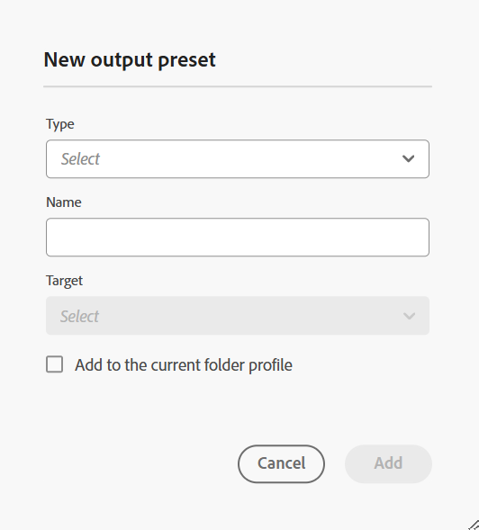

# Gerenciar predefinições de saída de perfil global e de pasta {#id22BLJ0D0V1U}

As predefinições Global e Perfil de pasta só estão disponíveis para usuários administrativos no nível da pasta.

Como administrador, o AEM Guides permite criar e gerenciar predefinições de saída para os Perfis global e de pasta. Em seguida, é possível usar facilmente essas predefinições de saída para gerar saída para todos os mapas relacionados a esse Perfil global ou de pasta.

Execute as seguintes etapas para criar uma predefinição de saída para os Perfis global e de pasta:

1. Selecione o mapa DITA para o qual deseja criar uma predefinição de saída.
1. Selecione o **Editar tópicos** opção no **Opções** menu do arquivo de mapa. O arquivo de mapa é aberto para edição no Editor da Web.
1. No **Output** selecione o ícone + para criar uma predefinição de saída para o mapa DITA.

   {width="350" align="left"}

1. Insira os seguintes detalhes na **Adicionar predefinição** diálogo:
   - Tipo
   - Nome
   - Target \(para predefinição da Base de conhecimento\)
1. Selecione o **Adicionar ao perfil da pasta** para criar uma predefinição de saída para o perfil de pasta relacionado e clique em **Adicionar**. A predefinição é criada e aparece sob a tag **Output** de todos os mapas relacionados. \( \) indica uma predefinição no nível do perfil da pasta.
1. Insira os detalhes da configuração. Para obter mais detalhes sobre predefinições de saída, consulte [Noções básicas sobre as predefinições de saída](./generate-output-understand-presets.md).

   >[!NOTE]
   >
   > Essas predefinições adicionadas ao perfil da pasta são independentes dos mapas, de modo que as configurações específicas do mapa não estão presentes para essas predefinições.

1. É possível selecionar a variável **Gerar predefinição** ícone na parte superior para gerar a saída dos mapas relacionados à predefinição de saída criada. Você verá o status do processo de geração de saída. Para exibir a saída, passe o mouse sobre o tópico e clique em **Exibir saída**.

>[!NOTE]
>
> Os Guias do AEM também fornecem uma predefinição de saída de PDF pronta para uso para gerar a saída para seus mapas DITA.

**Outras operações no menu Opções**

No menu Opções, também é possível executar as seguintes operações na predefinição:

- Selecione a predefinição como predefinição de pdf padrão. Em seguida, a predefinição selecionada seria usada como a predefinição padrão para gerar a saída de PDF usando o **Baixar como PDF** para um mapa.
- **Editar**, **Renomear**, **Duplicar** ou **Excluir** uma predefinição de saída existente do **Opções** menu.

>[!NOTE]
>
> Quando uma predefinição de saída em Perfis globais e de pasta for excluída, ela será refletida em todos os mapas relacionados e não aparecerá em **Output** guia.

**Tópico pai:**[ Trabalhar com o editor da Web](web-editor.md)
