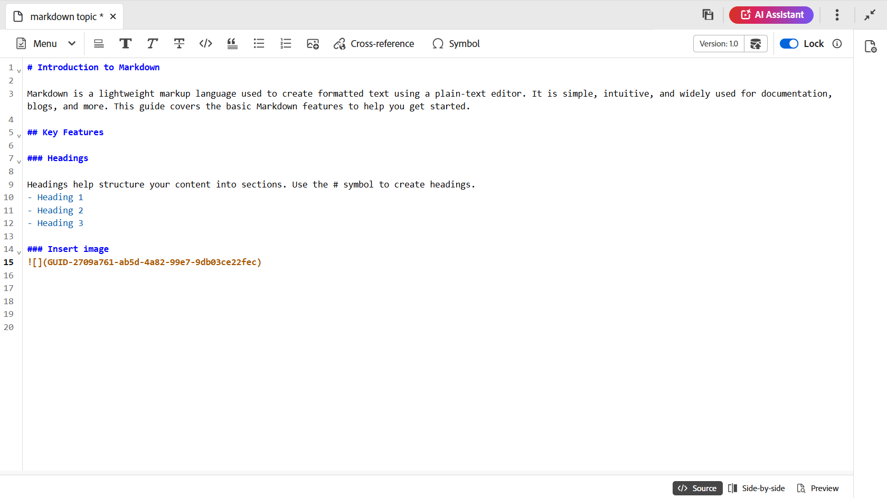

# Criação de documentos do Markdown a partir do editor {#id223MIE0B079}

O Markdown é uma linguagem de marcação simples que pode ajudar você a adicionar elementos de formatação a documentos de texto simples. O Adobe Experience Manager Guides fornece o recurso para criar, criar e visualizar um tópico Markdown \(.md\) no Editor. Também é possível fazer upload dos documentos existentes do Markdown e editá-los no Editor.

## Criar um tópico do Markdown

Execute as seguintes etapas para criar um tópico do Markdown no editor:

1. No painel Repositório, selecione  e, em seguida, selecione **Tópico** na lista suspensa.
1. Na caixa de diálogo **Novo tópico**, forneça os seguintes detalhes:

   {width="300" align="left"}

   * **Título**: forneça um título para o tópico.
   * **Nome**: o nome do arquivo é sugerido automaticamente com base no Título do tópico. Caso o administrador tenha ativado nomes de arquivo automáticos com base na configuração UUID, o campo Nome não será exibido.
   * **Modelo**: selecione **Markdown** na lista suspensa. O modelo **Tópico** é selecionado por padrão.
   * **Caminho**: procure o caminho onde você deseja salvar o arquivo de tópico. Por padrão, o caminho da pasta selecionada no momento no repositório é mostrado no campo Caminho.

   >[!NOTE]
   >
   > No caso de uma atualização, é necessário adicionar o modelo do Markdown ao perfil da pasta atual em uso. Você pode [criar um novo modelo de marcação a partir do Editor](./web-editor-features.md#templates) ou usar um modelo existente para criação de marcação. Para obter detalhes sobre como adicionar modelos de criação no Experience Manager Guides, exiba [Configurar perfis globais ou de nível de pasta](../cs-install-guide/conf-folder-level.md).
1. Selecione **Criar**.

   O tópico do Markdown é criado no caminho selecionado e está aberto para edição.

   {width="650" align="left"}

>[!NOTE]
>
> Você também pode criar um tópico de marcação para uma Pasta no painel Repositório. Selecione a pasta na qual deseja criar um tópico de marcação e selecione **Novo**. Em seguida, selecione **Tópico** no menu Opções. Agora é possível criar um tópico de marcação fornecendo detalhes do tópico na caixa de diálogo **Criar tópico**.

## Conhecer os recursos do editor de um tópico do Markdown

Esta seção aborda os vários recursos disponíveis no Editor para a criação de tópicos do Markdown. A interface de criação do é dividida nas seguintes seções ou áreas:

* [Barra de ferramentas](#toolbar)
* [Área de edição de conteúdo](#content-editing-area)
* [Modos Source, lado a lado e Visualização](#source-side-by-side-and-preview-modes)
* [Painel direito](#right-panel)

<!--
### Tab bar 

The tab bar features the file tabs of the topics or maps that are currently opened in the Editor along with other file-level options. 

Features available in the tab bar are explained as follows:

 {width="550" align="left"}

* **Topic tab**: Displays the currently opened topics in a tab. By default, you can view the file titles in the tab. As you hover over a file, you can view the file title and the file path as a tooltip.

    >[!NOTE]
    >
    > As an administrator, you can also choose to view the list of files by filenames in the tabs. View [User preferences](./intro-home-page.md#user-preferences) for details.
* **Save all**: Saves the changes you have made in all opened topics. If you have multiple topics opened in the Editor, selecting **Save all** or pressing `Crtl+S` shortcut keys saves all documents in one click. You do not have to individually save each document.
* **AI Assistant**: [AI-powered Smart Help](./ai-based-smart-help.md) feature that helps you find relevant content from the Adobe Experience Manager Guides Documentation.
* **More actions**: Allows you to navigate to the **Assets UI**. As an administrator, you also get an option to navigate to the **Settings** page. Learn how to work with [settings](./web-editor-features.md#main-toolbar) or editor settings. 
* **Expand view**: Allows you to expand the page view using the **Expand** icon. In this view, the header bar is hidden, maximizing the content space. To return to the standard view, use the **Exit the expanded view** icon.

-->

### Barra de ferramentas

A barra de ferramentas está localizada logo abaixo da barra de guias. Os recursos disponíveis na barra de ferramentas são explicados da seguinte maneira:

{align="left"}

| Recursos | Descrição |
|----------------|----------------|
| Edição de ações | Fornece acesso a vários recursos de edição de documentos, incluindo **Recortar**  , **Desfazer**  , **Refazer**  , **Cópia**  , **Excluir**   e **Localizar e substituir**  . Você pode acessar as opções disponíveis no menu suspenso **Menu**. |
| Opções de formatação de texto | Fornece acesso a várias opções de formatação de texto, incluindo **Títulos**  , **Negrito**  , **Itálico**  , **Tachado**  , **Código**   e **Aspas de bloco**  . |
| Opções de inserção de conteúdo | Fornece opções para inserir uma **lista numerada**  , **Lista ordenada**  , **Tabela**  , **Imagem** , **Referência cruzada**   e **Símbolo**   em um documento.   **Observação**: você também pode arrastar e soltar imagens e outros arquivos no editor do Markdown. Os arquivos são adicionados como links de referência cruzada, enquanto as imagens são exibidas como elementos de imagem padrão. |
| Histórico da versão | Permite criar versões de arquivos de marcação e visualizar o histórico de alterações. Você pode comparar diferentes versões e reverter para versões anteriores, se necessário. A opção Histórico de versão está presente na lista suspensa **Menu**. |
| Salvar como nova versão | Salva as alterações feitas no tópico e também cria uma nova versão do tópico. Se você estiver trabalhando em um tópico recém-criado, as informações da versão serão mostradas como nenhuma. |
| Bloquear/desbloquear | Bloqueia ou desbloqueia o arquivo atual. Bloquear um arquivo oferece acesso de gravação exclusivo ao arquivo. Isso impede que outros usuários editem o arquivo. Desbloqueie o arquivo se desejar que outras pessoas tenham acesso para edição. Como administrador, você também tem acesso ao recurso **Forçar desbloqueio** que permite desbloquear o arquivo bloqueado por outra pessoa. |

>[!NOTE]
>
> O recurso **Histórico de versões** e os recursos mencionados em ações de edição, formatação de texto e inserção de conteúdo podem ser acessados das exibições **Source** e **Lado a lado** do tópico de marcação.

### Área de edição de conteúdo

A área de edição de conteúdo exibe a fonte do Markdown do tópico, onde você faz todas as edições de conteúdo. Na exibição Lado a lado, essa área se divide em duas seções: Exibição do código-fonte do Markdown à esquerda e Visualização à direita. É possível abrir vários tópicos ao mesmo tempo, que são exibidos em suas respectivas guias.

### Modos Source, lado a lado e Visualização

Para criação de markdown, o Editor aceita três modos de exibição diferentes para auxiliar na criação e formatação de conteúdo:

{align="left"}

* Origem
* Lado a lado
* Visualização

**Origem**

Esta é a visualização de código de marcação do Editor. É possível editar tópicos de marcação como faria em qualquer editor de marcação normal. Na exibição do Source, você tem as opções para salvar uma revisão do documento, inserir cabeçalhos, inserir tabela, inserir imagem e muito mais.

Use essa exibição se quiser se concentrar exclusivamente na gravação e edição da marcação bruta sem visualizar a saída renderizada.

**Lado a lado**

Esse modo divide o Editor em dois painéis:

* O painel Source que exibe o tópico de marcação que você está editando.
* O Painel de visualização que mostra a saída renderizada do tópico do Markdown em tempo real.

{width="550" align="left"}

Use essa exibição se desejar exibir a saída renderizada em tempo real ao editar tópicos de marcação.

**Visualização**

Abrir um tópico de marcação no modo de Visualização mostra como um tópico será exibido quando for visualizado por um usuário em seu navegador. Nesta visualização, todos os recursos de edição são removidos da barra de ferramentas. No entanto, você ainda pode acessar os recursos **Salvar como novas versões**, **Bloquear/desbloquear** na barra de ferramentas e o recurso **Propriedades do arquivo** no painel direito.

### Painel direito

O painel direito fornece acesso ao painel **Propriedades do arquivo.

As Propriedades do arquivo têm as duas seções a seguir:

**Geral**

A seção Geral fornece acesso aos seguintes recursos:

* **Nome do arquivo**: exibe o nome do arquivo do tópico selecionado.
* **ID**: exibe a ID do tópico selecionado.
* **Idioma**: mostra o idioma do tópico. Ele é definido no campo Language na página de propriedades.
* **Criado em**: exibe a data e a hora em que o tópico foi criado.
* **Modificado em**: exibe a data e a hora em que o tópico foi modificado.
* **Bloqueado por**: mostra o usuário que fez check-out do tópico.
* **Estado do documento**: você pode selecionar e atualizar o estado do documento do tópico aberto no momento. Para obter mais detalhes, exiba [Estado do Documento](./web-editor-document-states.md).
* **Marcas**: estas são as marcas de metadados do tópico. Eles são definidos no campo tags na página propriedades. Você pode digitá-los ou selecioná-los na lista suspensa. As tags são exibidas na lista suspensa. Para excluir uma tag, selecione o ícone de cruz ao lado da tag.
* **Editar mais propriedades**: é possível editar mais propriedades na página de propriedades do arquivo.

**Referências**

A seção Referências fornece acesso aos seguintes recursos:

* **Usado em**: as referências Usado em listam os documentos nos quais o arquivo atual está sendo referenciado ou usado.
* **Links de saída**: os Links de saída listam os documentos referenciados no documento atual.

>[!NOTE]
>
> Todas as referências a links usados em e links de saída são vinculadas aos documentos por hiperlink. É possível abrir e editar facilmente os documentos vinculados.

## Limitações de recursos

Os seguintes recursos do Experience Manager Guides não se aplicam à criação no Markdown:

1. Revisar
2. Mesclar
3. Assistente de IA
4. Rastrear alterações

**Tópico pai:**[ Introdução ao Editor](web-editor.md)
