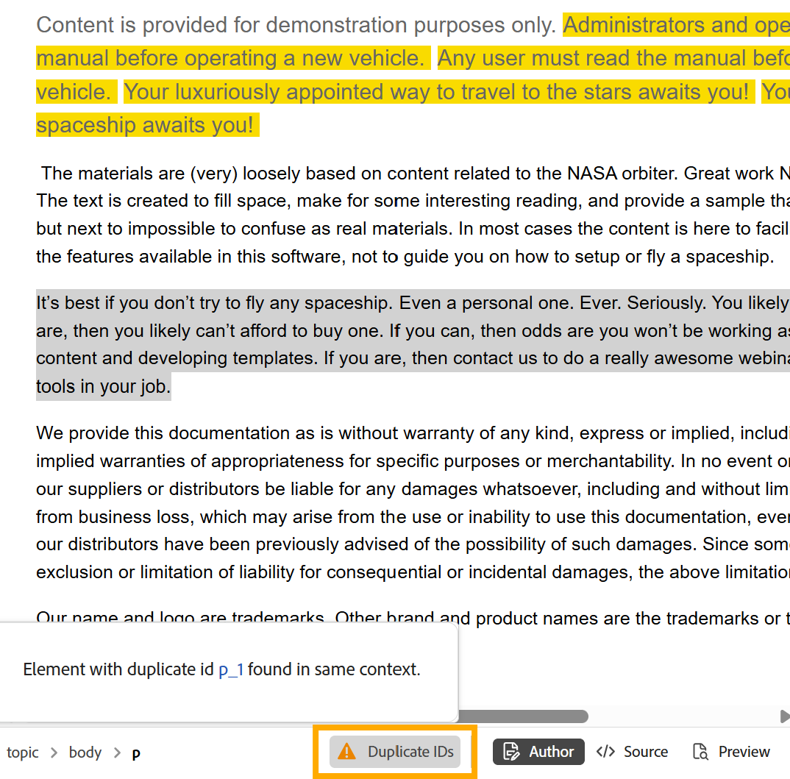

# Recursos adicionais no editor {#id2056B0B0YPF}

Existem outros recursos úteis no Editor que você pode usar:

## Funções de menu de contexto na guia de um arquivo

Ao abrir um arquivo no Editor, você pode executar várias ações do menu de contexto. É possível exibir opções diferentes se você abrir um arquivo de mídia, um único arquivo DITA ou vários arquivos.

**Arquivo de mídia**

Você obtém as seguintes funções no menu de contexto da guia de um arquivo de mídia aberto:

{width="300" align="left"}

**Arquivo DITA único**

Você obtém as seguintes funções no menu de contexto de uma guia de arquivo aberta:

{width="400" align="left"}

**Vários arquivos**

Quando tiver múltiplos arquivos abertos, então você terá mais opções no menu de contexto:

{width="550" align="left"}

As várias opções no menu de contexto são explicadas abaixo:

***Salvar***: você pode escolher entre as seguintes opções:

- **Salvar**: para salvar um arquivo sem criar uma nova versão, selecione **Salvar**. Sempre que você cria um novo tópico, uma cópia de trabalho sem versão do tópico é criada no DAM. Salvar seu documento atualiza a cópia de trabalho do documento no DAM. Fazer um simples salvamento nesta versão não cria uma nova versão de um tópico. Se seu tópico estiver sendo revisado, salvar um tópico não dará aos revisores acesso ao conteúdo do tópico alterado.

- **Salvar tudo**: se houver vários documentos abertos no Editor, você também terá uma opção para **Salvar todos** os documentos abertos.

***Salvar como nova versão***

Para criar uma nova versão do arquivo, selecione **Salvar como nova versão**. Para obter mais detalhes sobre **Salvar** e **Salvar como nova versão**, consulte a [Barra de ferramentas no Editor](web-editor-toolbar.md).

***Copiar***: você pode escolher entre as seguintes opções:

- **Copiar UUUID**: para copiar a UUID do arquivo ativo no momento para a Área de Transferência, selecione **Copiar \> Copiar UUID**.
- **Copiar Caminho**: para copiar o caminho completo do arquivo ativo no momento para a Área de Transferência, selecione **Copiar \> Caminho**.

***Localizar em***: você pode escolher entre as seguintes opções:

- **Mapa**: se você tiver aberto um mapa DITA grande e quiser encontrar o local exato de um arquivo no mapa, selecione **Localizar em \> Mapa**. Quando você seleciona a opção Localizar no mapa, o arquivo \(de onde a opção é chamada\) está localizado e realçado na hierarquia do mapa. Para usar esse recurso, é necessário abrir o arquivo de mapa no Editor. Se a Visualização de mapa estiver oculta, invocar esse recurso exibirá a Visualização de mapa e o arquivo será destacado na hierarquia de mapa.

- **Explorer**: assim como Localizar no Mapa, o **Localizar no \> Explorer** mostra o local do arquivo no Explorer \(ou DAM\). A Visualização do Explorer é aberta e o arquivo selecionado é realçado no Explorer. Se o arquivo estiver em uma pasta, essa pasta será expandida para mostrar o local do arquivo selecionado no Explorer.

  >[!NOTE]
  >
  >Na versão 2025.11.0, o **Repositório** foi renomeado para **Explorer**. Para configuração no local, ele continua disponível como Repositório até a versão 5.1 do Experience Manager Guides.

***Adicionar a***: você pode escolher entre as seguintes opções:

- **Coleções**: para adicionar o arquivo selecionado às coleções, selecione **Adicionar a \> Coleções**. Para obter mais detalhes, exiba a descrição do recurso **Coleções** na seção [Painel esquerdo](web-editor-left-panel.md).

- **Conteúdo reutilizável**: para copiar o arquivo selecionado para a lista de conteúdo reutilizável, selecione **Adicionar a \> Conteúdo reutilizável**. Para obter mais detalhes, exiba a descrição do recurso **Conteúdo reutilizável** na seção [Painel esquerdo](web-editor-left-panel.md).

***Propriedades***

Para exibir a página de propriedades AEM do arquivo selecionado, selecione **Propriedades**.

***Divisão***: você pode escolher entre as seguintes opções:

**Para Cima, Para Baixo, Para a Esquerda ou Para a Direita**

Por padrão, o Editor permite exibir um tópico de cada vez. Pode haver instâncias em que você deseje exibir dois ou mais tópicos ao mesmo tempo. Dividir a tela do editor permite exibir vários tópicos ao mesmo tempo. Por exemplo, se você tiver dois tópicos - A e B abertos no editor. Clicar com o botão direito do mouse no tópico B e escolher **Dividir \> Para cima** divide a janela do editor em duas partes. O tópico B é exibido na metade superior e o tópico A é exibido na metade inferior. Da mesma forma, você também pode dividir a tela horizontalmente selecionando **Dividir \> Esquerda** ou **Dividir \> Direita**. Você pode mover seus documentos de uma tela para outra arrastando a guia do arquivo e soltando-a na tela onde deseja colocá-la. Da mesma forma, também é possível reordenar as guias de arquivo arrastando-as e movendo-as de acordo com sua preferência.

<!--------------------------------------------

***Quick Generate***

Generate the output for the selected file. Output can be generated only for files that are a part of an output preset. For more details, view [Article-based publishing from the Web Editor](web-editor-article-publishing.md#id218CK0U019I).

--->

***Fechar***: você pode escolher entre as seguintes opções:

**Fechar**, **Fechar outros** ou **Fechar todos**

Para fechar o arquivo do qual o menu de contexto foi chamado, selecione **Fechar \> Fechar**. Use **Fechar \> Fechar outros** para fechar todos os outros arquivos abertos, exceto o arquivo ativo no momento. Para fechar todos os arquivos abertos, selecione a opção **Fechar \> Fechar tudo** no menu de contexto ou você também pode optar por fechar o Editor. Se houver arquivos não salvos em sua sessão, você será solicitado a salvá-los.

**Cenários de fechamento e salvamento de arquivos**

Ao tentar fechar um arquivo aberto no Editor usando o botão **Fechar** na guia do arquivo ou a opção **Fechar** do menu Opções, o Experience Manager Guides solicita que você salve suas edições e desbloqueie um arquivo bloqueado.

Os prompts são baseados nas seguintes configurações selecionadas pelo administrador:

- **Solicitar desbloqueio ao fechar:** Você tem a opção de desbloquear o arquivo \(que você bloqueou\) ao fechar o editor.
- **Solicitar nova versão ao fechar**: você tem a opção de salvar o arquivo \(que você editou\) como uma nova versão ao fechar o editor.

A experiência de gravação de arquivos dependerá dos três cenários a seguir, nos quais você tem:

- Não foram feitas alterações no conteúdo.
- Conteúdo editado e alterações salvas.
- Conteúdo editado, mas as alterações não foram salvas.

É possível exibir as seguintes opções, dependendo se o arquivo está bloqueado/desbloqueado e se tem alterações salvas ou não:

- **Desbloquear e Fechar**: o bloqueio do arquivo é liberado e o arquivo é fechado.
- **Salvar como uma nova versão**: isso salvará as alterações feitas no conteúdo e criará uma nova versão do arquivo. Você também pode adicionar rótulos e comentários para a versão recém-salva. Para obter mais informações sobre como salvar uma nova versão, consulte [Salvar como nova versão](web-editor-toolbar.md#version-information-and-save-as-new-version).

- **Desbloquear o arquivo**: se você optar por desbloquear um arquivo, ele liberará o bloqueio do arquivo e as alterações serão salvas na versão atual do arquivo.

  >[!NOTE]
  >
  > Se você desmarcar a opção para desbloquear o arquivo, também receberá uma opção para fechar o arquivo sem salvar as alterações.

  Por exemplo, um dos prompts é mostrado na seguinte captura de tela:

  {width="400" align="left"}

**Indicações visuais para referências corrompidas**

Se o tópico contiver referências cruzadas ou referências de conteúdo corrompidas, elas serão exibidas em texto vermelho.

**Smart Copy-Cole**

Você pode copiar e colar facilmente o conteúdo em e entre tópicos. A estrutura do elemento de origem é mantida no destino. Além disso, se o conteúdo copiado tiver referências de conteúdo, mesmo elas serão copiadas.

**Lembrar último local pesquisado**

O Editor fornece uma caixa de diálogo de procura inteligente de arquivos. O editor lembra o último local usado ao inserir uma referência ou conteúdo. Na primeira vez que você chamar a caixa de diálogo de navegação de arquivo \(via Inserir referência ou Inserir conteúdo de reutilização\), será levado ao local onde o documento atual será salvo. Na mesma sessão, se você tentar inserir outra referência, a caixa de diálogo de navegação de arquivos navegará automaticamente para o local de onde você inseriu a última referência.

>[!NOTE]
>
> No caso de um arquivo de imagem, áudio ou vídeo, a caixa de diálogo de navegação de arquivo assume como padrão o local do arquivo e não o último local usado.

## Procurar arquivos e pastas no Experience Manager Guides

O Experience Manager Guides fornece caixas de diálogo intuitivas - **Selecionar arquivo** e **Selecionar caminho** - para ajudá-lo a navegar e escolher arquivos ou pastas no repositório de conteúdo com eficiência.

>[!NOTE]
>
> O navegador de caminho de arquivos e pastas é introduzido com uma interface renovada na versão 2601 do Experience Manager Guides as a Cloud Service. A nova interface é ativada por padrão. Se preferir continuar usando a interface do usuário existente sem essas atualizações, entre em contato com a equipe de Sucesso do cliente para desativar esse novo aprimoramento.

### Procurar arquivos no Experience Manager Guides

O navegador de caminho de arquivo permite localizar e selecionar rapidamente arquivos específicos no repositório de conteúdo. Esse recurso está disponível para tarefas como adicionar um tópico a um mapa, vincular uma imagem ou referência cruzada, criar conteúdo reutilizável e muito mais.

{width="350" align="left"}

Ao iniciar o navegador de arquivos, a caixa de diálogo **Selecionar arquivo** é aberta. Esta caixa de diálogo inclui duas guias: **Repositório** e **Coleções**. Por padrão, a guia Repository (Repositório) é selecionada.

{width="650" align="left"}

**Recursos disponíveis na guia Repositório para navegação de arquivos**

**Exibição tabular de arquivos e pastas**

A guia Repositório fornece uma visualização tabular de arquivos e pastas do repositório de conteúdo, facilitando a localização do caminho de arquivo correto. Você também pode usar a navegação estrutural na parte superior e o painel de navegação da pasta à esquerda para percorrer as pastas.

{width="650" align="left"}

**Seleção de um e vários arquivos**

Para usar um arquivo, basta selecionar o arquivo e escolher **Selecionar**.

{width="650" align="left"}

Em alguns casos, você também pode selecionar vários arquivos nesta caixa de diálogo do navegador de caminho. Por exemplo, ao navegar pelos arquivos em busca de conteúdo Reutilizável, você pode selecionar vários arquivos e torná-los parte de seu conteúdo reutilizável.

{width="650" align="left"}

A seleção de vários arquivos está disponível no momento para conteúdo reutilizável, referências de tópico, esquema, predefinições de saída (usando DITAVAL) e Workfront.

>[!NOTE]
>
> Ao selecionar arquivos na caixa de diálogo do navegador de caminho, algumas pastas podem parecer desativadas. Esse comportamento restringe o acesso a tipos de arquivos específicos para garantir seleções válidas. Por exemplo, ao criar conteúdo reutilizável, somente arquivos de tópico e de mapa devem ser usados. Para evitar o uso de um tipo de arquivo inválido, como uma imagem, os arquivos correspondentes não são exibidos ou permanecem desativados para seleção no navegador de caminho.

**Visualizar arquivos selecionados**

Você pode visualizar os arquivos selecionados usando o botão **Visualizar**, conforme mostrado abaixo:

{width="650" align="left"}

A visualização do arquivo selecionado é exibida à direita.

{width="650" align="left"}

Para várias seleções, uma visualização de todos os arquivos selecionados é exibida no painel Visualização para facilitar a revisão.

{width="650" align="left"}

Você também pode usar o ícone **Remover** para desmarcar alguns arquivos da Visualização.

{width="650" align="left"}

**Pesquisar e filtrar experiência**

Ao navegar pelos arquivos no Repositório, você pode pesquisar arquivos por nome, título ou conteúdo no caminho selecionado. Você pode usar qualquer um, dois ou todos os três critérios para sua pesquisa. Se nenhum dos critérios for selecionado, os resultados incluirão informações comuns aos três critérios.

{width="650" align="left"}

Selecione o ícone **Filtrar pesquisa** \(\) para abrir o painel Filtro à direita.

{align="left"}

Você tem as seguintes opções para filtrar os arquivos e restringir sua pesquisa:

- **Pesquisar em**: selecione o caminho no qual deseja pesquisar os arquivos presentes no Repositório.

- **Tipo de arquivo**: filtre sua pesquisa com base em um tipo de arquivo específico. Opções disponíveis: **Tópico**, **Mapa**, **DITAVAL**, **Imagem**, **Multimídia**, **Documento** e **Outros**.

  >[!NOTE]
  >
  > Em alguns casos, o filtro **Tipo de arquivo** é pré-aplicado em tipos de arquivo específicos com base na tarefa e não pode ser alterado. Por exemplo, ao procurar uma imagem, o filtro é definido para exibir somente arquivos de imagem e, ao criar conteúdo reutilizável, é definido para mostrar somente arquivos de tópico e de mapa. Você ainda pode ajustar outros filtros, como estado do documento, tags ou data da última modificação, para refinar os resultados da pesquisa.

- **Estado do documento**: você pode filtrar sua pesquisa com base no estado atual do documento dos arquivos. Os valores de filtro disponíveis são definidos no campo `repositoryFilters` de `ui_config.json file` e estão associados ao perfil de pasta que você está usando no momento.

  Isso significa que:

   - Se você estiver usando o Perfil global, os valores de filtros configurados no Perfil global serão aplicados.
   - Se você selecionar um perfil de pasta específico, os valores de filtros definidos nesse perfil serão buscados.

  Os valores de filtro padrão disponíveis para o estado do documento são: Rascunho, Editar, Em revisão, Aprovado, Revisado e Concluído. Para obter detalhes sobre como personalizar valores de filtro para estados de documento, consulte [Configurar filtros de estado de documento](../cs-install-guide/config-doc-state-filters.md).

- **Bloqueado por**: exibe uma lista de usuários. A lista é paginada e carregada de forma assíncrona, mostrando um conjunto limitado de usuários de cada vez e buscando mais à medida que você rola a tela ou navega. Isso melhora a velocidade de carregamento e o desempenho geral, especialmente ao trabalhar com um grande número de usuários.

- **Última modificação**: filtrar conteúdo com base na data de modificação. Selecione um intervalo de datas no calendário ou escolha uma das seguintes opções de intervalo de tempo:
   - Na semana passada
   - No mês passado
   - No ano passado

- **Marcas**: filtrar conteúdo com base em marcas.

- **Elementos DITA**: filtre o conteúdo com base em vários elementos DITA.

Depois de aplicar todos os filtros necessários, selecione **Aplicar** no canto inferior direito do painel Filtros.

**Recursos disponíveis na guia Coleções para navegação de arquivos**

A guia **Coleções** fornece uma exibição com curadoria dos arquivos disponíveis em suas Coleções para acesso rápido e reutilização. Ao contrário da guia Repositório, que exibe a hierarquia completa de pastas, as Coleções permitem selecionar tópicos, mapas e imagens usados com frequência sem navegar por várias pastas.

Na guia Coleções, é possível:

- Use a navegação estrutural na parte superior e o painel de navegação da pasta à direita para navegar facilmente pelas Coleções.

  
- Selecione os arquivos presentes em um caminho de Coleções específico e visualize-o no Painel direito.

  

### Pastas do navegador no repositório

A procura de pastas usando a caixa de diálogo **Selecionar pasta** concentra-se em selecionar o caminho de pasta correto no Repositório para tarefas como a criação de novos tópicos ou a especificação de locais de saída para conteúdo publicado. Ele oferece uma visualização de pastas clara e estruturada em árvore, tornando a navegação intuitiva e garantindo que o conteúdo seja colocado no local correto.

{width="300" align="left"}

## Suporte para publicação baseada em artigo

No Editor, é possível gerar a saída para um ou mais tópicos ou para o mapa DITA inteiro. É necessário criar predefinições de saída para o mapa DITA e, em seguida, gerar facilmente a saída para um ou mais tópicos. Se você tiver atualizado alguns tópicos no mapa, também poderá gerar a saída somente para esses tópicos do Editor. Para obter mais detalhes, exiba [publicação baseada em artigo](web-editor-article-publishing.md#id218CK0U019I).

## Suporte para documentos do Markdown

O Editor permite usar os documentos do Markdown \(.md\) juntamente com os documentos DITA. Você pode criar e visualizar facilmente um documento do Markdown no editor e também adicioná-lo ao arquivo de mapa por meio do editor de mapa DITA. Para obter mais detalhes, exiba [os documentos do Markdown do autor do editor](web-editor-markdown-topic.md#).

## Suporte para tópico de termo do glossário DITA

O Editor oferece suporte a termos de glossário DITA que você pode inserir adicionando `term` ou `abbreviated-form` elementos.

## Trabalhar com equações do MathML

### Inserir equações do MathML

O Experience Manager Guides oferece suporte pronto para inserção de equações do MathML por integração com o aplicativo [MathType Web](https://docs.wiris.com/en/mathtype/mathtype_web/intro). Para inserir uma equação de MathML, selecione o ícone **Elemento** e digite mathml. Quando você seleciona um elemento matemático na lista, a caixa de diálogo **Inserir MathML** é exibida:

{width="550" align="left"}

Usando as ferramentas de equação do MathML, crie sua equação e selecione **Inserir** para adicioná-la ao seu documento. A equação é inserida com o plano de fundo cinza-claro.

A qualquer momento, você pode atualizar uma equação clicando com o botão direito do mouse em uma equação existente e selecionando **Editar MathML** no menu de contexto.

### Validação de equações no editor do MathML

O Experience Manager Guides valida as equações do MathML quando você salva um tópico contendo elas.
Ao inserir uma equação usando o editor do MathML, o Experience Manager Guides realça a equação em vermelho se houver problemas de sintaxe. Você pode corrigi-la antes de inseri-la. Se você não fizer alterações, mas selecionar **Inserir**, exibirá um aviso.

{width="400" align="left"}

Se você inserir a equação do MathML que contém um erro de sintaxe, ocorrerá um erro de validação quando você tentar salvar o tópico.

## Inserir notas de rodapé

Insira uma nota de rodapé em seu conteúdo usando o elemento `fn`. No modo de criação, o valor da nota de rodapé é mostrado em linha com o conteúdo. No entanto, ao alternar entre o modo de Visualização e a publicação do documento, a nota de rodapé é exibida no final do tópico.

## Renomear ou substituir um elemento

O Editor exibe a navegação estrutural do elemento na parte inferior esquerda do tópico. Se quiser trocar ou substituir um elemento por outro elemento, faça isso no menu de contexto da navegação estrutural. Por exemplo, você pode trocar o elemento `p` por `note` ou qualquer outro elemento válido no contexto.

{width="400" align="left"}

Na navegação estrutural, clique com o botão direito do mouse no nome de um elemento que deseja substituir e selecione Renomear elemento no menu de contexto. A caixa de diálogo Renomear elemento exibe todos os elementos válidos permitidos no local atual. Na caixa de diálogo Renomear elemento, selecione o elemento que deseja usar. O elemento original é substituído pelo novo elemento.

Além do menu de contexto da navegação estrutural, a caixa de diálogo Renomear elemento também pode ser acessada de outros locais:

- Selecione o nome do elemento na navegação estrutural para selecionar o conteúdo do elemento e clique com o botão direito do mouse no conteúdo selecionado para exibir o menu de contexto.

- Habilite a exibição Tags, selecione a tag de abertura de qualquer elemento e clique com o botão direito do mouse no conteúdo selecionado para exibir o menu de contexto.

- Você pode acessar a caixa de diálogo Renomear elemento chamando o menu Opções de um elemento no painel Estrutura de tópicos.

## Quebrar e desfazer a quebra de um elemento

### Quebrar um elemento

- Quebrar um elemento permite adicionar uma tag de elemento ao texto selecionado. Você pode quebrar o texto para qualquer elemento filho seguindo os padrões DITA. Por exemplo, se você tiver texto sob um elemento `note`, poderá quebrar o texto para um elemento `p`.

- A opção **Quebrar Elemento** está disponível no menu de contexto da navegação estrutural do tópico. Para quebrar um elemento, clique com o botão direito do mouse no elemento e abra o menu de contexto. Selecione o elemento na caixa de diálogo **Quebrar Elemento**. O texto aparece no novo elemento.

- Você também pode selecionar o texto ou o elemento no conteúdo e depois selecionar a opção **Quebrar Elemento** no menu de contexto.

### Decodificar um elemento

Desfazer a quebra de um elemento permite remover a tag do elemento do texto selecionado e mesclá-lo com seu elemento pai. Por exemplo, se você tiver um elemento `p` em um elemento `note`, poderá decodificar o elemento `p` para mesclar o texto diretamente no elemento `note`. A opção **Decodificar Elemento** está disponível no menu de contexto da navegação estrutural do tópico. Para decodificar um elemento, clique com o botão direito do mouse no elemento para abrir o menu de contexto e, finalmente, selecione **Decodificar Elemento** para remover o elemento e mesclar o texto do elemento com seu elemento pai.

## Manuseio de espaço em branco para elementos DITA

Em XML, os espaços em branco incluem espaços, tabulações, retornos de carro e linhas em branco. O Experience Manager Guides converte vários espaços em branco consequentes em um espaço. Isso ajuda a preservar a visualização WYSIWYG do Editor.

>[!NOTE]
>
> Em alguns elementos em que os espaços em branco precisam ser preservados de acordo com as regras DITA, os vários espaços em branco resultantes são retidos. Por exemplo, `<pre>` e `<codeblock>` elementos.

## Preservando quebras de linha e recuo

Os elementos DITA que contêm quebra de linha e espaços são suportados e renderizados de acordo com sua definição nos modos Autor, Source ou Visualização e também na saída final publicada. A captura de tela a seguir mostra o conteúdo do elemento `msgblock` no qual as quebras de linha e os espaços \(recuo\) foram preservados:

{align="left"}

## Manipulação de espaços não separáveis no Editor

- Você pode inserir espaços não separáveis no documento usando o ícone **Símbolo**  ou as teclas de atalho **Alt** + **Espaço**.  Esses espaços não separáveis aparecem como um indicador enquanto você edita um tópico no Editor. Você pode desativar a exibição dos espaços sem quebra com a opção **Mostrar indicador de espaço sem quebra no modo de autor** da guia **Aparência** de [Preferências do usuário](./intro-home-page.md#user-preferences).

- Se você copiar e colar conteúdo com um espaço sem quebra de qualquer fonte externa na exibição **Autor**, o espaço sem quebra será convertido em um espaço.
No entanto, se você copiar e colar o conteúdo com um espaço sem quebra da exibição **Autor**, ele será preservado.

## Gerar ID de elemento automaticamente

Você pode gerar IDs automaticamente para os elementos no tópico DITA. Essas IDs são exclusivas em um tópico DITA. Por exemplo, se você gerar IDs para um elemento de parágrafo, as IDs serão p\_1, p2, p\_3 e assim por diante. Você pode selecionar vários elementos e gerar IDs para cada elemento selecionado.

Faça o seguinte para gerar automaticamente a ID de um ou vários elementos:

1. Abra o tópico no Editor.
1. Selecione o conteúdo no qual deseja atribuir IDs.
1. Clique com o botão direito e selecione **Gerar IDs** no menu de contexto.

Como alternativa, clique com o botão direito do mouse na navegação estrutural e selecione **Gerar IDs**.

## Identificação de IDs duplicadas para elementos em um mapa ou tópico na exibição Autor

Se um determinado tópico ou mapa contiver elementos com IDs duplicadas, o botão **IDs duplicadas** será exibido no canto inferior direito da área de edição de conteúdo adjacente às exibições do Editor.

{width="350" align="left"}

Selecionar **IDs duplicadas** abre um pop-over listando todas as IDs duplicadas. Você pode selecionar a ID exibida no popover para navegar até o elemento correspondente e atualizá-lo com uma ID exclusiva.

>[!NOTE]
>
> O botão **IDs Duplicadas** está disponível somente na exibição **Autor**, e IDs de elementos semelhantes são permitidas em diferentes tópicos aninhados.

## Manuseio de arquivos grandes no Editor

Os principais recursos destinados a melhorar o tratamento de arquivos grandes são mencionados da seguinte forma:

- Para aprimorar o desempenho, determinadas funcionalidades como desfazer, refazer, o painel de estrutura de tópicos e o marcador sujo são desativadas. É recomendável dividir os tópicos em tópicos menores para obter uma experiência ideal.

- Uma mensagem de alerta é exibida na parte superior para arquivos grandes, como mostrado no trecho abaixo. Este alerta destaca o número de elementos com base no valor especificado no parâmetro **largeFileTagCount** do arquivo uiconfig.json. Por padrão, **largeFileTagCount** está definido como 2500.

{width="600" align="left"}

- Além disso, a contagem de tags é exibida na barra inferior da interface. Quando você passa o mouse sobre o valor de contagem de tags, uma dica de ferramenta é exibida. Selecionar a guia **Saiba mais** fornece detalhes sobre como manipular arquivos grandes.

{width="600" align="left"}

- A mensagem de alerta está disponível somente para arquivos DITA e está visível em todas as exibições: Autor, Source e Layout.

**Tópico pai:**&#x200B;[&#x200B; Introdução ao Editor](web-editor.md)
