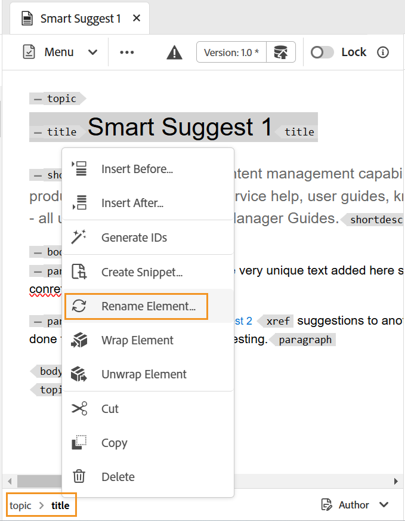

# Outros recursos no Editor da Web {#id2056B0B0YPF}

Existem outros recursos úteis no Editor da Web que você pode usar:

**Funções de menu de contexto na guia de um arquivo**

Ao abrir um arquivo no Editor da Web, você pode executar várias ações do menu de contexto. Você poderá ver diferentes opções se abrir um arquivo de mídia, um único arquivo DITA ou vários arquivos.

**Arquivo de mídia**

Você obtém as seguintes funções no menu de contexto da guia de um arquivo de mídia aberto:

{width="300" align="left"}

**Arquivo DITA único**

Você obtém as seguintes funções no menu de contexto de uma guia de arquivo aberta:

:   {width="300" align="left"}

**Vários arquivos**

Quando tiver múltiplos arquivos abertos, então você terá mais opções no menu de contexto:

{width="550" align="left"}

As várias opções no menu de contexto são explicadas abaixo:

***Salvar***: você pode escolher entre as seguintes opções:

- **Salvar**: para salvar um arquivo sem criar uma nova versão, selecione **Salvar**. Sempre que você cria um novo tópico, uma cópia de trabalho sem versão do tópico é criada no DAM. Salvar seu documento atualiza a cópia de trabalho do documento no DAM. Fazer um simples salvamento nesta versão não cria uma nova versão de um tópico. Se seu tópico estiver sendo revisado, salvar um tópico não dará aos revisores acesso ao conteúdo do tópico alterado.

- **Salvar tudo**: se houver vários documentos abertos no Editor da Web, você também terá a opção de **Salvar tudo**.

***Salvar como nova versão***

Para criar uma nova versão do arquivo, selecione **Salvar como nova versão**. Para obter mais detalhes sobre **Salvar** e **Salvar como nova versão**, consulte [Conhecer os recursos do Editor da Web](web-editor-features.md#).

***Copiar***: você pode escolher entre as seguintes opções:

- **Copiar UUUID**: para copiar a UUID do arquivo ativo no momento para a Área de Transferência, selecione **Copiar \> Copiar UUID**.
- **Copiar Caminho**: para copiar o caminho completo do arquivo ativo no momento para a Área de Transferência, selecione **Copiar \> Caminho**.

***Localizar em***: você pode escolher entre as seguintes opções:

- **Mapa**: se você tiver aberto um mapa DITA grande e quiser encontrar o local exato de um arquivo no mapa, selecione **Localizar em \> Mapa**. Quando você seleciona a opção Localizar no mapa, o arquivo \(de onde a opção é chamada\) está localizado e realçado na hierarquia do mapa. Para usar esse recurso, é necessário abrir o arquivo de mapa no Editor da Web. Se a Visualização de mapa estiver oculta, invocar esse recurso exibirá a Visualização de mapa e o arquivo será destacado na hierarquia de mapa.

- **Repositório**: assim como Localizar no Mapa, o **Localizar no \> Repositório** mostra o local do arquivo no repositório \(ou DAM\). A Visualização de repositório é aberta e o arquivo selecionado é realçado no repositório. Se o arquivo estiver em uma pasta, ela será expandida para mostrar o local do arquivo selecionado no repositório.

***Adicionar a***: você pode escolher entre as seguintes opções:

- **Favoritos**: para adicionar o arquivo selecionado à coleção de favoritos, selecione **Adicionar a \> Favoritos**. Para obter mais detalhes, consulte a descrição do recurso **Favoritos** na seção [Painel Esquerdo](web-editor-features.md#id2051EA0M0HS).

- **Conteúdo Reutilizável**: para copiar o arquivo selecionado para a lista de conteúdo reutilizável, selecione **Adicionar a \> Conteúdo Reutilizável**. Para obter mais detalhes, consulte a descrição do recurso **Conteúdo Reutilizável** na seção [Painel Esquerdo](web-editor-features.md#id2051EA0M0HS).

***Propriedades***

Para ver a página de propriedades AEM do arquivo selecionado, selecione **Propriedades**.

***Divisão***: você pode escolher entre as seguintes opções:

**Para Cima, Para Baixo, Para a Esquerda ou Para a Direita**

Por padrão, o Editor da Web permite exibir um tópico de cada vez. Pode haver instâncias em que você deseje ver dois ou mais tópicos ao mesmo tempo. Dividir a tela do editor permite exibir vários tópicos ao mesmo tempo. Por exemplo, se você tiver dois tópicos - A e B abertos no editor. Clicar com o botão direito do mouse no tópico B e escolher **Dividir \> Para cima** divide a janela do editor em duas partes. O tópico B é exibido na metade superior e o tópico A é exibido na metade inferior. Da mesma forma, você também pode dividir a tela horizontalmente selecionando **Dividir \> Esquerda** ou **Dividir \> Direita**. A captura de tela a seguir do Editor da Web exibe tópicos divididos horizontal e verticalmente. Em cada divisão, você pode ter uma visualização diferente. Por exemplo, na captura de tela a seguir, a tela 1 está no modo de exibição do Source, a tela 2 tem dois documentos abertos no modo Autor e a tela 3 está no modo de Visualização. Você pode mover seus documentos de uma tela para outra arrastando a guia do arquivo e soltando-a na tela onde deseja colocá-la. Da mesma forma, também é possível reordenar as guias de arquivo arrastando-as e movendo-as de acordo com sua preferência.

{width="800" align="left"}

***Geração rápida***

Gera a saída para o arquivo selecionado. A saída só pode ser gerada para arquivos que fazem parte de uma predefinição de saída. Para obter mais detalhes, consulte [Publicação baseada em artigo do Editor da Web](web-editor-article-publishing.md#id218CK0U019I).

***Fechar***: você pode escolher entre as seguintes opções:

**Fechar**, **Fechar Outros** ou **Fechar Todos**

Para fechar o arquivo do qual o menu de contexto foi chamado, selecione **Fechar \> Fechar**. Use **Fechar \> Fechar outros** para fechar todos os outros arquivos abertos, exceto o arquivo ativo no momento. Para fechar todos os arquivos abertos, selecione a opção **Fechar \> Fechar Tudo** no menu de contexto ou você também pode optar por fechar o Editor da Web. Se houver arquivos não salvos em sua sessão, você será solicitado a salvá-los.

**Cenários de fechamento e salvamento de arquivos**

Ao tentar fechar um arquivo aberto no Editor da Web usando o botão **Fechar** na guia do arquivo ou a opção **Fechar** do menu Opções, o AEM Guides solicita que você salve suas edições e desbloqueie um arquivo bloqueado.

Os prompts são baseados nas seguintes configurações selecionadas pelo administrador:

- **Solicitar check-in ao fechar:** Você tem a opção de fazer check-in do arquivo \(que você fez check-out\) ao fechar o editor.
- **Solicitar nova versão ao fechar**: você tem a opção de salvar o arquivo \(que você editou\) como uma nova versão ao fechar o editor.

A experiência de gravação de arquivos dependerá dos três cenários a seguir, nos quais você tem:

- Não foram feitas alterações no conteúdo.
- Conteúdo editado e alterações salvas.
- Conteúdo editado, mas as alterações não foram salvas.

Você pode ver as seguintes opções, dependendo se o arquivo está bloqueado/desbloqueado e se tem alterações salvas ou não:

- **Desbloquear e Fechar**: o bloqueio do arquivo é liberado e o arquivo é fechado.

  {width="400" align="left"}

- **Salvar como uma Nova Versão**: isso salvará as alterações feitas no conteúdo e criará uma nova versão do arquivo. Você também pode adicionar rótulos e comentários para a versão recém-salva. Para obter mais informações sobre como salvar uma nova versão, consulte [Salvar como nova versão](web-editor-features.md#save-as-new-version-id209ME400GXA).

- **Desbloquear o Arquivo**: se você optar por desbloquear um arquivo, ele liberará o bloqueio do arquivo e as alterações serão salvas na versão atual do arquivo.

  >[!NOTE]
  >
  > Se você desmarcar a opção para desbloquear o arquivo, também receberá uma opção para fechar o arquivo sem salvar as alterações.

  Por exemplo, um dos prompts é mostrado na seguinte captura de tela:

  {width="400" align="left"}

**Indicações visuais para referências corrompidas**

- Se o tópico contiver referências cruzadas ou referências de conteúdo corrompidas, elas serão exibidas em texto vermelho.

**Smart Copy-Cole**

- Você pode copiar e colar facilmente o conteúdo em e entre tópicos. A estrutura do elemento de origem é mantida no destino. Além disso, se o conteúdo copiado tiver referências de conteúdo, mesmo elas serão copiadas.

**Lembrar último local pesquisado**

- O Editor da Web fornece uma caixa de diálogo de procura inteligente de arquivos. O editor lembra o último local usado ao inserir uma referência ou conteúdo. Na primeira vez que você chamar a caixa de diálogo de navegação de arquivo \(via Inserir referência ou Inserir conteúdo de reutilização\), será levado ao local onde o documento atual será salvo. Na mesma sessão, se você tentar inserir outra referência, a caixa de diálogo de navegação de arquivos navegará automaticamente para o local de onde você inseriu a última referência.

>[!NOTE]
>
> No caso de um arquivo de imagem, áudio ou vídeo, a caixa de diálogo de navegação de arquivo assume como padrão o local do arquivo e não o último local usado.

**Suporte para publicação baseada em artigo**

- No Editor da Web, você pode gerar a saída para um ou mais tópicos ou para o mapa DITA inteiro. É necessário criar predefinições de saída para o mapa DITA e, em seguida, gerar facilmente a saída para um ou mais tópicos. Se você atualizou alguns tópicos no mapa, também poderá gerar a saída somente para esses tópicos do Editor da Web. Para obter mais detalhes, consulte [Publicação baseada em artigo do Editor da Web](web-editor-article-publishing.md#id218CK0U019I).

**Suporte para documentos do Markdown**

- O Editor da Web permite usar os documentos do Markdown \(.md\) juntamente com os documentos DITA. Você pode criar e visualizar facilmente um documento do Markdown no Editor da Web e também adicioná-lo ao arquivo de mapa por meio do editor de mapa DITA. Para obter mais detalhes, consulte [Criar documentos do Markdown a partir do Editor da Web](web-editor-markdown-topic.md#).

**Suporte para o tópico de termo do glossário DITA**

- O Editor da Web suporta termos de glossário DITA que você pode inserir adicionando `term` ou `abbreviated-form` elementos.

**Inserir equações MathML**

- O Experience Manager Guides oferece suporte pronto para uso para inserção de equações MathML por integração com o aplicativo [MathType Web](https://docs.wiris.com/en/mathtype/mathtype_web/intro). Para inserir uma equação de MathML, selecione o ícone **Inserir Elemento** e digite mathml. Quando você seleciona um elemento matemático na lista, a caixa de diálogo **Inserir MathML** é exibida:

{width="550" align="left"}

Usando as ferramentas de equação do MathML, crie sua equação e clique em **Inserir** para adicioná-la ao documento. A equação é inserida com o plano de fundo cinza-claro, conforme mostrado abaixo:

{width="400" align="left"}

A qualquer momento, você pode atualizar uma equação clicando com o botão direito do mouse em uma equação existente e selecionando **Editar MathML** no menu de contexto.

- **Validação de equações no editor MathML**

  O Experience Manager Guides valida equações MathML quando você salva um tópico contendo elas.
Ao inserir uma equação usando o editor MathML, o Experience Manager Guides realça a equação em vermelho se houver problemas de sintaxe. Você pode corrigi-la antes de inseri-la. Se você não fizer alterações, mas selecionar **Inserir**, exibirá um aviso.

  {width="400" align="left"}

  Se você inserir a equação MathML que contém um erro de sintaxe, ocorrerá um erro de validação quando você tentar salvar o tópico.

**Inserir notas de rodapé**

- Insira uma nota de rodapé em seu conteúdo usando o elemento `fn`. No modo de criação, o valor da nota de rodapé é mostrado em linha com o conteúdo. No entanto, ao alternar entre o modo de Visualização e a publicação do documento, a nota de rodapé é exibida no final do tópico.

**Renomear ou substituir um elemento**

- O Editor da Web exibe a navegação estrutural do elemento na parte superior do tópico. Se quiser trocar ou substituir um elemento por outro elemento, faça isso no menu de contexto da navegação estrutural. Por exemplo, você pode trocar o elemento `p` por `note` ou qualquer outro elemento válido no contexto.

{width="400" align="left"}

Na navegação estrutural, clique com o botão direito do mouse no nome de um elemento que deseja substituir e selecione Renomear elemento no menu de contexto. A caixa de diálogo Renomear elemento exibe todos os elementos válidos permitidos no local atual. Na caixa de diálogo Renomear elemento, selecione o elemento que deseja usar. O elemento original é substituído pelo novo elemento.

Além do menu de contexto da navegação estrutural, a caixa de diálogo Renomear elemento também pode ser acessada de outros locais:

- Clique no nome do elemento na navegação estrutural para selecionar o conteúdo do elemento e clique com o botão direito do mouse no conteúdo selecionado para exibir o menu de contexto.

- Habilite a exibição Tags, clique na tag de abertura de qualquer elemento e clique com o botão direito do mouse no conteúdo selecionado para exibir o menu de contexto.

- Você pode acessar a caixa de diálogo Renomear elemento chamando o menu Opções de um elemento no painel Estrutura de tópicos.

**Vincular um elemento**

- Quebrar um elemento permite adicionar uma tag de elemento ao texto selecionado. Você pode quebrar o texto para qualquer elemento filho seguindo os padrões DITA. Por exemplo, se você tiver texto sob um elemento `note`, poderá quebrar o texto para um elemento `p`.

  A opção **Quebrar Elemento** está disponível no menu de contexto da navegação estrutural do tópico. Para quebrar um elemento, clique com o botão direito do mouse no elemento e abra o menu de contexto. Selecione o elemento na caixa de diálogo **Quebrar Elemento**. O texto aparece no novo elemento.

  Você também pode selecionar o texto ou o elemento no conteúdo e depois selecionar a opção **Quebrar Elemento** no menu de contexto.

**Decodificar um elemento**

- Desfazer a quebra de um elemento permite remover a tag do elemento do texto selecionado e mesclá-lo com seu elemento pai. Por exemplo, se você tiver um elemento `p` em um elemento `note`, poderá decodificar o elemento `p` para mesclar o texto diretamente no elemento `note`. A opção **Decodificar Elemento** está disponível no menu de contexto da navegação estrutural do tópico. Para decodificar um elemento, clique com o botão direito do mouse no elemento para abrir o menu de contexto e, finalmente, selecione **Decodificar Elemento** para remover o elemento e mesclar o texto do elemento com seu elemento pai.

**Tratamento de espaço em branco para elementos DITA**

- Em XML, os espaços em branco incluem espaços, tabulações, retornos de carro e linhas em branco. O Experience Manager Guides converte vários espaços em branco consequentes em um espaço. Isso ajuda a preservar a visualização WYSIWYG do Editor da Web.

  >[!NOTE]
  >
  >Em alguns elementos em que os espaços em branco precisam ser preservados de acordo com as regras DITA, os vários espaços em branco resultantes são retidos. Por exemplo, `<pre>` e `<codeblock>` elementos.

**Preservando quebras de linha e recuo**

- Os elementos DITA que contêm quebra de linha e espaços são suportados e renderizados de acordo com sua definição nos modos Autor, Source ou Visualização e também na saída final publicada. A captura de tela a seguir mostra o conteúdo do elemento `msgblock` no qual as quebras de linha e os espaços \(recuo\) foram preservados:

{width="500" align="left"}

**Manipulando espaços não separáveis no Editor da Web**

- Você pode inserir espaços não separáveis no documento usando o ícone **Inserir Caracteres Especiais**  ou as teclas de atalho **Alt** + **Espaço**.  Esses espaços não separáveis aparecem como um indicador enquanto você edita um tópico no Editor da Web. Você pode desativar a exibição dos espaços sem quebra com a opção **Mostrar indicador de espaço sem quebra no modo de autor** da guia **Aparência** de **Preferências do usuário** .

- Se você copiar e colar conteúdo com um espaço sem quebra de qualquer fonte externa na exibição **Autor**, o espaço sem quebra será convertido em um espaço.
No entanto, se você copiar e colar o conteúdo com um espaço sem quebra da exibição **Autor**, ele será preservado.

**Gerar automaticamente ID do elemento**

- Você pode gerar IDs automaticamente para os elementos no tópico DITA. Essas IDs são exclusivas em um tópico DITA. Por exemplo, se você gerar IDs para um elemento de parágrafo, as IDs serão p\_1, p2, p\_3 e assim por diante. Você pode selecionar vários elementos e gerar IDs para cada elemento selecionado.

Faça o seguinte para gerar automaticamente a ID de um ou vários elementos:

1. Abra o tópico no editor da Web.
1. Selecione o conteúdo no qual deseja atribuir IDs.
1. Clique com o botão direito do mouse e selecione **Gerar IDs no menu de contexto.**

   Como alternativa, clique com o botão direito do mouse na navegação estrutural e selecione **Gerar IDs**.

**Tópico pai:**[ Trabalhar com o Editor da Web](web-editor.md)
