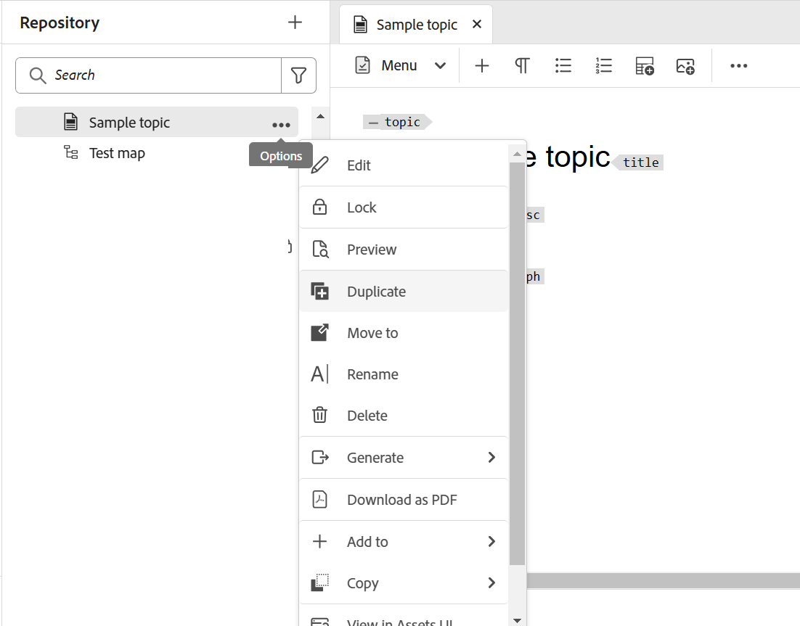

# Visualizar um tópico {#id1696II000QR}

Depois que um tópico é criado, o Adobe Experience Manager Guides gera uma pré-visualização do tópico. O modo de Visualização fornece vários recursos que você pode usar para trabalhar com o documento.

Há duas maneiras de visualizar um tópico no Experience Manager Guides:

- [No Editor](#preview-topics-from-the-editor)
- [Na interface do usuário do Assets](#preview-topics-from-the-assets-ui)

## Visualizar tópicos no Editor

Execute as seguintes etapas para visualizar um tópico do Editor:

1. No painel Repositório, navegue até o tópico que deseja visualizar.
1. Passe o mouse sobre o tópico que deseja visualizar e selecione **Visualizar** no menu Opções.

   {width="600" align="left"}

   A Visualização do tópico é exibida.

   {align="left"}

**Visualizar tópicos do modo de Visualização**

Ao abrir um tópico no Editor e alternar para o modo **Visualização**, localizado no canto inferior direito da área de edição de conteúdo, você pode visualizar o tópico aberto no momento.

Para obter mais detalhes, consulte [Exibições do editor](./web-editor-views.md#preview).

## Visualizar tópicos da interface do Assets

Execute as seguintes etapas para visualizar um tópico:

1. Na interface do usuário do Assets, navegue até o tópico que deseja visualizar.
1. Selecione o tópico que deseja exibir.

   Uma visualização do tópico é exibida na interface do usuário do Assets.

   >[!NOTE]
   >
   > Você pode exibir a versão do tópico ativo ou o mapa DITA no canto superior direito da barra de ferramentas.

   >[!IMPORTANT]
   >
   > O posicionamento dos seguintes recursos na barra de ferramentas de Visualização pode ser diferente com base na configuração do servidor do Adobe Experience Manager. Alguns dos recursos podem estar disponíveis na barra de ferramentas principal, enquanto outros podem estar disponíveis no menu Mais.

## Recursos disponíveis na interface do usuário do Assets para visualização

As seguintes operações estão disponíveis na barra de ferramentas ao usar o recurso Visualizar na interface do usuário do Assets,

{align="left"}

**Propriedades**

Exibir as propriedades do tópico selecionado. Com base na sua versão do Adobe Experience Manager, você pode visualizar propriedades como metadados, programação de ativação, referências, estado do documento e muito mais.

>[!NOTE]
>
> A propriedade de título de um tópico é preenchida automaticamente a partir da tag `title` do tópico ou mapa DITA. Se você fizer qualquer alteração no título usando a janela de propriedades, essa alteração será perdida. Se você quiser atualizar a propriedade do título, faça isso usando o editor.

A página Propriedades contém informações úteis sobre as referências, como onde um mapa ou tópico está sendo usado ou quais referências estão contidas em um documento. A página Propriedades lista dois tipos de referências para um documento - **Usado em** e **Referências de Saída**.

As referências **Usado em** listam os documentos nos quais o arquivo atual está sendo referenciado ou usado. A **Referências de Saída** lista os documentos referenciados no documento atual.

O ícone \(+\) na seção de referências **Usado em** permite navegar para cima para localizar onde esse tópico está sendo usado ou referenciado.

{align="left"}

Selecionar o ícone  ao lado de um documento mostra o mapa ou os arquivos de tópico para os quais esse documento está sendo mais referenciado.

**Filtragem Condicional \(A/B\)**

Se o tópico tiver conteúdo condicional, você visualizará o ícone A/B na barra de ferramentas. Selecionar esse ícone abre uma janela pop-up que permite filtrar o conteúdo de acordo com as condições disponíveis no tópico.

>[!NOTE]
>
> O conteúdo condicional é realçado usando a cor de fundo clara no Editor.

{width="300" align="left"}

**Editar**

- Abra o tópico para edição no Editor. A opção **Editar** não estará disponível se o administrador tiver habilitado a opção **Desabilitar edição sem bloquear o arquivo**. Com a opção habilitada, você exibirá a opção **Editar** somente após bloquear um arquivo de tópico.

**Resolução de Chave**

- Se quiser usar um arquivo de espaço-chave para o tópico, selecione o ícone Resolução-Chave. Em seguida, você pode escolher um espaço de chave na janela pop-up Resolução de chave.

**Origem**

- Abra o código-fonte XML de um arquivo. Você pode exibir o código XML subjacente de um mapa, tópico ou arquivo DITAVAL abrindo o arquivo no modo Visualização e selecionando o ícone Source. O pop-up XML Source exibe o código-fonte XML. Você pode selecionar um código específico do arquivo ou pressionar `Ctrl`+`a` para selecionar o conteúdo inteiro.

  >[!NOTE]
  >
  > Para obter a visualização do código-fonte de um arquivo de mapa DITA, selecione o arquivo na interface do usuário do Assets e selecione Source.

  {align="left"}

**Compartilhar Link UUID**

- O Experience Manager Guides permite compartilhar os links baseados em UUID para mapas DITA, tópicos e arquivos de imagem dos seguintes locais:

   - Interface do usuário do Assets
   - Console do mapa DITA
   - Visualização do tópico ou da imagem

Uma nova opção **Compartilhar link de UUID** é mostrada na barra de ferramentas das áreas mencionadas acima. A captura de tela a seguir mostra a opção **Compartilhar Link UUID** no modo de Visualização de um tópico:

{align="left"}

Na interface do usuário do Assets, essa opção fica visível ao selecionar um arquivo. Enquanto estiver no modo de Visualização, essa opção estará disponível na barra de ferramentas principal por padrão. Em um console de mapa DITA, essa opção está visível na seção Predefinições de saída.

Depois de copiar o URL, o mesmo poderá ser compartilhado com outros usuários para conceder a eles acesso direto ao arquivo. Esse link permanece válido mesmo quando o arquivo é movido para algum outro local no repositório. A única vez que o link falhará é quando o arquivo for excluído do repositório.

Se você compartilhar o link do console de mapa DITA ou do modo de visualização de um arquivo, o usuário terá a mesma visualização do arquivo. No entanto, quando você compartilha o link de um arquivo de mapa na interface do usuário do Assets, o usuário é levado para o console do mapa. Da mesma forma, para um tópico ou arquivo de imagem, a visualização do arquivo é mostrada.

>[!IMPORTANT]
>
> O link não pode ser usado como um link de referência em outro tópico; ele fornece acesso direto ao arquivo no repositório. Além disso, o link permanece válido enquanto o arquivo estiver disponível no repositório. Mesmo que o arquivo seja movido para algum outro local no repositório, o link permanecerá válido. O link falhará somente quando o arquivo for excluído do repositório.

**Check-out/Check-in**

- Alterna os recursos Check-out e Check-in. Quando um arquivo é submetido a check-out, o usuário atual obtém uma permissão de gravação exclusiva no arquivo. Um arquivo com check-out pode ser aberto no Editor para edição. Depois de fazer a alteração necessária, selecione o ícone Check-in para salvar o arquivo no DAM.

Ao fazer check-out de um tópico, o status do arquivo é mostrado como check-out na exibição de cartão e na exibição de lista.

Arquivo com check-out na exibição de cartão:

{width="300" align="left"}

Arquivo com check-out na exibição de lista:

{width="550" align="left"}

Se a coluna Com check-out não estiver visível, selecione **Configurações de Exibição** em **Exibição da Lista** e selecione o status **Com Check-out** na caixa de diálogo **Configurar Colunas**.

{align="left"}

>[!TIP]
>
> Consulte a seção Versionamento de conteúdo no guia de práticas recomendadas para obter as práticas recomendadas sobre como trabalhar com check-out e check-in de arquivo.

**Diferença de versão baseada na Web**

- Se o tópico tiver sofrido algumas alterações, você poderá descobrir facilmente as alterações feitas em diferentes versões desse tópico. Para descobrir alterações em diferentes versões de um tópico:

  >[!IMPORTANT]
  >
  > O método descrito no procedimento a seguir é aplicável apenas para arquivos DITA. Para arquivos não DITA, use a exibição Linha do tempo para criar versões ou restaurar uma versão existente de um arquivo.

   1. Abra o tópico no modo Visualização.

   1. No painel à esquerda, selecione **Histórico de Versões** e selecione uma versão.

      {align="left"}

   1. Nas versões listadas, selecione aquela que você deseja usar como a versão base e selecione **Visualizar Versão**. A visualização da versão selecionada é mostrada na janela Visualização de versão.

   1. Na lista **Mostrar comparação**, selecione a versão com a qual deseja comparar a versão base.

      {align="left"}

      O conteúdo alterado é realçado na pré-visualização do tópico. O conteúdo realçado em verde significa que o conteúdo recém-adicionado e o conteúdo em vermelho é o conteúdo excluído.

      {align="left"}

## Ramificar, reverter e versões subsequentes

- Em um ambiente de criação típico, seria necessário criar uma nova ramificação de um tópico para atender a uma versão específica. Como qualquer outro sistema de gerenciamento de versão, o Experience Manager Guides permite criar uma ramificação a partir de uma versão existente de um tópico ou reverter para uma versão mais antiga de um tópico. Usando os recursos de gerenciamento de versão oferecidos pelo Experience Manager Guides, você pode executar as seguintes tarefas:

   - Criar uma ramificação a partir de uma versão existente de um tópico
   - Criar versões subsequentes em uma nova ramificação
   - Reverter para uma versão específica de um tópico

  A ilustração a seguir mostra o sistema típico de ramificação e versões subsequentes:

  {width="550" align="center"}

  Para qualquer novo tópico, a primeira versão é numerada como 1.0. Consequentemente, cada nova versão do tópico é salva com um número incremental como 1.1, 1.2 e assim por diante. Depois de criar uma ramificação de um tópico, uma nova ramificação é criada pegando o número da versão do local em que a ramificação é criada e adicionando um .0 no final da versão. Conforme mostrado na ilustração, uma nova ramificação é criada a partir da versão 1.1 de um tópico. A nova ramificação recebe a versão 1.1.0. Consequentemente, toda vez que você salvar uma nova versão do tópico nesta ramificação, ele receberá um número de versão incremental como 1.1.1, 1.1.2 e assim por diante.

  Semelhante à ramificação, você também pode reverter sua versão atual ou em funcionamento para qualquer versão existente no repositório. Para reverter para uma versão, basta selecionar a versão desejada do tópico e selecionar **Reverter para Esta Versão** no painel **Histórico de Versão**.

  Execute as seguintes etapas para criar uma ramificação, reverter para uma versão e manter versões subsequentes de um tópico:

  >[!IMPORTANT]
  >
  > O método descrito no procedimento a seguir é aplicável apenas para arquivos DITA. Para arquivos não DITA, use a exibição Linha do tempo para criar versões ou restaurar uma versão existente de um arquivo.

   1. Acesse o tópico na interface do Assets.

      >[!NOTE]
      >
      > Você também pode abrir o tópico no modo Visualização e prosseguir com a Etapa 3.

   1. Selecione o tópico para o qual deseja criar uma ramificação.

   1. No painel à esquerda, selecione **Histórico de Versões**.

      >[!NOTE]
      >
      > Uma lista de versões disponíveis para o tópico selecionado é exibida. Cada versão contém informações de carimbo de data/hora, nome de usuário, comentário de versão e [rótulo](web-editor-use-label.md#).

   1. Selecione uma versão em que deseja criar uma ramificação. Na captura de tela a seguir, a versão 1.2 é selecionada para criar uma ramificação.

      {width="300" align="left"}

      >[!NOTE]
      >
      > A versão atual de um tópico contém *\(Current\)* mencionado ao lado do número da versão.

   1. Selecione **Reverter para Esta Versão**.

      Uma mensagem é exibida solicitando que você confirme a criação de uma nova ramificação.

   1. *\(Opcional\)* No prompt de mensagem, você tem a opção de selecionar **Salvar a Cópia de Trabalho Atual como uma Nova Versão**. As duas ações a seguir são possíveis com base na seleção dessa opção:

      - Se você selecionar essa opção, uma ramificação será criada da versão 1.1. Além disso, uma nova versão do tópico também é criada a partir da cópia de trabalho atual do tópico e salva como a próxima versão - 1.4.

        {width="300" align="left"}

        A versão 1.2 se torna a cópia de trabalho atual do tópico. Qualquer versão salva depois disso é criada na nova ramificação da 1.1. Por exemplo, a versão subsequente de um novo tópico nesta ramificação será salva como 1.2.0.

        {width="300" align="left"}

      - Se você não selecionar essa opção, nenhuma nova versão da cópia de trabalho atual do tópico será criada. Uma nova ramificação é criada a partir da versão 1.2 do tópico. Qualquer versão subsequente do tópico é salva na ramificação 1.2 como 1.2.0, 1.2.1 e assim por diante.

        {width="300" align="left"}

   1. Selecione **OK**.

  Uma nova ramificação é criada a partir da versão selecionada do tópico. O processo acima também é aplicável para reverter para uma versão específica de um tópico. Reverter para uma versão específica tecnicamente significa que você cria uma nova ramificação da versão selecionada e torna essa versão a cópia de trabalho atual do tópico. Você também pode exibir o histórico de arquivos que foram revertidos no relatório Histórico de reversão da versão. Para obter mais detalhes sobre este relatório, exiba [relatório de histórico de versão de arquivos revertidos](reports-reverted-file-version-history.md#).

**Tópico pai:**&#x200B;[ Criar e visualizar tópicos](create-preview-topics.md)
